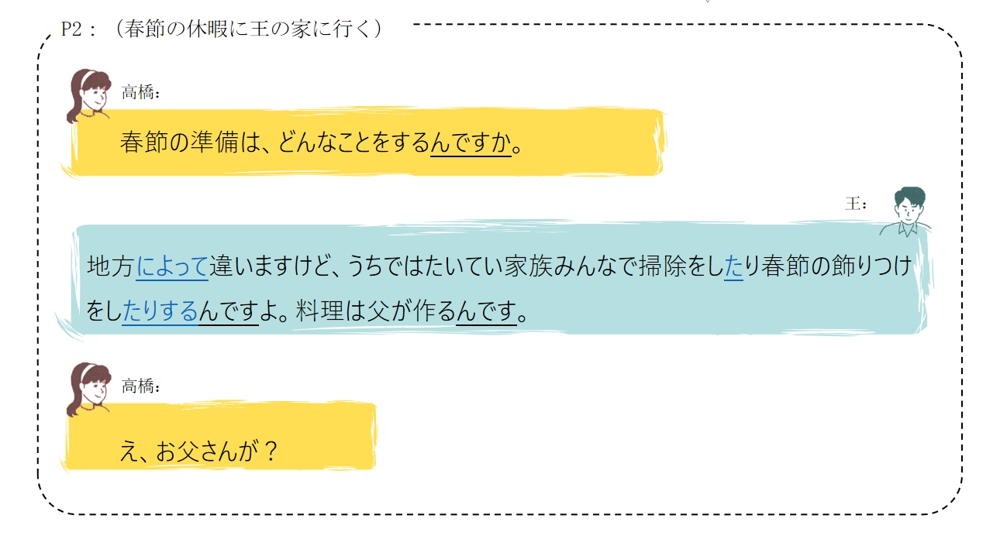
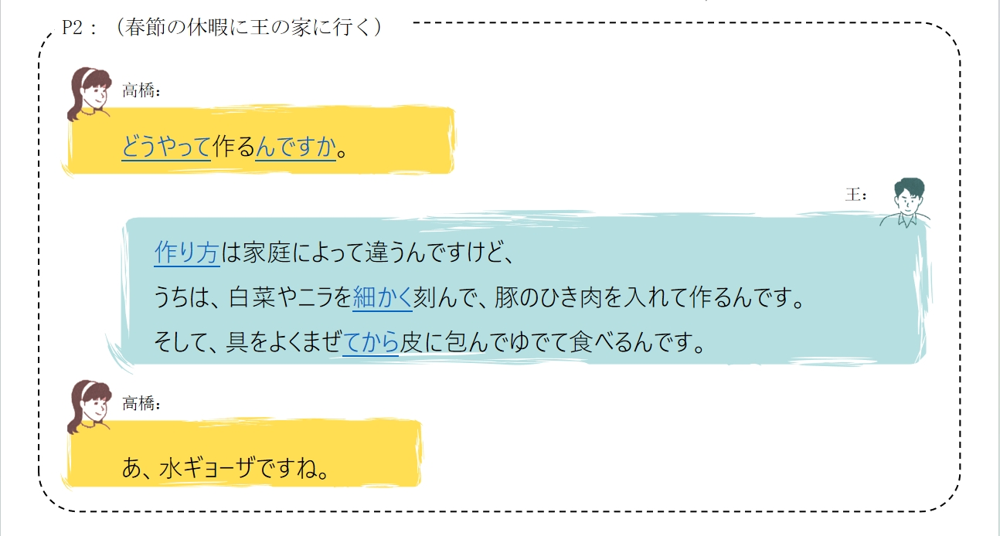
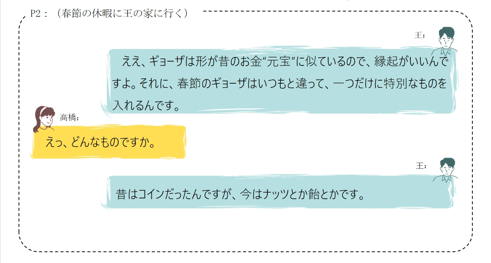
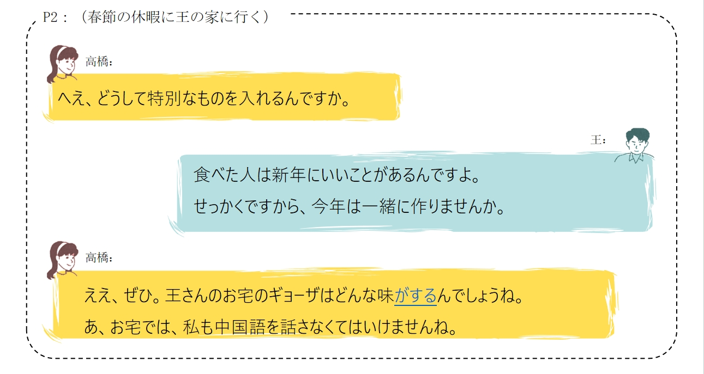

# 春節の体験

## 新出単語

<vue-plyr>
  <audio controls crossorigin playsinline loop>
    <source src="../audio/c/1-2-たんご.mp3" type="audio/mp3" />
  </audio>
 </vue-plyr>

| 単語                                                        | 词性            | 翻译                               |
| ----------------------------------------------------------- | --------------- | ---------------------------------- |
| <JpWord>あいだ</JpWord> 〖間〗                              | ⓪ ＜名＞        | 期间；之间                         |
| 変わる（<JpWord>かわる</JpWord> ）                          | ⓪ ＜自 Ⅰ ＞     | 变化；变换                         |
| 晩（<JpWord>ばん</JpWord> ）                                | ⓪ ＜名＞        | 晚上；傍晚                         |
| 一家（<JpWord>いっか</JpWord> ）                            | ① ＜名＞        | 全家；一家；家                     |
| <JpWord>だんらん</JpWord> 〖団欒〗                          | ⓪ ＜名・自 Ⅲ ＞ | 团圆；团聚                         |
| 爆竹（<JpWord>ばくちく</JpWord> ）                          | ⓪ ＜名＞        | 爆竹                               |
| 花火（<JpWord>はなび</JpWord> ）                            | ① ＜名＞        | 焰火；烟花                         |
| 切り紙（<JpWord>きりがみ</JpWord> ）                        | ⓪② ＜名＞       | 剪纸                               |
| <JpWord>ランタン</JpWord>                                   | ③① ＜名＞       | 灯笼                               |
| 街（<JpWord>まち</JpWord> ）                                | ② ＜名＞        | 街；商业区                         |
| <JpWord>あふれる</JpWord> 『溢れる』                        | ③ ＜自 Ⅱ ＞     | 溢出；充满                         |
| 気分（<JpWord>きぶん</JpWord> ）                            | ① ＜名＞        | 心情                               |
| 盛り上がる（<JpWord>もりあがる</JpWord> ）                  | ④ ＜自 Ⅰ ＞     | （气氛）高涨；鼓起                 |
| <JpWord>イルミネーション</JpWord> （illumination）          | ④ ＜名＞        | 夜景灯光；灯饰                     |
| <JpWord>ライブ配信</JpWord> （live はいしん）               | ④ ＜名＞        | 网络直播                           |
| <JpWord>ライブ</JpWord> （live）                            | ① ＜名＞        | 现场直播                           |
| 配信（<JpWord>はいしん</JpWord> ）                          | ⓪ ＜名・他 Ⅲ ＞ | 传送；发布信息                     |
| <JpWord>ホンバオ</JpWord>                                   | ⓪ ＜名＞        | 红包                               |
| お弁当（<JpWord>おべんとう</JpWord>）                       | ⓪ ＜名＞        | 盒饭（美化语用法）                 |
| 弁当（<JpWord>べんとう</JpWord>）                           | ③ ＜名＞        | 盒饭，便当                         |
| 昼休み（<JpWord>ひるやすみ</JpWord>）                       | ③ ＜名＞        | 午休                               |
| 訪ねる（<JpWord>たずねる</JpWord>）                         | ③ ＜他 Ⅱ ＞     | 拜访；访问                         |
| <JpWord>ゴールデンウイーク</JpWord>（和制英语 golden week） | ⑦ ＜名＞        | 黄金周                             |
| 博物館（<JpWord>はくぶつかん</JpWord>）                     | ④③ ＜名＞       | 博物馆                             |
| 終える（<JpWord>おえる</JpWord>）                           | ⓪ ＜他 Ⅱ ＞     | 结束；终了                         |
| 焼く（<JpWord>やく</JpWord>）                               | ⓪ ＜他 Ⅰ ＞     | 烤；煎；烧                         |
| <JpWord>ソース</JpWord>（sauce）                            | ① ＜名＞        | 沙司；调料汁                       |
| 曲がる（<JpWord>まがる</JpWord>）                           | ⓪ ＜自 Ⅰ ＞     | 拐；拐弯，弯曲                     |
| <JpWord>つながる</JpWord>『繋がる』                         | ⓪ ＜自 Ⅰ ＞     | 连；相连；连接                     |
| 能力（<JpWord>のうりょく</JpWord>）                         | ① ＜名＞        | 能力 超能力                        |
| 優れる（<JpWord>すぐれる</JpWord>）                         | ③ ＜自 Ⅱ ＞     | 优秀；出色（的）；出众（的）；杰出 |
| 目（<JpWord>め</JpWord>）                                   | ① ＜名＞        | 眼睛                               |
| <JpWord>トラ</JpWord>『虎』                                 | ⓪ ＜名＞        | 虎；老虎                           |
| 腕（<JpWord>うで</JpWord>）                                 | ② ＜名＞        | 胳膊；本事；技术                   |
| 毎晩（<JpWord>まいばん</JpWord>）                           | ①⓪ ＜名＞       | 每晚                               |
| <JpWord>ドラマ</JpWord>（drama）                            | ① ＜名＞        | （戏）剧                           |
| 冬（<JpWord>ふゆ</JpWord>）                                 | ② ＜名＞        | 冬；冬天；冬季                     |
| 海南島（<JpWord>かいなんとう</JpWord>）                     | ⓪ ＜固名＞      | 海南岛                             |
| 悲しい（<JpWord>かなしい</JpWord>）                         | ⓪ ＜形 Ⅰ ＞     | 悲伤（的）                         |
| 生まれる（<JpWord>うまれる</JpWord>）                       | ⓪ ＜自 Ⅱ ＞     | 出生；产生                         |
| <JpWord>あきらめる</JpWord>『諦める』                       | ④ ＜他 Ⅱ ＞     | 放弃；死心；作罢                   |
| 希望（<JpWord>きぼう</JpWord>）                             | ⓪ ＜名・他 Ⅲ ＞ | 希望                               |
| 願望（<JpWord>がんぼう</JpWord>）                           | ⓪ ＜名＞        | 愿望；期望                         |
| 瞬間（<JpWord>しゅんかん</JpWord>）                         | ⓪ ＜名＞        | 瞬间                               |

## N によって

意义：表示判断的依据或根据。  
译文：根据...（而不同）；因......（而异）
接续：名词+によって

```ts
(1)春節の準備は地方によって違います。 // 違い（ちがい）　不同、区别或差异
春节的准备因地而异。
(2)この単語は時代によって意味が違います。 // 時代(じだい) 意味（いみ）意思;含义
这个词根据时代的不同意思也不一样。
(3)人によって考えが違います。 // 考え（かんがえ）想法;意见;;思考
不同的人有不同的想法。
(4)メニューは季節によって変わります。// 季節（きせつ); 変わり（かわり）用来描述事物的变化。
菜单随季节变化。
```

## 練習 れんしゅう

```ts
特例：人にはいろいろな夢があります。//　夢（ゆめ）梦想
    夢は人によっていろいろです。// 根据人的不同，梦想也不同。
    人によって夢がちがいます。// 每个人都有不同的梦想。
 1.学习的方法因人而异。　//　仕方（しかた）
 ⇒　勉強の仕方は人によって違います。
 2.起床的时间根据星期而不同。// 起きる（おきる）時間（じかん）　曜日　（ようび）星期
 ⇒　起きる時間は曜日によって違います。

```

## どうやって～んですか＜询问方式＞

意义：询问行为、动作的方式、方法或事件的过程。  
译文：怎么样.....；如何.....
接续：どうやって＋动词连体形＋んですか

```ts
(1)ギョーザはどうやって作るんですか。
饺子是怎么做的。
(2)この食べ物は初めて見ました。どうやって食べるんですか。
第一次看到这种食物。怎么吃呢？
(3)すみませんが、駅まではどうやって行くんですか。
对不起，请问去车站怎么走。
(4)李さんはどうやって日本語を勉強しているんですか。　
小李是怎样学习日语的。
```

## 練習 れんしゅう

```ts
1.炒饭要怎么做呀？//　チャーハン　炒饭
⇒チャーハンはどうやって作るんですか。
2.刺身要怎么吃呀？//　刺身（さしみ）
⇒刺身はどうやって食べるんですか。

```

## V 方＜方法＞　

意义：表示行为、动作的方式、方法。  
译文：....法；....的方法  
接续：动词的第一连用形＋方

> 说明：动词带「を格」补足语时，由「N を V」变成「N の V 方」

```ts
(1)ギョーザの作り方は家庭によって違います。　//　家庭（かてい）家庭；家庭生活
饺子的做法因家庭而异。
(2)高橋さんは北京ダックの食べ方を知りませんでした。
高桥不知道北京烤鸭的吃法。
(3)図書館への行き方を教えてください。  // 教えて（おしえて） 请教我或告诉我
请告诉我去图书馆的路。
(4)旅行会社の検索の仕方を説明しました。 // 旅行会社（りょこうがいしゃ）旅行社; 検索（けんさく）搜索;查询
说明了旅行社的搜索方法。
```

## 練習 れんしゅう

> ギョーザを作るーギョーザの作り方

```ts
翻訳（ほんやく）しましょう。
ギョーザを作るーギョーザの作り方 饺子的制作方法。
1.手紙を書く。　//　手紙（てがみ）；　書く（かく）写、书写或画。　
⇒手紙の書き方。
2.予習をする。　　//　予習（よしゅう）预习;
⇒ 予習の仕方。
```

## Ｖてから＜先后顺序＞

意义：表示动作的先后顺序，后面的动作以前面的动作为基础、条件。  
译文：先....，再.....；....之后（再）.....
接续：V て＋から

```ts
(1)ギョーザは、具をよくまぜてから皮に包みます。// まぜる（まぜる）搅拌  具（ぐ）馅料； 皮（は）皮
 饺子的馅充分混合后包在饺子皮里。
(2)野菜を洗ってから切ります。 // 切る（きる）切、割、割开或切掉; 野菜（やさい）蔬菜
  将蔬菜洗净后切块。
(3)A：急いで映画館に行きましょうか。 // 急いで（いそがれて）匆忙地；急切地  // 映画館（えいがかん）电影院
  B：いいえ、食事をしてから行きましょう。 // 食事（しょくじ）食物；餐食;
  A：我们去电影院吧？
  B：不，先吃饭再去看电影。
```

> 「V てから」还可以表达以某事为契机或起点发生的变化。

```ts
(1)日本に来てから３か月になる。 // 来て（きて）来;来到  // か月（かげつ）一个月
来到日本后已经三个月了。
(2)大学に入ってから、ずっと家庭教師のアルバイトをしている。 // 大学（だいがく）大学; // アルバイト（アルバイト）打工 // ずっと（ずっと）一直 // 家庭教師（かていきゅうし）家庭教师
进入大学后，我一直在做家庭教师的兼职。
```

## 練習 れんしゅう

```ts
1.先刷牙，再睡觉。
⇒ 歯を磨いてから.寝ます。
2.我稍微学习了一点日语后，再去日本留学了。
⇒ 少し日本語を勉強してから.日本に留学しました。
```

## だけ＋格助词＜限定＞

意义：表示限定  
译文：仅有....，只有....
接续：名词+だけ+格助词  
说明：「だけ」后接「が/を」时，「が/を」可以省略

```ts
(1)春節のギョーザはいつもと違って、一つだけに特別なものを入れるんです。 // 特別な（とくべつな）特别的 // もの（もの）东西；物品 // 入れる（いれる）放入；加入 // 特別なもの（とくべつなもの）特别的东西  // 春節（しゅんせつ）春节
春节的饺子和平时不一样，要在一个饺子里面放入特别的东西。
(2)子供は平仮名だけで作文を書きます。 // 平仮名（ひらがな）平假名 // 作文（さくぶん）作文 // だけ（だけ）只有 // 子供（こども）孩子
孩子只用平假名写作文。
(3)王さんだけ（が）日本に行きます。 // 行く（いく）去
只有小王去日本。
(4)うちのギョーザは白菜と豚肉だけ（を）入れます。// 白菜（はくさい）白菜 // 豚肉（ぶたにく）猪肉 // だけ（だけ）只有 // に入れる（いれる）放入
  我家的饺子只放白菜和猪肉。

```

## 練習 れんしゅう

```ts
1.我只和渡边说话。
⇒ わたなべさんだけと話します。
2.只送给了田中先生礼物。　// 上げる（あげる）送
⇒ 田中先生だけにプレゼントを上げました。
```

## N がする＜感受＞

意义：表示人的器官所感受到的气味、味道、声音或者生理、心理状态等。  
译文：听到声音（声がする）;闻到气味（匂いがする）；听到声响（音がする）  
　　　尝出味道（味がする）；感到....（気がする/感じがする）  
接续：（连体修饰语+）名词+がする

```ts
(1)王さんのお宅のギョーザはどんな味がするんでしょうね。 // お宅（おたく）家 // どんな味（どんなみ）什么味道 // がする（がする）味道 // しょうですね（しょうですね）呢
小王家的饺子什么味道呢？
(2)隣の部屋からコーヒーの匂いがします。 // 隣（りが）旁边 // コーヒー（こふぃー）咖啡 // の匂い（のにおい）气味 // がします（がします）味道
隔壁房间有咖啡的味道。
(3)このキャンディ「糖果」はリンゴの味がする。 // キャンディ（キャンディ）糖果 // リンゴ（りんご）苹果 // の味（のみ）味道 // がする（がする）味道
这个糖果是苹果的味道。
(4)何度も練習して上手になった気がする。　// 練習（れんしゅう）练习 // 上手（じょうず）熟练 // なった（なった）变成 // 気がする（きがする）感到
经过多次练习，感觉自己变得更好了。
(5)ちょっと頭痛がしていましたから、一時間早く家に帰ったのです。// ちょっと（ちょっと）一点，稍微 // 頭痛（つうずつう）头痛 // がしていました（がしていました）感到 // 一時間早く（いちじかんはやく）一个小时早 // 家に帰った（うちに帰った）回家
我有点头痛，所以提前一个小时回家了。

```

## 練習 れんしゅう

```ts
1.闻到了花香味。 // 花香（はなかおり）花香 // 匂い（におい）气味
⇒ 花の匂いがしました。
2.感觉有点冷。 // 冷（ひや）凉 // 気がする（きがする）感到
⇒ ちょっと寒気がした。
```

## 会話

<vue-plyr>
  <audio controls crossorigin playsinline loop>
    <source src="../audio/c/1-2-かいわ.mp3" type="audio/mp3" />
  </audio>
 </vue-plyr>








