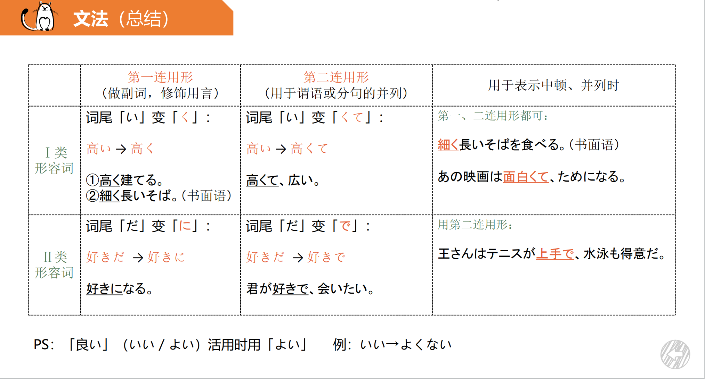
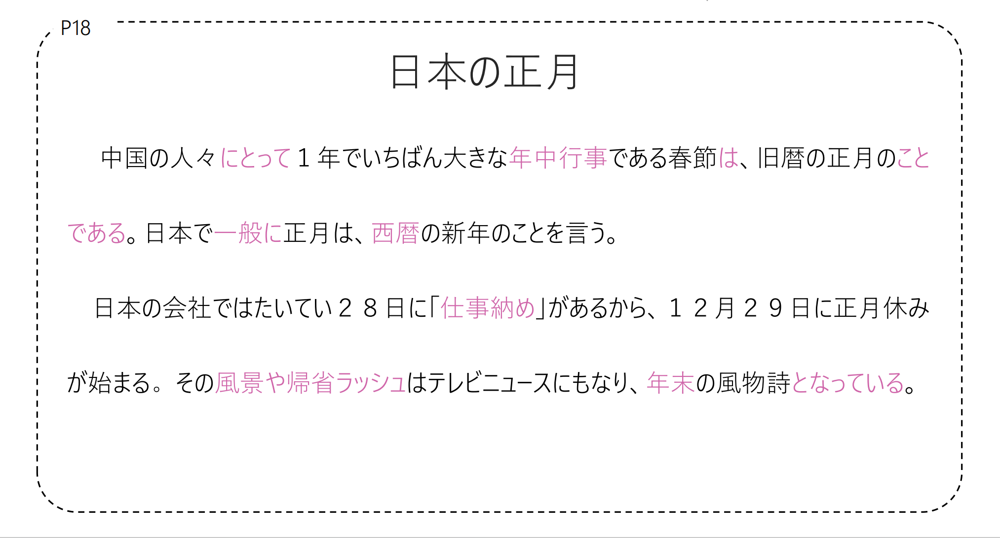
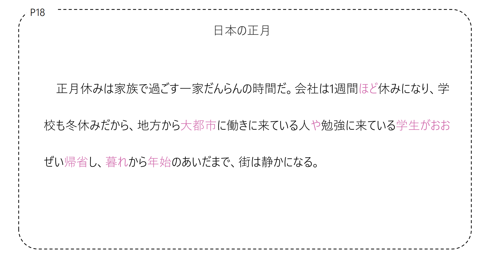
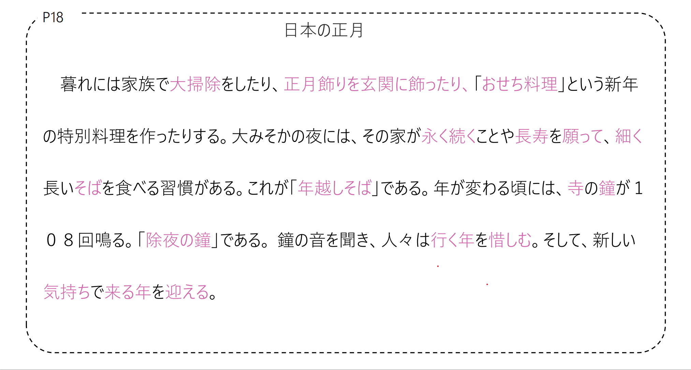
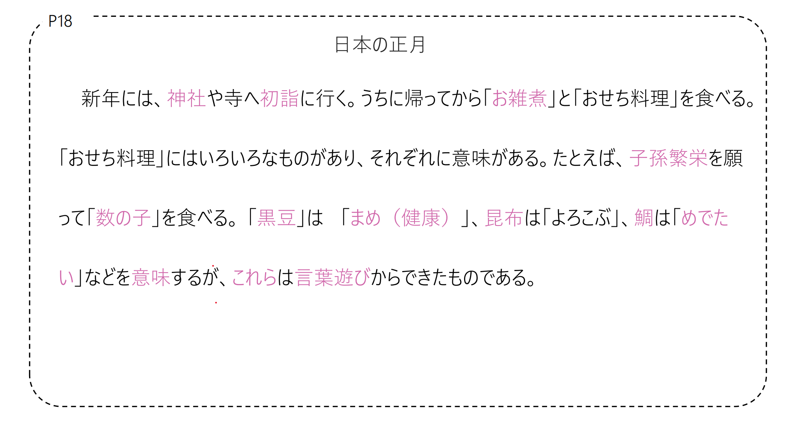
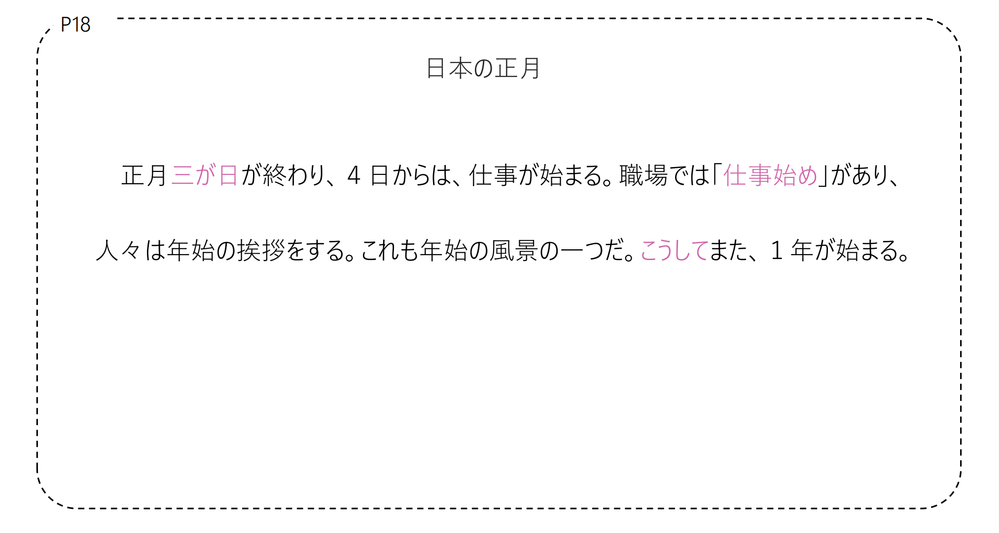
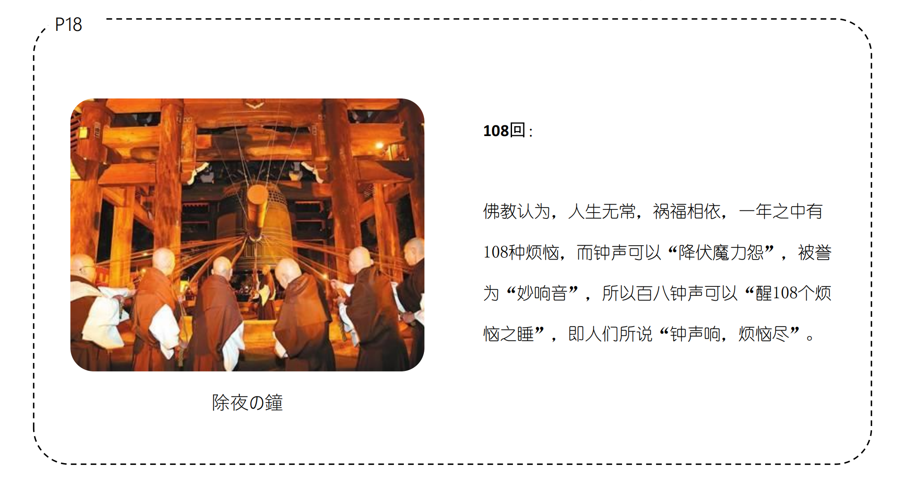
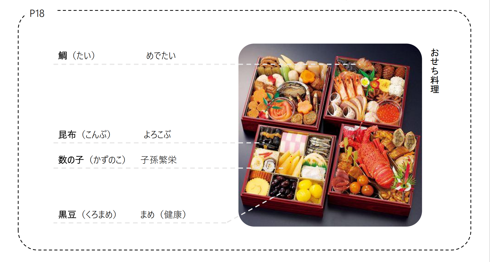
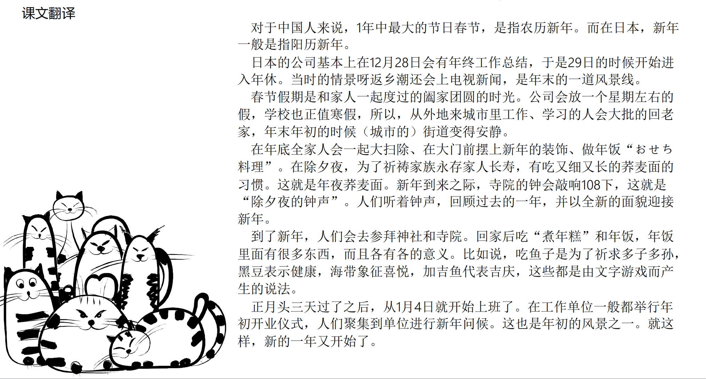

# 日本の正月

## 新出単語

<vue-plyr>
  <audio controls crossorigin playsinline loop>
    <source src="../audio/c/1-3-たんご.mp3" type="audio/mp3" />
  </audio>
 </vue-plyr>

| 単語                                        | 词性               | 翻译                                               |
| ------------------------------------------- | ------------------ | -------------------------------------------------- |
| 年中行事<JpWord>ねんちゅうぎょうじ</JpWord> | ⑤ ＜名＞           | 节日；年内的各种活动(也叫做「ねんじゅうぎょうじ」) |
| 西暦<JpWord>せいれき</JpWord>               | ⓪ ＜名＞           | 公历；阳历                                         |
| 新年<JpWord>しんねん</JpWord>               | ① ＜名＞           | 新年 新生活                                        |
| 仕事納め<JpWord>しごとおさめ</JpWord>       | ④ ＜名＞           | 工作年终收官(仪式)                                 |
| 風景<JpWord>ふうけい</JpWord>               | ① ＜名＞           | 风景；情景                                         |
| 帰省ラッシュ<JpWord>きせい rush</JpWord>    | ④ ＜名＞           | 返乡潮                                             |
| 帰省<JpWord>きせい</JpWord>                 | ⓪ ＜名・自 Ⅲ ＞    | 回乡探亲；回老家                                   |
| rush<JpWord>ラッシュ</JpWord>               | ① ＜名＞           | (人群)拥挤，(上下班)高峰                           |
| 風物詩<JpWord>ふうぶつし</JpWord>           | ④③ ＜名＞          | 风景诗；景物；风景线                               |
| 風物<JpWord>ふうぶつ</JpWord>               | ① ＜名＞           | 风景                                               |
| 大都市<JpWord>だいとし</JpWord>             | ③ ＜名＞           | 大都市；大城市                                     |
| 都市<JpWord>とし</JpWord>                   | ① ＜名＞           | 都市；城市                                         |
| 暮れ<JpWord>くれ</JpWord>                   | ⓪ ＜名＞           | 傍晚；末；年末                                     |
| 年始<JpWord>ねんし</JpWord>                 | ① ＜名＞           | 年初                                               |
| 大掃除<JpWord>おおそうじ</JpWord>           | ③ ＜名＞           | 大扫除                                             |
| 大‐<JpWord>おお‐</JpWord>                   | 大～               |                                                    |
| おせち料理<JpWord>おせちりょうり</JpWord>   | ④ ＜名＞           | 年(夜)饭                                           |
| 永い<JpWord>ながい</JpWord>                 | ② ＜形 Ⅰ ＞        | 永久(的)；长久(的)                                 |
| 続く<JpWord>つづく</JpWord>                 | ⓪ ＜自 Ⅰ ＞        | 继续；持续；延续                                   |
| 長寿<JpWord>ちょうじゅ</JpWord>             | ① ＜名＞           | 长寿                                               |
| 願う<JpWord>ねがう</JpWord>                 | ② ＜他 Ⅰ ＞        | 祝愿；希望；祈祷                                   |
| 細い<JpWord>ほそい</JpWord>                 | ② ＜形 Ⅰ ＞        | 细(的)                                             |
| <JpWord>そば</JpWord>〖蕎麦〗               | ① ＜名＞           | 荞麦；荞麦面条                                     |
| 年越し<JpWord>としこし</JpWord>             | ⓪④ ＜名＞          | 过年；除夕                                         |
| 寺<JpWord>てら</JpWord>                     | ② ＜名＞           | 寺；寺院                                           |
| 鐘<JpWord>かね</JpWord>                     | ⓪ ＜名＞           | 钟                                                 |
| 除夜の鐘<JpWord>じょやのかね</JpWord>       | ① ＜名＞           | 除夕夜的钟声                                       |
| 行く年<JpWord>ゆくとし</JpWord>             | ④                  | 即将过去的一年                                     |
| 惜しむ<JpWord>おしむ</JpWord>               | ② ＜他 Ⅰ ＞        | 珍惜；惋惜；可惜                                   |
| 来る年<JpWord>くるとし</JpWord>             | ①                  | 即将到来的一年                                     |
| 迎える<JpWord>むかえる</JpWord>             | ⓪ ＜他 Ⅱ ＞        | 迎接；欢迎                                         |
| 神社<JpWord>じんじゃ</JpWord>               | ① ＜名＞           | 神社                                               |
| 初詣<JpWord>はつもうで</JpWord>             | ③ ＜名＞           | 新年的首次参拜                                     |
| 初‐<JpWord>はつ‐</JpWord>                   |                    | 首次；最初                                         |
| お雑煮<JpWord>おぞうに</JpWord>             | ⓪ ＜名＞           | 煮年糕                                             |
| 子孫<JpWord>しそん</JpWord>                 | ① ＜名＞           | 子孙                                               |
| 繁栄<JpWord>はんえい</JpWord>               | ⓪ ＜名・自 Ⅲ ＞    | 繁荣                                               |
| 数の子<JpWord>かずのこ</JpWord>             | ⓪ ＜名＞           | 鲱鱼子                                             |
| 黒豆<JpWord>くろまめ</JpWord>               | ⓪ ＜名＞           | 黑豆                                               |
| <JpWord>まめ</JpWord>                       | ⓪ ＜名・形 Ⅱ ＞    | 健康；结实                                         |
| 昆布<JpWord>こんぶ</JpWord>                 | ① ＜名＞           | 海带                                               |
| 鯛<JpWord>たい</JpWord>                     | ① ＜名＞           | 鲷；加吉鱼                                         |
| <JpWord>めでたい </JpWord>                  | ③ ＜形 Ⅰ ＞        | 可喜可贺；值得庆贺                                 |
| 言葉遊び<JpWord>ことばあそび</JpWord>       | ④ ＜名＞           | 字游戏；语言游戏                                   |
| 三が日<JpWord>さんがにち</JpWord>           | ⓪③ ＜名＞          | 新年头三天                                         |
| 仕事始め<JpWord>しごとはじめ</JpWord>       | ④ ＜名＞           | 新的一年开始工作(的仪式)                           |
| 職場<JpWord>しょくば</JpWord>               | ⓪ ＜名＞           | 职场                                               |
| 挨拶<JpWord>あいさつ</JpWord>               | ① ＜名・自 Ⅲ ＞    | 寒暄；打招呼                                       |
| <JpWord>こうして</JpWord>                   | ⓪ ＜副＞           | 这样；如此；于是                                   |
| rival<JpWord>ライバル</JpWord>              | ① ＜名＞           | 竞争对手                                           |
| 競争<JpWord>きょうそう</JpWord>             | ⓪ ＜名・自 Ⅲ ＞    | 竞争                                               |
| IOT<JpWord>アイオーティー</JpWord>          | ⑤ ＜名＞           | (Internet of Things 的省略说法)物联网              |
| 中古品<JpWord>ちゅうこひん</JpWord>         | ⓪ ＜名＞           | 二手商品；旧货商品                                 |
| 品物<JpWord>しなもの</JpWord>               | ⓪ ＜名＞           | 商品；货物                                         |
| <JpWord>やや</JpWord>                       | ① ＜副＞：(书面语) | 稍微；有点儿                                       |
| 大事<JpWord>だいじ</JpWord>                 | ③ ＜形 Ⅱ ＞        | 珍惜；重要                                         |
| challenge<JpWord>チャレンジ</JpWord>        | ①② ＜名・自 Ⅲ ＞   | 挑战                                               |
| 台風<JpWord>たいふう</JpWord>               | ③ ＜名＞           | 台风                                               |
| 中止<JpWord>ちゅうし</JpWord>               | ⓪ ＜名・自 Ⅲ ＞    | 中止；暂停                                         |
| 来場者<JpWord>らいじょうしゃ</JpWord>       | ③⓪ ＜名＞          | 到场者；与会者；参加者                             |
| 来場<JpWord>らいじょう</JpWord>             | ⓪ ＜名・自 Ⅲ ＞    | 到场；与会；参会                                   |
| 盛況<JpWord>せいきょう</JpWord>             | ⓪ ＜名＞           | 盛况                                               |
| 曲<JpWord>きょく</JpWord>                   | ⓪ ＜名＞           | 曲；乐曲                                           |
| break<JpWord>ブレイク</JpWord>              | ② ＜名・自他 Ⅲ ＞  | 人气暴涨；休息；中断                               |
| <JpWord>きっかけ</JpWord> 『切っ掛け』      | ⓪ ＜名＞           | 原因；动因；契机                                   |
| 一人旅<JpWord>ひとりたび</JpWord>           | ③ ＜名＞           | 一个人的旅行，独自旅行                             |
| 旅<JpWord>たび</JpWord>                     | ② ＜名＞           | 旅行                                               |
| 人生<JpWord>じんせい</JpWord>               | ① ＜名＞           | 人生                                               |
| 変える<JpWord>かえる</JpWord>               | ⓪ ＜他 Ⅱ ＞        | 改变                                               |
| 大きな<JpWord>おおきな</JpWord>             | ① ＜連体＞         | 大(的)                                             |
| 木村<JpWord>きむら</JpWord>                 | ⓪ ＜固名＞         | (姓氏)木村 世界的                                  |
| 圧倒的<JpWord>あっとうてき</JpWord>         | ⓪ ＜形 Ⅱ ＞        | 压倒性(的)；绝对优势(的)                           |
| 強さ<JpWord>つよさ</JpWord>                 | ① ＜名＞           | 强劲；强壮；强度；优势                             |
| 休憩<JpWord>きゅうけい</JpWord>             | ⓪ ＜名・自 Ⅲ ＞    | 休息                                               |
| 文章<JpWord>ぶんしょう</JpWord>             | ① ＜名＞           | 文章                                               |
| EMS<JpWord>イー・エム・エス</JpWord>        | ⑤ ＜名＞           | 特快专递                                           |
| 建造<JpWord>けんぞう</JpWord>               | ⓪ ＜名・他 Ⅲ ＞    | 建造；修建                                         |

## N にとって＜评价的立场、角度＞

意义：表示从某人、某事的角度、立场进行评价。  
译文：对于～来说，是…的  
接续：N+にとって

```ts
(1) 中国の人々にとって、一年でいちばん大きな年中行事である春節は旧暦の正月のことである。 
// ちゅうごくのひとびと(中国の人々) 中国人民
// 年中行事 (ねんちゅうぎょうじ) 
// 旧暦 (きゅうれき)
对于中国人来说，一年中最重要的节日春节是农历新年。
(2) 一年生にとって、この文章はちょっと難しいですね。// 一年生 (いちねんせい)  // 難しい (むずかしい)
对于一年级生来说，这篇文章有点儿难。
(3) 子供の教育にとって、一番大切なことは何でしょうか。// 大切な (たいせつな) // 大切 (たいせつ) // 一番 (いちばん) // 子供の教育 (こどものかしこき)
对于孩子的教育来说，最重要的事情是什么？
```

## 練習 れんしゅう

```ts
1.毕业论文对于大四的学生来说是最大的挑战。 // 四年生 キャれんジ // 毕业论文 (びょかいぶんさん)
⇒ 卒業論文は四年生にとっていちばん大きなチャレンジです。
2.对于外国人来说这个问题很难。　// 外国人 (がいこくじん) // 難しい (むずかしい) // 質問　(しつもん)
⇒　この質問は外国人にとって答えるのが難しい。
```

## ～（と）は～のことだ＜定义＞

意义：表示定义、说明。  
译文：（所谓的）.....是指.....  
接续：N+（と）は＋～のことだ

```ts
(1) 春節は旧暦の正月のことである。 // 旧暦 (きゅうれき) // 正月 (せいちがつ)
春节是农历的正月。
(2) 就活生は、文字通り（どおり）、就職活動をする学生のことだ。// 就活生 (しゅうかつせい) // 就職活動 (しゅうしょくかつどう) // 文字通り (どおり) 
求职生，如字面所示，是指正在找工作的学生。
(3) 冬至とは、一年で昼の時間が最も短くなる日のことだ。 // 冬至 (とうじ) // 昼の時間 (ひるのじかん) // 一年中 (いちねんちゅう) // 最も (もっとも) // 短くなる (みじかくなる)
冬至是指一年中白天时间最短的那一天。
(4) 良い教師とは、学生のことを理解できる教師のことだ。 // 良い (よい)   // 教師 (きょうし) // 理解できる (りかいできる) // 学生のこと (がくせいのこと) // 理解 (りかい)
好老师是指能够理解学生的老师。
```

## 練習 れんしゅう

```ts
1.所谓的二手商品就是使用之后有点变旧的商品。// 二手商品 (ふうしょうしょうひん) // 使用 (しよう) // 一点 (いちばん) // 变旧 (へんきゅう) 
⇒ 中古品とは使用してやや古くなった品物のことだ。
2.所谓的学食就是学生食堂。// 学生食堂 (がくせいしょくどう) 
⇒　学食とは学生食堂のことだ。

```

## ～となる＜变化的结果＞

意义：表示变化的结果。  
译文：变成....;成为....
接续：N+となる

```ts
(1) その風景や帰省ラッシュはテレビニュースにもなり、年末の風物詩となっている。 
// 風景 (ふうけい) // 帰省ラッシュ (きせいらしゅう) // テレビニュース (てれびニュース) // 年末 (ねんまつ) // 風物詩 (ふうぶんし)
这样的风景和返乡的热潮也成为了电视新闻，成为了年末的风物诗。
(2) 会議の資料は、一部変更となります。
// 一部変更 (いちぶこうへん) // 資料 (しつりょう) // 一部 (いちぶ) // 変更 (こうへん) // 会議 (かいぎ) // 資料 (しつりょう)
会议材料将有一些变化。
(3) ９秒５８！世界新記録となります。 // 世界新記録 (せかいしんきろく) // 世界 (せかい) // 新記録 (しんきろく) // ９秒５８ (きゅうしゅうごせんご)
9秒58!这将是一个新的世界纪录。
```

### ～となる VS ～になる

#### ～となる：多用于书面语，侧重于表示事物变化的结果，带说话人的强烈的看法、判断等语感。

#### ～になる：书面语、口语中均可使用，侧重于表示变化的过程。

> a：（季節が）春になった。�（表示“四季轮回，季节更替”）  
> b:（長い冬が終わってようやく）春となった。�（表示眼下终于达到了“春天”这一结果）  
> 将来、｛何に/X 何と｝なりたいと思っていますか。�（未定的结果，不用「と」）  
> 審査の結果、２年生のチームが｛優勝と/??優勝に｝なりました。  
> �（最终的结果，更适宜用「と」）

## 練習 れんしゅう

```ts
1.这首曲子成为了他人气暴涨的契机。// 曲子 (きょじ) // 人気 (じんき) // 暴涨 (ぼうしょう) // 機会 (きかい)
⇒この曲は彼がブレイクするきっかけとなった。
2.祭祀因为台风的影响中止了。 // 祭祀  お祭り // 台風  たいふう // 中止  ちゅうし
お祭り台風影響中止⇒お祭りは台風の影響で中止となった
```

## 数量词＋ほど／くらい＜概数＞

意义：表示大概、大约的数量。
译文：“大约～、左右～”  
接续：表示时间、数量或距离等名词+ほど  
说明：意义用法与「くらい」大致相同，「くらい」比较口语化，「ほど」更委婉，郑重。

```ts
(1) 会社は一週間ほど休みになる。// 会社 (かいしゃ) // 休み (やすみ) // 一週間 (いっしゅうかん) 
这家公司将休息一个星期。
(2) 私は病気で一週間ほど学校を休みました。
// 病気 (びょうき) // 学校 (がっこう) // 休み (やすみ) // 一週間 (いっしゅうかん) // 学校を休みました (がっこうをやすみました)
我因病缺课一周左右。
(3) 毎朝３０分ほど日本語を朗読しています。// 毎朝 (まいあさ) // 朗読 (らんとう) // ３０分 (さんじゅうぷん) // 日本語 (にほんご) // 朗読 (らんとう)
每天早上读30分钟日语。
```

## 相比之下ほど多用于表示数量多，くらい多用于表示数量少。

### 例：クラスには 200 人ほどいます。（有 200 个人辣么多）

クラスには 20 人ぐらいいます。（只有 20 个人介么少）  
これほど（✖ ぐらい）のお金をもらったことはない。 Ｖたことはない  
これぐらい（✖ ほど）のお金は足りない。（还可能带有轻视的口吻） 


## くらい可接在最小数量词后表示甚少，“至少···、起码···”

### 例：とても景色のいいところだから、一度ぐらい（✖ ほど）行って見よう。

## くらい接在形容数量少的副词“少し、ちょっと”等后面，表示数量少。

### 例：A:お金がありますか。／B:少しぐらい（✖ ほど）はありますが、たくさんはありません。

## 練習 れんしゅう

```ts
1.春节的假期大概有10天。// 春节的假期 春節の休み // 春节 春節 // 假期 かいき // 大概 だいたい
⇒春節の休みは十日間ほどある。
2.从日本到中国的EMS要花三天左右。 // 日本 にほん // 中国 ちゅうごく // EMS えめえす // 三天左右 さんてんぐらい
⇒日本から中国までのEMSは三日間ほどかかる。
```

## AⅠ く＜并列＞

意义：表示多个形容词所示性状的并列关系。  
译文：既....，又.....  
接续：1 类形容词的第一连用形 AⅠ く（＋形容詞）  
说明：多用于书面语

```ts
(1) 大みそかの夜には、その家が永く続くことや長寿を願って、細く長いそばを食べる習慣がある。
除夕之夜，人们为了祈愿这个家庭长寿，有吃又细又长的荞麦面的习惯。
(2) 東北地方（とうほくちほう）の長く厳しい冬は、約5か月も続く。（ 長くて、厳しい冬）
东北地区漫长而严酷的冬季持续约5个月。
(3) 今の携帯電話は、軽く小さくなっている。（ 軽くて、小さい）
现在的手机变得又小又轻。(轻，小)
```

## AⅠ く＜并列＞

意义：表示多个形容词所示性状的并列关系
译文：既....，又..... 接续：1 类形容词的第一连用形 AⅠ く（＋形容詞）
说明：多用于书面语

> Ⅱ 类形容词的第一连用形「A ２に」一般不用于表示并列，表示并列或中顿时需要使用其第二连用形「A2 で」。

```ts
(1) 王さんは真面目で正直な人です。
小王是个认真诚实的人。
```

## 練習 れんしゅう

```ts
1.又长又热的夏天大概要持续4个月。　// 夏天  なつやすみ // 又长又热  ながく、あつい // 大概  だいたい // 持续  つづく
⇒長く暑い夏は四か月ほど続く。
2.游客在这里会享受到优美且壮丽的景色。 // 美しい壮大
⇒観光客はここですばらしく壮大な景色を楽しむ。
```

## 总结



## 会話

<vue-plyr>
  <audio controls crossorigin playsinline loop>
    <source src="../audio/c/1-3-かいわ.mp3" type="audio/mp3" />
  </audio>
 </vue-plyr>



```ts
// 正月（しょうがつ）」「一家（いっか）」家族（かぞく）過（す）」「学校（がっこう）」「冬（ふゆ）」
// 「地方（ちほう）」「大都市（だいとし）」　「働き（はたらき）」　「暮れ（くれ）」会社（かいしゃ） 「1週間（いっしゅうかん）」「学生（がくせい）」
// 「年始（ねんし）」「街（まち）」「静（しずか）」「时间（じかん）」「来ている（きている）」「人（ひと）」
```






