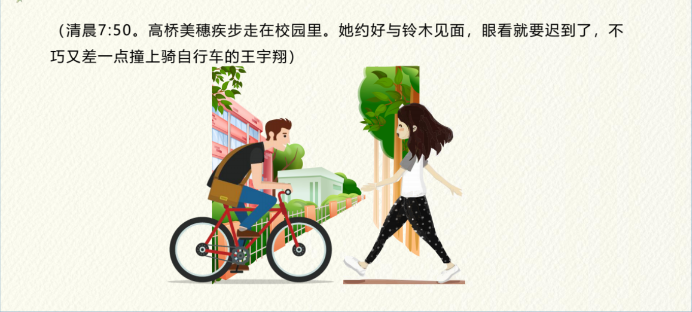
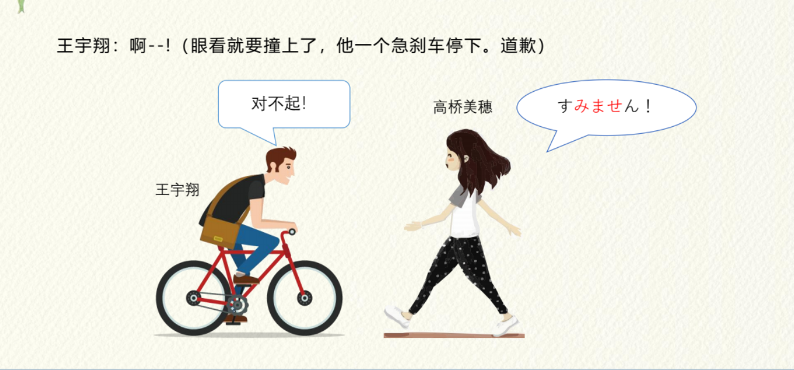
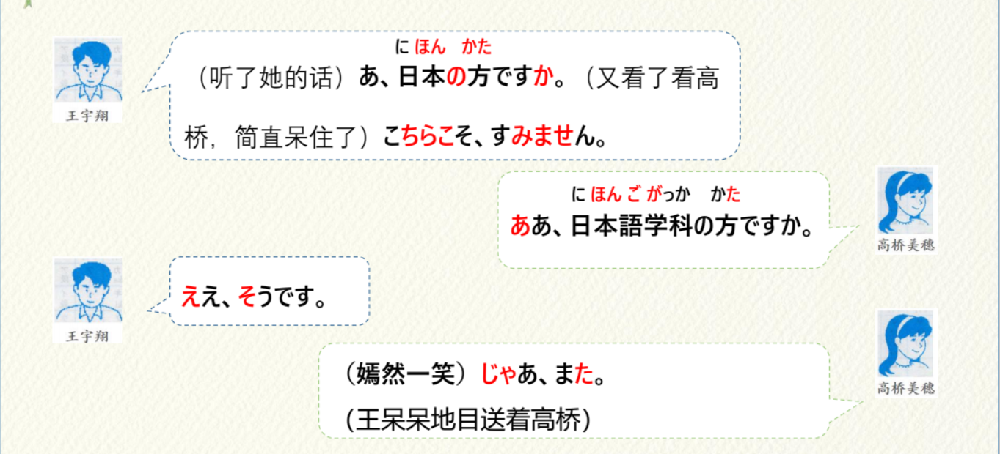
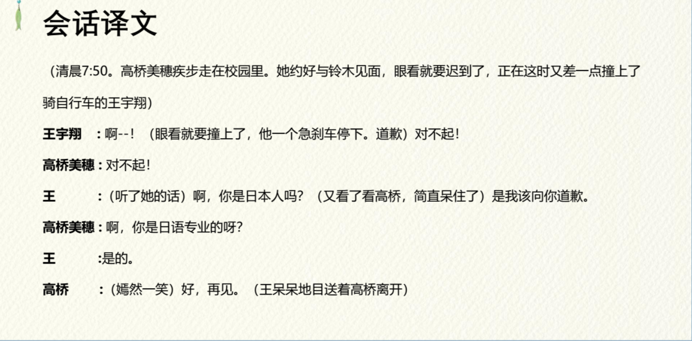
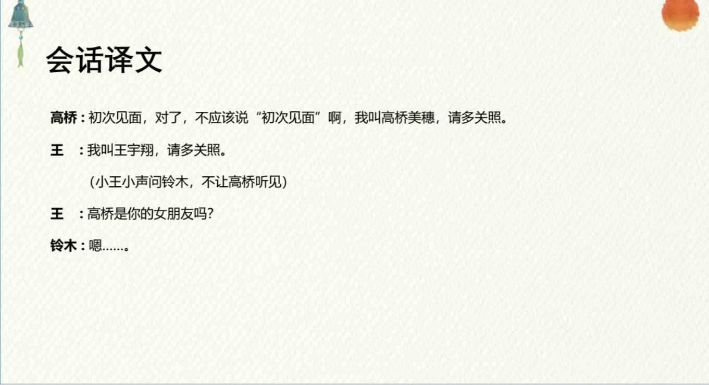

# N1 は N2 です

## 新出単語

<vue-plyr>
  <audio controls crossorigin playsinline loop>
    <source src="../audio/2-1-たんご.mp3" type="audio/mp3" />
  </audio>
 </vue-plyr>

| 単語                                                | 词性            | 翻译                                                        |
| :-------------------------------------------------- | --------------- | ----------------------------------------------------------- |
| 　新出単語<JpWord>しんしゅつたんご</JpWord>         | **⑤**<名>       | 新单词；生词                                                |
| 　新出<JpWord>しん しゅつ</JpWord>                  | **⓪**<名>       | 新出现；新                                                  |
| 　単語 <JpWord>たんご</JpWord>                      | **⓪**<名>       | 单词                                                        |
| 第 2 課 <JpWord>だいにか</JpWord>                   | **①**-**①**<名> | 第 2 课                                                     |
| 第-<JpWord>だい-</JpWord>                           | **①**＜接頭＞   | 第～ da i **①**调                                           |
| 課<JpWord>か</JpWord>                               | **①**<名>       | 课 ka だい-にか **①**-**①**                                 |
| 新生活<JpWord>しんせいかつ</JpWord>                 | **③**<名>       | 新生活                                                      |
| 新<JpWord>しん</JpWord>                             | ＜接頭＞        | 新                                                          |
| 生活<JpWord>せいかつ</JpWord>                       | **⓪**<名・自 Ⅲ> | 生活                                                        |
| unit<JpWord>ユニット</JpWord>                       | **①**<名>       | 单元                                                        |
| 会話<JpWord>かいわ</JpWord>                         | **⓪**<名・自 Ⅲ> | 会话                                                        |
| <JpWord>はじめまして</JpWord>                       | **➃**           | 初次见面                                                    |
| <JpWord>すみません</JpWord>                         | **➃**           | 对不起                                                      |
| <JpWord>あ<感></JpWord>                             |                 | （表示明白、吃惊、感叹之意）啊 a                            |
| 日本<JpWord>に ほん</JpWord>                        | **②**<固名>     | 日本                                                        |
| 中国<JpWord>ちゅうごく</JpWord>                     | **①**           | 中国                                                        |
| 方<JpWord>かた</JpWord>                             | **②**<名>       | （用于人，含敬意）位                                        |
| <JpWord>こちらこそ</JpWord>                         | **④**           | 表示自己才属于对方所说的那种情况                            |
| <JpWord>ああ</JpWord>                               | **①**＜感>      | （表示明白、吃惊、感叹或喜悦等）啊                          |
| 日本語学科<JpWord>にほんごがっか</JpWord>           | **⑤**<名>       | 日语专业；日语系                                            |
| 日本語<JpWord>にほんご</JpWord>                     | **⓪**<名>       | 日语                                                        |
| -語<JpWord>-ご</JpWord>                             | ＜接尾＞        | ～语                                                        |
| 学科<JpWord>がっ か</JpWord>                        | **⓪**<名>       | 专业                                                        |
| <JpWord>ええ</JpWord>                               | **①**＜感>      | （表示对对方提问的肯定答复）是；是的                        |
| <JpWord>そう</JpWord>                               | **①**<副>       | 那样；那么                                                  |
| <JpWord>じゃあ</JpWord>                             | **①**<接>       | (表示转换话题)那么                                          |
| <JpWord>また</JpWord>                               | **②**<副>       | 再见；再；又                                                |
| <JpWord>さん</JpWord>                               | ＜接尾＞        | （接在人名等后面,略表尊敬及亲密之意，相当于汉语的）         |
| <JpWord>おはよう</JpWord>                           | **⓪**           | 早上好                                                      |
| <JpWord>こちら</JpWord>                             | **⓪**<名>       | (指代说话人近旁的人)这位；这                                |
| 昨日<JpWord>きのう</JpWord>                         | **②**<名>       | 昨天                                                        |
| <JpWord>どうも</JpWord>                             | **①**<副>       | （ 加强感谢、道歉的语气）太；实在是                         |
| <JpWord>すみませんでした</JpWord>                   | **➃**           | (「すみません」的过去时)对不起                              |
| <JpWord>あれ</JpWord>                               | **⓪**<感>       | (表示吃惊或诧异)诶                                          |
| 知り合い<JpWord>しりあい</JpWord>                   | **⓪**<名>       | 相识；熟人                                                  |
| ちょっと<JpWord>ちょっと</JpWord>                   | **①**<副>       | 稍微，些许，一点儿，一下                                    |
| 高校<JpWord>こう こう</JpWord>                      | **⓪**<名>       | 高中　                                                      |
| 後輩<JpWord>こう はい</JpWord>                      | **⓪**<名>       | 晚辈；学弟；学妹； ニさんは私の後輩です。                   |
| 今<JpWord>いま</JpWord>                             | **①**<名>       | 现在 i ma 今何時？ いまなんじ？昨日 きのう                  |
| 京華大学<JpWord>きょう か だい がく</JpWord>        | **④**<固名>     | 京华大学                                                    |
| 語学留学生<JpWord>ご がく りゅう がく せい</JpWord> | **⑥**<名>       | 语言留学生 go ga ku ryu u ga ku se i                        |
| 語学<JpWord>ご がく</JpWord>                        | **①⓪**<名>      | 语言；外语 go ga ku                                         |
| 留学生<JpWord>りゅう がく せい</JpWord>             | **③**<名>       | 留学生 ryu u ga ku se i りゅう                              |
| 留学<JpWord>りゅう がく</JpWord>                    | **⓪**<名・自 Ⅲ> | 留学 ryu u ga ku                                            |
| <JpWord>どうぞ</JpWord>                             | **①**<副>       | (表示对他人提出请求)请；恳请；<br/> どうぞよろしく 请多指教 |
| <JpWord>よろしく</JpWord>                           | **④**<副>       | (寒暄用语)表示“请多关照”等意思 yo ro si ku                  |
| 彼女<JpWord>かの じょ</JpWord>                      | **①**<名>       | 她；女朋友 ka no zyo 彼氏（かれし）                         |
| <JpWord>まあ</JpWord>                               | **①**<副>       | （表示虽不十分满意，但还差强人意）就（还）算是吧 ma a       |
| 解説<JpWord>かい せつ</JpWord>                      | **⓪**<名・他 Ⅲ> | 解说；说明；解释；讲解 ka i se tu                           |
| 語彙<JpWord>ご い</JpWord>                          | **①⓪**＜名＞    | 词汇 go i 語彙力 max                                        |
| 音声<JpWord>おん せい</JpWord>                      | **①**<名>       | 语音；发音 o nn se i 音声メッセージ message                 |
| 文法<JpWord>ぶん ぽう</JpWord>                      | **⓪**<名>       | 语法 bu nn po u                                             |
| 表現<JpWord>ひょう げん</JpWord>                    | **➂**<名・他 Ⅲ> | 表达（方式） hyo u ge nn                                    |
| <JpWord>か</JpWord>                                 | <终助>          | （表示疑问）吗 ka                                           |
| <JpWord>は</JpWord>                                 | <取立て助>      | (「は」发 wa 的音)用于提出（凸显）话题 ha                   |
| <JpWord>ね</JpWord>                                 | <终助>          | 表示征求对方认同、确认的语气 ne                             |
| 会社員<JpWord>かい しゃ いん</JpWord>               | **③**＜名＞     | 公司职员 ka i sya i nn                                      |
| 会社<JpWord>かい しゃ</JpWord>                      | **⓪**＜名＞     | 公司 ka i sya                                               |
| ‐員<JpWord>いん</JpWord>                            | ＜接尾＞        | ～员；成员 i nn メンバー                                    |
| 大学生<JpWord>だい がく せい</JpWord>               | **③**           | 大学生 da i ga ku se i                                      |
| 学部生<JpWord>がく ぶ せい</JpWord>                 | **③**<名>       | 本科生 ga ku bu se i                                        |
| 学部<JpWord>がく ぶ</JpWord>                        | **⓪①**＜名＞    | 学院；系 ga ku bu                                           |
| 韓国<JpWord>かん こく</JpWord>                      | **①**<固名>     | 韩国 ka nn ko ku                                            |
| 中国 <JpWord>ちゅうごく </JpWord>                   |                 | tyu u go ku ちゅうごく                                      |
| 歴史学部<JpWord>れき し がく ぶ</JpWord>            | **④⑤**<名>      | 历史系 re ki si ga ku bu                                    |
| 歴史<JpWord>れき し</JpWord>                        | **⓪**<名>       | 历史 re ki si                                               |
| 友達<JpWord>とも だち</JpWord>                      | **⓪** <名>      | 朋友 to mo da ti    我是阿尼的朋友。                                        |
| 高校生<JpWord>こう こう せい</JpWord>               | **③**<名>       | 高中生 ko u ko u se i                                       |

## N1 は N2 です＜名词谓语句＞

意义：名词 N2 说明主语 N1 所指的内容。

译文：N1 是 N2

说明： N1N2 处填入名词
助词「は」提示主语或话题，读作「wa」。没有实际含义
「です」是判断词，前接名词构成名词谓语句。意思为中文的“是”
。
「です」的否定形式是「ではありません／じゃありません」，后者只用于口语。

> 私はアニです。我是阿尼  
> 助词：提示主题  
> 中文描述为：我 阿尼 是

```ts
（1）こちらは高橋美穂さんです。
（2））王さんは日本語科の方です。
（3）王さんは高橋さんの知り合いではありません。
（4）鈴木さんは語学留学生じゃありません。（口语）
```

## N1 は N2 では ありません // 不是

> (じゃ ありません) 用于口语

1. 句尾由【です】变成【ではありません】，表达否定的判断。
2. 中文：“不是”。

```ts
（1）王さんは高橋さんの知り合いではありませんか。
（2）鈴木さんは語学留学生じゃありません。（口语）
```

## です 音调规律

1. 平板型 ー ⓪ わたし０です // 高低 13
2. 起伏型 ﹀ ①②③④⑤....... // 低低 33

```ts
（1）かぜ 0 平板型 です //高低 13
（2）せんせい 3 起伏型 です //低低 33
```

## 練習 れんしゅう

```ts
（1）やま ya ma 2 です //31 33
（2）だいがく da i ga ku 0 です //3111 13
```

## S か ＜疑问＞

意义：表示疑问或确认。

译文：······吗？

接续：助词「か」用于句尾 说明：「か」接在陈述句的句尾构成疑问句。

```ts
（1）あ、日本の方ですか。//升疑问
（2）王さんは日本語学科の方ですか。//升 降~ 吗？ ~啊！
（3）高橋さんは王さんの知り合いですか。//升
（4）ああ、日本語学科の方ですか。//降 3声 确认
```

> 注意：表达疑问时，句子读升调，如（1）-（3）；表达确认时，句子读降调，如（4）。  
> 书写时，疑问句的「か」后面一般不使用问号，而使用句号。

## 練習 れんしゅう

```javascript
（1）女朋友是日本人吗？
（かのじょ） は （にほんじん ） ですか。
（2）我是帅哥吗？
 わたしはイケメンですか。
```

## 肯定回答：はい/ええ、そうです。

```javascript
（1）问：私はイケメンですか。
 答：はい、そうです。//是，是的
 /はい、イケメンです。//是，是帅哥。
```

## 否定回答：いいえ、～～ではありません

```javascript
（1）问：私は 美人ですか。
 答：いいえ、美人ではありません。//不是，不是美女。
（2） 问：私は美人 ですか。
 答：いいえ、ちがいます。//不是，不是的。
```

## S ね ＜确认＞ 向他人确认自己知道的事情。 对不对

意义：用于向对方确认自己说话的内容或征得对方的同意。

译文：······吧

接续：助词「ね」用于句尾

```javascript
（1）あ、きのうの方ですね。 //昨天的那位对吧。
（2）「はじめまして」じゃありませんね。
（3）あの方は王さんですね。
（4）高橋さんは鈴木さんの後輩ですね。
```

## の ＜领属＞

意义：助词「の」用于两个名词之间，前面的名词修饰后面的名词，表示领属关系、属性等。

译文：N1 的 N2（有时不译出）

接续：名词+の+名词

```javascript
（1）あ、日本の方ですか。 //你是日本人啊。
（2）鈴木さんは京華大学の学生です。 //すずきさん
（3）高橋さんは鈴木さんの彼女ではありません。 //たかはしさん
```

## 「か」与「ね」的区别

【か】是对初次接触到，刚刚获取的信息向对方确认。

> アニさんは日本語学科の学生ですか。阿尼是日语专业的学生呀。

【ね】是对自己已知的信息再次向对方确认。

> アニさんは女の子ですね。

## N1 で、N2 です ＜句子间中顿＞

意义：表示句子间的中顿。　～は～です。

译文：······是 N1，是 N2。A 是 n1.是 n2

接续：「で」是「です」的连用形，用于将两个名词谓语句连接起来。 当两个句子主语相同时，第二句的主语一般省略。

```javascript
（1）高橋さんは高校の後輩で、今、京華大学の語学留学生です。
（2）こちらは日本語学科の方で、王宇翔さんです。
（3）王さんは日本語科の学生で、二年生です。
```

## 練習 れんしゅう

```ts
（1）女朋友是医生，是作家
　かのじょはいしゃで、さっかです。
（2）我是美女，铃木是帅哥　//イケメン⓪帅哥
　わたしはびじんで、すずきはイケメンです。
```

## 宿题

```ts
（1）铃木不是学生。// 鈴木（すずき）　学生（がくせい）
　すずきさんはがくせいではありません。
（2）A：小王是高桥的学长吗？ //高桥：高橋（たかはし）
    おうさんはだかはしさんのせんぱいですか。
　　B：不，不是的。是高桥的男朋友。//男朋友：彼氏（かれし）　　
　　いいえ、おうさんはたかはしさんのかれしです。
（3）小李是铃木的朋友。 //朋友：友達（ともだち）李：李（り）
　りさんはすずきさんのともだちです。
（4）我是阿尼，是学生。阿尼：（アニ）学生：学生（がくせい）
　わたしはあにで、がくせいです。
```

## 亲属称谓

| 汉语                 | 自己的家庭成员                                  | 他人的家庭成员                                  |
| :------------------- | :---------------------------------------------- | :---------------------------------------------- |
| **爷爷、姥爷**       | 祖父（そふ） ①                                  | お爺さん（おじいさん） ②                        |
| **奶奶、姥姥**       | 祖母（そぼ） ①                                  | お婆さん（おばあさん） ②                        |
| **爸爸**             | 父（ちち） ①②                                   | お父さん（おとうさん） ②                        |
| **妈妈**             | 母（はは） ①                                    | お母さん（おかあさん） ②                        |
| **哥哥**             | 兄（あに） ①                                    | お兄さん（おにいさん） ②                        |
| **姐姐**             | 姉（あね） ⓪                                    | お姉さん（おねえさん） ②                        |
| **弟弟**             | 弟（おとうと） ④                                | 弟さん（おとうとさん） ⓪                        |
| **妹妹**             | 妹（いもうと） ④                                | 妹さん（いもうとさん） ⓪                        |
| **丈夫**             | 夫（おっと）⓪/旦那（だんな）⓪/主人（しゅじん）① | 旦那さん（だんなさん）⓪/　ご主人（ごしゅじん）② |
| **妻子**             | 妻（つま）①/家内（かない）①                     | 奥さん（おくさん） ①                            |
| **儿子**             | 息子（むすこ） ⓪                                | 息子さん（むすこさん）⓪/お子さん（おこさん）⓪   |
| **女儿**             | 娘（むすめ） ③                                  | 娘さん（むすめさん）⓪/**お子さん** ⓪            |
| **兄弟姐妹**         | 兄弟（きょうだい） ①                            | ご兄弟（ごきょうだい） ②                        |
| **叔叔、舅舅**       | 叔父／伯父（おじ ） ⓪                           | 叔父／伯父（おじさん） ⓪                        |
| **姑姑、姨**         | 叔母／伯母 （おば） ⓪                           | 叔母／伯母 （おばさん） ⓪                       |
| **侄子、外甥**       | 甥（おい） ⓪                                    | 甥御さん（おいごさん）⓪                         |
| **侄女、外甥女**     | 姪（めい） ⓪                                    | 姪御さん（めいごさん）⓪                         |
| **堂（表）兄弟姐妹** | 従兄弟／従姉妹（いとこ） ②                      | 従兄弟／従姉妹さん（いとこさん）②               |

```ts
（1）这个人是我的祖母
    このひとはわたしのそぼです。
（2）这个人是大白的祖母
　　このひとはしろさんのおばあさん。
```

## さん 音调规律

1. 高读 ー ⓪ すずきさん // 平板型　 ①①
2. 低读 ﹀ ①②③④⑤....... // 起伏形 ③③

> （1）すずきさん ⓪ 　　// 平板型,高读

> （2）もりさん ⓪ // 平板型,高读

> （3）たかはしさん ② // 起伏形

> （4）おうさん ① // 起伏形

## 会話

<vue-plyr>
  <audio controls crossorigin playsinline loop>
    <source src="../audio/2-1-かいわ.mp3" type="audio/mp3" />
  </audio>
 </vue-plyr>








