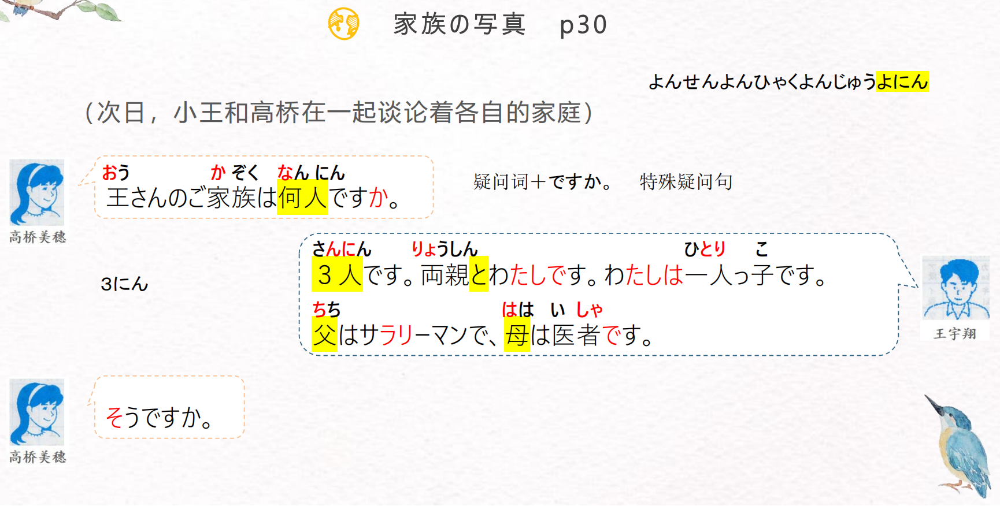
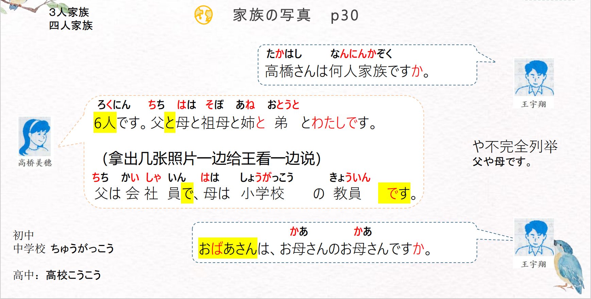
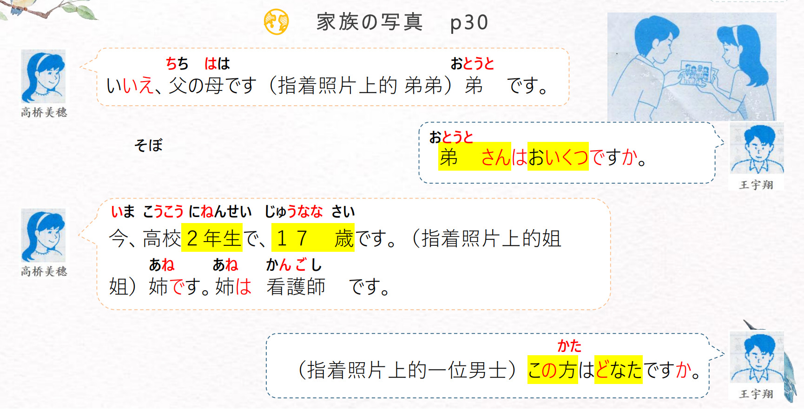
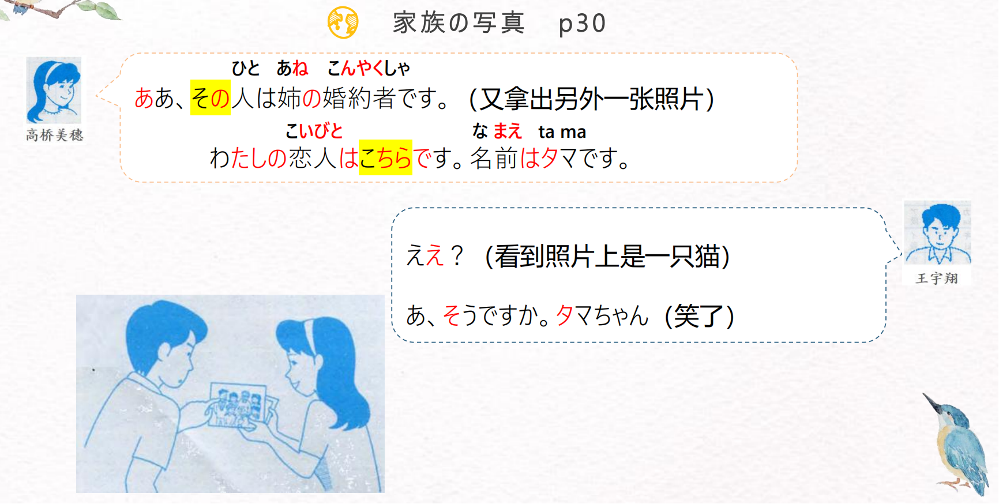
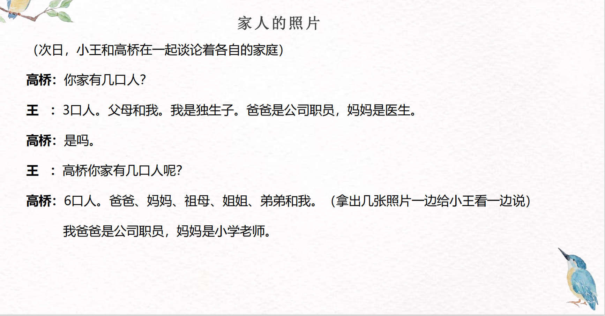
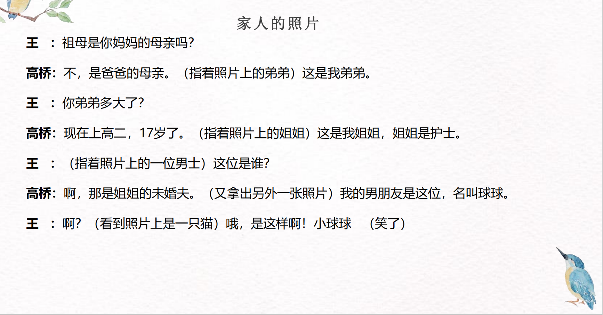

# いち、にん、ひとつ...

## 新出単語

<vue-plyr>
  <audio controls crossorigin playsinline loop>
    <source src="../audio/2-2-たんご.mp3" type="audio/mp3" />
  </audio>
 </vue-plyr>

| 単語                                          | 词性               | 翻译                                                   |
| --------------------------------------------- | ------------------ | ------------------------------------------------------ |
| 家族<JpWord>かぞく</JpWord>                   | **①**＜名＞        | 家；家人；家庭成员                                     |
| 写真<JpWord>しゃ しん</JpWord>                | **◎**＜名＞        | 照片；相片                                             |
| 御～<JpWord>ご～</JpWord>                     | ＜接頭＞           | 主要接在汉字音读名词前ごかぞく                         |
| 何人<JpWord>なんにん</JpWord>                 | **①**＜名＞        | 几个人（ 询问人数）                                    |
| ～人<JpWord>～にん</JpWord>                   | ＜接尾＞           | （接在数量名词或动作性名词后面）（几）人；（做……的）人 |
| 3 人<JpWord>さん にん</JpWord>                | **③**＜名＞        | 3 人                                                   |
| 両親<JpWord>りょうしん</JpWord>               | **①**＜名＞        | 父母；双亲                                             |
| 一人っ子<JpWord>ひとりっこ</JpWord>           | **③**＜名＞        | 独生子女 hi to ri kko                                  |
| 父<JpWord>ちち</JpWord>                       | **①②**＜名＞       | （我）父亲；（我）爸爸 谦称 敬称                       |
| 父<JpWord>ちち</JpWord>                       | **①②**＜名＞       | （我）父亲；（我）爸爸 谦称 敬称                       |
| salaried man<JpWord>サラリーマン</JpWord>     | **③**＜名＞        | 男性公司职员                                           |
| 公司职员<JpWord> かいしゃいん</JpWord>        | ＜名＞             | 公司职员                                               |
| 母<JpWord>はは</JpWord>                       | **①**＜名＞        | （我）母亲；（我）妈妈                                 |
| 医者<JpWord>い しゃ</JpWord>                  | **◎**＜名＞        | 医生；大夫                                             |
| 祖母<JpWord>そぼ</JpWord>                     | **①**＜名＞        | 祖母；外祖母；奶奶；姥姥                               |
| 姉<JpWord>あね</JpWord>                       | **⓪**＜名＞        | （我）姐姐 おねえさん                                  |
| 弟<JpWord>おとうと</JpWord>                   | **④**＜名＞        | （我）弟弟 おと う と さ ん                            |
| 小学校<JpWord>しょう がっ こう</JpWord>       | **③**＜名＞        | 小学 だい がく da i ga ku                              |
| 中学校<JpWord>ちゅう がっ こう</JpWord>       | **➂**              | 高中 tyu u ga kko u                                    |
| 初中；高校<JpWord>こう こう</JpWord>          | **◎**              |                                                        |
| 教員<JpWord>きょう いん</JpWord>              | **◎**＜名＞        | 教员；教师；老师                                       |
| 教師<JpWord>きょうし</JpWord>                 |                    |                                                        |
| 医生 律师~<JpWord>せんせい</JpWord>           |                    |                                                        |
| お祖母さん<JpWord>おばあさん</JpWord>         | **②**＜名＞        | (「祖母」的敬称)祖母;外祖母；奶奶；姥姥                |
| お母さん<JpWord>おかあさん</JpWord>           | **②**＜名＞        | （「母親」的敬称。可用于直接称呼）                     |
| <JpWord>おいくつ</JpWord>                     | **◎**＜名＞        | （用于询问对方的年龄）几岁；多大年纪                   |
| <JpWord>いくつ</JpWord>                       | **①**＜名＞        | 几岁；几个 （物品个数） り んごは い く つですか。     |
| <JpWord>アニさ んは い く つですか。</JpWord> |                    |                                                        |
| 17 歳<JpWord>じゅうなな さい</JpWord>         | **④**＜名＞        | 17 岁 ～さい                                           |
| -歳<JpWord>-さい</JpWord>                     | ＜接尾＞           | ~岁                                                    |
| 看護師<JpWord>かん ご し</JpWord>             | **③**<名>          | 护士 看護士                                            |
| <JpWord>この</JpWord>                         | **⓪**＜連体＞      | （指代说话人方面的人或事物等）这~                      |
| <JpWord>どなた</JpWord>                       | **①**＜名＞        | 哪位；谁 （谦称 敬称） だれ                            |
| <JpWord>その</JpWord>                         | **⓪**＜連体＞      | （指代对方附近或对方方面的人或事物等）那~              |
| 人<JpWord>ひと</JpWord>                       | **◎**＜名＞        | 人                                                     |
| 婚約者<JpWord>こん やく しゃ</JpWord>         | **④③**＜名＞       | 订婚对象；未婚夫；未婚妻                               |
| 婚約<JpWord>こん やく</JpWord>                | **◎**＜名・自 Ⅲ ＞ | 婚约；订婚                                             |
| -者<JpWord>しゃ</JpWord>                      | ＜接尾＞           | 做/是……的人                                            |
| 恋人<JpWord>こい びと</JpWord>                | **◎**＜名＞        | 恋人；对象；男朋友；女朋友 浊音变                      |
| <JpWord>と</JpWord>                           | ＜格助＞           | （表示并列）和；与 ちちとははとわたし                  |
| 名前<JpWord>なまえ</JpWord>                   | **◎**＜名＞        | 名字；姓；你的名字。 君の名は 。                       |
| <JpWord>タマ</JpWord>                         | **①**＜固名＞      | （猫的名字）球球 だいじん                              |
| <JpWord>ええ</JpWord>                         | **②**＜感＞        | （表示疑问，带有吃惊的语气）诶                         |
| <JpWord>あの</JpWord>                         | **⓪**＜連体＞      | （指代远离说话人、听话人双方的人或事物等）那~          |
| <JpWord>どの</JpWord>                         | **①**＜連体＞      | 哪个；哪~                                              |
| 祖父<JpWord>そふ</JpWord>                     | **①**<名>          | 祖父；爷爷 敬称： おじ い さ ん                        |
| 教師<JpWord>きょう し</JpWord>                | **①**<名>          | 教师                                                   |
| America<JpWord>アメリカ</JpWord>              | **◎**＜固名＞      | 美国 amerika 　アメリカ人（じん）                      |
| 仕事<JpWord>し ごと</JpWord>                  | **◎**＜名＞        | 工作 こと                                              |

## 音读基数词

| 0                 | 1                | 2                                         | 3                                       | 4               | 5                                         | 6            | 7                                         |
| :---------------- | :--------------- | :---------------------------------------- | :-------------------------------------- | :-------------- | :---------------------------------------- | :----------- | :---------------------------------------- |
| ゼロ ① <br>れい ① | いち ②           | に ①                                      | さん ⓪                                  | し ① <br>よん ① | ご ①                                      | ろく ②       | しち ② <br>なな ①                         |
| 8                 | 9                | 10                                        | 百                                      | 千              | 万                                        | 億           |
| はち ②            | く ①<br>きゅう ① | じゅう ①                                  | ひゃく ②                                | せん ①          | まん ①                                    | おく ①       |
| 100               | 200              | 300                                       | 400                                     | 500             | 600                                       | 700          | 800                                       |
| ひゃく ②          | にひゃく ③       | <font color="#ff0000">さんびゃく ①</font> | よんひゃく ①                            | ごひゃく ③      | <font color="#ff0000">ろっぴゃく ④</font> | ななひゃく ② | <font color="#ff0000">はっぴゃく ④</font> |
| 900               | 1000             | 2000                                      | 3000                                    | 4000            | 5000                                      | 6000         | 7000                                      |
| きゅうひゃく ①    | せん ①           | にせん ②                                  | <font color="#ff0000">さんぜん ③</font> | よんせん ③      | ごせん ②                                  | ろくせん ③   | ななせん ③                                |

## 训读基数词

| 一つ     | 二つ     | 三つ     | 四つ       | 五つ     |
| :------- | :------- | :------- | :--------- | :------- |
| ひとつ ② | ふたつ ③ | みっつ ③ | よっつ ③   | いつつ ② |
| 六つ     | 七つ     | 八つ     | 九つ       | 十       |
| むっつ ③ | ななつ ② | やっつ ③ | ここのつ ② | とお ①   |

## 数字-数法注意

1. 数数时，0 都不需要读出来。例：102：**ひゃくに** ；１００２ **せんに**;
2. 十百千 位为 1 时， 不需要把 1 读出来，10：じゅう；100：ひゃく；1000：せん
3. 当读房间号时，例如：301，其中 0 读作：**まる**:301 ：さんまるいち
4. 读电话号码时，通常会隔为两组或者三组朗读，其中会用“-”横杠隔开，且横杠读作
   「の」；例如：6751-390 １：ろく なな ご いち の さん きゅう ゼロ いち
   345-6834-8274
5. 百位注意：100 ひゃく, 300 さんびゃく,600 ろっぴゃく,800 はっぴゃく的读音；
   千位注意：1000 せん, 3000 さんぜん,8000 はっせん的读音；

```ts
（1）520 五百二十 ごひゃくにじゅう
（2）802 八百零二 はっぴゃくに
（3）33377 三万三千三百七十七 さんまんさんぜんさんびゃくななじゅうなな
```

## N は疑问词ですか

意义：用于表示疑问的词。 どなたですか おいくつですか～～

译文：几人、几个、谁、哪里等 一般 君の 名前は ア ニ で すか。

接续：疑问词+ですか。 N は疑问词ですか。

```ts
（1）王さんのご家族は 何人ですか。
（2）日本語学科（がっか）の学生（がくせい）は 何人ですか。
（3）弟（おとうと）さんは おいくつですか。
（4）（指着照片）高橋さん：この方は どなたですか
```

## 練習 れんしゅう

```ts
（1）铃木的女朋友是谁？// かのじょ　女朋友
　すずきさんのかのじょはだれですか。
（2）黑崎多大了？　// くろざき ②黑崎  おいくつ⓪几岁
　くろざきさんはおいくつですか。
```

## ～人 （にん：人数 じん：哪国人）

| １人                                  | ２人                                  | ３人                                        | 4 人                                                      | ５人         |
| :------------------------------------ | :------------------------------------ | :------------------------------------------ | :-------------------------------------------------------- | :----------- |
| <font color="#ff0000">ひとり ②</font> | <font color="#ff0000">ふたり ③</font> | さんにん ③                                  | <font color="#ff0000">よにん ②</font>（ 以 4 结尾的时候） | ごにん ②     |
| 6 人                                  | ７人                                  | 8 人                                        | ９人                                                      | 10 人        |
| ろくにん ②                            | しちにん ②/ななにん ②                 | はちにん ②                                  | きゅうにん ①/くにん ②                                     | じゅうにん ① |
| 100 人                                | 1000 人                               | 10000 人                                    | 何人                                                      |              |
| ひゃくにん ②                          | せんにん ①                            | <font color="#ff0000">いちまんにん ⓪</font> | なんにん ①                                                |              |

## 人数-数法注意

1. 基本都是音読数字加上「にん」的读法。 人（にん）
2. 注意： 1 人「**ひとり**」；2 人「**ふたり**」；疑问词：何人「**なんにん**」；
   じゅういちにんたくさんのひと
3. 数人数时，4 都读作「よ」，而不是「よん」或者「し」。个位上的 4
   例：4 人「よにん」 14 人「 じゅうよにん」 24 人「 にじゅうよにん」

```ts
（1）11人 じゅういちにん
（2）12人 じゅうににん
（3）14人 じゅうよにん
```

## ～年生 （ねんせい）

“～年生”一律读成-④ 型。为了便于解说和突出其规律性，此处采用负数式标

记法。在以后的各课中，类似情形也将采用负数式标记法。

> 1 年生 いちねんせい -④  
> 2 年生 にねんせい -④  
> 3 年生 さんねんせい -④  
> 4 年生 <font color="#ff0000">よねんせい</font> -④  
> 5 年生 ごねんせい -④  
> 6 年生 ろくねんせい -④  
> 疑问词： 何年生 なんねんせい -④ 高校一年生  
> あなたは なんねんせいですか。 何年生ですか。

> 负 ④ 调：正数第 2 到倒数第 4 个假名高读，其余低读。

## ～歳 （さい）

| １歳                                     | ２歳             | ３歳                                                        | 4 歳                 | ５歳                                           |
| :--------------------------------------- | :--------------- | :---------------------------------------------------------- | :------------------- | :--------------------------------------------- |
| <font color="#ff0000">いっさい ① </font> | にさい ①         | さんさい ①                                                  | よんさい ①           | ごさい ①                                       |
| 6 歳                                     | ７歳             | 8 歳                                                        | ９歳                 | 10 歳                                          |
| ろくさい ②                               | ななさい ②       | <font color="#ff0000">はっさい ① </font>                    | きゅうさい ①         | <font color="#ff0000">じゅういっさい ③ </font> |
| １１歳                                   | １８歳           | ２０歳                                                      | ３０歳               | 何歳                                           |
| じ（ゅ）っさい ①                         | じゅうはっさい ③ | <font color="#ff0000">はたち ①</font><br>にじ（ゅ）っさい ② | さんじ（ゅ）っさい ③ | いくつ ①<br>何歳 なんさい ①                    |

## 年龄数法注意

1. 基本都是音读数字加上「さい」的读法。 歳 促音变 じ ゅ っさい
2. 注意：以**1 岁**，**8 岁**，**10 岁**结尾，是「っさい」，都有促音。
   例如：11 歳「じゅういっさい」；18 歳「じゅうはっさい」；30 歳「さんじ（ゅ）っさい」；
3. 20 岁的读法比较特殊，读作「**はたち**」，「にじゅっさい」不常用，考试都考「はたち」。

## と<并列助词> 和

意义：助词「と」连接两个或两个以上的名词之间，表并列关系。  
译文：……和……  
接续：名词+と+名词（+と+名词） 完全列举

```ts
（1）（家族は）三人です。両親と私です。
（2）高橋さんと渡辺さんは語学留学生です。
（3）家族は６人で、父と母と祖母と姉と弟と私です。
```

## この、その、あの。どの<指示> 人物

意义：用于指示、限定名词所指称的人或事物。  
译文：这个……， 那个……， 哪个……  
接续：この/その/あの/どの＋名词

```ts
（1）王 ：この方はどなたですか。
高橋：ああ、その人は姉の婚約者です。
（2）あの方は鈴木真一さんです。
（3）王 ：高橋さんはどの人ですか。
高橋：高橋さんはあの人です。
```

> 说明： 「 こ の 、 そ の 、 あ の 、 ど の 」 是連体詞， 不能独立使用，  
> 只能做连体修饰名词。

| この       | その       | あの               | どの   |
| :--------- | :--------- | :----------------- | :----- |
| 这个~      | 那个~      | 那个~              | 哪个~  |
| 近称       | 中称       | 远称               | 疑问称 |
| 接近说话人 | 接近听话人 | 离说话人听话人都远 |        |

> こ问そ答 そ问こ答 あ问あ答

```ts
（1） A：そのほんは誰の本ですか。
　　　B：この本は私の本です。
（2）A：あの方 はどなたですか。
　　 B：あの方 は李さんの お父さんです。
（3） A：王さんはこの方ですか。
　　　B：いいえ、その方 は李さんです。
```

## 宿题

```ts
（1）姐姐和妈妈是护士。// 姉（あね） ⓪　母（はは） ①　看護師（护士） かんごし
　あねとはははかんごしです。
（2）小王和铃木是学生　//学生　がくせい
   おうさんとすずきさんはがくせいです。
（3）高桥： 那个人是小王的祖母吗。// 祖母（そぼ） ①	お婆さん（おばあさん） ②
　たかはし：そのひとはおうさんのおばめさんですか。
　小王： 是的， 这个人是我的祖母。
　おうさん：はい、そうです、このひとはわたしのそばです。
```

```ts
（1）18岁　じゅっはっさい
（2）20岁　はたちさい
（3）31岁　さんじゅうさい
（4）2人　ふたり ③ よん
（5）34人　さんじゅうよにん
（6）64人　ろくじゅうよにん
```

## 会話

<vue-plyr>
  <audio controls crossorigin playsinline loop>
    <source src="../audio/2-2-かいわ.mp3" type="audio/mp3" />
  </audio>
 </vue-plyr>






