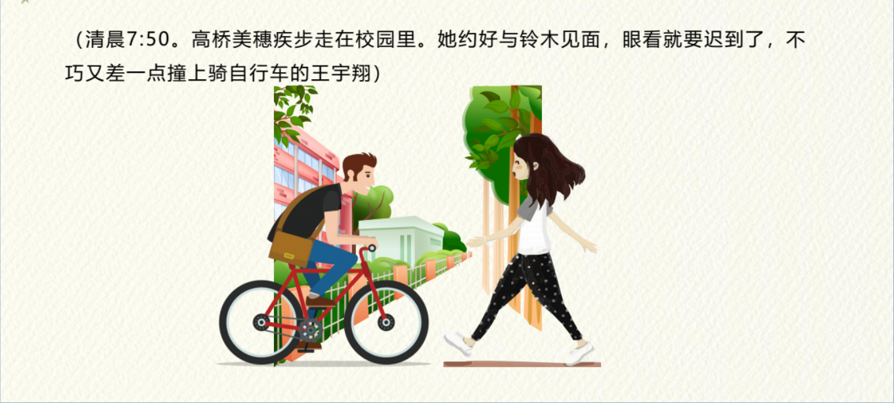
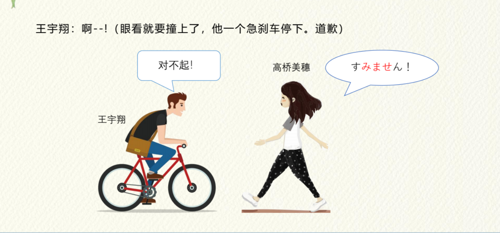
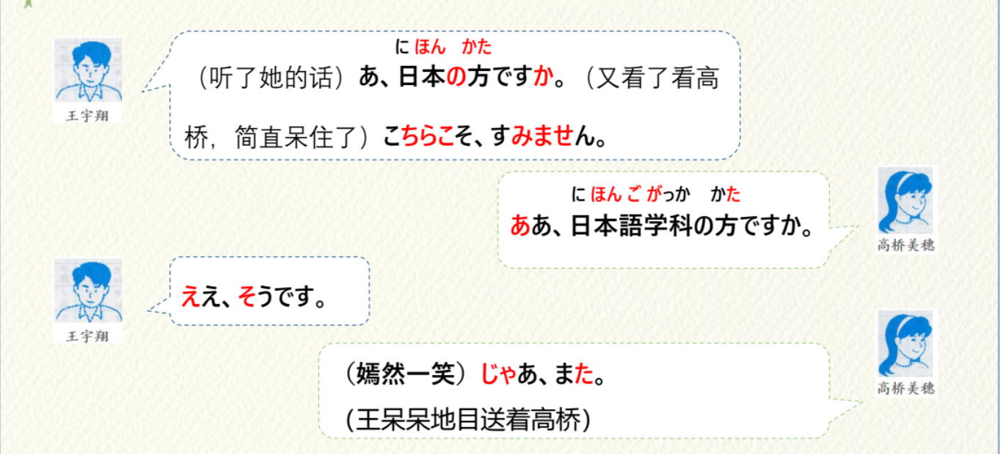
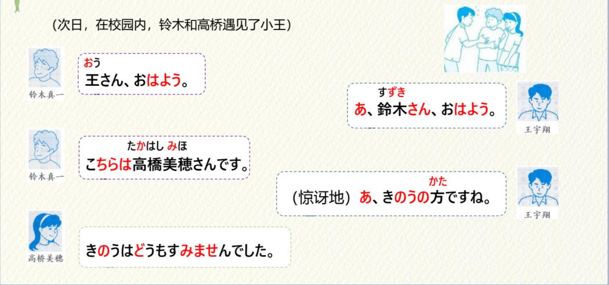
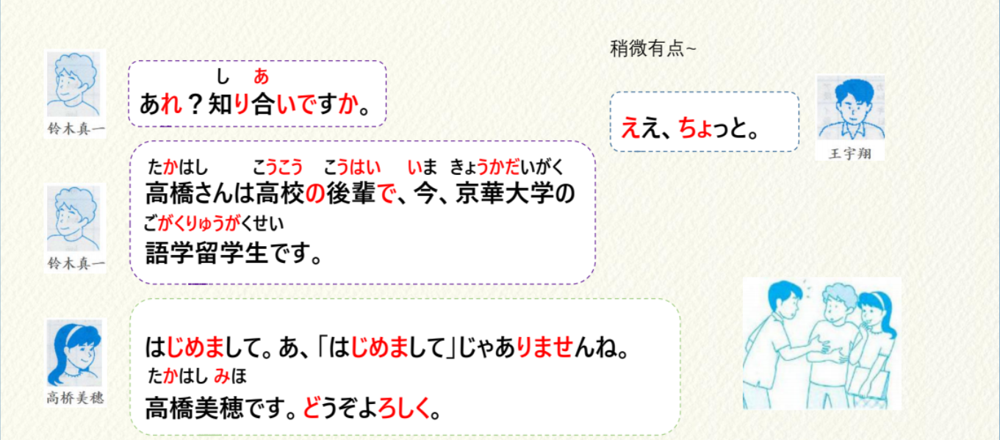
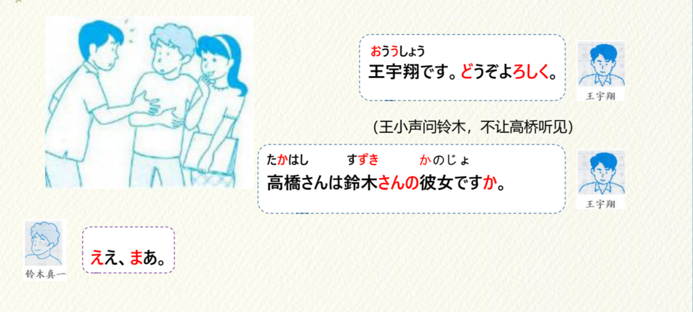
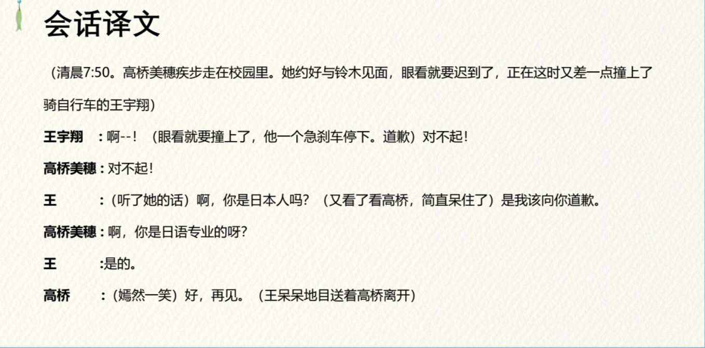
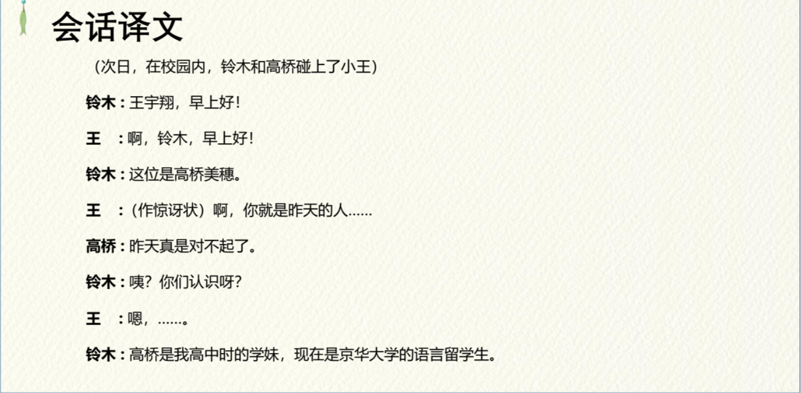
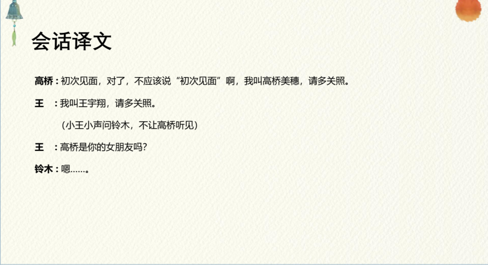

# ちち、はは、あに、いも...

## 亲属称谓

| 汉语                 | 自己的家庭成员                                  | 他人的家庭成员                                  |
| :------------------- | :---------------------------------------------- | :---------------------------------------------- |
| **爷爷、姥爷**       | 祖父（そふ） ①                                  | お爺さん（おじいさん） ②                        |
| **奶奶、姥姥**       | 祖母（そぼ） ①                                  | お婆さん（おばあさん） ②                        |
| **爸爸**             | 父（ちち） ①②                                   | お父さん（おとうさん） ②                        |
| **妈妈**             | 母（はは） ①                                    | お母さん（おかあさん） ②                        |
| **哥哥**             | 兄（あに） ①                                    | お兄さん（おにいさん） ②                        |
| **姐姐**             | 姉（あね） ⓪                                    | お姉さん（おねえさん） ②                        |
| **弟弟**             | 弟（おとうと） ④                                | 弟さん（おとうとさん） ⓪                        |
| **妹妹**             | 妹（いもうと） ④                                | 妹さん（いもうとさん） ⓪                        |
| **丈夫**             | 夫（おっと）⓪/旦那（だんな）⓪/主人（しゅじん）① | 旦那さん（だんなさん）⓪/　ご主人（ごしゅじん）② |
| **妻子**             | 妻（つま）①/家内（かない）①                     | 奥さん（おくさん） ①                            |
| **儿子**             | 息子（むすこ） ⓪                                | 息子さん（むすこさん）⓪/お子さん（おこさん）⓪   |
| **女儿**             | 娘（むすめ） ③                                  | 娘さん（むすめさん）⓪/**お子さん** ⓪            |
| **兄弟姐妹**         | 兄弟（きょうだい） ①                            | ご兄弟（ごきょうだい） ②                        |
| **叔叔、舅舅**       | 叔父／伯父（おじ ） ⓪                           | 叔父／伯父（おじさん） ⓪                        |
| **姑姑、姨**         | 叔母／伯母 （おば） ⓪                           | 叔母／伯母 （おばさん） ⓪                       |
| **侄子、外甥**       | 甥（おい） ⓪                                    | 甥御さん（おいごさん）⓪                         |
| **侄女、外甥女**     | 姪（めい） ⓪                                    | 姪御さん（めいごさん）⓪                         |
| **堂（表）兄弟姐妹** | 従兄弟／従姉妹（いとこ） ②                      | 従兄弟／従姉妹さん（いとこさん）②               |

```ts
（1）这个人是我的祖母
    このひとはわたしのそぼです。
（2）这个人是大白的祖母
　　このひとはしろさんのおばあさん。
```

## さん 音调规律

1. 高读 ー ⓪ すずきさん // 平板型　 ①①
2. 低读 ﹀ ①②③④⑤....... // 起伏形 ③③

> （1）すずきさん ⓪ 　　// 平板型,高读

> （2）もりさん ⓪ // 平板型,高读

> （3）たかはしさん ② // 起伏形

> （4）おうさん ① // 起伏形

## 会話

<vue-plyr>
  <audio controls crossorigin playsinline loop>
    <source src="../audio/2-1-かいわ.mp3" type="audio/mp3" />
  </audio>
 </vue-plyr>









