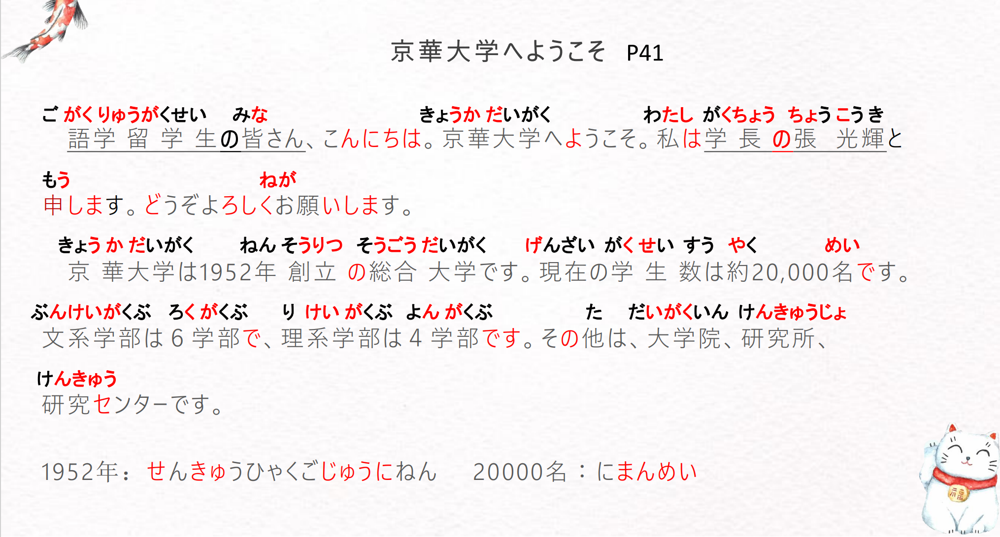

# ねん、の...

## 新出単語

<vue-plyr>
  <video id="player" playsinline controls loop >
    <source src="../audio/2-3-たんご.mp4" type="video/mp4" />
  </video>
 </vue-plyr>

| 単語                                                         | 词性              | 翻译                                             |
| ------------------------------------------------------------ | ----------------- | ------------------------------------------------ |
| 読解文<JpWord>どっかいぶん</JpWord>                          | **③**＜名＞       | 阅读理解的文章；课文 do kka i bunn               |
| 読解<JpWord>どっかい</JpWord>                                | **⓪**＜名.自 Ⅲ>   | 阅读理解； do kka i                              |
| 文<JpWord>ぶん</JpWord>                                      | **①**＜名＞       | 文章；句子                                       |
| 皆さん<JpWord>みなさん</JpWord>                              | **②**＜名＞       | 大家；各位 mi na sa nn                           |
| <JpWord>こんにちは</JpWord>                                  | **⓪**             | 你好！                                           |
| ~地点<JpWord>へようこそ</JpWord>                             | （へ：发 e 的音） | 表示欢迎对方的来访等 yo u ko so                  |
| 学長<JpWord>がくちょう</JpWord>                              | **⓪**＜名＞       | 大学校长 ga ku tyou                              |
| 張光輝<JpWord>ちょう-こうき</JpWord>                         | **①-①** ＜固名＞  | （人名）张光辉                                   |
| ～年<JpWord>ーねん</JpWord>                                  |                   | （用于计算年限或学年等）年                       |
| 創立<JpWord>そうりつ</JpWord>                                | **⓪**＜名＞       | 创立；创建；设立 起立 so u ri tu                 |
| 総合大学<JpWord>そうごうだいがく</JpWord>                    | **⑤**＜名＞       | 综合大学 so u go u da i ga ku                    |
| 総合<JpWord>そうごう</JpWord>                                | **⓪**＜名＞       | 综合                                             |
| 現在<JpWord>げんざい</JpWord>                                | **①**＜名＞       | 现在 ge nn za i                                  |
| 学生数<JpWord>がくせいすう</JpWord>                          | **③**＜名＞       | 学生数 ga ku se i su u                           |
| -数<JpWord>すう</JpWord>                                     | **①**＜接尾＞     | 数；数量                                         |
| 約<JpWord>やく</JpWord>                                      | **①**＜副＞       | 大约；大概 ya ku                                 |
| ～名<JpWord>～めい</JpWord>                                  |                   | （表示人数。「～人（にん）」的郑重说法）~名；~人 |
| 文系学部<JpWord>ぶんけいがくぶ</JpWord>                      | **⑤**＜名＞       | 文科院系 bu nn ke i ga ku bu                     |
| 理系学部<JpWord>りけいがくぶ</JpWord>                        | **④**＜名＞       | 理科院系 ri ke i ga ku bu                        |
| その他<JpWord>そのた</JpWord>                                | **②**＜名＞       | 其他；另外 so no ta                              |
| 大学院<JpWord>だいがくいん</JpWord>                          | **④**＜名＞       | 研究生院 da i ga ku i nn                         |
| 研究所<JpWord>けんきゅうじょ/けんきゅうしょ</JpWord>         | **⓪⑤**＜名＞      | 研究所 ke nn kyu u jyo/syo                       |
| 研究<JpWord>けんきゅう</JpWord>                              | **⓪**＜名.他 Ⅲ ＞ | 研究                                             |
| センター<JpWord>center</JpWord>                              | **①**<名>         | 中心 se nn ta –                                  |
| コース<JpWord>course</JpWord>                                | **①**＜名＞       | 学科；方向；路线 ko - su                         |
| 国際教育センター<JpWord>こくさいきょういく センター</JpWord> | **⓪-①**＜名＞     | 国际教育中心                                     |
| 国際<JpWord>こくさい</JpWord>                                | **⓪**＜名＞       | 国际                                             |
| 教育<JpWord>きょういく</JpWord>                              | **⓪**＜名·他 Ⅲ ＞ | 教育                                             |
| 一部<JpWord>いちぶ</JpWord>                                  | **②**＜名＞       | 一部分（此处为「一部分」的省略）                 |
| 主要科目<JpWord>しゅようかもく</JpWord>                      | **④**＜名＞       | 主要科目 syu yo u ka mo ku                       |
| 主要<JpWord>しゅよう</JpWord>                                | **⓪**＜形 Ⅱ ＞    | 主要 syu yo u                                    |
| 科目<JpWord>かもく</JpWord>                                  | **⓪**＜名＞       | 科目，学科 ka mo ku                              |
| 中国語<JpWord>ちゅうごくご</JpWord>                          | **⓪**＜名＞       | 汉语；中文 tyu u go ku go                        |
| 発音<JpWord>はつおん</JpWord>                                | **⓪**＜名.他 Ⅲ ＞ | 发音 ha tu o nn                                  |
| 聴解<JpWord>ちょうかい</JpWord>                              | **⓪**＜名＞       | 听力 tyo u ka i                                  |
| 作文<JpWord>さくぶん</JpWord>                                | **⓪**＜名.自 Ⅲ ＞ | 作文；写作 sa ku bu nn                           |
| 言葉<JpWord>ことば</JpWord>                                  | **③**＜名＞       | 语言；词汇；口语 ko to ba                        |
| 勉強<JpWord>べんきょう</JpWord>                              | **⓪**＜名.他 Ⅲ ＞ | 学习 be nn kyo u                                 |
| 日々<JpWord>ひび</JpWord>                                    | **①**＜名＞       | 每天；天天；平时 hi bi                           |
| 努力<JpWord>どりょく</JpWord>                                | **①**＜名.自 Ⅲ ＞ | 努力 do ryo ku                                   |
| 積み重ね<JpWord>つみかさね</JpWord>                          | **⓪**＜名＞       | 积累 tu mi ka sa ne                              |
| <JpWord>では</JpWord>                                        | **①**＜接＞       | 那么                                             |
| <JpWord>の</JpWord>                                          | <格助＞           | 表示同位关系                                     |
| 言語文学部<JpWord>げんごぶんがくぶ</JpWord>                  | **⑦**＜名＞       | 语言文学院；语言文学系                           |
| 文学部<JpWord>ぶんがくぶ</JpWord>                            | **④**＜名＞       | 文学院；文学系                                   |
| 教育学部<JpWord>きょういく</JpWord>                          | **⑥**＜名＞       | 教育学院；教育（学）系                           |
| 法学部<JpWord>ほうがくぶ</JpWord>                            | **④**＜名＞       | 法学院；法学系                                   |
| 経済学部<JpWord>けいざいがくぶ</JpWord>                      | **⑤⑥**＜名＞      | 经济学院；经济学系                               |
| 理学部<JpWord>りがくぶ</JpWord>                              | **③**＜名＞       | 理学院；理科系                                   |
| 医学部<JpWord>いがくぶ</JpWord>                              | **③**＜名＞       | 医学院；医学系                                   |
| 歯学部<JpWord>しがくぶ</JpWord>                              | **③**＜名＞       | 口腔学院；口腔系                                 |
| 薬学部<JpWord>やくがくぶ</JpWord>                            | **④**＜名＞       | 药学院；药学系                                   |
| 獣医学部<JpWord>じゅういがくぶ</JpWord>                      | **⑤⑥**＜名＞      | 兽医学院；兽医（学）系                           |
| 水産学部<JpWord>すいさんがくぶ</JpWord>                      | **⑤⑥**＜名＞      | 水产学院；水产养殖学系                           |
| 大学内機関<JpWord>だいがくないきかん</JpWord>                | **⑦**＜名＞       | 大学校内机构 da i ga ku na i ki ka nn            |
| -内<JpWord>ない</JpWord>                                     | ＜接尾＞          | …内                                              |
| 機関<JpWord>きかん</JpWord>                                  | **①**＜名＞       | 机构                                             |
| 動物病院<JpWord>どうぶつびょういん</JpWord>                  | **⑤**＜名＞       | 宠物医院 do u bu tu byo u i nn                   |
| 動物<JpWord>どうぶつ</JpWord>                                | **⓪**＜名＞       | 动物                                             |
| 病院<JpWord>びょういん</JpWord>                              | **⓪**＜名＞       | 医院                                             |

## ～年 ねん

| 1 年           | 2 年                  | 3 年       | 4 年                   | 5 年         |
| :------------- | :-------------------- | :--------- | :--------------------- | :----------- |
| いちねん ②     | にねん ①              | さんねん ⓪ | よねん ⓪               | ごねん ⓪     |
| 6 年           | 7 年                  | 8 年       | 9 年                   | 10 年        |
| ろくねん ②     | しちねん ②/ななねん ② | はちねん ② | きゅうねん ① /くねん ⓪ | じゅうねん ① |
| 20 年          | 100 年                |            |                        |              |
| にじゅうねん ② | ひゃくねん ②          |            |                        |              |

> 疑問詞： 何年 なんねん いまはなんねんですか。  
> 10 年、20 年······90 年均读成-4 型 // -4 "负数式"中的数字表示从后往前数时高读的最后一个音节的位置。

```ts
（1）あいうえお0＝あいうえお0
（2）あいうえお4＝あいうえお-2
（3）あいうえお5＝あいうえお-1
```

## の＜同位＞

意义： 「の」用于两个名词之间，表同位关系，即「の」前后的名词所指相同。

接续： 身份性质+の+专有名词； 性质，关系名词

```ts
（1）この方は留学生の高橋さんです。
（2）こちらはわたしの友達の王さんです。 // 友達（ともだち）
（3）こちらは高橋さんの恋人（こいびと） の 王さんです。
```

## 会話

<vue-plyr>
  <audio controls crossorigin playsinline loop>
    <source src="../audio/2-3-かいわ.mp3" type="audio/mp3" />
  </audio>
 </vue-plyr>



