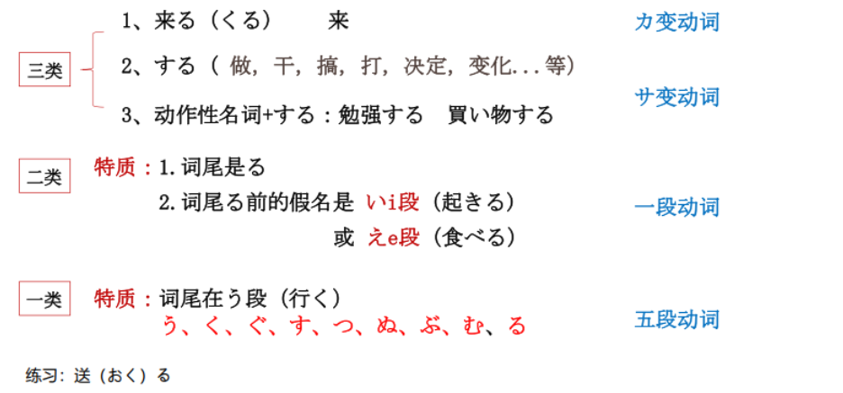

# どうし、を..

## 新出単語
<vue-plyr>
  <audio controls crossorigin playsinline autoplay loop>
    <source src="../audio/5-1-たんご.mp3" type="audio/mp3" />
  </audio>
 </vue-plyr>

## 动词

1. 什么是动词？概念：动作（うごく） 变化（なる）状态（こむ）存在（いる）
2. 结构：词干+词尾
3. 特征：结尾为“u”段假名。
   う、く、ぐ、す、つ、ぬ、ぶ、む、る、する
4. 形态变化：在变形时在哪里变呢？

## 動詞の類型



注意！看上去像二类动词，实为一类的动词

> 走る ② （跑） はしる　　

> 知る ⓪（知道） しる　　

> 要る ⓪（要） いる　　

> 入る ①（进入） はいる　　

> 帰る ①（回） かえる　　

> 切る ①（切） きる　　

> 喋る ②（说）しゃべる


```ts
★ 试试把下面的动词分类吧~
運動する（うんどうする）◎
鳴る（なる）①
送る（おくる）◎
食べる（たべる）②
来る（くる）①
知る（しる）◎

```

```ts
★ 试试把下面的动词分类吧~
運動する（うんどうする）◎ 3
鳴る（なる）◎ 1
送る（おくる）◎ 1
食べる（たべる）② 2
来る（くる）① 3
知る（しる）◎ 1

```

## 動詞の敬体（肯定・否定）

## 动词的敬体形式（ます形） 三类动词

① 来る（くる） → きます（来ます）  
② する → します  
③ 勉強する → 勉強します

## 动词的敬体形式（ます形） 二类动词

1. 将动词词典形词尾的「る」去掉，然后再接「ます」。  
   見る（みる）① → み＋ます → 見ます
   着る（きる）◎ → き＋ます → 着ます  
   食べる（たべる）→ たべ＋ます → 食べます

## 动词的敬体形式（ます形） 一类动词

1. 先将动词词典形（基本形，原型）词尾的「う」段假名
   变成「い」段假名，然后再接「ます」。

読む（よむ）① → よみ＋ます → 読みます  
書く（かく）① → かき＋ます → 書きます  
切る（きる）① →  
買う（かう）◎ →

## ます型的接続

1 類動詞  
词尾「う」段变同行的「い」段假名+ます  
買うー買いーかいます 行く  
2 類動詞  
去「る」+ます  
食べるー食べーたべます 起きる  
3 類動詞  
① 来（く）るーきーきます  
② するーします 勉強するー勉強＋します

## 動詞敬体 ます型

|      | 非過去肯定<br>ます | 非過去否定 <br>ません | 過去肯定<br>ました | 過去否定<br> ませんでした |
| :--- | :----------------- | :-------------------- | ------------------ | ------------------------- |
| 一類 | 飲みます           | 飲みません            | 飲みました         | 飲みませんでした          |
| 二類 | 食べます           | 食べません            | 食べました         | 食べませんでした          |
| 三類 | 来ます             | 来ません 来ました     | 来ませんでした     |
| 三類 | します             | しません              | しました           | しませんでした            |

## 什么是动词谓语句？

动作作用的事物（ 人） 为宾语。

```ts
(1) ジョイさんは教師です 。
(2) ジョイさんは綺麗です 。
(3) ジョイさんはすいかを食べる 。  // 食べる （ たべる ）
```

## 動詞非過去時

意义： 表示经常性、 习惯性、 反复性的动作  
说明： 常与表示动作频率的副词或时间名词） 一起使用。

```ts
(1) みなさんはどこでお菓子や果物を買いますか。
(2)  李さんはよくネットショッピングをしますか。
(3)  王さんは毎日日本語のニュースを聞きます。
```

## を<客体>

意义： 表示动作的客体。  
接续： 名词+ を

> 当以客体为话题时， 可
> 以用助词「 は 」 或
> 「 も 」 替代「 を 」 来提
> 示。 如例句（5）（6） 。

```ts
（1）お菓子を買います。 お菓子は買います。
我买点心。 点心的话， 我买。
（2） メールを送ります。
メールは送ります。メールも送ります。邮件的话， 我也发
（3）私は毎日新聞を読みます。
（4）私はコーヒーを飲みません。
（5）新聞を読みます。ニュースも聞きます。
（6）SNSは使いますが、メールはほとんど使いません。
```
## 会話
<vue-plyr>
  <audio controls crossorigin playsinline autoplay loop>
    <source src="../audio/5-1-かいわ.mp3" type="audio/mp3" />
  </audio>
 </vue-plyr>