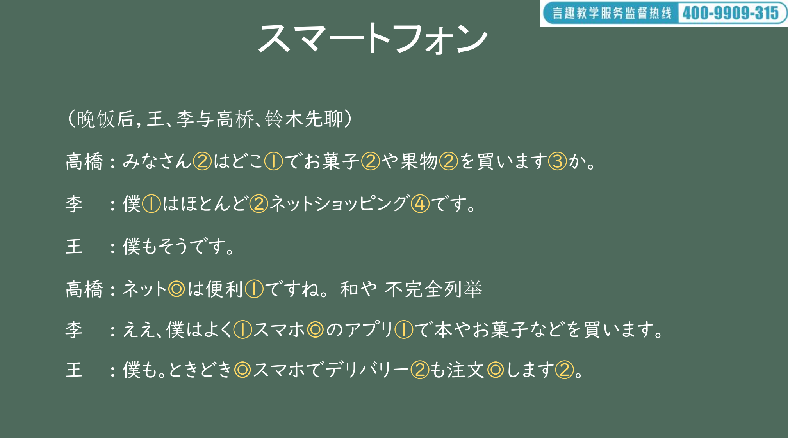
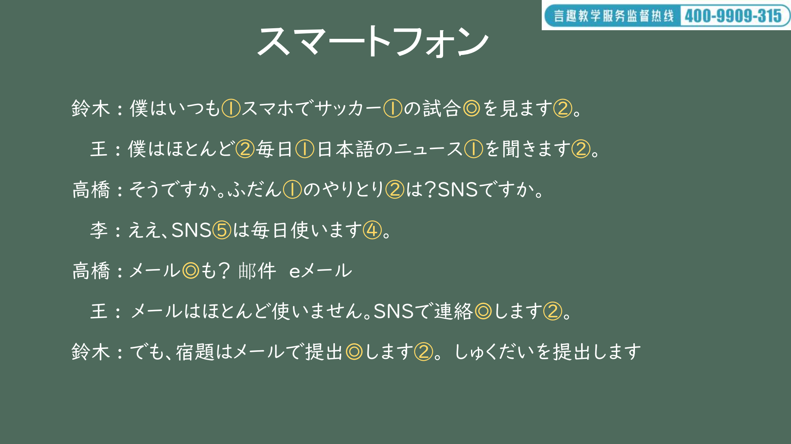
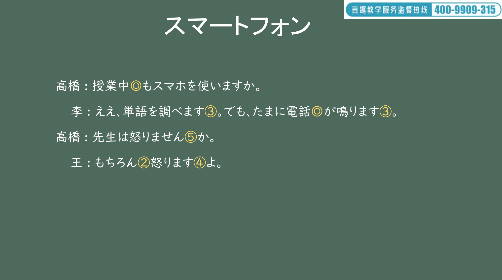
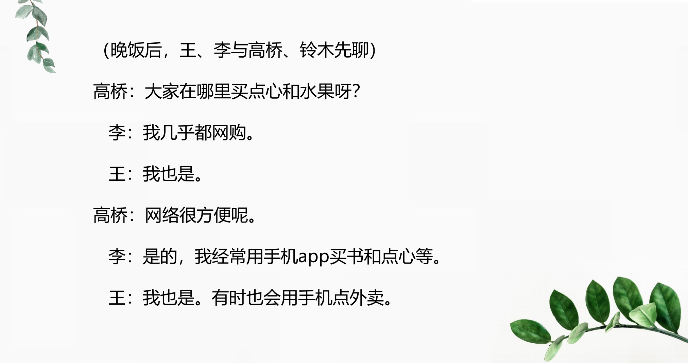
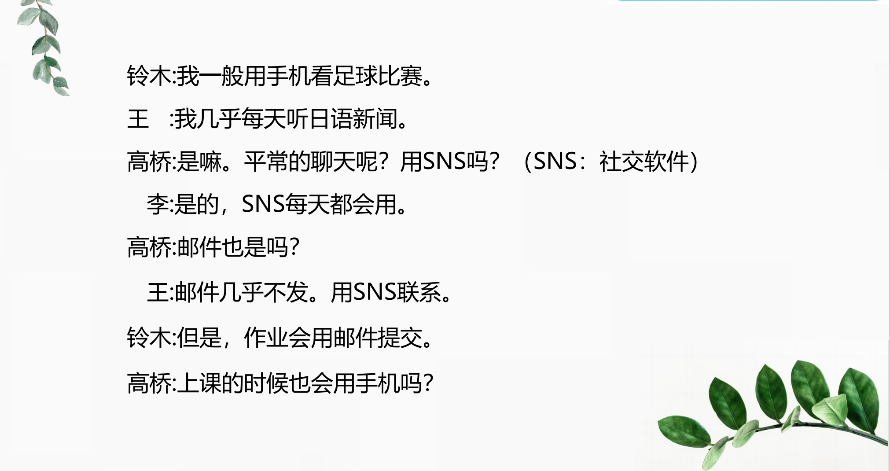
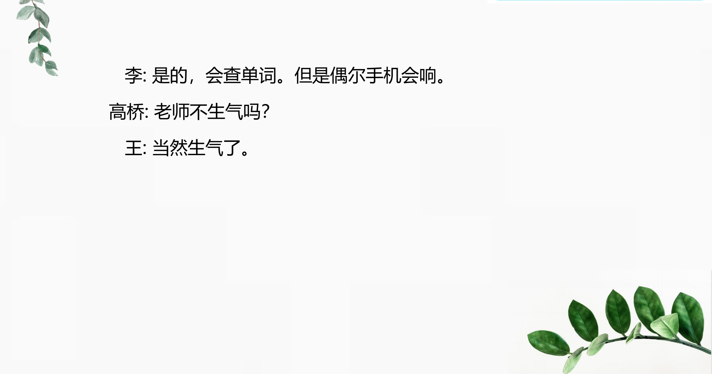

# どうし、を..

## 新出単語

<vue-plyr>
  <audio controls crossorigin playsinline loop>
    <source src="../audio/5-1-たんご.mp3" type="audio/mp3" />
  </audio>
 </vue-plyr>

| 単語                                                   | 词性                                                    | 翻译                                                                             |
| :----------------------------------------------------- | ------------------------------------------------------- | -------------------------------------------------------------------------------- |
| 　<JpWord>スマートフォン</JpWord> （smartphone）       | 　 ④<名>                                                | 智能手机 su ma-to fo nn                                                          |
| 　<JpWord>スマート</JpWord> （smart）                  | ②<名>                                                   | 机敏；漂亮；苗条                                                                 |
| 　<JpWord>フォン</JpWord> （phone）                    | ①<名>                                                   | 电话                                                                             |
| 　お菓子<JpWord>お か し</JpWord>                      | ② ＜名＞                                                | 点心；糕点 おかしい可笑的 ，奇怪的                                               |
| 　果物<JpWord>くだ もの</JpWord>                       | ② ＜名＞                                                | 水果 おかしやくだものなどです。                                                  |
| 　買う<JpWord>かう</JpWord>                            | ⓪ ＜他 Ⅰ ＞                                             | 买；购买                                                                         |
| 　僕<JpWord>ぼく</JpWord>                              | ① ＜名＞                                                | （男性自称）我 ぼくはヒーローになりたい。                                        |
| 　<JpWord>ほとんど</JpWord>                            | ②<副>                                                   | 几乎；大部分；差不多                                                             |
| 　<JpWord>ネットショッピング</JpWord> （net shopping） | ④ ＜名・自 Ⅲ ＞                                         | 网购；线上购物                                                                   |
| 　<JpWord>ネット</JpWord> （net）                      | ⓪ ＜名＞                                                | （「インターネット」（internet)省略说法）网络                                    |
| <JpWord>ショッピング</JpWord>（shopping）              | ① ＜名・自 Ⅲ ＞                                         | 购物 ne tto syo ppinn gu                                                         |
| <JpWord>よく</JpWord>                                  | ①<副>                                                   | 经常；常常；很；非常（いつも的频率更高）                                         |
| <JpWord>スマホ</JpWord>                                | ⓪ ＜名＞                                                | （「スマートフォン」（smartphone)的省略说法）智能手机                            |
| <JpWord>アプリ</JpWord>                                | ① ＜名＞                                                | （「アプリケーションソフト」（application)的省略说法）                           |
| <JpWord>ときどき</JpWord>〖時々〗                      | ⓪<名・副>                                               | 常                                                                               |
| <JpWord>デリバリー</JpWord>（delivery）                | ② ＜名・自 Ⅲ ＞                                         | 外卖,出货                                                                        |
| 注文<JpWord>ちゅう もん</JpWord>                       | ⓪ ＜名・他 Ⅲ ＞                                         | 订单；下订单；订货；点菜 动作性名词                                              |
| <JpWord>いつも</JpWord>                                | ①<副>                                                   | 总是；经常；往常；平时 いつもなんどでも                                          |
| <JpWord>サッカー</JpWord>（soccer)                     | ① ＜名＞                                                | 足球 をする 踢足球 バスケットボールをする                                        |
| 試合<JpWord>し あい</JpWord>                           | ⓪ ＜名＞                                                | 比赛 試験（しけん）考试，测试 テスト test                                        |
| 見る<JpWord>みる</JpWord>                              | ① ＜他 Ⅱ ＞                                             | 看；观看 テレビをみる ほんをみる                                                 |
| 毎日<JpWord>まい にち</JpWord>                         | ① ＜名＞                                                | 每天；天天 ひび 天天                                                             |
| 毎-<JpWord>まい-</JpWord>                              | ＜接頭＞                                                | 每～ ほとんどまいにち                                                            |
| 聞く<JpWord>きく</JpWord>                              | ⓪ ＜他 Ⅰ ＞                                             | 听；问 おんがくを聞く 道を聞く                                                   |
| SNS<JpWord>エスエヌエス</JpWord>                       | （Social Network Software 或 Social Networking Services | 的省略说法）⑤：社交软件，社交网站                                                |
| 使う<JpWord>つかう</JpWord>                            | ⓪ ＜他 Ⅰ ＞                                             | 使用；用 エスエヌエス を つかう                                                  |
| <JpWord>メール</JpWord>（mail)                         | ①⓪ ＜名＞                                               | 邮件 e メール                                                                    |
| 連絡<JpWord>れん らく</JpWord>                         | ⓪ ＜名・自 Ⅲ ＞                                         | 联系；联络 連絡する                                                              |
| 提出<JpWord>てい しゅつ</JpWord>                       | ⓪ ＜名・他 Ⅲ ＞                                         | 提交；上交；提出 宿題を提出する                                                  |
| 授業中<JpWord>じゅ ぎょう ちゅう</JpWord>              | ⓪ ＜名＞                                                | 上课时 れんあいちゅう せかいじゅう                                               |
| -中<JpWord>-ちゅう</JpWord>                            | ＜接尾＞                                                | （表示动作、状态等正在进行、持续过程当中正······；······的时候                   |
| 調べる<JpWord>しらべる</JpWord>                        | ③ ＜他 Ⅱ ＞                                             | 调查；查阅                                                                       |
| <JpWord>たまに</JpWord>⓪ ＜副＞                        | 偶尔 他骂你                                             |
| 電話<JpWord>でんわ</JpWord>                            | ⓪<名·自 Ⅲ>                                              | 电话 スマホ けいたい                                                             |
| 鳴る<JpWord>なる</JpWord>                              | ⓪<自 Ⅰ>                                                 | 响；发出声响 でんわがなる                                                        |
| 怒る<JpWord>おこる</JpWord>                            | ②<自 Ⅰ>                                                 | 生气；发火；不高兴；愤怒 アニさんがおこる                                        |
| <JpWord>もちろん</JpWord>〖勿論〗                      | ②<副>                                                   | 当然                                                                             |
| <JpWord>を</JpWord>                                    | ＜格助＞                                                | 表示动作、作用的对象                                                             |
| <JpWord>が</JpWord>                                    | <格助>                                                  | 表示动作、变化、状态的主体                                                       |
| <JpWord>ふだん</JpWord>（普段）                        | ①<名・副>                                               | 平时；平常；平日                                                                 |
| <JpWord>やりとり</JpWord>                              | ② ＜名＞                                                | 对话，一问一答。 订单，电子邮件                                                  |
| 食べる<JpWord>たべる</JpWord>                          | ②<他 Ⅱ>                                                 | 吃                                                                               |
| 運動場<JpWord>うん どう じょう</JpWord>                | ⓪<名>                                                   | 运动场                                                                           |
| <JpWord>バスケットボール</JpWord> （basketball）       | ⑥<名>                                                   | 篮球                                                                             |
| <JpWord>する</JpWord>                                  | ⓪<他 Ⅲ>                                                 | 做；干 バスケットボールをする 想                                                 |
| 手紙<JpWord>て がみ</JpWord>                           | ⓪<名>                                                   | 信                                                                               |
| 書く<JpWord>かく</JpWord>                              | ①<他 Ⅰ>                                                 | 写 手紙 を 書く                                                                  |
| <JpWord>パン</JpWord> （葡萄牙语 pão)                  | ① ＜名＞                                                | 面包                                                                             |
| 店<JpWord>みせ</JpWord>                                | ②<名>                                                   | 商店                                                                             |
| 映画館<JpWord>えいがかん</JpWord>                      | ③<名>                                                   | 电影院                                                                           |
| <JpWord>パソコン</JpWord>                              | ⓪ ＜名＞                                                | （「パーソナルコンピューター（personal computer)的省略说法）个人电脑；笔记本电脑 |
| 携帯電話<JpWord>けいたいでんわ</JpWord>                | ⑤ ＜名＞                                                | 手机                                                                             |
| <JpWord>メッセージ</JpWord> （message）                | ① ＜名＞                                                | 信息；留言 me sse - ji                                                           |
| 届く<JpWord>とどく</JpWord>                            | ② ＜自 Ⅰ ＞                                             | 到；寄到；送到                                                                   |
| <JpWord>e メール</JpWord> （イー mail）                | ③ ＜名＞                                                | 电子邮件 e メール が とどく                                                      |
| 来る<JpWord>くる</JpWord>                              | ①<自 Ⅲ>                                                 | 来                                                                               |
| 読む<JpWord>よむ</JpWord>                              | ①<他 Ⅰ>                                                 | 读；阅读 ほんをよむ テレビをみる                                                 |
| 全然<JpWord>ぜんぜん</JpWord>                          | ⓪ ＜副＞                                                | （句尾通常与否定呼应使用）一点也（不）；全然（不）                               |

## 动词

1. 什么是动词？概念：动作（うごく） 变化（なる）状态（こむ）存在（いる）
2. 结构：词干+词尾
3. 特征：结尾为“u”段假名。
   う、く、ぐ、す、つ、ぬ、ぶ、む、る、する
4. 形态变化：在变形时在哪里变呢？

## 動詞の類型


注意！看上去像二类动词，实为一类的动词

> 走る ② （跑） はしる

> 知る ⓪（知道） しる

> 要る ⓪（要） いる

> 入る ①（进入） はいる

> 帰る ①（回） かえる

> 切る ①（切） きる

> 喋る ②（说）しゃべる

```ts
★ 试试把下面的动词分类吧~
運動する（うんどうする）◎
鳴る（なる）①
送る（おくる）◎
食べる（たべる）②
来る（くる）①
知る（しる）◎

```

```ts
★ 试试把下面的动词分类吧~
運動する（うんどうする）◎ 3
鳴る（なる）◎ 1
送る（おくる）◎ 1
食べる（たべる）② 2
来る（くる）① 3
知る（しる）◎ 1

```

## 動詞の敬体（肯定・否定）

## 动词的敬体形式（ます形） 三类动词

① 来る（くる） → きます（来ます）  
② する → します  
③ 勉強する → 勉強します

## 动词的敬体形式（ます形） 二类动词

1. 将动词词典形词尾的「る」去掉，然后再接「ます」。  
   見る（みる）① → み＋ます → 見ます
   着る（きる）◎ → き＋ます → 着ます  
   食べる（たべる）→ たべ＋ます → 食べます

## 动词的敬体形式（ます形） 一类动词

1. 先将动词词典形（基本形，原型）词尾的「う」段假名
   变成「い」段假名，然后再接「ます」。

読む（よむ）① → よみ＋ます → 読みます  
書く（かく）① → かき＋ます → 書きます  
切る（きる）① →  
買う（かう）◎ →

## ます型的接続

1 類動詞  
词尾「う」段变同行的「い」段假名+ます  
買うー買いーかいます 行く  
2 類動詞  
去「る」+ます  
食べるー食べーたべます 起きる  
3 類動詞  
① 来（く）るーきーきます  
② するーします 勉強するー勉強＋します

## 動詞敬体 ます型

|      | 非過去肯定<br>ます | 非過去否定 <br>ません | 過去肯定<br>ました | 過去否定<br> ませんでした |
| :--- | :----------------- | :-------------------- | ------------------ | ------------------------- |
| 一類 | 飲みます           | 飲みません            | 飲みました         | 飲みませんでした          |
| 二類 | 食べます           | 食べません            | 食べました         | 食べませんでした          |
| 三類 | 来ます             | 来ません 来ました     | 来ませんでした     |
| 三類 | します             | しません              | しました           | しませんでした            |

## 什么是动词谓语句？

动作作用的事物（ 人） 为宾语。

```ts
(1) ジョイさんは教師です 。
(2) ジョイさんは綺麗です 。
(3) ジョイさんはすいかを食べる 。  // 食べる （ たべる ）
```

## 動詞非過去時

意义： 表示经常性、 习惯性、 反复性的动作  
说明： 常与表示动作频率的副词或时间名词） 一起使用。

```ts
(1) みなさんはどこでお菓子や果物を買いますか。
(2)  李さんはよくネットショッピングをしますか。
(3)  王さんは毎日日本語のニュースを聞きます。
```

## を<客体>

意义： 表示动作的客体。  
接续： 名词+ を

> 当以客体为话题时， 可
> 以用助词「 は 」 或
> 「 も 」 替代「 を 」 来提
> 示。 如例句（5）（6） 。

```ts
（1）お菓子を買います。 お菓子は買います。
我买点心。 点心的话， 我买。
（2） メールを送ります。
メールは送ります。メールも送ります。邮件的话， 我也发
（3）私は毎日新聞を読みます。
（4）私はコーヒーを飲みません。
（5）新聞を読みます。ニュースも聞きます。
（6）SNSは使いますが、メールはほとんど使いません。
```

## が<主体>

意义：表示客观事件（如现象描写）的主语。　　
接续：名词+が

```ts
(1) たまに電話が鳴ります。
(2) ベル[铃]が鳴ります。
(3) よく友達が来ます。
```

## 他动词

1. 需要借助宾语才能完整表达主语的某种动作。
2. 主语用は /が 提示， 宾语和他动词之间一般用【 を 】 连接。
   【 主语は /が ＋ 宾语を ＋ 动词】

```ts
(1)阿尼さんは授業を始めます。 开始：始める（はじめる）
(2)電気をつけます。 打开： 付ける（つける）
```

## 自动词

1. 动词本身能够完整地表达主语（ 或主题） 的某种动作， 状态。
2. 没有宾语， 不是人为进行动作。 描述客观现象。【 主语が +自动词】

```ts
（1）授業が始まります 始まる（はじまる）
（2）電気がつきます 付く（つく）
（3）雨が降ります（降る「ふる」） 下（雨/雪）
```

## 自动词和他动词

1. 动词本身能够完整地表达主语（或主题）的某种动作，状态。
2. 没有宾语，不是人为进行动作。描述客观现象。【主语が+动词】
3. 需要借助宾语才能完整表达主语的某种动作。
4. 主语用は/が提示，宾语和他动词之间一般用【を】连接。
   【主语は/が＋宾语を＋动词】

```ts
(1)　雨が降ります（降る「ふる」） 下（雨/雪）
(2) 先生はたまに怒ります。
(3) 授業中に携帯電話が鳴ります
```

```ts
(1) 李さんはリンゴを食べました。
(2) 私もよく海外のニュースを読みます。
(3) 李さんはこのアプリを使います。

```

## 如何判断自动词和他动词

• 如何判断句子翻译成日语后，使用自动词还是他动词？
• 他动词：（侧重动作有发出者）能改成“把”字句，表示主语，宾语关系 n1 ＋把＋ n2 ＋动作
• 自动词：（侧重主语状态）能加个“着”字。表示主语状态 主语＋动作＋着（动作是主语做的）
• 注意：自然现象里面的动词一般用自动词

```ts
(1) 吃面包。たべる パン
(2) パン を たべます。
(3) 下雪。ゆき ふる
(4) ゆきがふる
(5) 小王买水果。くだもの かう
(6) おうさんは くだもの を かいます。
(7) 公司放假（休息状态） 放假：休む（やすむ）自他
(8) かい し ゃ が やすみ ま す。
(9) 辞职： かい し ゃ を やすみ ま す。
```

## 频率副词

意义：表示动作、状态发生的频率。 听课  
说明：与动词的非过去时呼应使用时，用于表示该动作、状态反复出现的频率、本单元以及本课第 3 单元出现的几个词语，可以按照频率高低归纳如下：

> 全然～ません ほとんど～ません あまり～ません たまに ときどき よく まいにち

| 频率副词                   | 频率 | 意思           |
| :------------------------- | :--- | :------------- |
| 毎-（毎日）                | 100% | 每~（每天）    |
| ほとんど                   | 95%  | 几乎（都）     |
| いつも                     | 90%  | 经常，总是     |
| よく                       | 70%  | 经常           |
| 時々（ときどき）           | 50%  | 时常，有时     |
| たまに                     | 20%  | 偶尔           |
| あまり～Ｖません           | 10%  | 不太~；不怎么~ |
| ほとんど～Ｖません         | 5%   | 几乎不~        |
| 全然（ぜんぜん）～Ｖません | 0    | 完全不~        |

```ts
(1) メールはほとんど使いません。
(2) 授業中、たまに電話がなります。
(3) ときどき、宅配便もデリバリーも利用します。
(4) 僕はよく小説を読みます。
(5) 鈴木さんは毎日中国の新聞を読みます。
(6) みなさんはいつもSNSを使います。
```

## で<处所>

意义：表示动作、行为进行的处所。  
译文：在······；于······  
接续：表示处所的名词+で

```ts
(1) みなさんはどこでお菓子や果物を買いますか。
(2) 毎日、図書館で本や雑誌などを読みます。]
```

## で<工具、手段>

意义：表示进行动作时使用的工具、手段、方式等。  
译文：用······；靠······；通过······  
接续：名词+で

```ts
(1) 僕はよくスマホのアプリで本やお菓子などを買います。
(2) 私はインターネットで日本語を勉強します。
```

## 动词的非过去时＜习惯、反复＞

意义： 表示经常性、 习惯性、 反复性的动作  
说明： 常与表示动作频率的副词或时间名词） 一起使用。

```ts
(1) みなさんはどこでお菓子や果物を買いますか。
(2) 李さんはよくネットショッピングをしますか。
(3) 王さんは毎日日本語のニュースを聞きます。
```

## 宿题

```ts
(1) 中国人用筷子吃饭。箸（はし） // 中国人は 筷子で饭を 吃
ちゅうごくじんははしで ごはん を たべる
(2) 教室的铃声响了。//教室（きょうしつ） 铃声：べる
きょうしつのベルがなる 。
(3) 高桥不使用邮件。 //邮件：メール   高桥は邮件を不使用
たかはしさんはメールをつかいません。
(4) 小李用电脑玩游戏。//ゲームをする
小李は电脑で游戏を玩。
りさんはパソコンでゲームをする
(5) 小王又帅， 又热情。 //帅： かっ こ い い 热情： し んせつ
おうさんはかっこよくて、しんせつだ.
```

## 会話

<vue-plyr>
  <audio controls crossorigin playsinline loop>
    <source src="../audio/5-1-かいわ.mp3" type="audio/mp3" />
  </audio>
 </vue-plyr>







