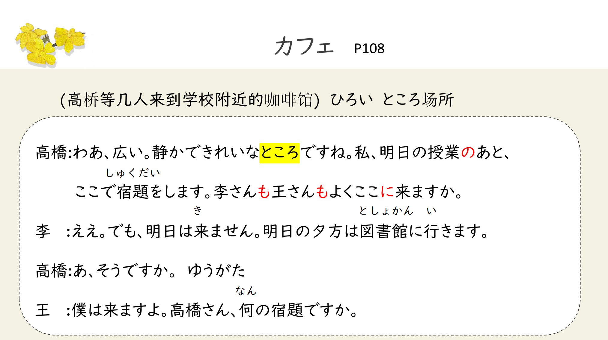
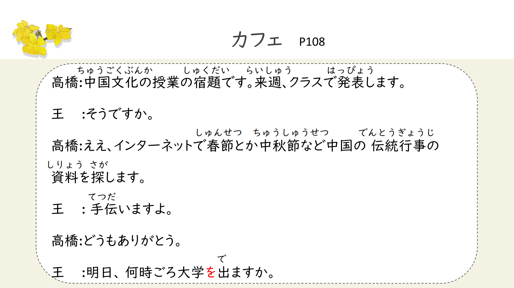
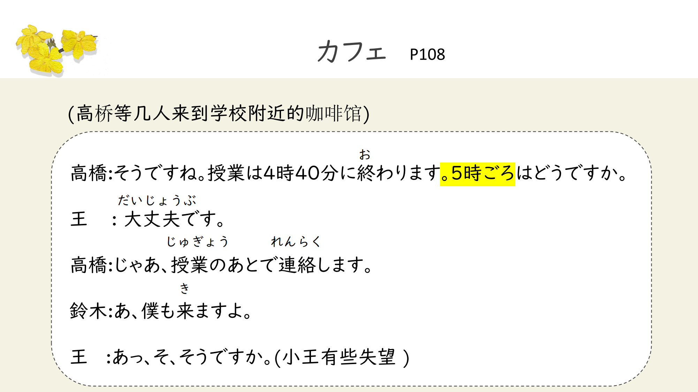
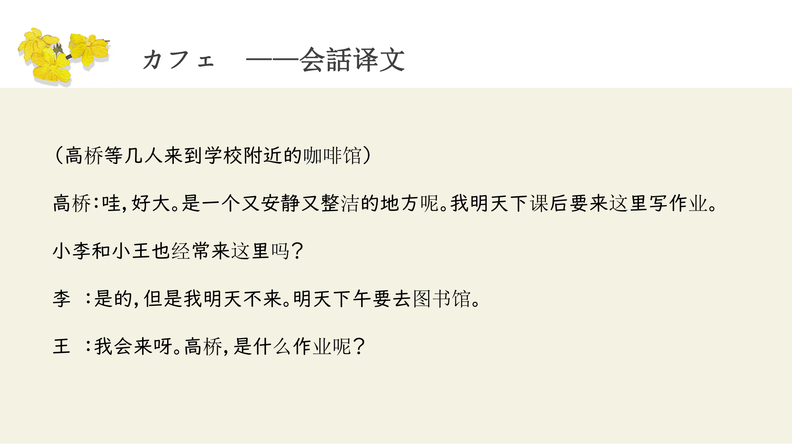
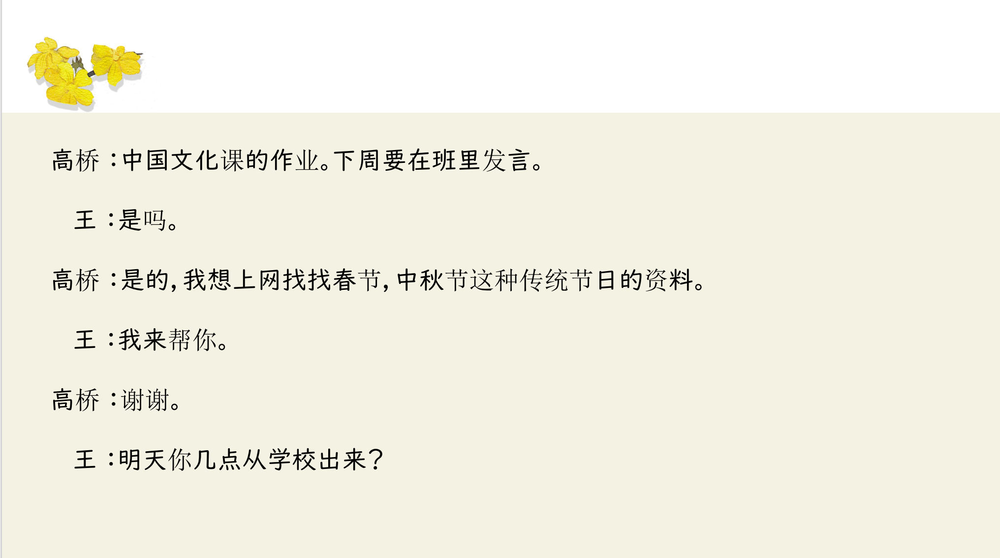
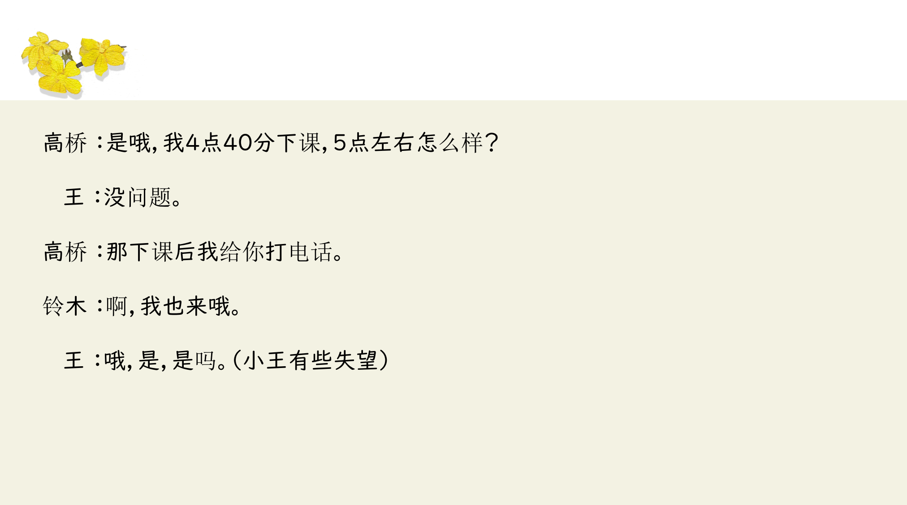

# あと（で）に、とか

## 新出単語
<vue-plyr>
  <audio controls crossorigin playsinline loop>
    <source src="../audio/5-2-たんご.mp3" type="audio/mp3" />
  </audio>
 </vue-plyr>

 | 単語                                     | 词性          | 翻译                                                     |
| ---------------------------------------- | ------------- | -------------------------------------------------------- |
| <JpWord>カフェ</JpWord> （ 法语 cafe ）  | ① ＜名＞      | 咖啡店(也作カフェ一) きっさてん                          |
| <JpWord>わぁ</JpWord>                    | ＜感＞        | (表示惊讶)哇                                             |
| <JpWord>あと</JpWord>[後]                | ① ＜名·副＞   | 以后;之后;后面;其余;其他                                 |
| 行く<JpWord>いく </JpWord>               | ◎ ＜自 I ＞   | (到~)去 ちょうさに行く                                   |
| 文化<JpWord> ぶんか</JpWord>             | ① ＜名＞      | 文化 文化祭 さい                                         |
| 春節<JpWord> しゅんせつ </JpWord>        | ◎ ＜名＞      | 春节                                                     |
| 中秋節<JpWord>ちゅうしゅうせつ </JpWord> | ③ ＜名＞      | 中秋节                                                   |
| 伝統<JpWord>でんとう</JpWord>            | ◎ ＜名＞      | 传统 たんごせつ                                          |
| 行事<JpWord>ぎょうじ </JpWord>           | ① ＜名＞      | 传统节日;传统庆典                                        |
| 資料<JpWord>しりょう </JpWord>           | ① ＜名＞      | 资料                                                     |
| 探す<JpWord>さがす </JpWord>             | ◎ ＜他 I ＞   | 找;寻找 在教室找资料 きょうしつ きょうしつで資料をさがす |
| 手伝う<JpWord> てつだう </JpWord>        | ③ ＜他 I ＞   | 帮助 敬体肯定 （ます）てつだいます                       |
| <JpWord>-ごろ</JpWord>[-頃]              | ＜接尾＞      | (接时间词后，表示大致的时间)左右;大约;大概               |
| 出る<JpWord>でる </JpWord>               | ① ＜自 Ⅱ ＞   | 出；出去；出发；出现；出席，离开 三時ごろ                |
| 終わる<JpWord>おわる </JpWord>           | ◎ ＜自他 I ＞ | 結束 きょうのじゅぎょうはこれでおわります。              |
| <JpWord>あっ</JpWord>                    | ① ＜感＞      | (表示惊讶)啊！a xtu                                      |
| <JpWord>を</JpWord>                      | ＜格助＞      | 表示位移动作(移动)的出发点、起点或离开的地点             |
| <JpWord>に</JpWord>                      | ＜格助＞      | 表示移幼的目的地、終点或进行动作的时间等                 |
| <JpWord>とか</JpWord>                    | ① ＜接助＞    | (表示列举) ……呀                                          |

## 动词的非过去时＜将来＞

意义:表示将来的动作或未来的状态。  
说明:常与表示将来时点的时间名词呼应使用。如果对话语境比较明  
显地提示出“将来”这一信息时，时间名词可省略。

```ts
✿(1) 私、明日の授業のあと、ここで宿題をします。
✿(2) 来週、クラスで発表します。
✿(3) 明日、宿題を提出します。
✿(4) 高橋さんは行きますが、鈴木さんは行きません。会~
```

## Ｎのあと（で） ＜先后顺序＞

意思： 表示时间順序， 在一个动作结束之后进行另一个动作。  
译文:… … 之后;… … 以后  
接续:动作性名词+のあと (で )， 「 で 」 可省略 勉強、 買い 物

```ts
(1) 私、明日の授業のあと、ここで宿題をします。
(2) じゃ、授業のあとで連絡します。
(3) 勉強のあと、ニュ一スを聞きます。
(4) 買い物のあと、テレビを見ます。

```

## に <目的地>

意义:表示移动的目的地。  
译文:到… … ;至… …  
接续:表示处所的名词十に 移动性动词 地点+に 行く  
搭配动词有：行く（いく）、来る（くる）、帰る（かえる）、入る（はいる）（进入）...

```ts
(1) 李さんも王さんもよくここに来ますか。 ～も ～も ~和~都
(2) 明日図書館に行きます。 あした としょかん
(3) 鈴木さんはよく映画館に行きます。 えいがかん
铃木は经常电影院に 去 鈴木さ んは よ く 映画館に 行き ま す。
```

> 来，行，归

```ts
(1)我12点睡觉。 睡觉： 寝る （ ね る ） じ ゅ う に じ
わたしはじゅうにじにねる
(2) 下午一点去公司。 会社（ かいしゃ ） 行く（ いく ） ごご
下午一点に公司に去ごご一時にかいしゃにいきます
(3) 9点起床。 起きる （ お き る ）
くじにおきます kiるおきます
(4) 早上八点去图书馆。 図書館（ としょかん ） 行く （ いく ）
あさはちじにとしょかんにいきます
(5) 用自行车去图书馆。 じてんしゃとしょかん
じでんしゃでとしょかんにいきます 。
(6) 小王经常去日本。 よく
おうさんはよくにほんにいく
(7) 明天来教室。 あした
あしたはきょうしつにくる
あしたはきょうしつにきます
(8) 早上八点去图书馆。 図書館（ としょかん ） 行く （ いく ）
あさはちじにとしょかんにいく
```

## に <时间点>

意义:表示动作、行为发生生的时间。  
接续:时间名词十に  
说明:一般用在表示绝对时刻的名词后面，如「3 時」「2 月」「2020 年」。

```ts
(1) 授業は4時40分に終わります。
(2) 私は午後2時に行きます。
(3) 田中さんは16日に中国に来ます。
```

## 关于时间＋「に」的用法

1. 明确、具体的时间必须加「に」
   ✿ ７時に、６月に、2017 年に
2. 模糊、非具体的时间不加「に」
   ✿ 毎日、今日、昨日、去年、先月、さっき、昔、将来
3. 特定的时间、时间段可加可不加
   ✿ 春、夏、秋、冬、夏休み、~曜日、春節
   はる なつ あき ふゆ なつやすみ


## とか <举例>
意义:举例，暗示还有同类的事物。 NやN 和不完全列举  
译文:… … 啦;… … 啦;  
说明:一般接在名词后面，有时也可以接在动词、形容词或引语后;  
可以两个以上并列使用，如「～とか~とか」。  

```ts
(1) インタ一ネットで春節とか中秋節など中国の伝統行事の資料を探します。
しゅんせつ ちゅうしゅうせつ
(2) 料理はギョ一ザとかおすしとかです。
(3) インタ一ネットでゲ一ムとかネットショッピングとか（を）します。
```
## 宿題

```ts
(1) 昨天八点回了家。
(2) 小王明天七点来我家。 我家： う ち
(3) 每天坐公交去公司。公交：バス
```

## 会話
<vue-plyr>
  <audio controls crossorigin playsinline loop>
    <source src="../audio/5-2-かいわ.mp3" type="audio/mp3" />
  </audio>
 </vue-plyr>







