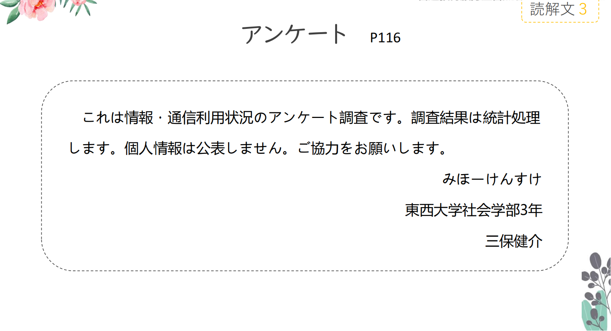
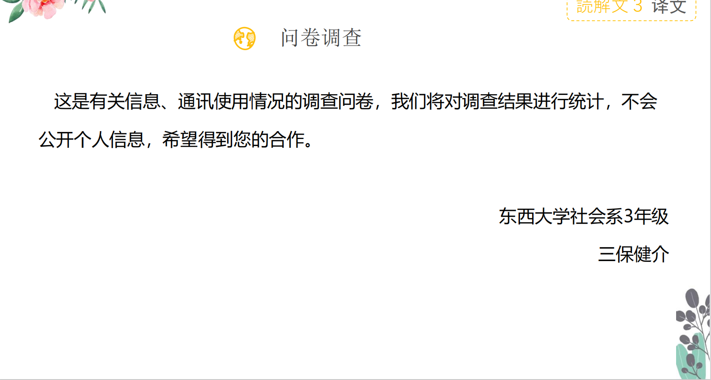

# に、あまり、あんけーと

## 新出単語

<vue-plyr>
  <audio controls crossorigin playsinline loop>
    <source src="../audio/5-3-たんご.mp3" type="audio/mp3" />
  </audio>
 </vue-plyr>

| 単語                                                 | 词性                                      | 翻译                                                                                                           |
| ---------------------------------------------------- | ----------------------------------------- | -------------------------------------------------------------------------------------------------------------- |
| <JpWord>カフェ</JpWord> （ 法语 cafe ）              | ① ＜名＞                                  | 咖啡店(也作カフェ一) きっさてん                                                                                |
| 近く<JpWord>ちかく</JpWord>                          | ②<名>                                     | 附近;周边;不久;即将 ちかい                                                                                     |
| 起きる<JpWord>おきる</JpWord>                        | ②<自 II>                                  | 起床;发生 阿尼起床了（过去敬体肯定）あにさんがおきました                                                       |
| 帰る<JpWord>かえる</JpWord>                          | ①<自 I>                                   | 回;归                                                                                                          |
| <JpWord>うち</JpWord>                                | ⓪<名>                                     | 家 うちにかえる いみがわからない                                                                               |
| 意味<JpWord>いみ</JpWord>                            | ①<名·他 3>                                | 意思;意义;语义;意味 単語のいみを調べます                                                                       |
| 読み方<JpWord>よみかた</JpWord>                      | ④<名>                                     | 读法 この漢字の読み方はなんですか。                                                                            |
| お土産<JpWord>おみやげ</JpWord>                      | ⓪<名>                                     | 土特产;伴手礼                                                                                                  |
| ご飯<JpWord>ごはん</JpWord>                          | ①<名>                                     | 饭菜;米饭. めし 看电视テレビをみる                                                                             |
| <JpWord>テレビ</JpWord>                              | ①<名>                                     | (「テレビジョン」(television) 的省略説法)电视;电视机                                                           |
| <JpWord>アンケート</JpWord>（法语 enquête ）         | ① ＜名＞                                  | 问卷调查 an nn ke- to                                                                                          |
| 通信<JpWord>つう しん</JpWord>                       | ⓪<名·自 Ⅲ>                                | 通讯                                                                                                           |
| 利用<JpWord>り よう</JpWord>                         | ⓪ ＜名・他 Ⅲ ＞                           | 利用；使用                                                                                                     |
| 状況<JpWord>じょう きょう</JpWord>                   | ⓪ ＜名＞                                  | 状况；情况                                                                                                     |
| 調査<JpWord>ちょう さ</JpWord>                       | ①<名·他 Ⅲ>                                | 调查 ちょうさ                                                                                                  |
| 結果<JpWord>けっか</JpWord>                          | ⓪<名>                                     | 结果                                                                                                           |
| 統計処理<JpWord>とう けい しょ り</JpWord>           | ⑤<名>                                     | 统计处理                                                                                                       |
| ☆ 統計<JpWord>とうけい</JpWord>                      | ⓪<名·他 Ⅲ>                                | 统计； ☆ 処理（しょり）①<名·他 Ⅲ>:处理                                                                         |
| 個人情報<JpWord>こ じん じょう ほう</JpWord>         | ④<名>                                     | 个人信息                                                                                                       |
| ☆ 個人<JpWord>こじん</JpWord>                        | ①<名>                                     | 个人；私人                                                                                                     |
| 公表<JpWord>こう ひょう</JpWord>                     | <名·他 Ⅲ>⓪                                | 公布 不公布 こうひょうしません                                                                                 |
| 協力<JpWord>きょう りょく</JpWord>                   | <名·自 Ⅲ>⓪                                | 协助；合作                                                                                                     |
| 社会<JpWord>しゃ かい</JpWord>                       | ①<名>                                     | 社会                                                                                                           |
| 該当項目<JpWord>がい とう こう もく</JpWord>         | ⑤<名>                                     | 该项                                                                                                           |
| ☆ 該当<JpWord>がいとう</JpWord>                      | ⓪<名·自 Ⅲ>                                | 该                                                                                                             |
| ☆ 項目<JpWord>こうもく</JpWord>                      | ⓪<名>                                     | 项；项目                                                                                                       |
| <JpWord>チェック</JpWord>（check）                   | ①<名·他 Ⅲ>                                | 核对；审核；检查；打勾，做记号                                                                                 |
| <JpWord>チェックする</JpWord>                        | 核对，检查                                | tye kku                                                                                                        |
| 性別<JpWord>せいべつ</JpWord>                        | ⓪<名>                                     | 性别                                                                                                           |
| 女性<JpWord>じょ せい</JpWord>                       | ⓪<名>                                     | 女性 だんせい                                                                                                  |
| 所属<JpWord>しょ ぞく</JpWord>                       | ⓪<名·自 Ⅲ>                                | 所属；属于；（所在）单位                                                                                       |
| 研究科<JpWord>けん きゅう か</JpWord>                | ⓪<名>                                     | 研究科目；研究专业；研究方向                                                                                   |
| ☆-科<JpWord>-か</JpWord>                             | <接尾>                                    | ～科 大学所属の研究所                                                                                          |
| 修士課程<JpWord>しゅう し か てい</JpWord>           | ④ ＜名＞                                  | 硕士课程                                                                                                       |
| ☆ 課程<JpWord>かてい</JpWord>                        | ⓪ ＜名＞                                  | 课程 博士（はかせ）                                                                                            |
| 博士課程<JpWord>はくし か てい</JpWord>              | ④ ＜名＞                                  | 博士课程                                                                                                       |
| ☆ 博士<JpWord>はくし</JpWord>                        | ① ＜名＞                                  | 博士                                                                                                           |
| 学年<JpWord>がく ねん</JpWord>                       | ⓪<名>                                     | 学年；年级                                                                                                     |
| <JpWord>ぐらい</JpWord>〖位〗                        | ①<取立て助>                               | 表示程度）（也作「くらい」）左右；大小                                                                         |
| ☆3 人<JpWord>ぐらい</JpWord>                         | 3 人左右；                                | ☆ 百万円ぐらい：一百万日元左右                                                                                 |
| ～ぐらい」和「～ごろ」                               | 都可以表示时间上的大致程度“~左右”，之间的 | 区别：① 时间段+ぐらい。如:3 時間ぐらい（3 个小时左右）② 时间点+ごろ。 如:3 時ごろ（3 点左右）                  |
| -未満（<JpWord>-み まん</JpWord>                     | ① ＜接尾＞                                | 未满······；不满······ 23.-以上（-い じょう）① ＜接尾＞:······以上；超过······· ともだちいじょうこいびとみまん |
| 機器（<JpWord>き き</JpWord>                         | ① ＜名＞                                  | 机器；仪器；器具                                                                                               |
| 複数回答（<JpWord>ふく すう かい とう</JpWord>       | ⑤ ＜名・自 Ⅲ ＞                           | 多项选择                                                                                                       |
| ☆ 複数（<JpWord>ふくすう</JpWord>                    | ⓪ ＜名＞                                  | 多次；多项；复数                                                                                               |
| ☆ 回答（<JpWord>かいとう</JpWord>                    | ⓪ ＜名・自 Ⅲ ＞                           | 回答                                                                                                           |
| 可（<JpWord>か</JpWord>                              | ①<名>                                     | 可以                                                                                                           |
| <JpWord>タブレット</JpWord>（tablet)                 | ③ ＜名＞                                  | （「タブレット型端末」的省略说法）平板电脑                                                                     |
| 私人电脑 <JpWord>パソコン</JpWord>                   | 智能手机                                  | スマホ                                                                                                         |
| 情報収集<JpWord>じょう ほう しゅう しゅう</JpWord>   | ⑤ ＜名・自 Ⅲ ＞                           | 收集信息                                                                                                       |
| ☆ 収集<JpWord>しゅうしゅう</JpWord>                  | ⓪ ＜名・他 Ⅲ ＞                           | 收集                                                                                                           |
| オンライン学習<JpWord>オンライン がくしゅう</JpWord> | ⓪－① ＜名・自 Ⅲ ＞                        | 在线学习；远程学习                                                                                             |
| <JpWord>☆ オンライン</JpWord>（on-line)              | ③ ＜名＞                                  | 在线                                                                                                           |
| 記事<JpWord>き じ</JpWord>                           | ① ＜名＞                                  | 新闻报道 記事を書く                                                                                            |
| 送る<JpWord>おくる</JpWord>                          | ⓪ ＜他 Ⅰ ＞                               | 送；发送；寄（包裹等） メッセージをおくる                                                                      |
| 送花给阿尼                                           | 阿尼に花を送                              | はな                                                                                                           |
| 地図<JpWord>ちず</JpWord>                            | ① ＜名＞                                  | 地图 用地图找 ちずでさがす                                                                                     |
| 天気<JpWord>てんき</JpWord>                          | ① ＜名＞                                  | 天气；好天气                                                                                                   |
| 紙<JpWord>かみ</JpWord>                              | ② ＜名＞                                  | 纸；纸张；纸质 てがみ（手紙）                                                                                  |
| 新聞<JpWord>しんぶん</JpWord>                        | ⓪<名>                                     | 报纸                                                                                                           |
| <JpWord>ラジオ</JpWord>（radio）                     | ①<名>                                     | 广播；收音机                                                                                                   |
| <JpWord>ハガキ</JpWord>はがき・葉書）                | ⓪ ＜名＞                                  | 明信片                                                                                                         |
| <JpWord>ありがとうーございました</JpWord>            | 〖有（り）難うございました〗              | ②-④:「ありがとう」的礼貌说法，过去时态）谢谢                                                                   |
| <JpWord>に</JpWord><格助>                            | 表示附着于某物的表面                      |                                                                                                                |

## を　<出发点>

意义:表示离开等动作的出发点。  
接续:名词十を +表示离开、 出发意义的自动词  
搭配动词： 出る (で る )出， 出去、 発つ (た つ )出发、 離れ る (は な れ る )离开。

```ts
(1)明日、 何時ご ろ 大学を 出ま す か 。
(2)兄は 7月に 大学を 卒業し ま す 。 そ つ ぎ ょ う
(3)私は 明日北京を 発ち ま す [离开]。
たちます
```

## 「 を 」 与「 から 」 的区別

を用于“ 分离” 性的动作
から用于“ 移动” 性的动作。 试比较:

> ○ 大学を 卒業し ま す ✖ 大学か ら 卒業し ま す
> ○ 東京か ら 行き ま す ✖ 東京を 行き ま す

から ：单纯的从某个地方移动到另外一个地方。 （ 空间移动）  
を：不仅可以表空间移动， 也可表抽象移动。 （ 搭配的动词有限制）  
如社会地位、 生活场所， 工作地点等发生改变时， 用「 を 」。

## に <表示附着于某物的表面>

意义:表示事物的附着点。（动作做完后一定会有东西留下来。）  
译文: ……在……（与表示附着含义的动词搭配：置く[おく：放，放置。]）  
接续:接在表达处所、地点等的名词后面

```ts
(1) ノ一トに名前を書きました。ノート 笔记本 かく
(2) 教科書を机[课桌]の上に置く[放]。 つくえのうえ
(3) 該当項目にチェックをお願いします。がいとうこうもく
```

## 动词的简体（肯定/否定）

动词的肯定形式：就是单词本身最基本的形态（基本形・词典形）  
基本形：就是单词最原始的形态，也称之为【原形】。  
词典形：顾名思义就是词典上的形态。


## 动词简体非过去时肯定/否定

**1 类动词**：词尾【う】段变为【あ】段+ない，其中词尾う结尾，则变为【わ】  
例：① 書く ⇒ かか＋ない＝書かない ② 使う ⇒ つかわ＋ない＝使わない  
買う（かう）ーかわない 愛す（あいす）ーあいさない あるーない  
**2 类动词**：去掉词尾【る】+ない  
例：食べる ⇒ たべ＋ない＝食べない 起きる ⇒ おき＋ない＝起きない

**3 类动词**：死记！！！
来「く」る ⇒ こ＋ない＝来ない「こない」 きません
する ⇒ し＋ない＝しない
勉強する ⇒ べんきょう＋しない＝勉強しない


## 会話

<vue-plyr>
  <audio controls crossorigin playsinline loop>
    <source src="../audio/5-3-かいわ.mp3" type="audio/mp3" />
  </audio>
 </vue-plyr>




