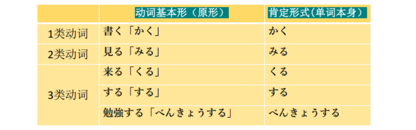
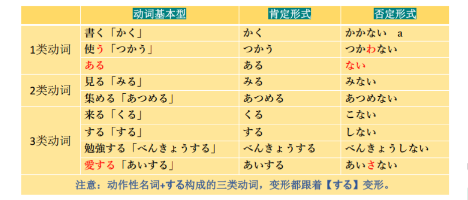

# に、あまり、あんけーと

## 新出単語
<vue-plyr>
  <audio controls crossorigin playsinline autoplay loop>
    <source src="../audio/5-3-たんご.mp3" type="audio/mp3" />
  </audio>
 </vue-plyr>

## を　<出发点>

意义:表示离开等动作的出发点。  
接续:名词十を +表示离开、 出发意义的自动词  
搭配动词： 出る (で る )出， 出去、 発つ (た つ )出发、 離れ る (は な れ る )离开。

```ts
(1)明日、 何時ご ろ 大学を 出ま す か 。
(2)兄は 7月に 大学を 卒業し ま す 。 そ つ ぎ ょ う
(3)私は 明日北京を 発ち ま す [离开]。
たちます
```

## 「 を 」 与「 から 」 的区別

を用于“ 分离” 性的动作
から用于“ 移动” 性的动作。 试比较:

> ○ 大学を 卒業し ま す ✖ 大学か ら 卒業し ま す
> ○ 東京か ら 行き ま す ✖ 東京を 行き ま す

から ：单纯的从某个地方移动到另外一个地方。 （ 空间移动）  
を：不仅可以表空间移动， 也可表抽象移动。 （ 搭配的动词有限制）  
如社会地位、 生活场所， 工作地点等发生改变时， 用「 を 」。

## に <表示附着于某物的表面>

意义:表示事物的附着点。（动作做完后一定会有东西留下来。）  
译文: ……在……（与表示附着含义的动词搭配：置く[おく：放，放置。]）  
接续:接在表达处所、地点等的名词后面

```ts
(1) ノ一トに名前を書きました。ノート 笔记本 かく
(2) 教科書を机[课桌]の上に置く[放]。 つくえのうえ
(3) 該当項目にチェックをお願いします。がいとうこうもく
```

## 动词的简体（肯定/否定）
动词的肯定形式：就是单词本身最基本的形态（基本形・词典形）  
基本形：就是单词最原始的形态，也称之为【原形】。  
词典形：顾名思义就是词典上的形态。  



## 动词简体非过去时肯定/否定

**1类动词**：词尾【う】段变为【あ】段+ない，其中词尾う结尾，则变为【わ】  
例：①書く⇒かか＋ない＝書かない ②使う⇒つかわ＋ない＝使わない  
買う（かう）ーかわない 愛す（あいす）ーあいさない あるーない  
**2类动词**：去掉词尾【る】+ない  
例：食べる⇒たべ＋ない＝食べない 起きる⇒おき＋ない＝起きない  

**3类动词**：死记！！！
来「く」る⇒こ＋ない＝来ない「こない」 きません
する⇒し＋ない＝しない
勉強する⇒べんきょう＋しない＝勉強しない



## 会話
<vue-plyr>
  <audio controls crossorigin playsinline autoplay loop>
    <source src="../audio/5-3-かいわ.mp3" type="audio/mp3" />
  </audio>
 </vue-plyr>