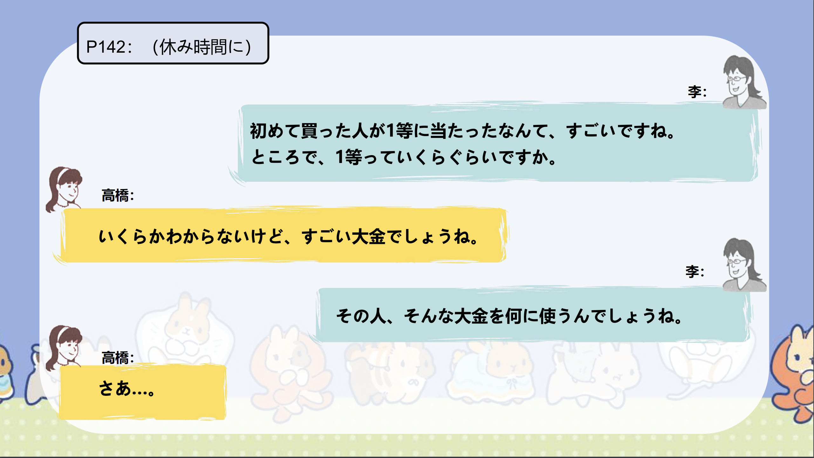

# ～そうだ...

## 新出単語

<vue-plyr>
  <audio controls crossorigin playsinline loop>
    <source src="../audio/c/6-1-たんご.mp3" type="audio/mp3" />
  </audio>
 </vue-plyr>

| 単語                                  | 词性            | 翻译                                                   |
| ------------------------------------- | --------------- | ------------------------------------------------------ |
| 宝くじ（<JpWord>たからくじ</JpWord>） | ③④<名>          | 彩票；奖券                                             |
| 当たる（<JpWord>あたる</JpWord>）     | ⓪<自 Ⅰ>         | 中奖；打中；猜中                                       |
| <JpWord>このごろ</JpWord>             | ⓪<名>           | 最近；这些日子                                         |
| <JpWord>あんまり</JpWord>             | ⓪<副>           | （「あまり」的强调用法，用于口语）(不)太～；(不)怎么～ |
| 金持ち（<JpWord>かねもち</JpWord>）   | ④③<名>          | 有钱人                                                 |
| 1 等（<JpWord>いっとう</JpWord>）     | ⓪③<名>          | 一等(奖)                                               |
| ‐等（<JpWord>とう</JpWord>）          | <接尾>          | 等；等级                                               |
| 驚く（<JpWord>おどろく</JpWord>）     | ③<自 Ⅰ>         | 惊讶；吃惊                                             |
| 運（<JpWord>うん</JpWord>）           | ①<名>           | 运气                                                   |
| <JpWord>なんて</JpWord>               | ①<取り立て助>   | 表示例示、强调。                                       |
| <JpWord>ところで</JpWord>             | ③<接>           | 那么；不过                                             |
| 大金（<JpWord>たいきん</JpWord>）     | ⓪<名>           | 巨款；一大笔钱                                         |
| <JpWord>さあ</JpWord>                 | ①<感>           | 那么                                                   |
| <JpWord>に</JpWord>                   | <格助>          | 表示用途，目的｡                                        |
| <JpWord>な</JpWord>                   | <終助>          | 表示感叹                                               |
| 花粉（<JpWord>かふん</JpWord>）       | ⓪ ＜名＞        | 花粉                                                   |
| ‐点（<JpWord>‐てん</JpWord>）         | ⓪ ＜接尾＞      | 分；件                                                 |
| 仮定（<JpWord>かてい</JpWord>）       | ⓪ ＜名・他 Ⅲ ＞ | 假定，假设                                             |
| 一周（<JpWord>いっしゅう</JpWord>）   | ⓪ ＜名・自 Ⅲ ＞ | 一周，一圈；绕~一周；环游                              |

## ～そうだ

意义：表示间接引语，用于说话人转述从其他地方获得的信息。  
译文：听说.....；  
据说...... 接续：简体句子+そうだ  
说明：可以使用「N によると」来明确指出信息的来源。

```ts
(１)初めて買ってみたら一等に当たったそうです。
听说是第一次试着买了一回，结果中了一等奖。
(２)今年の夏は暑いそうです。
听说今年夏天很热。
(３)李さんはクラスで英語がいちばんよくできるそうです。
听说小李在班里英语学得最好。
(４)天気予報によると、明日は雨だそうだ。
天气预报说明天有雨。
(５)大学新聞によると、シンポジウムに300人が集まったそうだ。
据大学新闻报道，研讨会聚集了300人。
```

> ☛ 表示间接引语的「～そうだ」一般没有否定形式，要表达“听说不......，听说没......
> ”的意思时，应当使用「～ないそうだ」的形式，而不是「～そうではない」。

```ts
(６)田中先生は夏休みに日本にお帰りにならないそうです。
```

## 練習 れんしゅう

```ts
1.据天气预报说，明天会变冷。
⇒天気予報によると、明日は寒くなるそうだ。
2.据高桥说，日本的天气预报有花粉信息。
⇒高橋さんによると、日本の天気予報に花粉情報があるそうだ。
```

## ～なんて

意义：将已知的事物、事情作为话题提出，后续的谓语部分多为说话人对该事物、事情的评价（「すごい、うらやましい、ひどい」等）。  
译文：要说.....  
接续：名词/简体句子＋なんて。

```ts
(１)初めて買った人が1等に当たったなんて、すごいですね。第一次买的人中了一等奖，真厉害。
(２)Aさんなんて、大嫌い！
我最讨厌A了！
(３)あんな人が社長だなんて信じ「相信」られない。
我不相信那样的人是社长。
(４)こんなところで先生にお会いするなんて、びっくりしました。在这种地方见到老师，真让人吃惊。
```

> ☛ 用「なんて」提出话题时，常常表示说话人的意外、惊讶或轻蔑的语气。「なんて」后面的部分有时可省略。

```ts
> (５)あのやさしい林さんがそんなひどいことを言うなんて！
```

## 練習 れんしゅう

```ts
1.能说日语、英语和泰语之类的，好优秀呢。
⇒日本語と英語とタイ語が話せるなんて、すばらしいですね。　
2.周六和周日都有工作之类的，好忙呢。
⇒土曜日も日曜日も仕事があるなんて、忙しいですね。だ。
```

## 会話

<vue-plyr>
  <audio controls crossorigin playsinline loop>
    <source src="../audio/c/6-1-かいわ.mp3" type="audio/mp3" />
  </audio>
 </vue-plyr>
 





