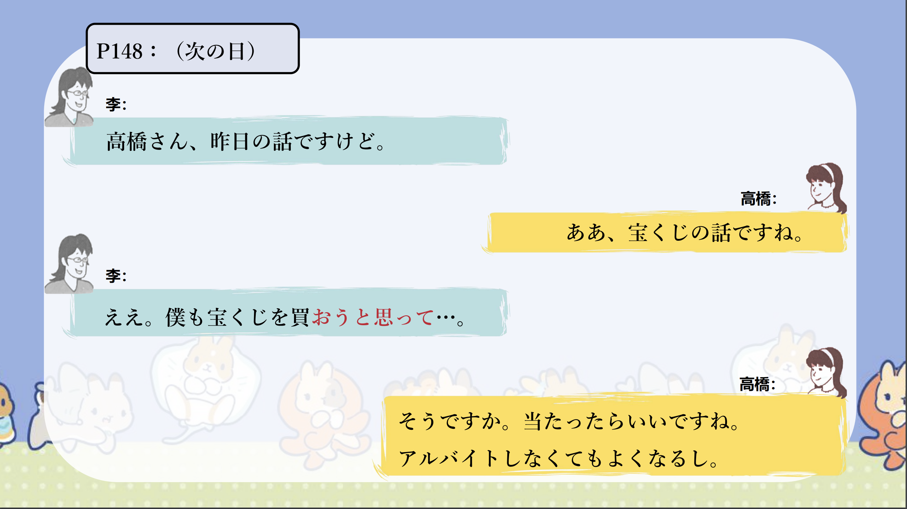
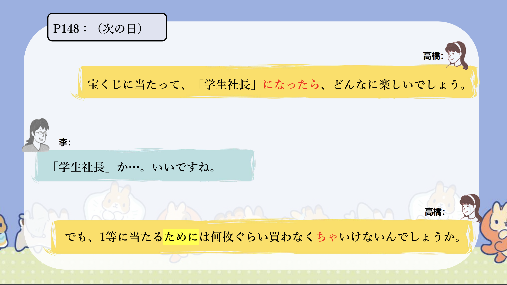

# ～ V るために／N のために...

## 新出単語

<vue-plyr>
  <audio controls crossorigin playsinline loop>
    <source src="../audio/c/6-2-たんご.mp3" type="audio/mp3" />
  </audio>
 </vue-plyr>

| 単語                                            | 词性        | 翻译                                                                                                |
| ----------------------------------------------- | ----------- | --------------------------------------------------------------------------------------------------- |
| 本末転倒（<JpWord>ほんまつ－てんとう</JpWord>） | ①–⓪<名>     | 本末倒置                                                                                            |
| <JpWord>ゲームソフト</JpWord>（game soft）      | ④<名>       | 游戏软件ソフト（soft）①<名・形 Ⅱ>：（software 的省略说法）软件；柔软（的）（性 格，态度）温和（的） |
| <JpWord>ため</JpWord>                           | ②<名>       | 为了                                                                                                |
| 一式（<JpWord>いっしき</JpWord>）               | ⓪④<名>      | 一套；整体                                                                                          |
| <JpWord>どんなに</JpWord>                       | ①<副>       | 如何；怎样                                                                                          |
| 資金（<JpWord>しきん</JpWord>）                 | ②①<名>      | 资金                                                                                                |
| 確率（<JpWord>かくりつ</JpWord>）               | ⓪<名>       | 概率；几率                                                                                          |
| 低い（<JpWord>ひくい</JpWord>）                 | ②<形 Ⅰ>     | 低（的）；矮（的）；价格便宜（的）                                                                  |
| 進級(<JpWord>しんきゅう</JpWord>)               | ⓪<名・自 Ⅲ> | 升级；升班                                                                                          |
| 第一（<JpWord>だい－いち</JpWord>）             | ①–②①<名>    | 第一；最重要                                                                                        |

## ～ V るために／N のために

意义：表示动作的目的。  
译文：为了......  
接续：动词的词典形+ために+自主动词名词+の+ために+自主动词

```ts
(１)1等に当たるためには何枚ぐらい買わなくちゃいけないんでしょうか。
为了中一等奖，一定要买几张呢。
(２)高橋さんは中国語を勉強するために、中国へ留学しました。
高桥先生为了学习中文，来中国留学。
(３)李：もし1等が当たったら、何を買おうかな。
如果中了一等奖，买什么好呢。
高橋 ：ゲームソフトを作るための高いパソコン一式とか？
为了制作游戏软件，要有一套很贵的电脑吗？　
(４)健康のために、毎日ジョキングしている。
为了健康，每天慢跑
```

## 練習 れんしゅう

```ts
1.为了学习经济学，进了经济系。
⇒経済学を勉強するために、経済学部に入った。
2.为了保护家人，现在正在加油。
⇒家族を守るために、今頑張っている。
```

## V るように

意义：表示要达到的目标或者目的，后续的主句一般是表示为达到该目标而采取的手段，方法（动作行为）。  
译文：为了.....；以免.....  
接续：动词的词典形／动词的否定形／可能态动词的连体形＋ように

```ts
(１)宝くじがたくさん買えるようにもっとアルバイトしよう。
为了能买很多彩票，多打工吧。
(２)後ろの人にも聞こえるように、大きな声で話してください。
请大声说话，以便后面的人也能听到。
(３)風邪を引かないように、コートを着ました。
为了不感冒，穿了大衣。
(４)コンサートに遅れないように、タクシーで行きました。
为了不耽误演唱会，我坐出租车去了。
```

> ☛ 表示目的的「ように」与「ために」的区别在于：「ように」前面的动词多为非自主动词（可能动词，意志性较弱的动词等），而「ために」前面的动词多为自主动词（意志性较强的动词）

```ts
a.家を買えるように一生懸命に働いている。
b.家を買うために一生懸命に働いている。
```

「ように」vs 「ために」

```ts
「ように」前面词多为非自主动词（可能动词，意志性较弱的动词等）前后项主语可以不一致。
「ために」前面的动词多为自主动词（意志性较强的动词）前后项主语要一致。
```

## 練習 れんしゅう

```ts
1.为了不忘记记住的单词，制作了单词的笔记本。
⇒覚えた単語を忘れないように、単語のノートを作った。
2.为了明天能去玩，今天提交了报告。
⇒明日遊びに行けるように、今日、レポートを出した。
```

## ～ため（に）＜原因＞

意义：表示动作发生的原因，主句谓语一般为非自主性动词。  
译文：因为.....；由于.....  
接续：动词、形容词的连体形＋ために名词＋の＋ために

```ts
(１)宝くじのために進級できなくなったら、本末転倒ですね。
如果因为彩票不能升级的话，就本末倒置了。
(２)台風のために学校が休みになりました。
因为台风学校放假了。
(３)友達が訪ねてきたために、約束の時間に遅れてしまいました。
因为朋友来访，所以约会的时间迟到了。 　
(４)最近忙しかったために、借り本はまだ読んでいない。
由于最近很忙，借的书还没看。
```

> ☛ 注意表示原因的「～ために」的后句不出现要求，命令，推测，意志等表达方式。

```ts
(５)風邪を引いたために、仕事を｛×休みたいです／×休みましょう／×休んでください／○休んだ｝。
```

## 練習 れんしゅう

```ts
1.因为下雨了，运动会停止了。
⇒雨が降ったために、運動会は中止になった。
2.因为发生了事故，上课迟到了。
⇒事故があったために、授業に遅刻した。
```

## 会話

<vue-plyr>
  <audio controls crossorigin playsinline loop>
    <source src="../audio/c/6-2-かいわ.mp3" type="audio/mp3" />
  </audio>
 </vue-plyr>
 





