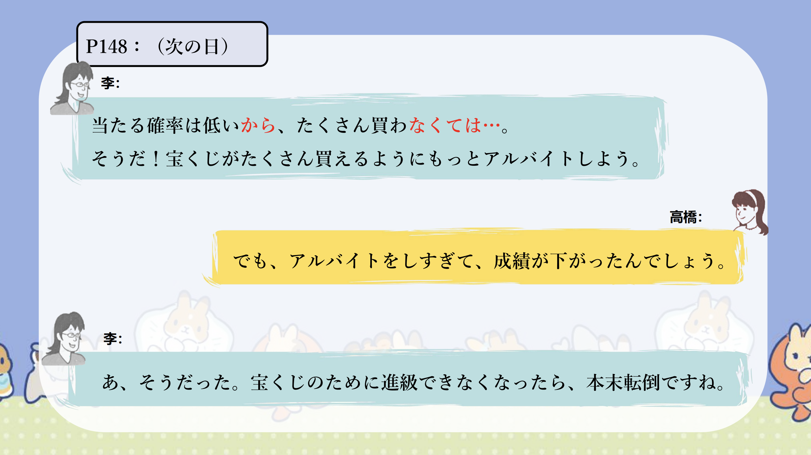

# （どんなに／いくら）～ても...

## 新出単語

<vue-plyr>
  <audio controls crossorigin playsinline loop>
    <source src="../audio/c/6-2-たんご.mp3" type="audio/mp3" />
  </audio>
 </vue-plyr>

| 単語                                                | 词性            | 翻译                           |
| --------------------------------------------------- | --------------- | ------------------------------ |
| 故障（<JpWord>こしょう</JpWord>）                   | ⓪ ＜名・自 Ⅲ ＞ | 故障；出故障                   |
| 国慶節（<JpWord>こっけいせつ</JpWord>）             | ③ ＜名＞        | 国庆节                         |
| 尽くす（<JpWord>つくす</JpWord>）                   | ② ＜他 Ⅰ ＞     | 尽；尽力                       |
| 迷惑をかける（<JpWord>めいわくを－かける</JpWord>） | ①–②             | 添麻烦                         |
| 迷惑（<JpWord>めいわく</JpWord>）                   | ① ＜名・形 Ⅱ ＞ | 麻烦；烦扰                     |
| 冷たい(<JpWord>つめたい</JpWord>)                   | ⓪③ ＜形 Ⅰ ＞    | 冷（的）；凉（的）；冷淡（的） |
| 朝いちばん（<JpWord>あさいちばん</JpWord>）         | ①–② ＜名＞      | 一大早；一清早                 |
| 月末（<JpWord>げつまつ</JpWord>）                   | ⓪ ＜名＞        | 月末，月底                     |
| 目的（<JpWord>もくてき</JpWord>）                   | ⓪ ＜名＞        | 目的                           |

## （どんなに／いくら）～ても

意义：表示转折性的条件，在此条件下仍会发生后续的动作。  
译文：即使（再）.....也.....；不管（再）......也.....  
接续：V ても／AⅠ くても／AⅡ でも／N でも  
说明：常常与副词「どんなに／いくら」搭配使用。

```ts
(１)どんなに高くても買えますね。
再贵也能买到。
(２)約束がありますから、雨が降っても行きます。
因为有约会，即使下雨也去。
(３)いくら便利でもその町へは引っ越ししたくないです。
再方便我也不想搬到那个城市。
(４)いくら好きな料理でも、毎日食べると飽きて［厌烦］しまうでしょう。
 无论多么喜欢的菜，每天吃也会腻的吧。
```

## 練習 れんしゅう

```ts
1.不管再怎么贵，因为是必要的，所以也要买。
⇒どんなに高くても、必要だから、買う。
2.不管再怎么困扰也不想给他人添麻烦。迷惑をかける
⇒いくら困っていても、他人に迷惑をかけたくない。
```

## どんなに~だろう

意义：构成感叹句，表示喜悦、悲伤、期盼等心情。  
译文：多么.....啊！  
接续：どんなに+表示属性，状态的词语+だろう

```ts
(１)宝くじに当たって、「学生社長」になったら、どんなに楽しいでしょう。
 中了彩票，当了“学生社长”，该多开心啊。
(２)子供が重い病気になったら、親はどんなに悲しいだろう。
  孩子得了重病，父母该多伤心啊。
(３)一生懸命勉強して大学には入れたら、どんなにうれしいでしょう。
  如果努力学习考上大学，该多高兴啊。
(４)スマホが使えなくなると、どんなに困るだろう。
  如果智能手机不能使用的话，会有多为难啊。
```

## 練習 れんしゅう

```ts
1.大家都回去了的话，多么寂寞啊。
⇒皆が帰ったら、どんなに寂しいでしょう。
2.明明学习了但还是成绩差的话，多么悲伤啊。
⇒勉強したのに成績が悪かったら、どんなに悲しいでしょう
```

～すぎる

意义：表示动作、行为或状态超过了通常的程度或范围。  
译文：过于.....；太.....  
接续：动词第一连用形/形容词的词干＋すぎる

```ts
(１)アルバイトをしすぎて、成績が下がったんでしょう。
打工太多，成绩下降了吧。
(２)昨日お酒を飲みすぎたので、今頭が痛い。
昨天喝酒喝多了，现在头痛。
(３)私の家の周りは静かすぎて、ちょっと寂しいです。
我家周围太安静了，有点寂寞。 　
(４)この問題は小学生には難しすぎるでしょう。
这道题对小学生来说太难了吧。
```

## 練習 れんしゅう

```ts
1.这个蛋糕太甜了，不喜欢。
⇒このケーキは甘すぎて、好きではない。
2.那位老师太严格了，可怕。
⇒あの先生は厳しすぎて、怖い。
```

## 会話

<vue-plyr>
  <audio controls crossorigin playsinline loop>
    <source src="../audio/c/6-2-かいわ.mp3" type="audio/mp3" />
  </audio>
 </vue-plyr>
 





