# N のようだ...

## 新出単語

<vue-plyr>
  <audio controls crossorigin playsinline loop>
    <source src="../audio/c/6-3-たんご.mp3" type="audio/mp3" />
  </audio>
 </vue-plyr>

| 単語                                        | 词性          | 翻译                         |
| ------------------------------------------- | ------------- | ---------------------------- |
| 対象（<JpWord>たいしょう</JpWord>）         | ⓪<名>         | 对象                         |
| 有効（<JpWord>ゆうこう</JpWord>）           | ⓪<名・形 Ⅱ>   | 有效                         |
| 詳細（<JpWord>しょうさい</JpWord>）         | ⓪<名・形 Ⅱ>   | 详细；详情；具体内容         |
| 掲載（<JpWord>けいさい</JpWord>）           | ⓪<名・他 Ⅲ>   | 刊登；登载                   |
| 状態（<JpWord>じょうたい</JpWord>）         | ⓪<名>         | 状况；状态                   |
| 有無（<JpWord>うむ</JpWord>）               | ①<名>         | 有无                         |
| <JpWord>バッグ（bag）</JpWord>              | ①<名>         | 包；手提包                   |
| 維持（<JpWord>いじ</JpWord>）               | ①<名・他 Ⅲ>   | 维持；维护                   |
| <JpWord>グラフ</JpWord>（graph）            | ①⓪<名>        | 图（表）                     |
| <JpWord>ゆとり</JpWord>                     | ⓪<名>         | （时间、生活等）富裕；有余裕 |
| 生かす(<JpWord>いかす</JpWord>)             | ②<他 Ⅰ>       | 有效利用；运用               |
| 次に（<JpWord>つぎに</JpWord>）             | ②<接>         | 然后；接着                   |
| 次いで（<JpWord>ついで</JpWord>）           | ⓪<接>         | 紧接着；然后                 |
| 友人（<JpWord>ゆうじん</JpWord>）           | ⓪<名>         | 友人；朋友                   |
| 関わる（<JpWord>かかわる</JpWord>）         | ③⓪<自 Ⅰ>      | 相关；有关；牵涉             |
| 関心（<JpWord>かんしん</JpWord>）           | ⓪<名>         | 关注；关心；兴趣             |
| <JpWord>ほどほど</JpWord>                   | ⓪<名・形 Ⅱ>   | 适度；适量；适可而止         |
| 浅い(<JpWord>あさい</JpWord>)               | ②⓪<形 Ⅰ>      | 浅；不足；（颜色）淡         |
| 自由（<JpWord>じゆう</JpWord>）             | ②<名・形 Ⅱ>   | 自由；不限                   |
| 記述（<JpWord>きじゅつ</JpWord>）           | ⓪<名・他 Ⅲ>   | 记述；填写；记录；描写       |
| 欄（<JpWord>らん</JpWord>）                 | ①<名>         | 栏；栏目                     |
| 挑戦（<JpWord>ちょうせん</JpWord>）         | ⓪<名・自 Ⅲ>   | 挑战                         |
| 精神（<JpWord>せいしん</JpWord>）           | ①<名>         | 精神                         |
| 優先（<JpWord>ゆうせん</JpWord>）           | ⓪<名・自他 Ⅲ> | 优先                         |
| 案外(<JpWord>あんがい</JpWord>)             | ①⓪<副・形 Ⅱ>  | 竟然；出乎意料               |
| 読み取る（<JpWord>よみとる</JpWord>）       | ③⓪<他 Ⅰ>      | 理解；读出                   |
| 方法（<JpWord>ほうほう</JpWord>）           | ⓪ ＜名＞      | 方法；办法                   |
| 一人暮らし（<JpWord>ひとりぐらし</JpWord>） | ④ ＜名＞      | 独自生活；一个人生活         |
| <JpWord>シニア</JpWord>（senior）           | ① ＜名＞      | 年长者；上司；上级           |
| 主婦（<JpWord>しゅふ</JpWord>）             | ① ＜名＞      | 家庭主妇                     |
| 非常に(<JpWord>ひじょうに</JpWord>)⓪        | ＜副＞        | 非常                         |
| 余暇（<JpWord>よか</JpWord>）               | ① ＜名＞      | 余暇；闲暇                   |
| ‐票（<JpWord>‐ひょう</JpWord>）             | ＜接尾＞      | ~票                          |

## N のようだ ① 表示比喻

意义：表示明喻,将某事物比作「ようだ」前面的名词。  
译文：像 …… ; 就像……一样;宛如……  
说明：常与副词 「まるで」搭配使用。

> 口语形式：みたいだ/Ｎみたいだ。

> 接续：N ＋のようだ/ように/ような

```ts
①Nのようだ：直接结句
②Nのような：用语连体修饰语，后接体言。
③Nのように：连用修饰语，后接用言。
```

```ts
（1）香山公園の頂上から見た景色は、まるで絵のようでした。
  从香山公园的山顶看到的景色，宛如一幅画。
（2）妹は髪が短くて、まるで男の子のようです。
  妹妹的头发很短，像个男孩
（3）豆腐料理ですが、肉のような味がします。
  虽然是豆腐料理，但是味道像肉。
（4）10月になったが、まだ8月のように暑い。
  虽然已经十月了，但还是像八月一样热。
```

## 練習 れんしゅう

```ts
1.我家的狗很可爱像是布娃娃一样。【ぬいぐるみ】
⇒うちの犬はとても可愛くて、まるでぬいぐるみのようだ。
2. 这个药很甜像是果汁一样。
⇒この薬は甘くて、まるでジュースのようだ。
```

## N のようだ ② 表示举例

意义 :将 「ような/ように」前面的名词作为例子,表示某事物具有与其相同的特征。  
译文 :例如……; 同……一样;像……  
接续 :  
 名词+ のような+ 名词  
 名词+ のように+ 动词/ 形容词

```ts
（1）ご存じのように、中日は一衣帯水の隣国である。
众所周知，中日是一衣带水的邻邦。
（2）孫さんのように上手に日本語が話せる人はなかなかいません。
很少有人像孙先生那样日语说得这么好。
（3）私は東京のような大都会に住みたいです。
我想住在像东京那样的大城市。
（4）京華大学のようなキャンパスが広い大学へ留学したいと思います。
想去像京华大学那样校园广阔的大学留学。
```

## 練習 れんしゅう

```ts
1.明明是十月份却跟冬天一样冷。
⇒十月なのに、冬のように寒い。
2. 想要住在北京那样的城市。
⇒北京のような町に住みたい。
```

## 〜そうだ ① 表示征兆

意义 :表示将要发生某动作或变化的征兆。  
译文 :马上要……; 就要……; 快要……  
接续 : 动词第一连用形+ そうだ/そうな+名词  
否定:动词第一连用形+ そうにもない/そうもない/そうにない  
说明 :常与副词「今にも」搭配使用。

```ts
（1）空が暗くて、今にも雪が降りそうだ。
  天空很暗，眼看就要下雪了。
（2）本棚から本が落ちそうだ。
书好像要从书架上掉下来了。
（3）寒くて死にそうだ。
  冷得要死。
（4）今日は雨が降りそうな天気ですね。今天好像要下雨的天气。
今天好像要下雨的天气。
（5）もう約束の時間を30分も過ぎたから、彼女は来そうにもない。（来そうもない/来そうにない）
已经过了约定的时间30分钟了，看来她不会来了。
```

## 練習 れんしゅう

```ts
1.天一直阴着，好像要下雨了。
「くもる」⇒ずっと曇って、雨が降りそうだ。
2. 手机看起来像是要从餐桌上掉下来了。
「テーブル」⇒スマホがテーブルから落ちそうだ。
```

## 〜そうだ ② 表示推测

意义 :表示说话人根据事物的外表或某些情况、经验来进行猜测、推断。  
译文 :看上去... ; 看起来... ；... 的样子  
接续:形容词词干/动词第一连用形+ そうだ  
（+ そうな+ 名词/ そうに+ 动词）  
否定 :形容词词干+ そうではない  
 或 A1 くなさそうだ/A 2 ではなさそうだ

```ts
（1）みんな、とても楽しそうです。
  大家看起来都很开心。
（2）王さんのお弁当はおいしそうですね。
  小王的便当看起来很好吃啊。
（3）この靴は丈夫そうですね。
这双鞋看起来很结实。
（4）この目標は楽に実現しそうですね。
 这个目标似乎很容易实现。
（5）王さんは少し苦しそうな顔をしている。
 小王看起来有点痛苦的样子。
（6）高橋さんは楽しそうに春節の話をしました。
 高桥兴致勃勃地谈起了春节。
（7） この小説はあまりおもしろそうではない。// おもしろくなさそうだ。
 这部小说看起来不怎么有趣看起来没什么意思。
（8）彼は体が丈夫そうではない。 // 丈夫ではなさそうだ。
  他看上去身体不好看起来不结实。
(9)張さんは頭がよさそうだ。
(10)あの人はお金がなさそうだ。
(11)今度のテストは難しくなさそうだ。
```

> 注意：「そうだ」在接形容词 「よい」 「ない」以及形容词的简体否定形时要变成「〜さそうだ」的形式。

## 練習 れんしゅう

```ts
1.新老师，好像不太温柔。　
⇒新しい先生はあまりやさしくなさそうだ。
2. 他好像很开心的样子。
⇒彼は嬉しそうな顔をしている。
```

## V ております

意义: 「V ています」的自谦形式  
接续: V て+ おります

```ts
（1）先生には日本語の授業でもいつもお世話になり、感謝しております。
  在日语课上也经常受到老师的关照，非常感谢。
（2）私は大学で教師をしております。
  我在大学教书。
（3）私のうちにもどうぞいらっしゃってください。お待ちしております。
  请到我家来。恭候您的光临。
```

## 練習 れんしゅう

```ts
1.我们在制定计划。
⇒私たちは計画を立てております。　
2. 我的父亲在公司上班。
⇒父は会社に勤めております。
```

## N を対象に（して）

意义：表示以某人为对象实施某行为。  
译文：以......为对象
接续：（表人的）名词＋を＋対象に（して）

```ts
(１)東西大学学生新聞では、1年生７００人を対象にインターネットで大学生活についてのアンケート調査を実施した。
东西大学学生报以700名1年级学生为对象，在网上进行了关于大学生活的问卷调查。
(２)大学生を対象に英語を教える。
以大学生为对象教授英语。
(３)中国にいる日本人を対象にして生活調査を実施した。
以在中国的日本人为对象实施了生活调查。
```

## 練習 れんしゅう

```ts
1.以中学生为对象，做了关于日本动漫的调查。【ちょうさ】
⇒中学生を対象にして、日本のアニメについての調査をした。
2.以家庭主妇为对象，就这次新商品实施了问卷调查。「しゅふ」
⇒主婦を対象にして、今度の新商品についてアンケート調査を実施した。
```

## N を中心に（して）

意义：表示围绕某一事物实施某行为。  
译文：以.....为中心；以......为主  
接续：名词＋を＋中心に（して）

```ts
(１)大学生活で大事だと思っていることを中心に日常生活について複数回答で聞いてみた。
以大学生活中重要之事为中心，围绕日常生活以多选的形式作答
(２)日本と中国を中心にアジアについての情報を紹介します。
以日本和中国为中心介绍关于亚洲的信息。
(３)日本語を中心にして、さまざまな授業を受けています。
以日语为中心，接受各种各样的课程。
```

## 練習 れんしゅう

```ts
1.以战国时代为中心，读了100本以上的历史书。
⇒戦国時代を中心にして、１００冊以上の歴史の本を読んだ。
2.以一年级学生为中心，举行了日语的朗读大会。
⇒一年生を中心にして、日本語の朗読大会を行った。
```

## ～と考えられる／思われる

意义：表示自然而然得出某个结论（常用于学术文体中）。  
译文：一般认为.....；觉得.....  
接续：简体形式的小句＋と考えられる／思われる

```ts
(１)学生は、経済的にあまり困っていないと考えられる。
学生在经济上不太困难。
(２)来年は経済が回復すると思われます。
（认为）明年经济会恢复。
(３)この問題は子供には難しいと思われます。
（认为）这个问题对孩子来说很难
```

> ☛「～と考えられる／思われる」是一种自动态（「自発態」）的词形，自动态表示自然而然地意识、感受到某事。并非所有动词都有自动态，除了本课表示思维活动的动词外，部分表示感情活动的动词也可以后续自动态后缀「‐（ら）れる」，表示自然而然产生某种感情，如：案じる［担心］ー案じられる、思い出す［想起］ー思い出される、偲ぶ［怀念］ー偲ばれる。
> 除了自动态之外，一些表示知觉、思考等意义的动词的可能态也可表示自发的意义，如：「見える」「聞ける」「思える」「読み取れる」等。

## 練習 れんしゅう

```ts
1.一般认为年轻人们参加志愿者活动的机会相当多。
⇒若者たちがボランティア活動に参加する機会がかなりあると考えられる。
2.觉得现在的大学生对社会持有关心。
⇒今の大学生は社会に関心を持っていると思われる。
```

## 会話

<vue-plyr>
  <audio controls crossorigin playsinline loop>
    <source src="../audio/c/6-3-かいわ.mp3" type="audio/mp3" />
  </audio>
 </vue-plyr>
 
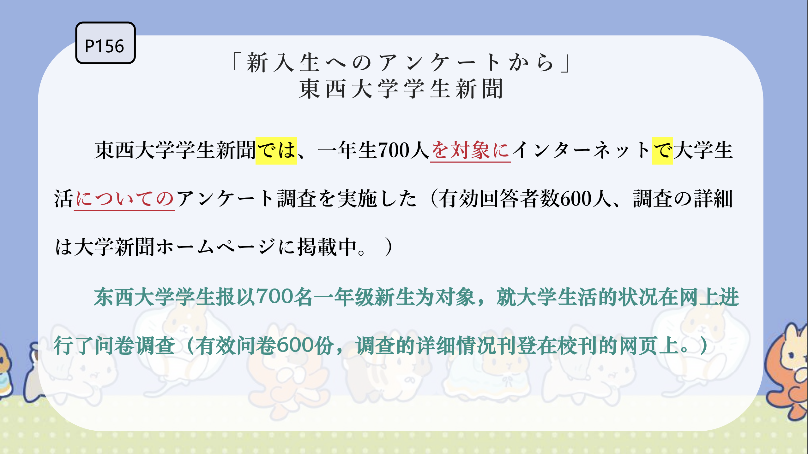
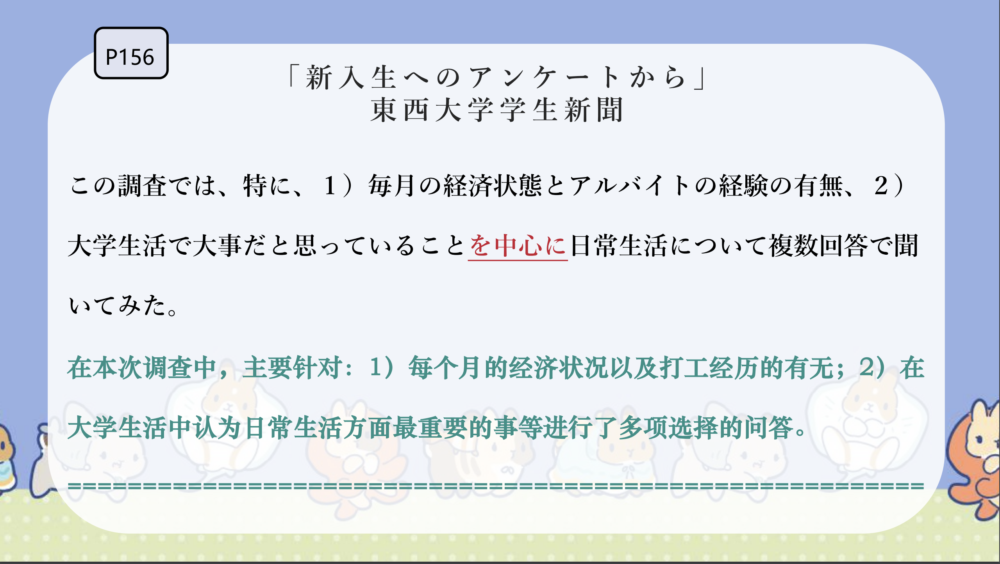
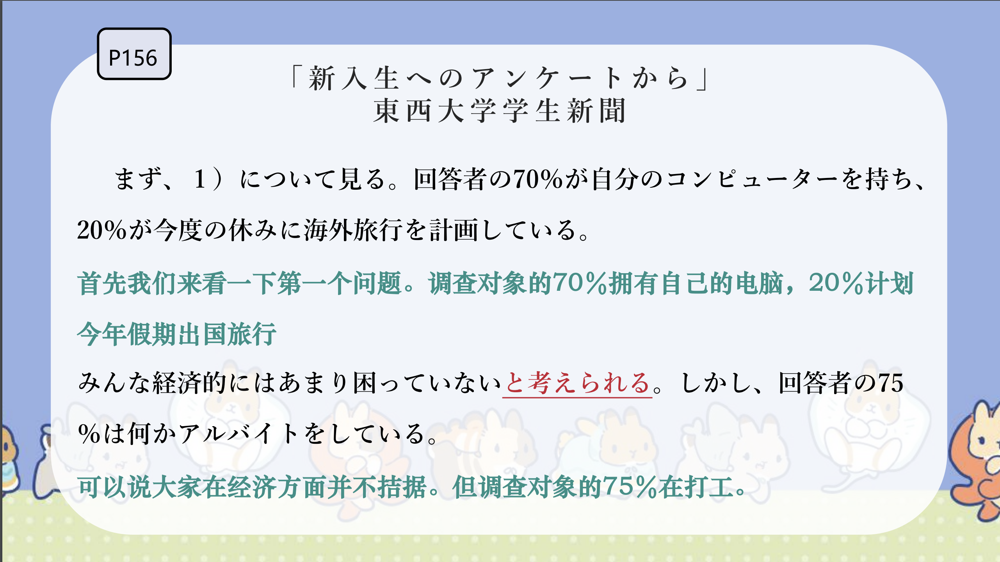
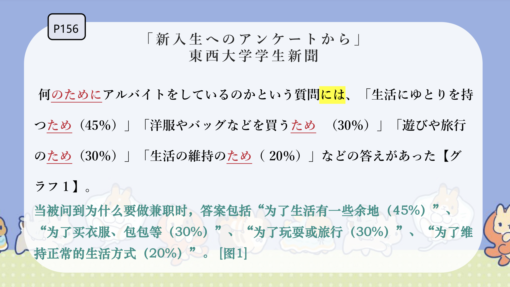
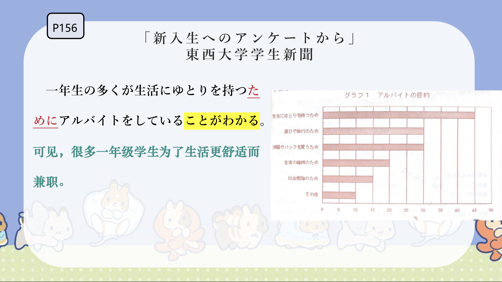
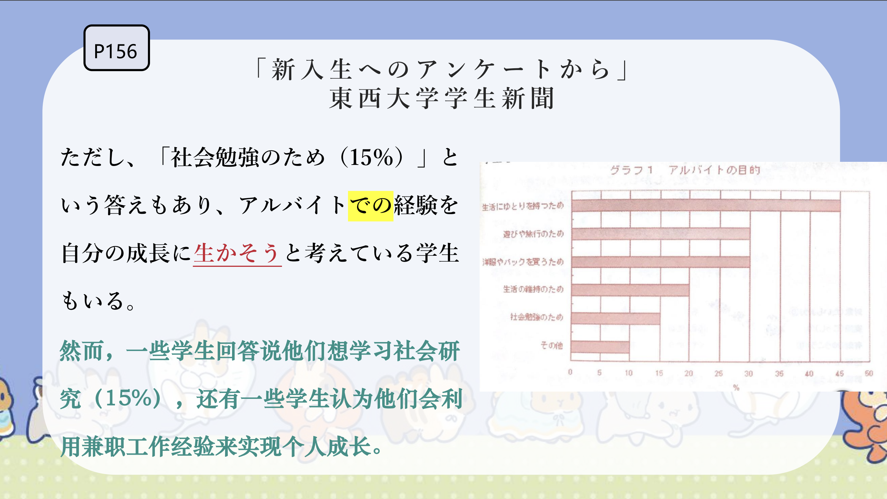
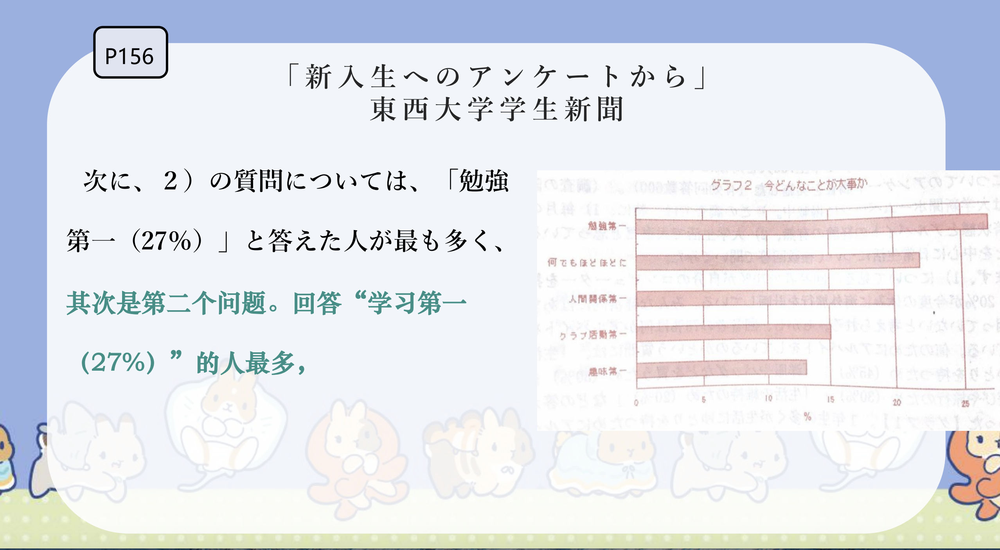
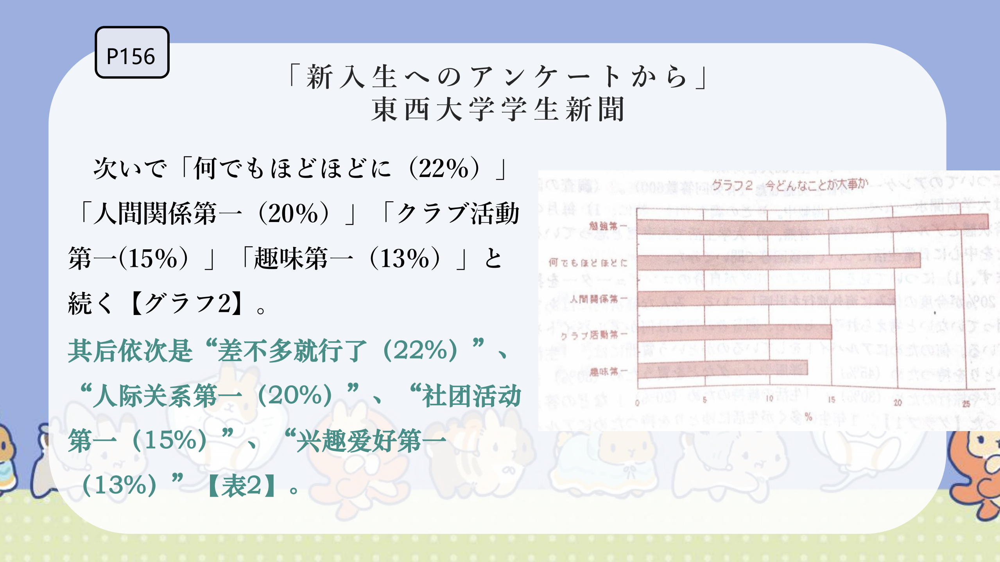
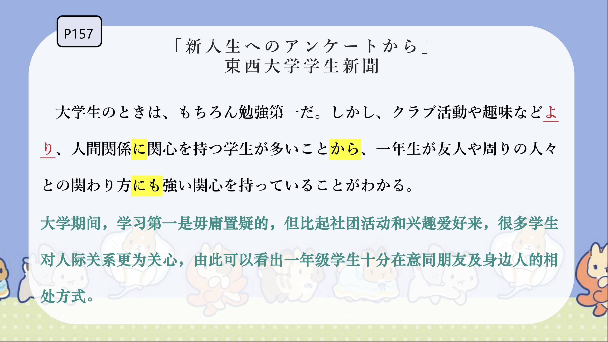
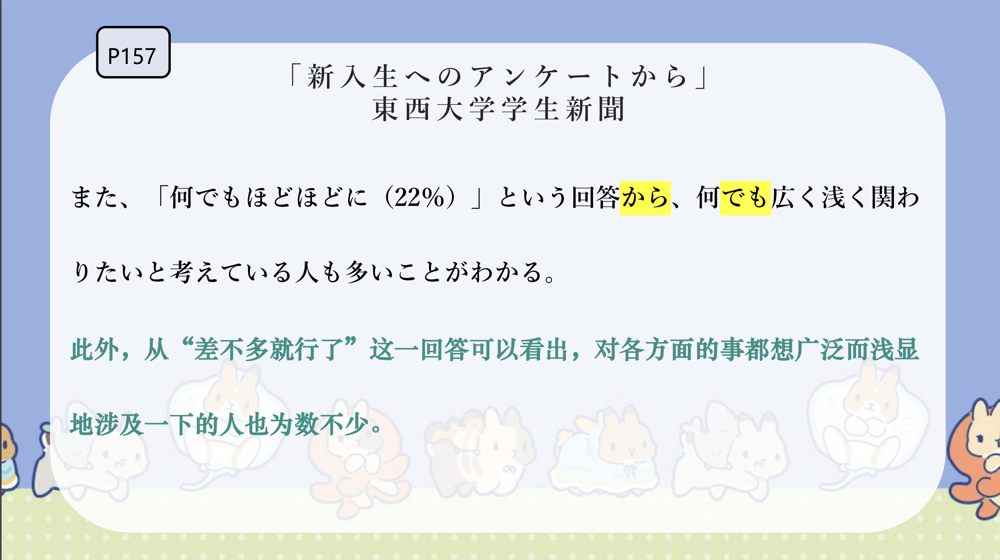
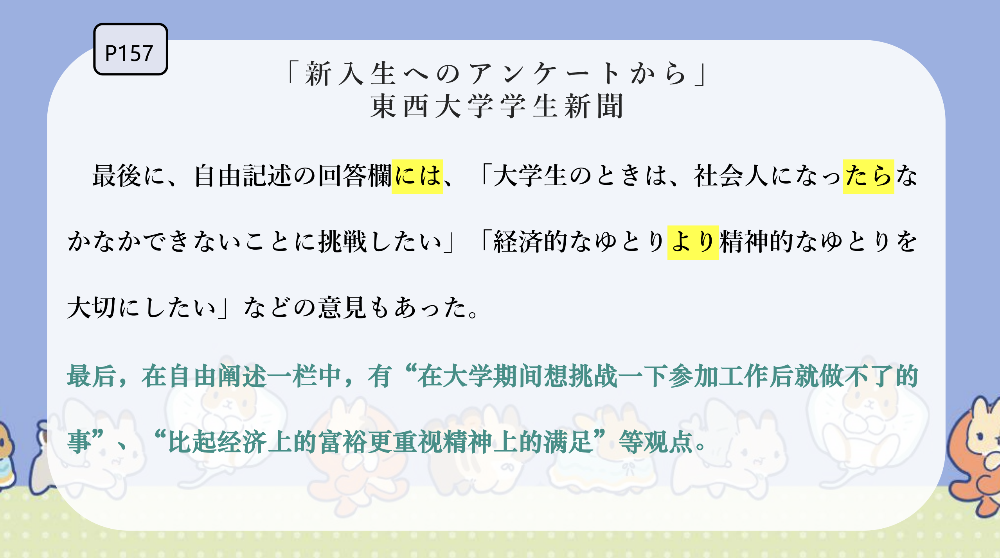
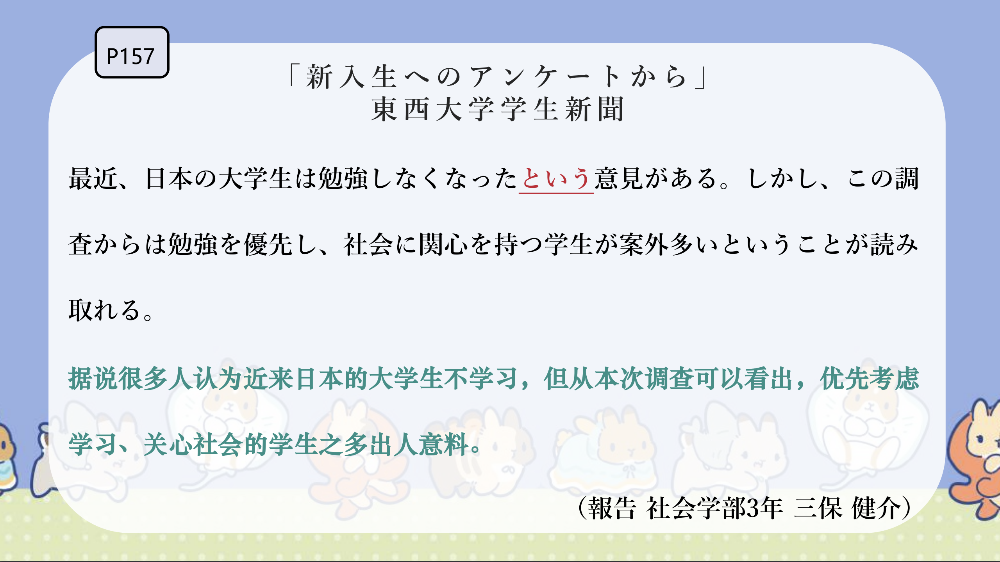
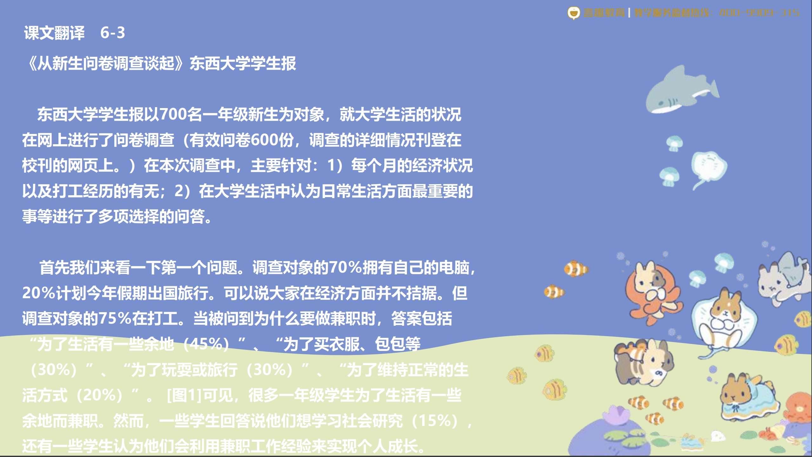
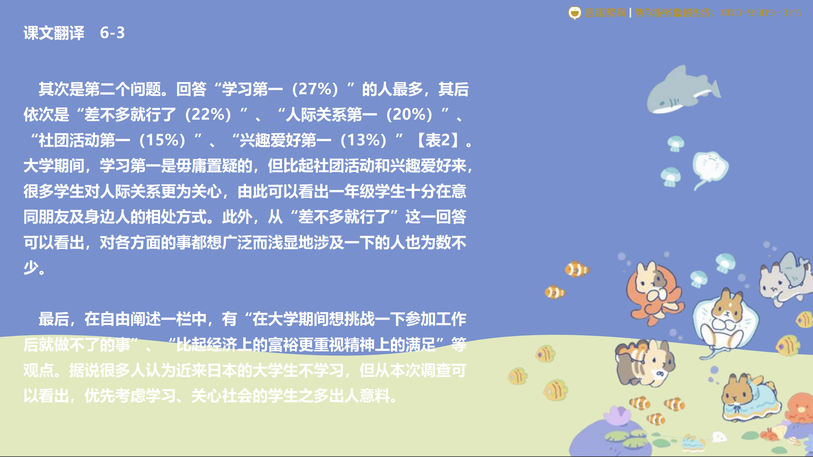
