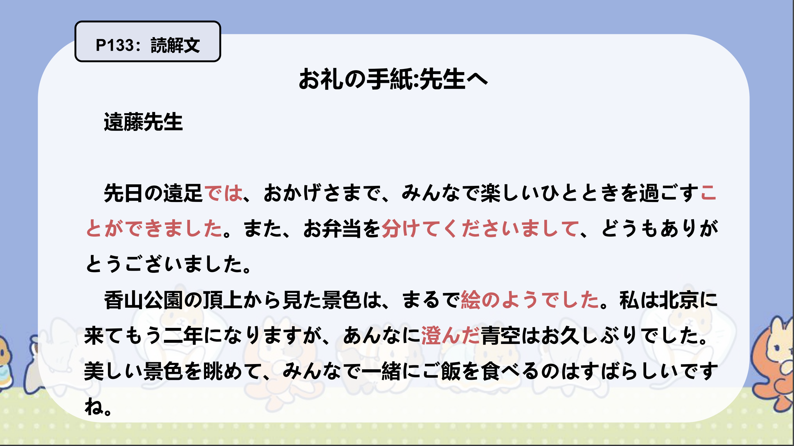
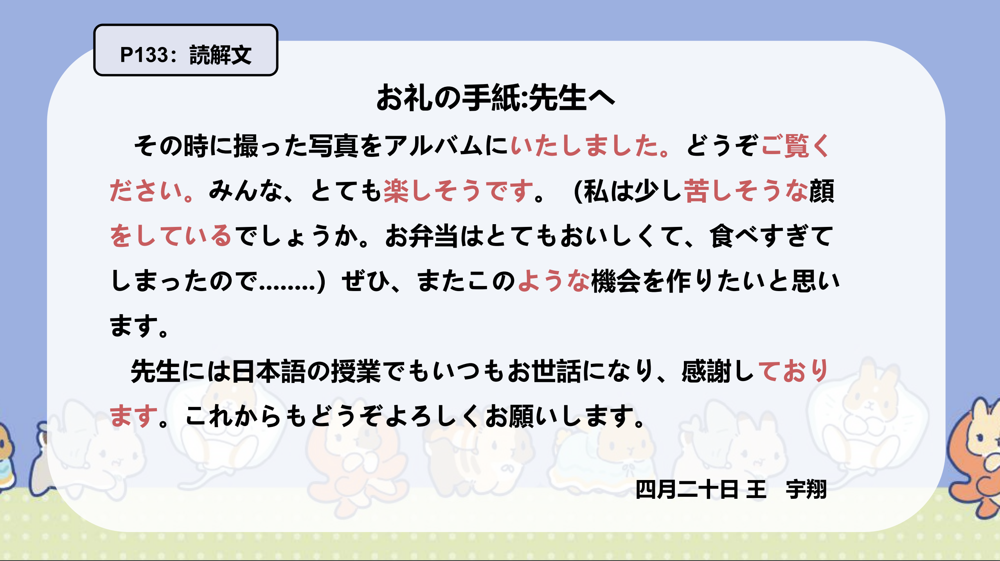
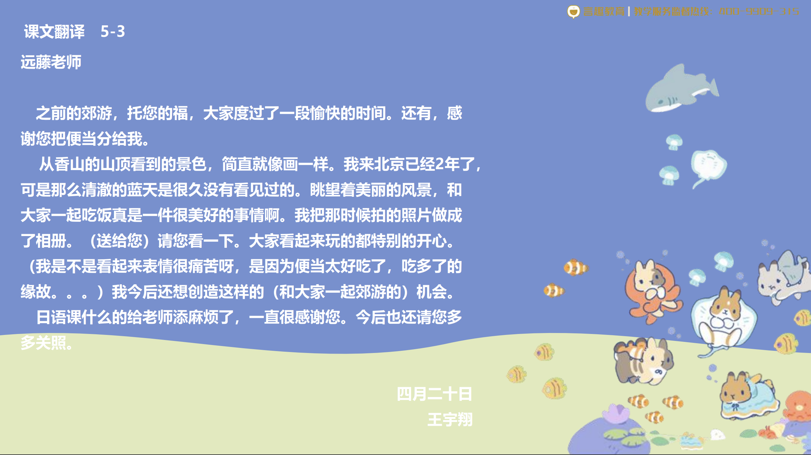

# Nのようだ...

## 新出単語

<vue-plyr>
  <audio controls crossorigin playsinline loop>
    <source src="../audio/c/5-3-たんご.mp3" type="audio/mp3" />
  </audio>
 </vue-plyr>

| 単語                                                 | 词性                | 翻译                                               |
| ---------------------------------------------------- | ------------------- | -------------------------------------------------- |
| 先日（<JpWord>せんじつ</JpWord>）| ⓪ ＜名＞| 最近几天；前几天| 
| 一時（<JpWord>ひととき</JpWord>）| ②＜名＞| 一段时间；短暂时光| 
| 頂上（<JpWord>ちょうじょう</JpWord>）| ③＜名＞| 山顶；最高处| 
| <JpWord>まるで</JpWord>| ⓪＜副＞| 好像；简直像；宛如；完全| 
| 澄む（<JpWord>すむ</JpWord>）| ①＜自Ⅰ＞| 清澈；明净| 
| 青空（<JpWord>あおぞら</JpWord>）| ③＜名＞| 蓝天；晴空| 
| 眺める（<JpWord>ながめる</JpWord>）| ③＜他Ⅱ＞| 眺望| 
| <JpWord>アルバム</JpWord>（album）| ⓪ ＜名＞| 相册；音乐专辑| 
| ご覧（<JpWord>ごらん</JpWord>）| ⓪＜名＞| 【見る】的尊敬说法）看；观看；浏览| 
|  食べすきる（<JpWord>たべすぎる</JpWord>）| ④⓪＜他Ⅱ＞| 吃得太多；吃撑了ーすぎる＜接尾＞：过~；太~| 
| 機会（<JpWord>きかい</JpWord>）| ②⓪＜名＞| 机会| 
| <JpWord>おる</JpWord>| ①＜自Ⅰ＞| （【いる】的尊敬说法）在；有| 
| <JpWord>モデルルーム</JpWord>（model room）|  ④ ＜名＞| 样板间| 
|  <JpWord>モデル</JpWord>（model）| ①⓪ ＜名＞| 模特;样板;模范| 
| 仲（<JpWord>なか</JpWord>）| ① ＜名＞| 关系;感情| 
| 上品（<JpWord>じょうひん</JpWord>）| ③ ＜名・形Ⅱ＞| 优雅;质量上乘| 
| <JpWord>フルーティー</JpWord>（fruity）| ② ＜形Ⅱ＞| 果香四溢（的）| 
| <JpWord>アンダーソン</JpWord>（Anderson）| ② ＜固名＞| 安德森| 
| 髪型（<JpWord>かみがた</JpWord>）| ⓪＜名＞| 发型| 
| <JpWord>ライオン</JpWord>（lion）|  ⓪＜名＞| 狮子| 
| 唐（<JpWord>とう</JpWord>）| ① ＜固名＞| （姓氏）唐| 
| 不思議（<JpWord>ふしぎ</JpWord>） | ⓪＜形Ⅱ＞| 不可思议;奇怪| 
|  徹底（<JpWord>てってい</JpWord>）| ⓪ ＜名・自Ⅲ＞| 彻底;贯彻| 
| 検正（<JpWord>けんしょう</JpWord>）| ⓪ ＜名・他Ⅲ＞| 证实,查证;检查;验证| 
| 今にも（<JpWord>いまにも</JpWord>）| ① ＜副＞| 马上;眼看| 
| <JpWord>テーブル </JpWord>（table）|  ⓪＜名＞| 桌子| 
| お目にかかる（<JpWord>おめにかかる</JpWord>）| ⓪-②| （「会う」的自谦说法）见到| 
|  通訳（<JpWord>つうやく</JpWord>）| ① ＜名•他Ⅲ＞| 翻译;口译| 

## Nのようだ  ①表示比喻

意义：表示明喻,将某事物比作「ようだ」前面的名词。  
译文：像 …… ; 就像……一样;宛如……  
说明：常与副词 「まるで」搭配使用。  

> 口语形式：みたいだ/Ｎみたいだ。

> 接续：N＋のようだ/ように/ような

```ts
①Nのようだ：直接结句
②Nのような：用语连体修饰语，后接体言。
③Nのように：连用修饰语，后接用言。
```
```ts
（1）香山公園の頂上から見た景色は、まるで絵のようでした。
  从香山公园的山顶看到的景色，宛如一幅画。
（2）妹は髪が短くて、まるで男の子のようです。
  妹妹的头发很短，像个男孩
（3）豆腐料理ですが、肉のような味がします。
  虽然是豆腐料理，但是味道像肉。
（4）10月になったが、まだ8月のように暑い。
  虽然已经十月了，但还是像八月一样热。
```

## 練習 れんしゅう
```ts
1.我家的狗很可爱像是布娃娃一样。【ぬいぐるみ】
⇒うちの犬はとても可愛くて、まるでぬいぐるみのようだ。
2. 这个药很甜像是果汁一样。
⇒この薬は甘くて、まるでジュースのようだ。
```

## Nのようだ  ② 表示举例

意义 :将 「ような/ように」前面的名词作为例子,表示某事物具有与其相同的特征。  
译文 :例如……; 同……一样;像……  
接续 :  
  名词+ のような+ 名词  
  名词+ のように+ 动词/ 形容词

```ts
（1）ご存じのように、中日は一衣帯水の隣国である。
众所周知，中日是一衣带水的邻邦。
（2）孫さんのように上手に日本語が話せる人はなかなかいません。
很少有人像孙先生那样日语说得这么好。
（3）私は東京のような大都会に住みたいです。
我想住在像东京那样的大城市。
（4）京華大学のようなキャンパスが広い大学へ留学したいと思います。
想去像京华大学那样校园广阔的大学留学。
```

## 練習 れんしゅう

```ts
1.明明是十月份却跟冬天一样冷。
⇒十月なのに、冬のように寒い。
2. 想要住在北京那样的城市。
⇒北京のような町に住みたい。
```

## 〜そうだ  ① 表示征兆
意义 :表示将要发生某动作或变化的征兆。  
译文 :马上要……; 就要……; 快要……    
接续 : 动词第一连用形+ そうだ/そうな+名词      
否定:动词第一连用形+ そうにもない/そうもない/そうにない    
说明 :常与副词「今にも」搭配使用。

```ts
（1）空が暗くて、今にも雪が降りそうだ。
  天空很暗，眼看就要下雪了。
（2）本棚から本が落ちそうだ。
书好像要从书架上掉下来了。
（3）寒くて死にそうだ。
  冷得要死。
（4）今日は雨が降りそうな天気ですね。今天好像要下雨的天气。
今天好像要下雨的天气。
（5）もう約束の時間を30分も過ぎたから、彼女は来そうにもない。（来そうもない/来そうにない）
已经过了约定的时间30分钟了，看来她不会来了。
```


## 練習 れんしゅう

```ts
1.天一直阴着，好像要下雨了。
「くもる」⇒ずっと曇って、雨が降りそうだ。
2. 手机看起来像是要从餐桌上掉下来了。
「テーブル」⇒スマホがテーブルから落ちそうだ。
```

## 〜そうだ  ② 表示推测
意义 :表示说话人根据事物的外表或某些情况、经验来进行猜测、推断。    
译文 :看上去... ; 看起来... ；... 的样子  
接续:形容词词干/动词第一连用形+ そうだ  
（+ そうな+ 名词/ そうに+ 动词）    
否定 :形容词词干+ そうではない  
  或A1 くなさそうだ/A 2ではなさそうだ  

```ts
（1）みんな、とても楽しそうです。
  大家看起来都很开心。
（2）王さんのお弁当はおいしそうですね。
  小王的便当看起来很好吃啊。
（3）この靴は丈夫そうですね。
这双鞋看起来很结实。
（4）この目標は楽に実現しそうですね。
 这个目标似乎很容易实现。
（5）王さんは少し苦しそうな顔をしている。
 小王看起来有点痛苦的样子。 
（6）高橋さんは楽しそうに春節の話をしました。
 高桥兴致勃勃地谈起了春节。   
（7） この小説はあまりおもしろそうではない。// おもしろくなさそうだ。
 这部小说看起来不怎么有趣看起来没什么意思。
（8）彼は体が丈夫そうではない。 // 丈夫ではなさそうだ。
  他看上去身体不好看起来不结实。
(9)張さんは頭がよさそうだ。
(10)あの人はお金がなさそうだ。
(11)今度のテストは難しくなさそうだ。
```

> 注意：「そうだ」在接形容词 「よい」 「ない」以及形容词的简体否定形时要变成「〜さそうだ」的形式。

## 練習 れんしゅう

```ts
1.新老师，好像不太温柔。　
⇒新しい先生はあまりやさしくなさそうだ。
2. 他好像很开心的样子。
⇒彼は嬉しそうな顔をしている。
```


## Vております

意义: 「V ています」的自谦形式  
接续: V て+ おります  

```ts
（1）先生には日本語の授業でもいつもお世話になり、感謝しております。
  在日语课上也经常受到老师的关照，非常感谢。
（2）私は大学で教師をしております。
  我在大学教书。
（3）私のうちにもどうぞいらっしゃってください。お待ちしております。
  请到我家来。恭候您的光临。
```

## 練習 れんしゅう
```ts
1.我们在制定计划。
⇒私たちは計画を立てております。　
2. 我的父亲在公司上班。
⇒父は会社に勤めております。
```

## 会話

<vue-plyr>
  <audio controls crossorigin playsinline loop>
    <source src="../audio/c/5-3-かいわ.mp3" type="audio/mp3" />
  </audio>
 </vue-plyr>
 


