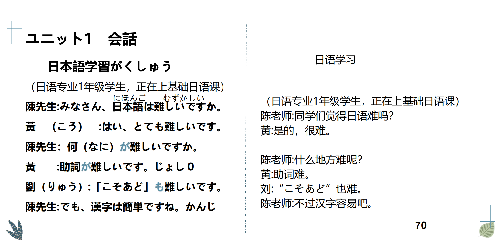
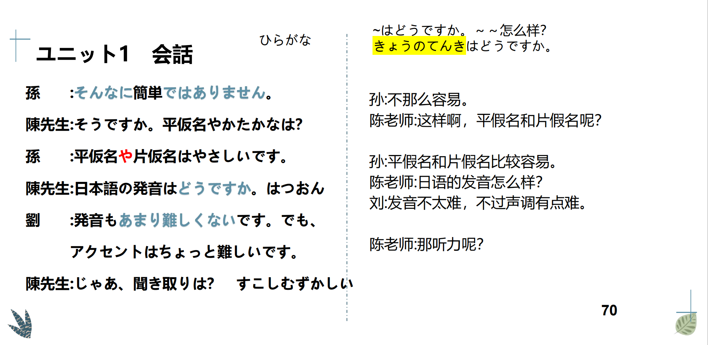
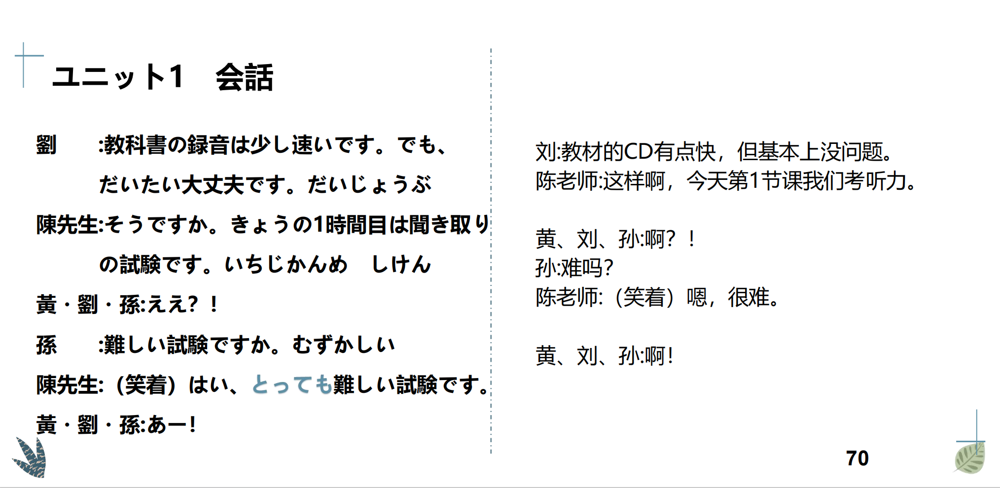

# かわい、きらい、ゆうめい...

## 新出単語

<vue-plyr>
  <audio controls crossorigin playsinline loop>
    <source src="../audio/4-1-たんご.mp3" type="audio/mp3" />
  </audio>
 </vue-plyr>

| 単語                                | 词性         | 翻译                                                        |
| :---------------------------------- | ------------ | ----------------------------------------------------------- |
| 学習<JpWord>がくしゅう</JpWord>     | ⓪<名・他 Ⅲ>  | 学习 ga ku syu u                                            |
| 何<JpWord>なに</JpWord>             | ①<名>        | 什么 na ni 单独用                                           |
| 助詞<JpWord>じょし</JpWord>         | ⓪<名>:助词　 | 　 zyo si 　は　も　の　と ①                                |
| <JpWord>こそあど</JpWord>           | ⓪<名>        | 日语语法中具有指示功能的词语）こそあど系列词                |
| 漢字<JpWord>かんじ</JpWord>         | ⓪<名>        | 汉字 kann zi 　かんたん　な　かんじ                         |
| 簡単<JpWord>かんたん</JpWord>       | ⓪<形 Ⅱ>      | 简单（的）な　ふくざつ　 kann tann                          |
| <JpWord>そんなに</JpWord>           | ④<副>        | 那么　 so nn na ni                                          |
| 平仮名<JpWord>ひらがな</JpWord>     | ③<名>        | 平假名 hi ra ga na やさしいひと                             |
| 片仮名<JpWord>かたかな</JpWord>     | ③②<名>       | 片假名 カタカナ ka ta ka na                                 |
| <JpWord>やさしい</JpWord>〖易しい〗 | ③⓪<形 Ⅰ>     | 容易（的）；简单（的） ya sa si i                           |
| アニさんはやさしい。                | 易しい問題   | むじゃき たんじゅん                                         |
| <JpWord>どう</JpWord>               | ①<副>        | 如何；怎样 do u ～はどうですか。 どんな怎样的＋名词＋ですか |
| <JpWord>あまり</JpWord>             | ⓪<副>        | （后接否定）（不）太；（不）怎么 a ma ri                    |
| accent<JpWord>アクセント</JpWord>   | ①<名>        | 声调 a ku se nn to                                          |
| 聞き取り<JpWord>ききとり</JpWord>   | ⓪<名>        | 听力；听解 口语，随意 ki ki to ri                           |
| 録音<JpWord>ろくおん</JpWord>       | ⓪<名・他 Ⅲ>  | 录音 ro ku o nn 音声おんせい 语音                           |
| 少し<JpWord>すこし</JpWord>         | ②<副>        | 稍微；一点儿 su ko si                                       |
| 速い<JpWord>はやい</JpWord>         | ②<形 Ⅰ>      | 快（的）；迅速（的） ha ya i すこし はやいです              |
| 大丈夫<JpWord>だいじょうぶ</JpWord> | ③<形 Ⅱ>      | 没问题（的）；可以 da i zyo u bu                            |
| 試験<JpWord>しけん</JpWord>         | ②<名・他 Ⅲ>  | 考试；测验 si ke nn test テスト                             |
| <JpWord>とっても</JpWord>           | ⓪<副>        | 很；非常（「とても」的口语表达方式，有强调程度之甚的语气）  |
| 教室<JpWord>きょうしつ</JpWord>     | ⓪<名>        | 教室 きょうし                                               |
| 広い<JpWord>ひろい</JpWord>         | ②<形 Ⅰ>      | 宽广（的）;宽敞（的） しろい                                |
| <JpWord>おもしろい</JpWord>         | ④ <形 Ⅰ>     | 有趣（的）；有意思（的）                                    |
| おもしろいこじゃありませんか。      |              | 不是个有趣的孩子嘛                                          |
| 英語<JpWord>えいご</JpWord>         | ⓪<名>        | 英语 中文ちゅうごくご                                       |
| 静か<JpWord>しずか</JpWord>         | ①<形 Ⅱ>      | 安静（的）;宁静（的）                                       |
| bus<JpWord>バス</JpWord>            | ①<名>        | 公交车 巴士 バスはべんりです。                              |
| 便利<JpWord>べんり</JpWord>         | ①<形 Ⅱ>      | 方便（的）；便利（的）バスはふべんです。                    |
| 体育館<JpWord>たいいくかん</JpWord> | ④ <名>       | 体育馆                                                      |
| 体育<JpWord>たいいく</JpWord>       | ① <名>       | 体育                                                        |
| <JpWord>かぎ</JpWord>〖鍵〗         | ②<名>        | 钥匙；关键;钥匙在哪里？かぎはどこですか。                   |
| 前<JpWord>まえ</JpWord>             | ①<名>        | 前面；以前 （鍵は）私のまえです。                           |
| <JpWord>きれい</JpWord>〖綺麗〗     | ①<形 Ⅱ>      | 干净（的）；漂亮（的）                                      |
| game<JpWord>ゲーム</JpWord> | ①<名>        | 游戏                                                        |
| 誰<JpWord>だれ</JpWord>             | ①<名>        | 谁 どなた                                                   |
| <JpWord>おいしい</JpWord>           | ③<形 Ⅰ>      | 好吃（的）；美味（的）                                      |
| 多い<JpWord>おおい</JpWord>         | ①<形 Ⅰ>      | 多（的） ひとがおおいです。                                 |
| 遠い<JpWord>とおい</JpWord>         | ⓪<形 Ⅰ>      | 远（的）；遥远（的）日本までとおいです。                    |
| 楽しい<JpWord>たのしい</JpWord>     | ③<形 Ⅰ>      | 快乐（的）；高兴（的）；愉快（的）                          |
| 辞書<JpWord>じしょ</JpWord>         | ①<名>        | 词典；辞典 日汉 moji 辞書                                   |
| 寮<JpWord>りょう</JpWord>           | ①<名>        | （集体）宿舍;公寓                                           |
| 狭い<JpWord>せまい</JpWord>         | ②<形 Ⅰ>      | 窄（的）塞蚂蚁                                              |
| 暑い<JpWord>あつい</JpWord>         | ②<形 Ⅰ>      | （天气）炎热（的）                                          |
| 北京<JpWord>ぺきん</JpWord>         | ①<固名>      | 北京                                                        |
| 寒い<JpWord>さむい</JpWord>         | ②<形 Ⅰ>      | （天气）寒冷（的） つめたい                                 |
| 作家<JpWord>さっか</JpWord>         | ⓪<名>        | 作家                                                        |
| 故郷<JpWord>ふるさと</JpWord>       | ②<名>        | 故乡；老家 训读单词，和语词汇                               |
| 町<JpWord>まち</JpWord>             | ②<名>        | 城镇；街道                                                  |
| <JpWord>うるさい</JpWord>           | ③<形 Ⅰ>      | 吵闹（的） まちがうるさい。                                 |
| 少ない<JpWord>すくない</JpWord>     | ③<形 Ⅰ>      | 少（的） ひとがすくないです                                 |
| <JpWord>まずい</JpWord>             | ②<形 Ⅰ>      | 难吃（的）；糟糕的                                          |
| 安い<JpWord>やすい</JpWord>         | ②<形 Ⅰ>      | 便宜（的）                                                  |
| 暗い<JpWord>くらい</JpWord>         | ⓪<形 Ⅰ>      | 暗（的）；昏暗；看不清（的）                                |
| 汚い<JpWord>きたない</JpWord>       | ③<形 Ⅰ>      | 脏（的）きたない                                            |
| <JpWord>つまらない</JpWord>         | ③<形 Ⅰ>      | 无趣（的）；无聊（的）                                      |
| 小さい<JpWord>ちいさい</JpWord>     | ③<形 Ⅰ>      | 小（的）                                                    |
| 新しい<JpWord>あたらしい</JpWord>   | ④<形 Ⅰ>      | 新（的）；新鲜（的）                                        |
| <JpWord>かわいい</JpWord>           | ③<形 Ⅰ>      | 可爱（的）                                                  |
| <JpWord>かっこいい</JpWord>         | ④<形 Ⅰ>      | 干练（的）；酷（的）；帅（的） かっこう が いい             |
| 不便<JpWord>ふべん</JpWord>         | ①<名·形 Ⅱ>   | 不方便 バスはふべんです。                                   |
| <JpWord>にぎやか</JpWord>〖賑やか〗 | ②<形 Ⅱ>      | 热闹（的）；繁华（的） まちはにぎやかです。                 |
| 親切<JpWord>しんせつ</JpWord>       | ①<形 Ⅱ>      | 亲切（的）；热心（的）                                      |

## 形容词（2 类）

1.形容词的结构是什么？

词干+词尾 可愛い（かわいい）可爱的

A.一类形容词：「い」结尾的形容词
かわい い
词干 词尾

B.二类形容词：「だ」结尾的形容词　　
りっぱ だ
词干 词尾

> 「だ」不会出现在单词
> 表（词典）上，单词表
> （词典）上都是词干部
> 分。所以词尾得自己记

## 接续方法：形容词+体言（名词）

1. 一类：直接+名词  
   おいしい 料理
   可愛い 学生
2. 二类形容词：词干+な＋名词  
   簡単(かんたん)な問題(もんだい)
   きらい な ひと

## 形容词的变形

> 时态：

1. 过去时 我以前很可爱
2. 非过去时（现在+将来） 我现在很可爱

> 语体：

1. 简体（好朋友，家人，下属）
2. 敬体（上司，陌生人，长辈）

## 非过去时变形(现在时和将来时)

1. 一类形容词的非过去时肯定  
   简体肯定： かわいい  
   就是形容词本身（原形） ― かわいい  
   敬体肯定：かわいいです 敬体  
   原形+です。 ― かわいいです

```ts
练习： おもしろい ちいさい
简体肯定： おもしろい ちいさい
敬体肯定： おもしろいです ちいさいです
```

2. 一类形容词的非过去时否定  
   简体否定： かわいい  
   词尾的い变成**く**＋ない ― かわい**く**ない  
   敬体否定：かわい**い** かわい**く**ありません  
   ① 词尾的い变成く＋ないです ― むずかしくないです // 難しい
   ② 词尾的い变成く＋ありません ― むずかしくありません

```ts
练习：おもしろい
简体否定： おもしろくない　 // 面白い 有趣的，有意思的
敬体否定： おもしろくないです
```

## 特殊变形

1. 良い（いい）①：好(的) いい いいですよい 动词尾  
   简体否定 よくない
   敬体否定 よくありません或者よくないです。
2. かっこいい ④： 帅气 ==格好(かっこう)がい い  
   简体否定かっこよくない
   敬体否定かっこよくありません或者かっこよくないです。

   > 当这个いい和かっこいい需要动词尾い的时候，就先把いい变成**よい**，かっこいい变成かっこ**よい**

## 一类形容词非过去时变形总结

| 一类非过去 | 简体                            | 敬体                                           | 例子                               |
| :--------- | :------------------------------ | :--------------------------------------------- | ---------------------------------- |
| 肯定       | 一类形容词本身（原形）          | 可愛い直接+です                                | 可愛いです                         |
| 否定       | 词尾い ⇒ く＋ない<br>可愛くない | 词尾い变く＋ありません<br>词尾い变く＋ないです | 可愛くありません<br>可愛くないです |

## 二类形容词非过去时肯定

1. 简体肯定 词干＋词尾  
   词干+だ(原形) ― 簡単だ
2. 敬体肯定 词干+です  
   词干+です ― 簡単です

```ts
   练习：有名（ ゆうめい）
  简体肯定 有名だ
  敬体肯定 有名です
```

## 二类形容词非过去时否定

1. 简体否定： 簡単  
   ① 词干+ではない ― 簡単 ではない
   ② 词干+じゃない（口语） ― 簡単じゃない
2. 敬体否定：  
   ① 词干+ではないです ―簡単では（じゃ）ないです
   ② 词干+ではありません―簡単では（じゃ）ありません

```ts
练习：ゆうめい 有名　　
简体否定 ゆうめいではない　　
敬体否定 ゆうめいではないです・ゆうめいではありません
```

## 二类形容词非过去时变形总结

| 二类非过去 | 简体                                          | 敬体                                                                                                           |
| :--------- | --------------------------------------------- | -------------------------------------------------------------------------------------------------------------- |
| 肯定       | 词干+だ<br>簡単だ                             | 词干＋です<br>簡単です                                                                                         |
| 否定       | 词干+では（じゃ）ない<br>簡単では（じゃ）ない | 词干＋では（じゃ）ありません<br>簡単では（じゃ）ありません<br>では（じゃ）ないです<br>簡単では（じゃ）ないです |

```ts
立派（りっぱ）
简体肯定： 立派だ
敬体肯定:立派です
简体否定:立派ではない
敬体否定:立派ではないです・立派ではありません
```

## 形容词谓语句

（有时态，语体）体现在形容词

```ts
✿ 这里的料理不好吃。（おいしい）
简体：ここの料理はおいしくない。
✿ 高桥很漂亮。
简体：高橋さんは綺麗だ。
✿ 作业不简单。 （宿題しゅくだい）
敬体：宿題は簡単ではないです。
宿題は簡単ではありません。
```

## が<主体（主语，疑问）>

1. 疑问词做主语时，用「が」来凸显“未知的信息”或者“新出现的信息”。  
   ★ 回答时主语也必须用が！（问答一致）  
   ✿ Q:誰が面白いですか。おもしろい  
    A:王さんが面白いです。  
   どこが賑やかですか？にぎやか ----公園が賑やかです。こうえん  
   「は」可以用来提示主语，但疑问词做主语时，一般用「が」。

```ts
✿ 教室はどこですか。
✿ Q:どこが教室ですか。 ---A:あそこが教室です。
```

2. 「は」凸显助词， 提示主题，强调后者，句子重点在后面。  
   「が」主格助词，凸显主语，强调的重点在前面。  
   ✿ 私はアニです。 （陈述，说明）  
   ✿ 私がアニです。 （强调主语 ）  
   ✿ ここは教室です。（强调“教室”，这里是教室）  
   ✿ ここが教室です。（强调“这里”，这里是教室）

3. ★ 喜欢，讨厌的对象的时候也会用「が」来表示

```ts
✿君は 誰が好きですか。きみのことがすきです。
--私は妹が好きです。がすき
--私は君が嫌いです。がきらい
```

## そんなに + 形容词的否定形式

表示程度没有相象的那么高，”并不那么“（想象差）  
✿ 1 类：日本語は、そんなに難しくないです。// むずかしい  
✿ 2 类：そんなに上手ではありません。 //【上手（じょうず）② 擅长】  

```ts
      (1) 没有那么黑。（くろい）
      (2) 这个问题没有那么复杂。（もんだい、ふくざつ）この これ
```

## あまり + 形容词的否定形式  
表示程度不高，”不太~“ ”不怎么~“ （无想象差）  
✿ 1 类：日本語は、あまり難しくないです。   
✿ 2 类：あまり静かではありません。 （しずか ① 安静)  

```ts
     (1) 这个菜不怎么好吃。（りょうり、おいしい）
     (2) 书不怎么贵。（ほん、たかい）
```

## 会話

<vue-plyr>
  <audio controls crossorigin playsinline loop>
    <source src="../audio/4-1-かいわ.mp3" type="audio/mp3" />
  </audio>
 </vue-plyr>



