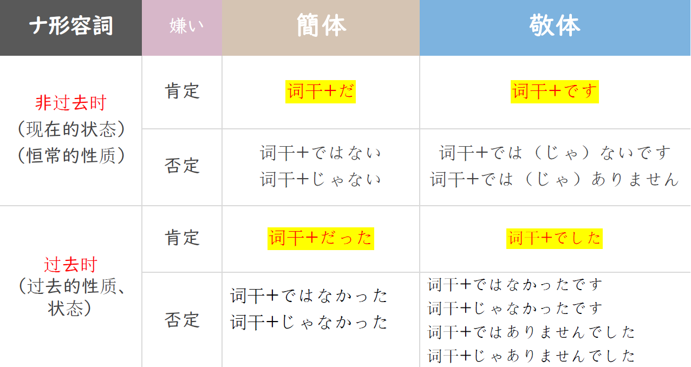
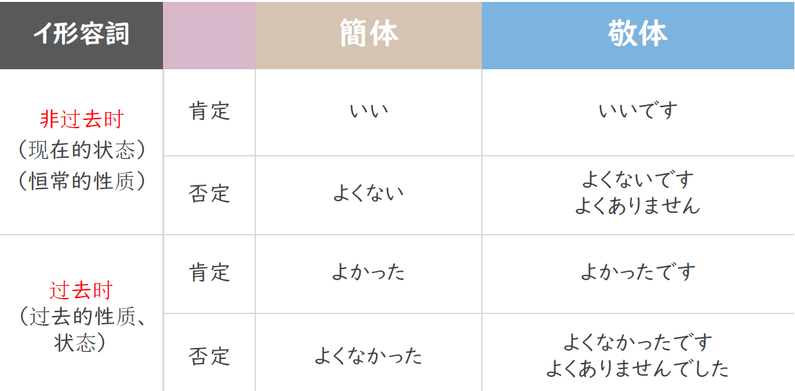
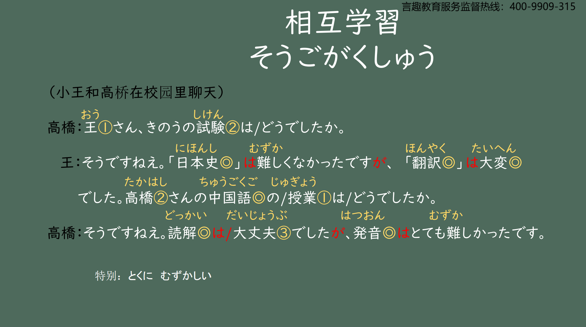
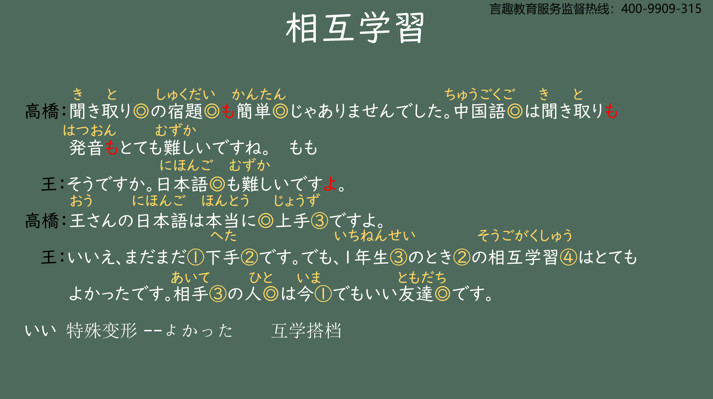
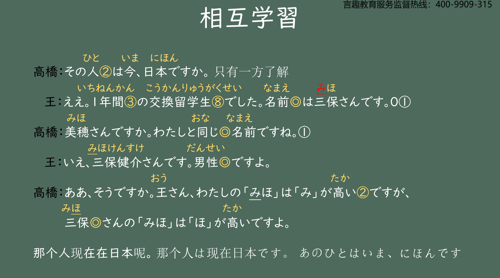
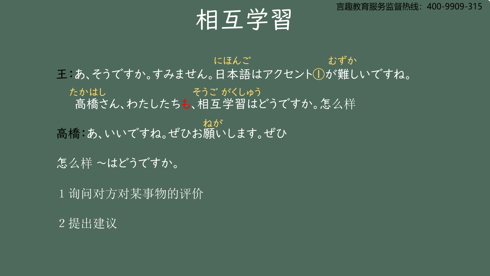
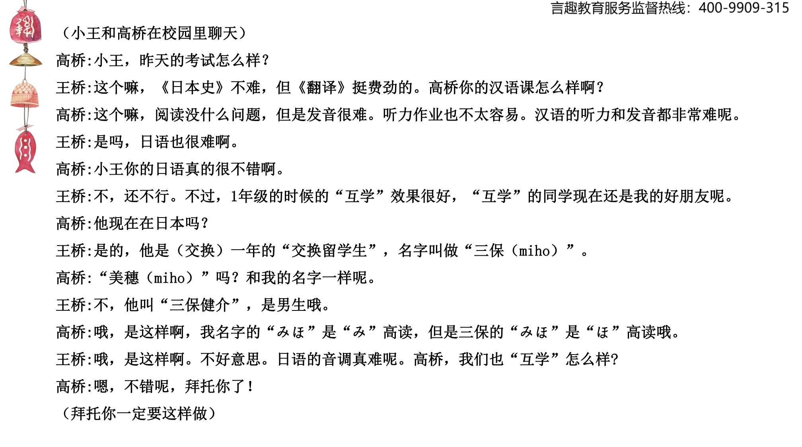

# かった、だった、どうで..

## 新出単語

<vue-plyr>
  <audio controls crossorigin playsinline loop>
    <source src="../audio/4-2-たんご.mp3" type="audio/mp3" />
  </audio>
 </vue-plyr>

| 単語                                                 | 词性                                           | 翻译                                                    |
| :--------------------------------------------------- | ---------------------------------------------- | ------------------------------------------------------- |
| 相互学習<JpWord>そう ご がく しゅう</JpWord>         | ④<名>                                          | 互学                                                    |
| 相互<JpWord>そう ご</JpWord>                         | ①<名>                                          | 互相 のパートナー                                       |
| 翻訳<JpWord>ほん やく</JpWord>                       | ⓪<名·他 Ⅲ>                                     | 翻译；笔译                                              |
| 宿題<JpWord>しゅく だい</JpWord>                     | ⓪<名>                                          | 作业                                                    |
| 本当に<JpWord>ほん とう に</JpWord>                  | ⓪<副>                                          | 真；太 きみの日本語は本当に上手だ                       |
| 上手<JpWord>じょうず</JpWord>                        | ③<名·形 Ⅱ>                                     | 棒（的）；好（的）； 优秀（的）；出色（的）；巧妙（的） |
| <JpWord>まだまだ</JpWord>                            | ①<副>:副词                                     | 「まだ（尚未、还）」的重叠形式，表示强调                |
| 下手<JpWord>へた</JpWord>                            | ②<名·形 Ⅱ>                                     | 差；不好；不行 まだまだへたです。 まだまだだな～～      |
| <JpWord>とき</JpWord> 〖時〗                         | ②<名>                                          | 时候；时间；时辰；年代 小时候 结婚的时候 漂亮的时候     |
| <JpWord>よい</JpWord> 〖良い〗                       | ①<形 Ⅰ>                                        | 好（的）；很好（口语中常用「いい」的形式）              |
| 相手<JpWord>あい て</JpWord>                         | ③<名>                                          | 对方；伙伴；对手                                        |
| <JpWord>いい</JpWord>                                | ① ＜形１＞                                     | 好（的）；优良（的）；不错（的）                        |
| 1 年間<JpWord>いち ねん かん</JpWord>                | ③<名>                                          | 一年                                                    |
| -年間<JpWord>-ねん かん</JpWord>                     | ＜接尾＞                                       | ～年时间                                                |
| 交換<JpWord>こう かん</JpWord>                       | ⓪<名·他 Ⅲ>                                     | 交换                                                    |
| 同じ<JpWord>おなじ</JpWord>                          | ⓪<形 Ⅱ>                                        | 相同；一样                                              |
| <JpWord>いえ</JpWord>                                | ②<感>                                          | （意同「いいえ」，表示否定的语气）不 家（いえ）         |
| 男性<JpWord>だん せい</JpWord>                       | ⓪<名>                                          | 男性 じょせい                                           |
| <JpWord>ぜひ</JpWord> 〖是非〗                       | ①<副>                                          | （表示希望实现的强烈愿望、心情）一定；务必              |
| <JpWord>よ</JpWord> <终助>                           | 表示说话人的断定、告知、叮嘱、命令、建议等语气 |
| <JpWord>が</JpWord>                                  | ＜接助＞                                       | （连接具有对比关系的两个事项）～                        |
| <JpWord>ねえ</JpWord>                                | <终助>                                         | 「ね」的长音形式，表示强调                              |
| 公園<JpWord>こう えん</JpWord>                       | ⓪<名>                                          | 公园 静止                                               |
| 散歩<JpWord>さん ぽ</JpWord>                         | ⓪<名・自 Ⅲ>                                    | 散步 动态                                               |
| 考え<JpWord>かんが え</JpWord>                       | ③<名>                                          | 想法；思考 いい考え                                     |
| 先週<JpWord>せん しゅう</JpWord>                     | ⓪<名>                                          | 上周；上礼拜；上星期                                    |
| <JpWord>かばん</JpWord>                              | ⓪<名>                                          | 包；提包                                                |
| 国語<JpWord>こく ご</JpWord>                         | ⓪<名>                                          | 国语；语文 国（くに）                                   |
| <JpWord>子ども</JpWord> （こども・子供）             | ⓪ ＜名＞                                       | 孩子；幼儿；儿童                                        |
| 絵<JpWord>え</JpWord>                                | ①<名>                                          | 画；绘 うきよえ                                         |
| 家<JpWord>いえ</JpWord>                              | ②<名>                                          | 家；（家的）房子 うち我家                               |
| <JpWord>タイトル</JpWord> （title）                  | ①<名>                                          | 题目；主题；                                            |
| <JpWord>ラスト・エンペラー</JpWord> （last Emperor） | ⓪-①<固名>                                      | 末代皇帝                                                |
| 中国飯店<JpWord>ちゅう ごく はん てん</JpWord>       | ⑤<固名>                                        | 中国饭店                                                |
| <JpWord>クラス</JpWord> （class）                    | ①<名>                                          | 班级 よんななさんクラス                                 |
| 窓<JpWord>まど</JpWord>                              | ①<名>                                          | 窗户；窗口 よんひゃくななじゅうさんクラス               |
| 髪<JpWord>かみ</JpWord>                              | ②<名>                                          | 头发 かみさま ①                                         |
| 長い<JpWord>ながい</JpWord>                          | ②<形 Ⅰ>                                        | 长（的）                                                |
| <JpWord>コーヒー</JpWord> （coffee）                 | ③<名>                                          | 咖啡 きっさてん                                         |
| <JpWord>けっこう</JpWord>                            | ①<名・副>                                      | 可以了；不用了；相当；很                                |
| 髪がけっこうながいです。                             | もういいです。                                 | けっこうです。                                          |
| <JpWord>やさしい</JpWord> 〖優しい〗                 | ⓪<形 Ⅰ>                                        | 温柔（的）；脾气好（的）                                |

## 形容词的敬体过去时

> 意义：表示过去的性质或状态。

```ts
(1)「日本史」は難しくなかったです。
(2) 読解の授業は大丈夫でした。
(3) 聞き取りの宿題も簡単じゃありませんでした。
```

> 注意:形容词「 よ い」 和「 いい」 在使用上的关联： 「 いい」 没有
> 活用变化， 它只有敬体和简体的非过去时的肯定形式， 因此， 当
> 它需要活用变化时必须使用「 よ い」 这一形式， 例如：

```ts
(4)１年生の時の相互学習はよかったです。
(5) 天気はよくなかったです。
```

## 形容詞変形——过去时

1. 一类形容词<过去时>  
    A.肯定形式  
    简体：词尾い变かった  
    如：✿ むずかしい  
    むずかしかった  
    敬体：词尾い变かった+です  
    如：✿ むずかしかったです
   B. 否定形式（先否定，再过去）
   简体： 词尾い 变 く+なかった  
   ✿ 難しい  
   難しくない  
   難しくなかった  
   敬体： ① 词尾い变く+なかった+です  
   ✿ 難しくなかったです  
   敬体： ② 词尾い 变 く+ありませんでした  
   ✿ 難しくありませんでした  
   難しくありません＋でした（です的过去式）

| 一类   |      | 简体                                | 敬体                                                                                             |
| :----- | :--- | :---------------------------------- | ------------------------------------------------------------------------------------------------ |
| 过去时 | 肯定 | い变为かっ た<br>寒かった           | い变为かった＋です<br>寒かったです                                                               |
|        | 否定 | い变く加なかった<br>寒く な かっ た | ① い变为なかった＋です<br>寒くなかったです<br>② い变く＋ありませんでした<br>寒くありませんでした |

2. 二类形容词<过去时>  
   A.肯定形式
   简体：词干+だった 如：✿ 簡単  
   簡単だった  
   敬体：词干+でした 如：✿ 簡単  
   簡単でした  
   B.否定形式（先否定，再过去）
   简体： 词干+ではなかった  
   如：✿ 簡単 簡単ではない  
   簡単ではなかった
   敬体： ① 词干+ではなかったです  
   如：✿ 簡単ではなかったです  
   ② 词干+ではありませんでした  
   如：✿ 簡単ではありませんでした  
   簡単ではありません＋でした

| 二类   |      | 简体                                     | 敬体                                                                                                               |
| :----- | :--- | :--------------------------------------- | ------------------------------------------------------------------------------------------------------------------ |
| 过去时 | 肯定 | 去掉だ＋だった<br>複雑だった             | 去掉だ＋でした<br>複雑でしたす                                                                                     |
|        | 否定 | 去掉だ＋ではなかった<br>複雑ではなかった | ① 去掉だ＋ではなかった＋です<br>複雑ではなかったです<br>② 去掉だ＋ではありませんでした<br>複雑ではありませんでした |

## 名词+はどうでしたか<询问过去的情况>

意义：用于询问过去发生的事情的结果或情形。

说明：「どうでしたか」是「どうですか」的过去时。

```ts
(1)王さん、昨日の試験はどうでしたか。
(2)一年生の時の相互学習はどうでしたか。
(3)今日の天気はどうでしたか。
```

## 总结

1. 一类形容词变形总结

   

2. 一类形容词特殊变形总结

   

3. 二类形容词变形总结

   

## が<转折>

意义： 表示两个分句间的转折关系。  
译文： 但是； 不过 でも  
接续： 两个分句之间

```ts
(1)「日本史」は難しくなかったですが、「翻訳」は大変でした。
（2）読解は大丈夫でしたが、発音はとても難しかったです。 阅读
（3）副会長は２年生ですが、会長は４年生です。 よねんせい
ふくかいちょう
```

## 「が」和「でも」有什么区别呢？

```ts
例句：
ジョイさんは可愛いですが、厳しいです。
ジョイさんは可愛いです。でも、厳しいです
```

## は　<对比>

意义：表示对比。  
说明： 将两个事物进行对比时， 要比较的事物用助词「 は 」 提示。  
多使用「 ～ は ～ が 、 ～ は ～ 」 的句式。 はがは 句型

```ts
(1)「日本史」は難しくなかったです。でも、「翻訳」は大変でした。 语感上少“对比”
(2) 私の「みほ」は「み」が高いですが、三保さんの「みほ」は「ほ」が高いですよ。
(3) 入学は簡単ですが、卒業は難しいです。
(4) 姉は医者ですが、兄は公務員です。
```

## は和が的区别

① 作为提示助词，提示主题 は 的用法
✿ 私 は 教師です。  
② 加强否定的语气
✿ 難（むずか）しく（は）ありません。
③ 表示前后对比 はがは句型  
✿ 昨日 は 涼（ す ず ） しかったですが、今日 は 暑い（あつい）です。

① 作为主格助词，接在主语后。  
✿ 誰（ だ れ ） が 教師（きょうし）ですか。  
→ 私 が 教師です。（疑问词做主语，が问が答）  
② 表示转折。（前后两句主语用「は」提示）  
✿ 昨日 は 涼しかった（すずしかった）ですが、今日 は 暑い（あつい）です。  
③ 表示喜欢讨厌的对象。擅长不擅长的对象。  
✿ 君のことが好きです。

```ts
(1) 小王可爱。高桥也可爱。
おうさんは可愛いです。 たかはしさんも可愛いです。
(2) 小王和高桥可爱。
おうさんとたかはしさん は かわいいです。
(3) 小王和高桥都可爱。
おうさんもたかはしさん も かわいいです。
```

## N1 も N2 も <并列> もも句型

意义： 表示并列。  
译文： N1 和 N2 都······  
接续： 名词 1+も +名词 2+も

```ts
(1) 中国語は聞き取りも発音もとても難しいですね。
(2) 陳先生も呉先生も京華大学の先生です。ちん
(3) 高橋さんも鈴木さんも留学生です。
```

## S よ<主张、提示>

意义： 表示说话人的主张、 提示、 叮嘱等。  
接续： 用于句尾。  
说明： 语气词「 よ 」 用于句尾时， 一般表示传递的信息是听话人未掌握的。

```ts
(1)日本語も難しいですよ。
(2)王さんの日本語は本当に上手ですよ。
(3) 今日は月曜日じゃありません。火曜日ですよ。
```

## のとき<状态的时间>

意义： 表示时间（ 时点或时段）。
译文： ······的时候； ······时  
接续： 名词+のとき  
说明： 「 Ｎのとき 」 在句中既可以做时间状语， 也可以后接「 の 」 做连体修饰语。

```ts
(1)１年生のときの相互学習はとてもよかったです。
(2) 大学創設のときは、まだ「还」学部は少なかったです。
(3) 王さんと李さんは高校のときの友達です。
```

## N のとき<状态的时间>

> 小时候 ちいさい 一类形容词接名词  
> ちいさいとき  
> 年轻的时候 わかい 一类形容词接名词  
> わかいとき
> 漂亮的时候 きれい 二类形容词接名词  
> きれいなとき

##　その
意义： 连体词「 そ の 」 除了可以指示距离听话人近的事物以外， 还可以用来
指示刚才的谈话或前文中涉及的、 只有一方了解的人或事物。  
译文： 那个······  
接续： その +名词

```ts
(1)王 ：相手の人は今でもいい友達です。 对面的人
高橋：その人は今、日本ですか。 2
あの人は今、日本です。
(2) 一年生の時の先生は田中先生でした。その先生はとても厳しかったです。1
(3) 王 ：高橋さんは私の友達です。
趙 ：その方も京華大学の語学留学生ですか。 2

```

## その　 vs 　あの

1. その 指示刚才谈话或前文涉及的 、只有一方了解的人或事物  
   ✿ A：相手の人は今でも大好きです。
   B：その人は今どこですか。
2. あの 强调双方都了解的人或事物  
   ✿ A：経済学部の高橋先生はかっこいいですね。  
   B：そうですね。でも、あの先生はもう結婚（けっこん）しましたよ。  
   A：えぇ？！Σ (ﾟ д ﾟ lll) ##　 N1 は N2 でした <名词谓语句的过去时>

意义： 名词 N2 说明主语 N1 过去的性质、 属性。  
译文： N1（ 曾） 是 N2  
说明： 「 でした 」 是判断词「 です 」 的过去时。  
「 です 」 的否定形式「 ではありません 」 的过去时是「 ではありませんでした 」 。

```ts
(1)（三保さんは）１年間の交換留学生でした。
(2) 昨日の午後は「日本史」の試験でした。
(3) 母は医者でした。
(4) 今日はとてもいい一日でした。
(5) 二人は同じ大学ではありませんでした

```

## N + ど同じ<类同> どおなじ

意义： 表达二者相同。  
译文： 与·····相同 と ： 和 お な じ ： 一样， 相同  
说明： 「 同じ 」 修饰名词时， 一般不用「 同じ な 」 的形式， 而是由词干直接修饰。

```ts
(1)美穂さ ん で す か 。 私と 同じ 名前で す ね 。 と 放在被比较对象后
(2) 李さ ん は 私と 同じ ク ラ ス で す 。
(3) 法学部は 経済学部と 同じ 建物で す 。
同样的意思还可以用以下形式表示。
(4)妹は 私と 小学校が 同じ で す 。
(5)李さ ん は 私と ク ラ ス が 同じ で す 。

```

## N1 は N2 が A です <主谓谓语句>

说明：该句中「は」表示的是全句的主语（又称大主语），它也是该句的话题；谓语部分是对话　　
题的说明，表示话题所指的事物整体所具有的的特征，其主语（又称小主语）用「が」表示。这　　
样的句式称为“主谓谓语句”。　　
大小主语之间一般为整体与部分或主体与侧面的关系。

```ts
(1) 日本語はアクセントが難しいです。日语的声调是难的。
にほんごのアクセントはむずかしいです。
日语は声调が难です。
(2) 私は英語が下手です。我的英语差。
(2) この会は会費が高いです。 这个会的会费贵。
```

```ts
例： 日本語 / アクセント / 難しい → 日本語はアクセントが難しいです
(1) あの人 / かみ / ながい
あのひとはかみがながい。
(2) この大学 / 留学生 / 多い だいがく りゅうがくせい おおい
このだいがくはりゅうがくせいがおおい。
(3) この部屋 / 窓 / 小さい へや 窓まど
このへやはまどがちいさい。
このへやのまどはちいさい。
```

## 总结 「は」的用法

① 作为凸显助词， 提示主语或者话题。 （ が前は 后）

✿ ア ニ は 教師です。 ア ニ が 教師です。

② 加强否定的语气。 む ずかし い

✿ 難しく（は）ありません。

③「が」连接的两个分句的主语后都使用「 は 」 时， 表示前后对比

✿ 昨日 は 涼しかったですが、今日 は 暑いです。すずしい

## 总结 「が」的用法

① 疑问词后接が、 且回答时也使用が。 が问が答

✿ どこが教室ですか。 --あそこが教室です。

② 接在前一个句子后面，表示转折。（ 讨厌， 喜欢的对象）

✿ 君はいい人で すが 、私は王さんのこと 好きです。

③ は表示大主语（管全句），が表示小主语（管一截儿）。

## 本节总结


## 宿题

```ts
(1) 小时候漂亮，但是现在不漂亮。（用“が”表转折）
(2) 我和小王是一样的铅笔。（鉛筆「えんぴつ」）
(3) 中国和日本的汉字不一样（漢字：かんじ ）
(4) 我曾是学生。（用简体）
```

## 会話

<vue-plyr>
  <audio controls crossorigin playsinline loop>
    <source src="../audio/4-2-かいわ.mp3"  type="audio/mp3" />
  </audio>
 </vue-plyr>






