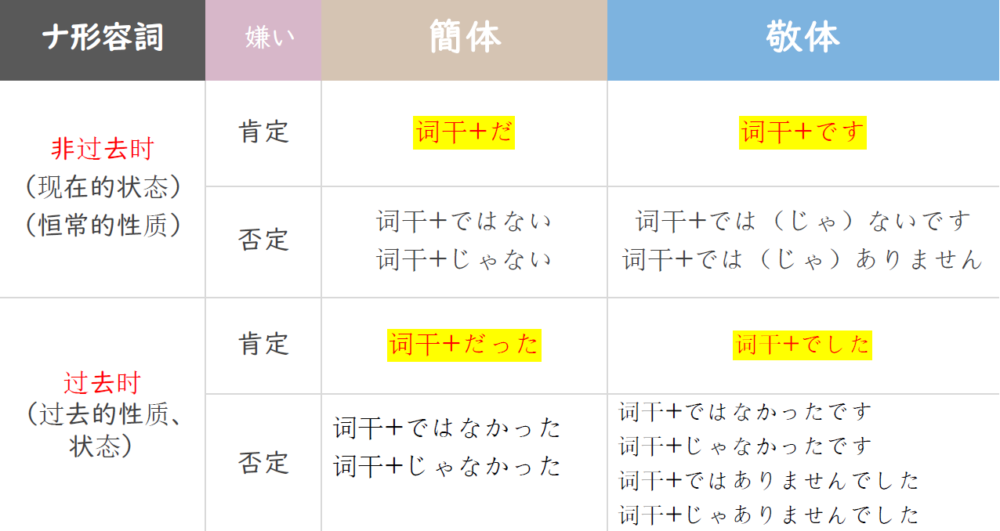

# かった、だった、どうで..

## 新出単語
<vue-plyr>
  <audio controls crossorigin playsinline autoplay loop>
    <source src="../audio/4-2-たんご.mp3" type="audio/mp3" />
  </audio>
 </vue-plyr>

## 形容词的敬体过去时

> 意义：表示过去的性质或状态。

```ts
(1)「日本史」は難しくなかったです。
(2) 読解の授業は大丈夫でした。
(3) 聞き取りの宿題も簡単じゃありませんでした。
```

> 注意:形容词「 よ い」 和「 いい」 在使用上的关联： 「 いい」 没有
> 活用变化， 它只有敬体和简体的非过去时的肯定形式， 因此， 当
> 它需要活用变化时必须使用「 よ い」 这一形式， 例如：

```ts
(4)１年生の時の相互学習はよかったです。
(5) 天気はよくなかったです。
```

## 形容詞変形——过去时

1. 一类形容词<过去时>  
    A.肯定形式  
    简体：词尾い变かった  
    如：✿ むずかしい  
    むずかしかった  
    敬体：词尾い变かった+です  
    如：✿ むずかしかったです
   B. 否定形式（先否定，再过去）
   简体： 词尾い 变 く+なかった  
   ✿ 難しい  
   難しくない  
   難しくなかった  
   敬体： ① 词尾い变く+なかった+です  
   ✿ 難しくなかったです  
   敬体： ② 词尾い 变 く+ありませんでした  
   ✿ 難しくありませんでした  
   難しくありません＋でした（です的过去式）

| 一类   |      | 简体                                | 敬体                                                                                             |
| :----- | :--- | :---------------------------------- | ------------------------------------------------------------------------------------------------ |
| 过去时 | 肯定 | い变为かっ た<br>寒かった           | い变为かった＋です<br>寒かったです                                                               |
|        | 否定 | い变く加なかった<br>寒く な かっ た | ① い变为なかった＋です<br>寒くなかったです<br>② い变く＋ありませんでした<br>寒くありませんでした |

2. 二类形容词<过去时>  
   A.肯定形式
   简体：词干+だった 如：✿ 簡単  
   簡単だった  
   敬体：词干+でした 如：✿ 簡単  
   簡単でした  
   B.否定形式（先否定，再过去）
   简体： 词干+ではなかった  
   如：✿ 簡単 簡単ではない  
   簡単ではなかった
   敬体： ① 词干+ではなかったです  
   如：✿ 簡単ではなかったです  
   ② 词干+ではありませんでした  
   如：✿ 簡単ではありませんでした  
   簡単ではありません＋でした

| 二类   |      | 简体                                     | 敬体                                                                                                               |
| :----- | :--- | :--------------------------------------- | ------------------------------------------------------------------------------------------------------------------ |
| 过去时 | 肯定 | 去掉だ＋だった<br>複雑だった             | 去掉だ＋でした<br>複雑でしたす                                                                                     |
|        | 否定 | 去掉だ＋ではなかった<br>複雑ではなかった | ① 去掉だ＋ではなかった＋です<br>複雑ではなかったです<br>② 去掉だ＋ではありませんでした<br>複雑ではありませんでした |

## 名词+はどうでしたか<询问过去的情况>

意义：用于询问过去发生的事情的结果或情形。

说明：「どうでしたか」是「どうですか」的过去时。

```ts
(1)王さん、昨日の試験はどうでしたか。
(2)一年生の時の相互学習はどうでしたか。
(3)今日の天気はどうでしたか。
```

## 总结

1. 一类形容词变形总结

   
   
2. 一类形容词特殊变形总结

   

3. 二类形容词变形总结

   

## 会話

<vue-plyr>
  <audio controls crossorigin playsinline autoplay loop>
    <source src="../audio/4-2-かいわ.mp3" type="audio/mp3" />
  </audio>
 </vue-plyr>