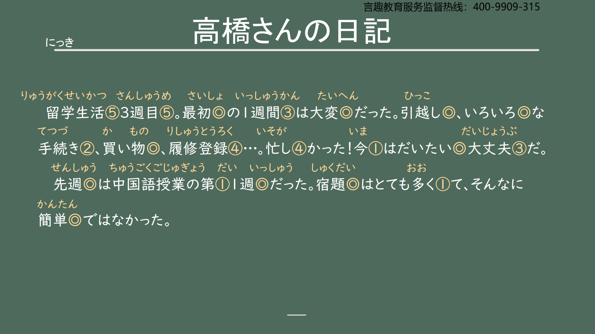
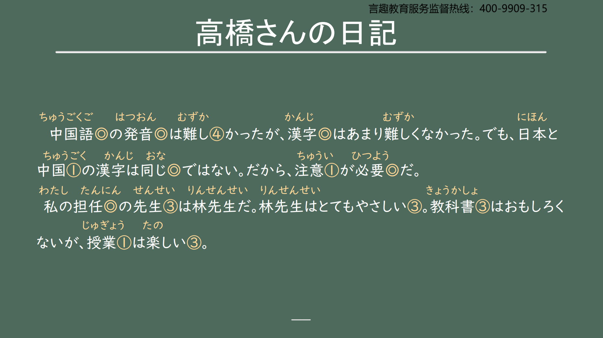
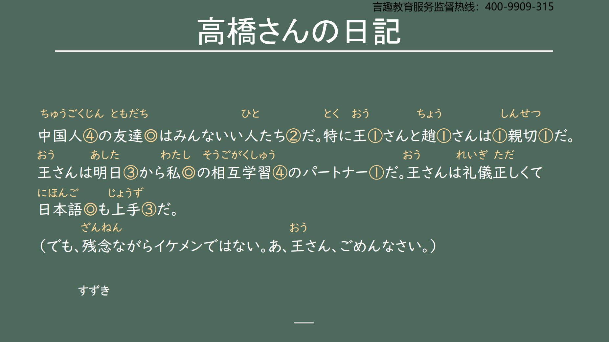
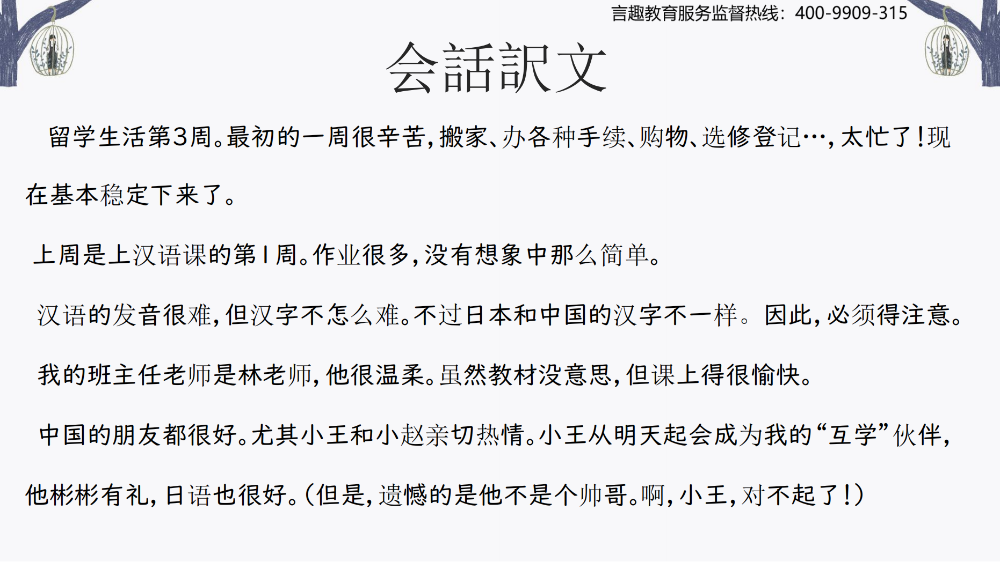

# だから/ですから ...

## 新出単語

<vue-plyr>
  <audio controls crossorigin playsinline loop>
    <source src="../audio/4-3-たんご.mp3" type="audio/mp3" />
  </audio>
 </vue-plyr>

| 単語                                              | 词性                  | 翻译                                   |
| :------------------------------------------------ | --------------------- | -------------------------------------- |
| <JpWord>にっき</JpWord>日記　                     | ⓪ ＜名＞              | 日记                                   |
| <JpWord>さいしょ</JpWord>最初                     | ⓪ ＜名＞              | 最初；最早（的）                       |
| ー週間<JpWord>ーしゅうかん</JpWord> 　            | ＜接尾＞              | ~周                                    |
| <JpWord>ひっこし</JpWord>引越し                   | 　 ⓪ ＜名.自 III ＞   | 搬家                                   |
| 色々 <JpWord>いろいろ</JpWord>                    | 　 ⓪ ＜形 II.名＞     | 各种各样;许多                          |
| <JpWord>てつづき</JpWord> 手続き                  | (2)＜名.自 III ＞     | 手续                                   |
| 買い物<JpWord>かいもの</JpWord>                   | 　 ⓪ ＜名＞           | 买东西；购物                           |
| <JpWord>りしゅうとうろく</JpWord> 履修登録        | 　(4)＜名＞           | 选修登记；选课                         |
| <JpWord>りしゅう</JpWord> 选修　 ⓪ ＜名.他 III ＞ | 选修                  |
| <JpWord>とうろく</JpWord> 登记　 ⓪ ＜名.他 III ＞ | 登记                  |
| 忙しい<JpWord>いそがしい</JpWord>                 | (4)＜形 Ⅰ ＞          | 忙的；忙碌的                           |
| 注意<JpWord>ちゅうい</JpWord> 　                  | （1）＜名.自他 III ＞ | 注意；留意                             |
| 必要<JpWord>ひつよう</JpWord>                     | （0）＜形 II.名＞     | 必要；需要                             |
| 担任<JpWord>のつかんじょ</JpWord> 　              | ⓪ ＜形 II。名＞       | 担任；担当；负责                       |
| <JpWord>みんな</JpWord>                           | （3）<名.副>          | 都                                     |
| 人たち<JpWord>ひとたち</JpWord>                   | （2）＜名＞           | 人们                                   |
| 特に <JpWord>とくに</JpWord>                      | 　(1)＜副＞           | 尤其;特别                              |
| 明日 <JpWord>あした</JpWord>                      | （3）＜名＞           | 明天                                   |
| partner <JpWord>パートナー</JpWord>               | (1)＜名＞             | 伙伴；搭档                             |
| 礼儀<JpWord>れい ぎ</JpWord>                      | ⓪ ＜名＞              | 礼仪；礼节                             |
| 正しい<JpWord>ただ しい</JpWord>                  | ③ ＜形 Ⅰ ＞           | 正确（的）；正当（的）；符合要求（的） |
| 礼儀正しい<JpWord>れいぎただしい</JpWord>         | ⑥ ＜形 Ⅰ ＞           | 彬彬有礼 アニさんは礼儀正しい人です。  |
| 残念ながら<JpWord>ざん ねん ながら</JpWord>       | ⑤                     | 遗憾的是；只可惜                       |
| 残念<JpWord>ざん ねん</JpWord>                    | ③<形 Ⅱ>               | （令人）遗憾（的）、（令人）惋惜（的） |
| <JpWord>イケメン</JpWord>                         | ⓪<名>                 | （「イケる＋メン」的缩略说法）帅哥     |
| <JpWord>ごめんなさい</JpWord>                     | ⑤                     | （道歉用语）对不起 すみません          |
| 近い<JpWord>ちか い</JpWord>                      | ② ＜形 Ⅰ ＞           | 近的 違い（ちがい）                    |
| 悪い<JpWord>わる い</JpWord>                      | ②<形 Ⅰ>               | 坏（的）；不好（的）                   |
| 元気<JpWord>げん き</JpWord>                      | ①<名·形 Ⅱ>            | 健康（的）；有精神（的）；有干劲（的） |
| おかげさまで、げんきですよ。                      | お陰様で              |                                        |
| <JpWord>レストラン</JpWord> （restaurant）        | ① ＜名＞              | 餐厅；饭店                             |

## 形容词第二连用形(A1 くて、A2 で)

意义：用于谓语或分句的并列，其构成方式是：  
①Ⅰ 类形容词词干+くて 例：難しい → 難しくて  
②Ⅱ 类形容词词干+で 例：簡単 → 簡単で

```ts
(1) 宿題はとても多くて、そんなに簡単ではなかった。
(2) 大学は広くて、学生も多いです。
(3) 中国人の友達は親切で、みんないい人たちだ。
(4) ここは静かで、とても便利だ。
```

> 注意： 形容词的连用形有第一连用形和第二连用形两种形式。

```ts
✿ 图书馆安静又干净。（としょかん しずか、きれい）
图书馆は し ずかで 、 き れい で す。
✿ 以前中国的朋友很好，老师也很有趣。（いい、おもしろい）
ちゅうごく ともだち せんせい
✿ 中国的朋友は 很好， 老师も 有趣
中国の 友達は よ く て 、 先生も お も し ろ かっ た
```

> 1.て形前面不会接过去时。时态（过去时、非过去时、敬体、简体）体现在句尾  
> ✿ 子供の時、無邪気で、可愛かったです。（無邪気 ①:むじゃき）  
> 小时候，天真又可爱。

> 2.连用的形容词若是褒义后者也要接褒义，若是贬义后者也要接贬义。  
> ✿ りんごは美味しくて、小さいです。 ✖

## だから/ですから <因果关系>

意义：表示因果关系，即前面的句子表示原因，后面的句子表示由该原因  
引起的结果。  
译文：因此······；所以······  
接续：用于两个句子之间。敬体的句子中用「ですから」。

```ts
(1) 日本と中国の漢字は同じではない。だから、注意が必要だ。
(2) この部屋は狭くて古い。だから、安い。 便宜的：やすい り ょ う
(3) 友達はみんな親切な人です。ですから、生活は大丈夫です。 だいじょうぶ
```

## 会話

<vue-plyr>
  <audio controls crossorigin playsinline loop>
    <source src="../audio/4-3-かいわ.mp3" type="audio/mp3" />
  </audio>
 </vue-plyr>




