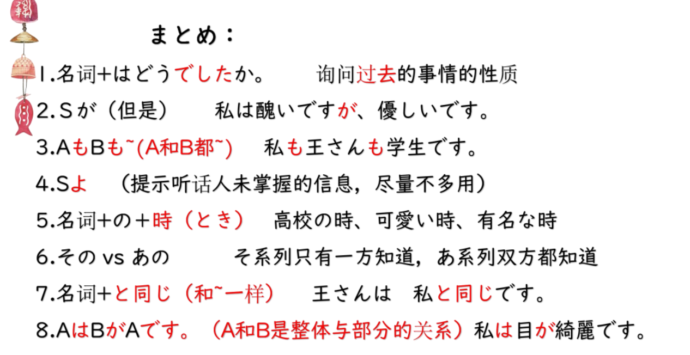

# が、は、もも、よ、のとき...

## 新出単語

<vue-audio file="../audio/4-2-たんご.mp3" loop />

## が<转折>

意义： 表示两个分句间的转折关系。  
译文： 但是； 不过 でも  
接续： 两个分句之间

```ts
(1)「日本史」は難しくなかったですが、「翻訳」は大変でした。
（2）読解は大丈夫でしたが、発音はとても難しかったです。 阅读
（3）副会長は２年生ですが、会長は４年生です。 よねんせい
ふくかいちょう
```

## 「が」和「でも」有什么区别呢？

```ts
例句：
ジョイさんは可愛いですが、厳しいです。
ジョイさんは可愛いです。でも、厳しいです
```

## は　<对比>

意义：表示对比。  
说明： 将两个事物进行对比时， 要比较的事物用助词「 は 」 提示。  
多使用「 ～ は ～ が 、 ～ は ～ 」 的句式。 はがは 句型

```ts
(1)「日本史」は難しくなかったです。でも、「翻訳」は大変でした。 语感上少“对比”
(2) 私の「みほ」は「み」が高いですが、三保さんの「みほ」は「ほ」が高いですよ。
(3) 入学は簡単ですが、卒業は難しいです。
(4) 姉は医者ですが、兄は公務員です。
```

## は和が的区别

① 作为提示助词，提示主题 は 的用法
✿ 私 は 教師です。  
② 加强否定的语气
✿ 難（むずか）しく（は）ありません。
③ 表示前后对比 はがは句型  
✿ 昨日 は 涼（ す ず ） しかったですが、今日 は 暑い（あつい）です。

① 作为主格助词，接在主语后。  
✿ 誰（ だ れ ） が 教師（きょうし）ですか。  
→ 私 が 教師です。（疑问词做主语，が问が答）  
② 表示转折。（前后两句主语用「は」提示）  
✿ 昨日 は 涼しかった（すずしかった）ですが、今日 は 暑い（あつい）です。  
③ 表示喜欢讨厌的对象。擅长不擅长的对象。  
✿ 君のことが好きです。

```ts
(1) 小王可爱。高桥也可爱。
おうさんは可愛いです。 たかはしさんも可愛いです。
(2) 小王和高桥可爱。
おうさんとたかはしさん は かわいいです。
(3) 小王和高桥都可爱。
おうさんもたかはしさん も かわいいです。
```

## N1 も N2 も <并列> もも句型

意义： 表示并列。  
译文： N1 和 N2 都······  
接续： 名词 1+も +名词 2+も

```ts
(1) 中国語は聞き取りも発音もとても難しいですね。
(2) 陳先生も呉先生も京華大学の先生です。ちん
(3) 高橋さんも鈴木さんも留学生です。
```

## S よ<主张、提示>

意义： 表示说话人的主张、 提示、 叮嘱等。  
接续： 用于句尾。  
说明： 语气词「 よ 」 用于句尾时， 一般表示传递的信息是听话人未掌握的。

```ts
(1)日本語も難しいですよ。
(2)王さんの日本語は本当に上手ですよ。
(3) 今日は月曜日じゃありません。火曜日ですよ。
```

## のとき<状态的时间>

意义： 表示时间（ 时点或时段）。
译文： ······的时候； ······时  
接续： 名词+のとき  
说明： 「 Ｎのとき 」 在句中既可以做时间状语， 也可以后接「 の 」 做连体修饰语。

```ts
(1)１年生のときの相互学習はとてもよかったです。
(2) 大学創設のときは、まだ「还」学部は少なかったです。
(3) 王さんと李さんは高校のときの友達です。
```

## N のとき<状态的时间>

> 小时候 ちいさい 一类形容词接名词  
> ちいさいとき  
> 年轻的时候 わかい 一类形容词接名词  
> わかいとき
> 漂亮的时候 きれい 二类形容词接名词  
> きれいなとき

##　その
意义： 连体词「 そ の 」 除了可以指示距离听话人近的事物以外， 还可以用来
指示刚才的谈话或前文中涉及的、 只有一方了解的人或事物。  
译文： 那个······  
接续： その +名词

```ts
(1)王 ：相手の人は今でもいい友達です。 对面的人
高橋：その人は今、日本ですか。 2
あの人は今、日本です。
(2) 一年生の時の先生は田中先生でした。その先生はとても厳しかったです。1
(3) 王 ：高橋さんは私の友達です。
趙 ：その方も京華大学の語学留学生ですか。 2

```

## その　 vs 　あの

1. その 指示刚才谈话或前文涉及的 、只有一方了解的人或事物  
   ✿ A：相手の人は今でも大好きです。
   B：その人は今どこですか。
2. あの 强调双方都了解的人或事物  
   ✿ A：経済学部の高橋先生はかっこいいですね。  
   B：そうですね。でも、あの先生はもう結婚（けっこん）しましたよ。  
   A：えぇ？！Σ (ﾟ д ﾟ lll) ##　 N1 は N2 でした <名词谓语句的过去时>

意义： 名词 N2 说明主语 N1 过去的性质、 属性。  
译文： N1（ 曾） 是 N2  
说明： 「 でした 」 是判断词「 です 」 的过去时。  
「 です 」 的否定形式「 ではありません 」 的过去时是「 ではありませんでした 」 。

```ts
(1)（三保さんは）１年間の交換留学生でした。
(2) 昨日の午後は「日本史」の試験でした。
(3) 母は医者でした。
(4) 今日はとてもいい一日でした。
(5) 二人は同じ大学ではありませんでした

```

## N + ど同じ<类同> どおなじ

意义： 表达二者相同。  
译文： 与·····相同 と ： 和 お な じ ： 一样， 相同  
说明： 「 同じ 」 修饰名词时， 一般不用「 同じ な 」 的形式， 而是由词干直接修饰。

```ts
(1)美穂さ ん で す か 。 私と 同じ 名前で す ね 。 と 放在被比较对象后
(2) 李さ ん は 私と 同じ ク ラ ス で す 。
(3) 法学部は 経済学部と 同じ 建物で す 。
同样的意思还可以用以下形式表示。
(4)妹は 私と 小学校が 同じ で す 。
(5)李さ ん は 私と ク ラ ス が 同じ で す 。

```

## 本节总结



## 宿题

```ts
(1) 小时候漂亮，但是现在不漂亮。（用“が”表转折）
(2) 我和小王是一样的铅笔。（鉛筆「えんぴつ」）
(3) 中国和日本的汉字不一样（漢字：かんじ ）
(4) 我曾是学生。（用简体）
```
## 会話

<vue-audio file="../audio/4-2-かいわ.mp3" loop=true></vue-audio>