# Ｖる/Ｎの前に...

## 新出単語

<vue-plyr>
  <audio controls crossorigin playsinline loop>
    <source src="../audio/c/3-1-たんご.mp3" type="audio/mp3" />
  </audio>
 </vue-plyr>

| 単語                                         | 词性              | 翻译                               |
| -------------------------------------------- | ----------------- | ---------------------------------- |
| 診察<JpWord>しんさつ</JpWord>                | ⓪ ＜名・他 Ⅲ ＞   | 诊断；检查；看病                   |
| 体（<JpWord>からだ</JpWord>）                | ⓪ ＜名＞          | 身体                               |
| 調子（<JpWord>ちょうし</JpWord>）            | ⓪ ＜名＞          | （身体）状况；状态                 |
| 次（<JpWord>つぎ</JpWord>）                  | ② ＜名＞          | 下一个；接下来；然后               |
| 熱（<JpWord>ねつ</JpWord>）                  | ② ＜名＞          | 热；发烧                           |
| 下（<JpWord>が</JpWord>）る（さがる）        | ② ＜自 Ⅰ ＞       | 下降；垂下                         |
| <JpWord>それに</JpWord>                      | ⓪ ＜接＞          | 而且；还有                         |
| <JpWord>のど</JpWord>〖咽喉〗                | ① ＜名＞          | 喉咙；嗓子                         |
| <JpWord>はい</JpWord>                        | ① ＜感＞          | 表示引起对方的注意                 |
| <JpWord>ずいぶん</JpWord>                    | ① ＜副＞          | 很；非常；相当                     |
| <JpWord>はれる</JpWord>〖腫れる〗            | ⓪ ＜自 Ⅱ ＞       | 肿；肿胀                           |
| 最近（<JpWord>さいきん</JpWord>）            | ⓪ ＜名＞          | 最近（指过去的一段时间）           |
| 食欲（<JpWord>しょくよく</JpWord>）          | ②⓪ ＜名＞         | 食欲                               |
| 息抜き（<JpWord>いきぬき</JpWord>）          | ③④⓪ ＜名・自 Ⅲ ＞ | 放松；喘口气儿；休                 |
| 体温計（<JpWord>たいおんけい</JpWord>）      | ⓪③ ＜名＞         | 体温计；体温表                     |
| 体温（<JpWord>たいおん</JpWord>）            | ①⓪ ＜名＞         | 体温                               |
| ‐ 計（<JpWord>けい</JpWord>）                | ＜接尾＞          | ~计；~表                           |
| ‐ 度（<JpWord>ど</JpWord>）                  | ＜接尾＞          | 度；度数                           |
| ‐ 分（<JpWord>ぶ</JpWord>）                  | ＜接尾＞          | 分；厘                             |
| <JpWord>かなり</JpWord>                      | ① ＜副・形 Ⅱ ＞   | 相当；很                           |
| <JpWord>つらい</JpWord>                      | ⓪ ＜形 Ⅰ ＞       | 难受；不舒服；痛苦                 |
| ‐分（<JpWord>ぶん</JpWord>）                 | ＜接尾＞          | 量；份量                           |
| 朝晩（<JpWord>あさばん</JpWord>）            | ① ＜名＞          | 早晚；早上和晚上                   |
| ‐錠（<JpWord>じょう</JpWord>）               | ＜接尾＞          | 粒；片                             |
| 食前（<JpWord>しょくぜん</JpWord>）          | ⓪ ＜名＞          | 饭前                               |
| ‐前（<JpWord>ぜん</JpWord>）                 | ＜接尾＞          | ~之前                              |
| <JpWord>それとも</JpWord>                    | ③ ＜接＞          | 或者；还是                         |
| 食後（<JpWord>しょくご</JpWord>）            | ⓪ ＜名＞          | 饭后                               |
| うがい薬（<JpWord>うがいぐすり</JpWord>）    | ④ ＜名＞          | 口药水                             |
| <JpWord>うがい</JpWord>〖嗽・含嗽〗          | ⓪ ＜名・自 Ⅲ ＞   | 漱口                               |
| <JpWord>ちゃんと</JpWord>                    | ⓪ ＜副＞          | 确实；一定                         |
| 予約（<JpWord>よやく</JpWord> ）             | ⓪ ＜名・他 Ⅲ ＞   | 预约；预订                         |
| 朗読（<JpWord>ろうどく</JpWord> ）           | ⓪ ＜名・他 Ⅲ ＞   | 朗读                               |
| <JpWord>デザート</JpWord> （dessert）        | ② ＜名＞          | 甜品                               |
| <JpWord>アイス</JpWord>                      | ① ＜名＞          | 冰；冰激凌                         |
| <JpWord>プリン</JpWord> （pudding）          | ① ＜名＞          | （「プッディング」的音变形式）布丁 |
| 絶対（<JpWord>ぜったい</JpWord> ）           | ⓪ ＜名・副＞      | 绝对                               |
| 不要不急（<JpWord>ふようふきゅう</JpWord> ） | ⓪ ＜名＞          | 非必要非紧急                       |
| 外出（<JpWord>がいしゅつ</JpWord> ）         | ⓪ ＜名・自 Ⅲ ＞   | 外出；出门                         |
| 控える（<JpWord>ひかえる</JpWord> ）         | ③② ＜他 Ⅱ ＞      | 减少；控制；临近                   |
| 騒ぐ（<JpWord>さわぐ</JpWord> ）             | ② ＜自 Ⅰ ＞       | 吵闹                               |
| <JpWord>チャンス</JpWord> （chance）         | ① ＜名＞          | 机会                               |
| 逃す（<JpWord>のがす</JpWord> ）             | ② ＜他 Ⅰ ＞       | 放跑；错过；（看）漏掉             |
| <JpWord>シャワ</JpWord> （shower）           | ① ＜名＞          | 淋浴；冲凉                         |
| 浴びる（<JpWord>あびる</JpWord> ）           | ⓪ ＜他 Ⅱ ＞       | 淋浴；沐浴；照射                   |
| 本棚（<JpWord>ほんだな</JpWord> ）           | ① ＜名＞          | 书架                               |
| 組み立てる（<JpWord>くみたてる</JpWord> ）   | ④⓪ ＜他 Ⅱ ＞      | 组装；安装                         |
| 求める（<JpWord>もとめる</JpWord> ）         | ③ ＜他 Ⅱ ＞       | 希望得到；寻求；要求               |
| 徹夜（<JpWord>てつや</JpWord> ）             | ⓪ ＜名・自 Ⅲ ＞   | 通宵；熬夜                         |

## Ｖる/N の前に＜动作的顺序＞

意义：表示在进行从句动作之前，先进行主句动作或发生了主句所述的情况。  
译文：在······之前  
接续：动词的词典形+前に  
动作性名词+の+前に  
说明：无论主句动词形式是「Ｖる」还是「Ｖた」，「前に」前面的动词只能是词典形「Ｖる」的形式。

```ts
(1)寝る前に薬を飲んだ。
睡觉前吃药。
(2)日本人は食事をする前に「いただきます」と言います。
日本人吃饭前会说“我开动了”。
(3)中国へ来る前に少し中国語を勉強しました。
来中国之前稍微学了一下中文。
(4)映画が終わる前に映画館を出ました。
在电影结束前离开了电影院。
(5)授業の前に予習します。
上课前预习。
```

## 練習 れんしゅう

```ts
1.去美国之前学习了英语。// アメリカ 英語勉強する
⇒アメリカへ行く前に、英語を勉強した。
2.睡觉之前必须要刷牙。// 寝る 歯を磨く
⇒寝る前に、必ず歯を磨く。
```

## それとも＜选择＞

意义：构成选择疑问句，表示两者选一。  
译文：是······，还是······  
接续：疑问句＋それとも＋疑问句

```ts
(1)（この薬を飲むのは）食前ですか。それとも、食後ですか。(吃这个药)是在饭前吗。还是饭后。
(2)バスで行きますか。それとも、地下鉄で行きますか。乘公共汽车去吗。还是坐地铁去。
(3)ケーキはいろいろありますよ。甘いほうがいいですか。それとも、甘くないほうがいいですか。
蛋糕有很多种。你喜欢甜的吗。还是不要太甜比较好。
```

## 練習 れんしゅう

```ts
1.正文的朗读是什么时候呢？ 上课之前呢，还是上课之后呢？
⇒本文の朗読はいつですか。授業の前ですか。それとも、授業のあとですか。
2.网球练习怎么样呀？是开心呢，还是痛苦呢？
⇒テニスの練習はどうですか。楽しいですか。それとも、つらいですか。
```

## Ｖたあとで＜动作的顺序＞

意义：表示进行了从句动作或发生了某一情况之后，再进行主句所述的动作。  
译文：在······之后接续：Ｖた+あとで  
说明：「Ｖたあとで」有时也可说成「Ｖたあと」

```ts
(1)熱が下がったあとも、ちゃんと薬を飲んで、よく休んでくださいね。
退烧后，也要好好吃药，好好休息。
(2)今忙しいので、仕事が終わったあとで、電話をします。
我现在很忙，所以下班后给你打电话。
(3)私はいつもごはんを食べたあと、コーヒーを飲みます。
我总是在吃完饭后喝咖啡。
```

## 練習 れんしゅう

```ts
1.吃完药后，马上睡觉了。
练习⇒薬を飲んだあとで、すぐに寝た。
2.回到家后，给老师打了电话。
⇒家に帰ったあとで、先生に電話した。
```

> てからた後で

##### 区别一：接续

「あと」接动词时，须接在过去，完了助动词「た」后。此外还可以接在体言「+の」 后。「○ ～のあと」  
「てから」 是由接续助词「て」与格助词「から」复合而成的。只能接续在动词连用形之后，不能接体言。「× 体のから」。

##### 区别二：重点不同

「あと」表示相同主题的先后两个动作行为。表达的重点在时间的先后顺序上，即后项动作行为在时间上晚于前向动作。  
「てから」表示相同主题的先后两个动作行为。表达的重点不在时间，而是动作行为本身的先后继起和顺序上。两者可以互换，但意义不同。

```ts
(1)お酒を飲んだ後で、ラーメンを食べます。
【时间的先后顺序上】則較無連續動作的感覺
(2)お酒を飲んでから、ラーメンを食べます。
【先后继起和顺序】有做完Ｘ緊接著做Ｙ的語感
```

##### 区别三：主体

「あと」 可以表示不同主体的先后两个动作行为。词义的重点仍在时间的向后顺序上。  
「てから」 主体必须相同。

```ts
 (1)○雷「かみなり」がなった後、雨が降り出した。
 (2)×雷がなってから、雨が降り出した。
```

## リスニングの練習

<vue-plyr>
  <audio controls crossorigin playsinline loop>
    <source src="../audio/c/3-1-ヒアリング.mp3" type="audio/mp3" />
  </audio>
 </vue-plyr>

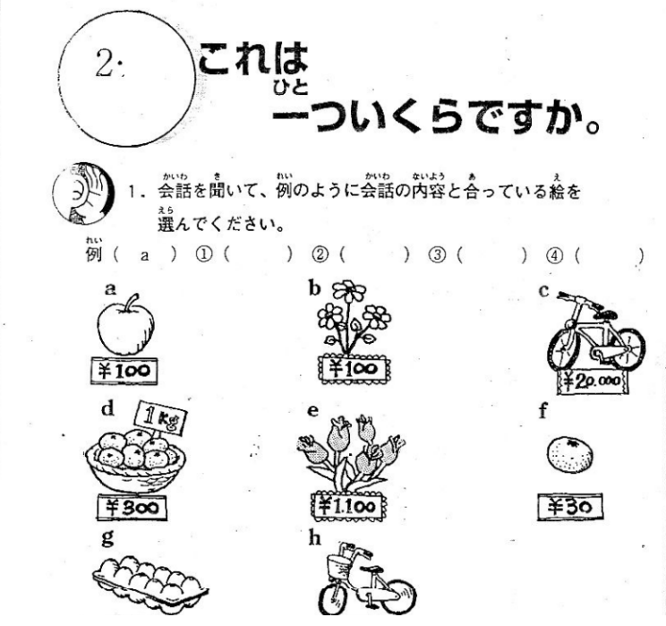
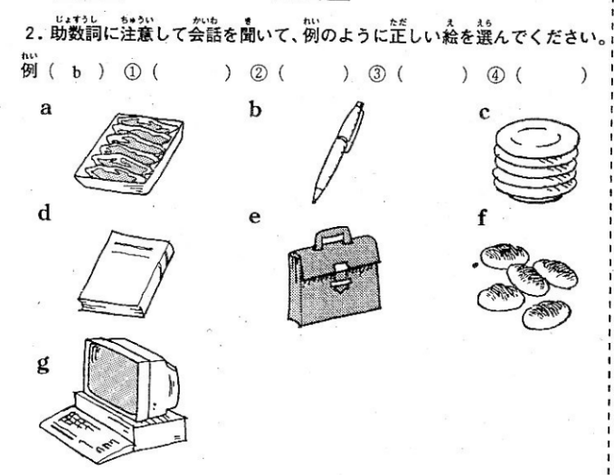
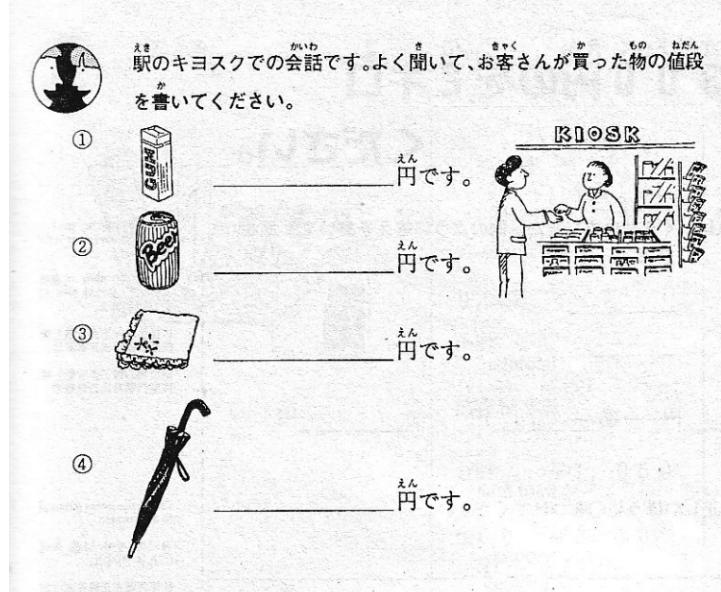
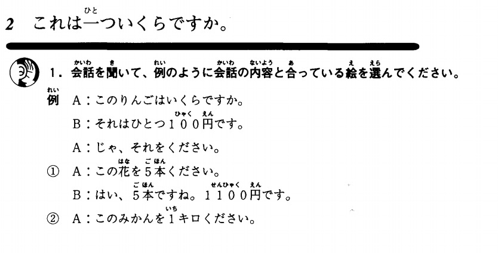
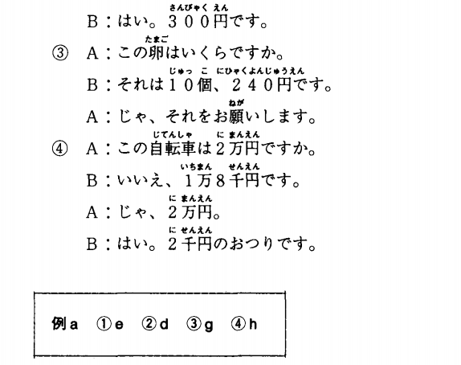
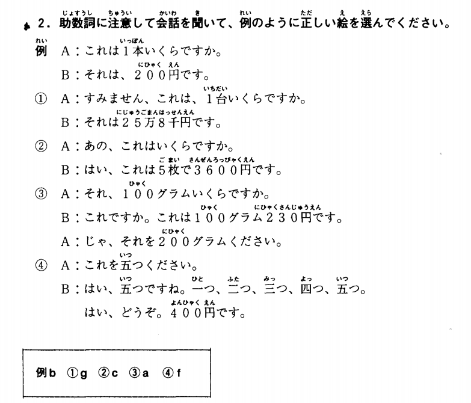
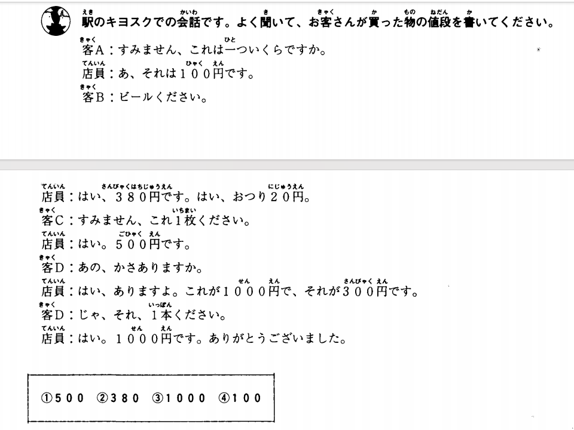

## Ｖるようにする＜目标＞

意义：表示设法做到（或不做）某件事，达到某种要求、目标。  
译文：注意······；力求······  
接续：动词的词典形或否定形式＋ようにする  
说明：常与「できるだけ、必ず、ちゃんと」等副词呼应使用。

```ts
(1)うがい薬も出しますから、できるだけうがいをするようにしてください。
我也会给你开漱口水，所以请尽量用漱口水漱口。
(2)今日からちゃんと予習と復習をするようにします。
从今天开始要好好预习和复习。
(3)約束の時間には遅れないようにしてください。
不要在约定的时间迟到。
(4)図書館では大きな声で話さないようにしましょう。
不要在图书馆大声说话。
(5)皆さんのやさしさを忘れないようにしたい。
不要忘记大家的温柔。
```

> ☞ 与「Ｖて/Ｖないで＋ください」相比，「Ｖる/Ｖない＋ようにしてください」表达的不是对一次性行为的命令、要求，而是偏重指习惯、日常的行为。

```ts
(6)ここにお名前を（書いてください/×書くようにしてください。）
```

## 練習 れんしゅう

```ts
1.请尽可能每天吃些蔬菜。
⇒できるだけ毎日野菜を食べるようにしてください。
2.日语课前请预习。
⇒日本語の授業の前に、予習するようにしてください。
```

## で＜时间量的限定＞

意义：表示对时间量的限定，即谓语动词所表示的变化或完成是在该时间量经过后出现的。  
译文：（时间量）就······  
接续：表示时间量的名词+で  
说明：动词一般表示变化或可能的含义。

```ts
(1)たぶん2、3日で熱は下がるでしょう。
也许两三天就能退烧。
(2)まず10分間でこの文章を読んでください。请在10分钟内读完这篇文章。
(3)あと1週間でこの工事は終わるだろう。
再过一个星期这个工程就要结束了吧。
(4)あの夫婦は結婚して半年で別れた。
那对夫妇结婚半年就分手了。
```

> ☞「で」还可以前接表达时间点的名词，意为持续的动作或状态以该时间点为界限结束。

```ts
(5)長い夏休みも明日で終わりです。
漫长的暑假明天就结束了。
(6)雪の影響により、図書館は16時で閉館いたします。
由于大雪，图书馆将在16时关门。
```

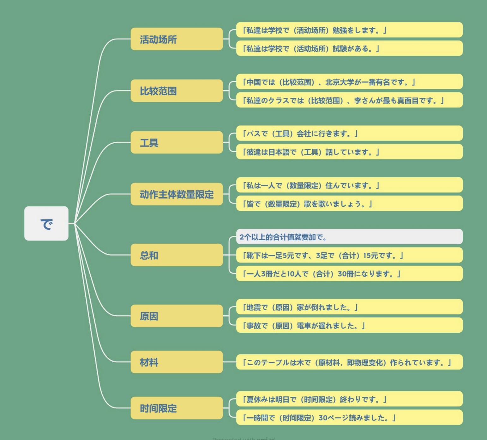

## 練習 れんしゅう

```ts
1. 半年就回国了。
⇒半年で国に帰った。
2. 3天就辞职了。
⇒三日で辞めた。
```

## N の/Ｖる/Ｖたとおり

意义：表示按照前述的动作、标准、要求等进行某动作。  
译文：按照······；正如······  
接续：动词的词典形+とおり  

```ts
(1)さっき言ったとおり、ちゃんと薬を飲んで、よく休んでくださいね。
就像刚才说的那样，好好吃药，好好休息。
(2)お医者さんが言うとおりにしてください。
按医生说的做。
(3)説明書のとおりに操作してください。
请按照说明书操作。
```

## 練習 れんしゅう

```ts
1.按照老师说的写了。
⇒先生が言ったとおり、書いた。
2.请按照录音的发音来练习。
⇒録音の発音のとおり、練習してください。
```

## 会話

<vue-plyr>
  <audio controls crossorigin playsinline loop>
    <source src="../audio/c/3-1-かいわ.mp3" type="audio/mp3" />
  </audio>
 </vue-plyr>

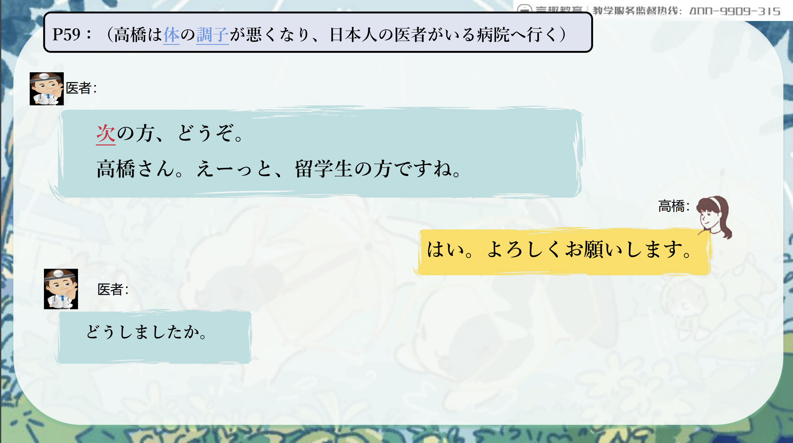
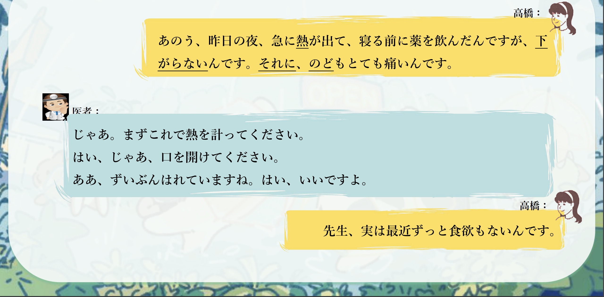

> こっか　国家　
> 過ぎる すぎる
> 左 ひだり
> 首都体育館 しゅとたいいくかん
> 正門（せいもん）学校的正门
> 6 時　ろくじ

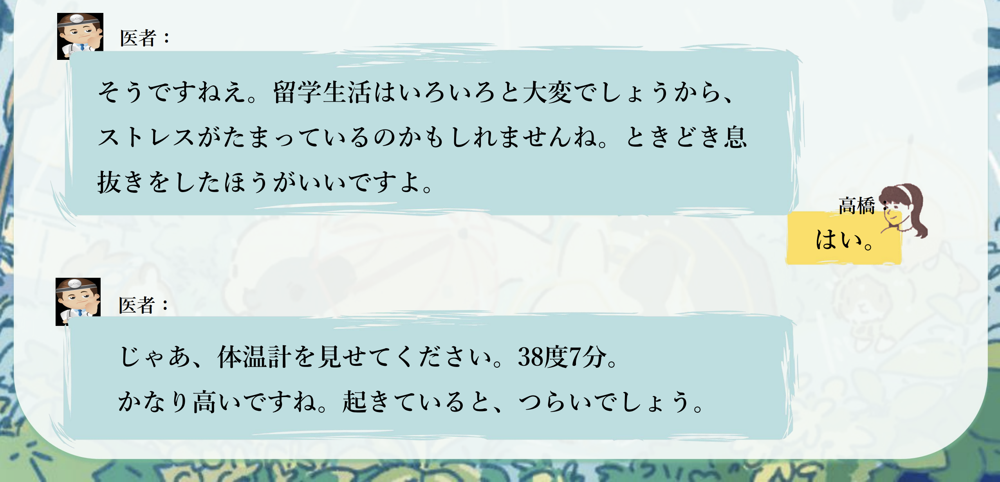
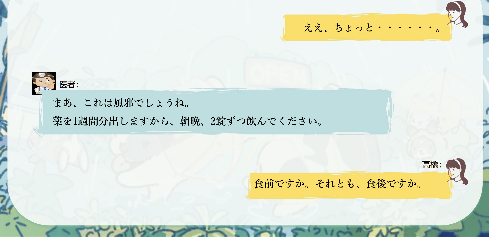
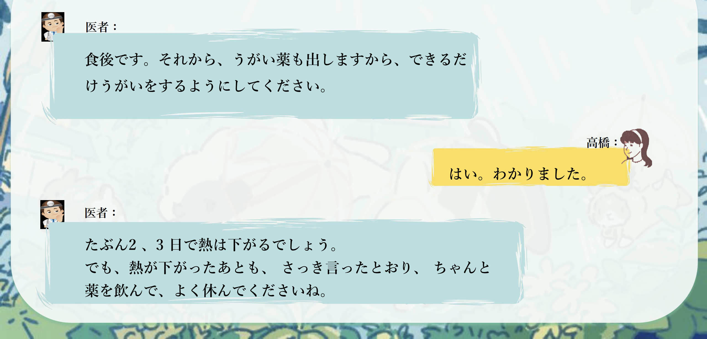
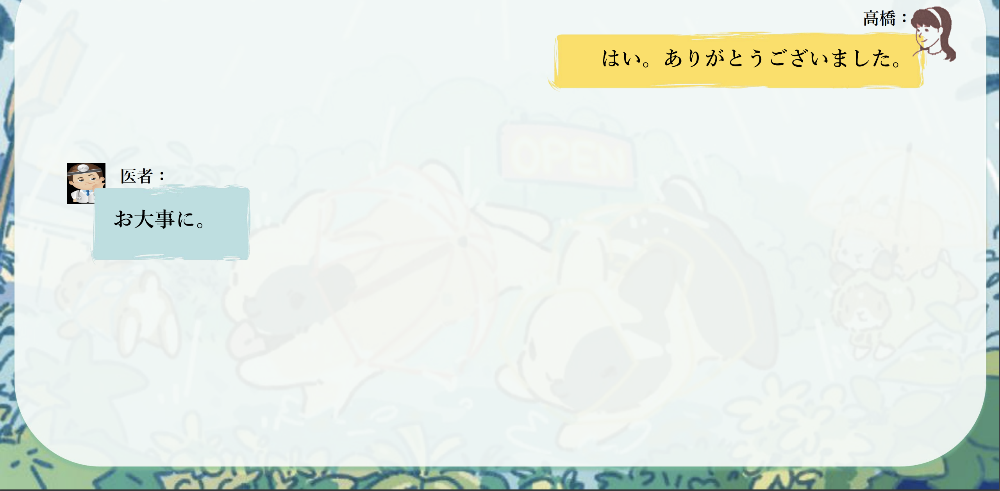
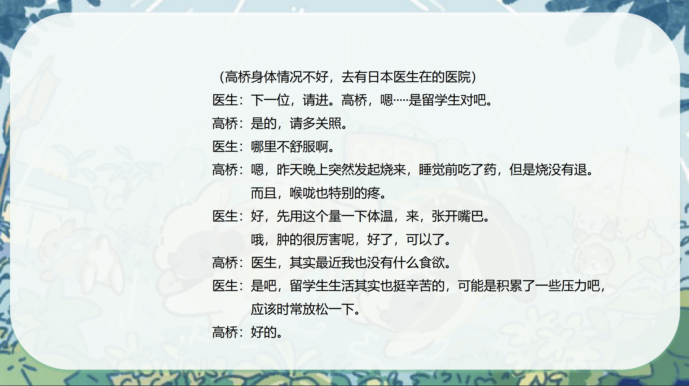
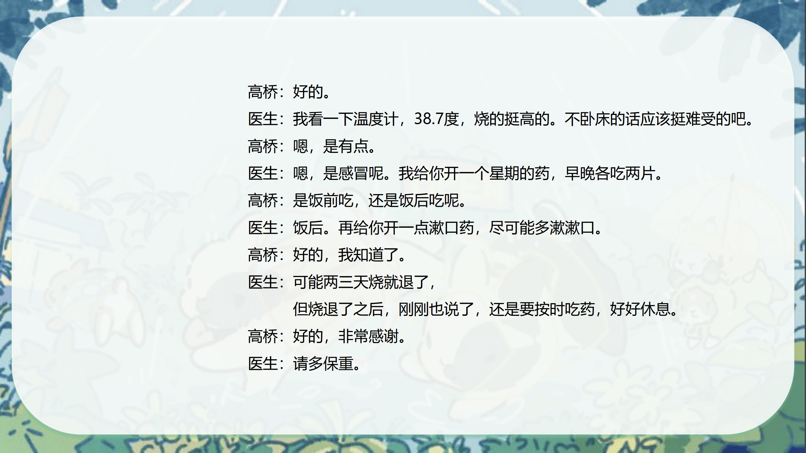
