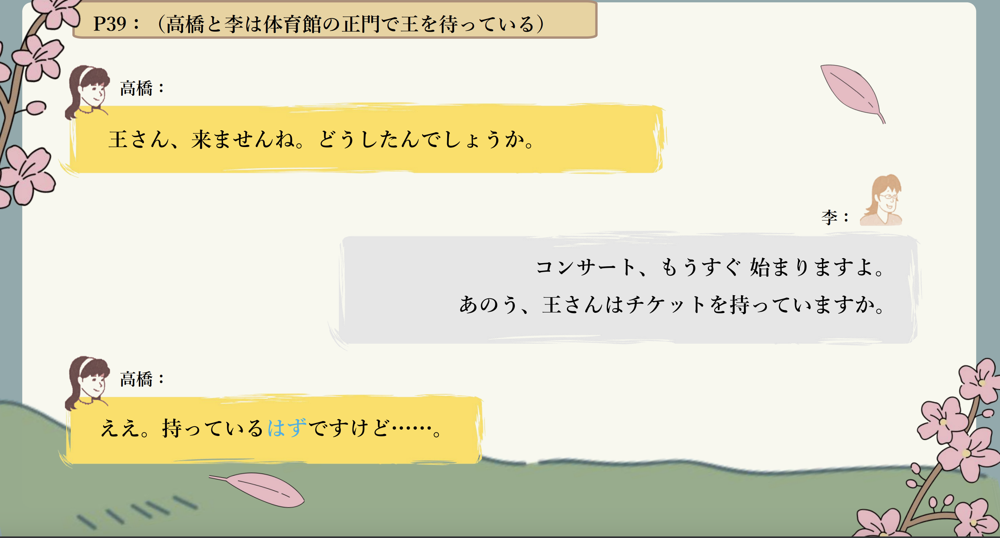
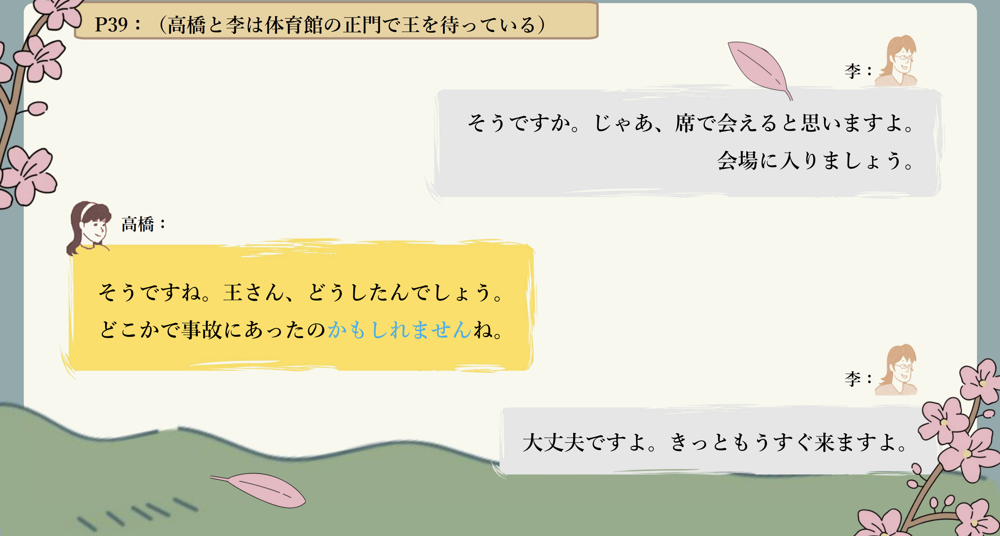
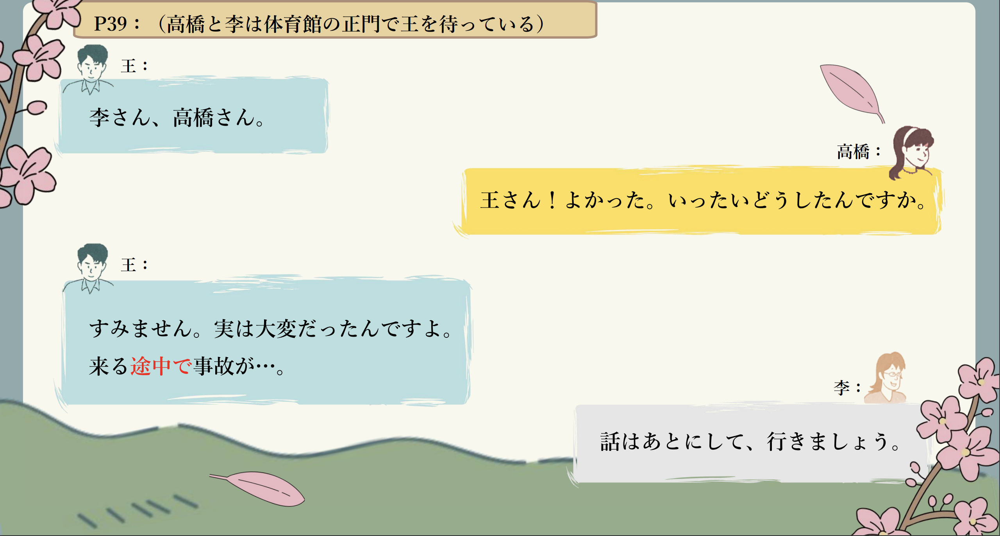
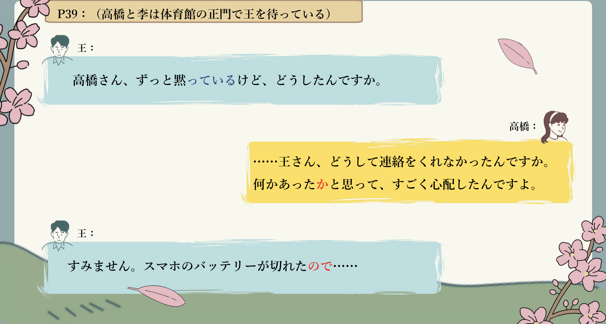
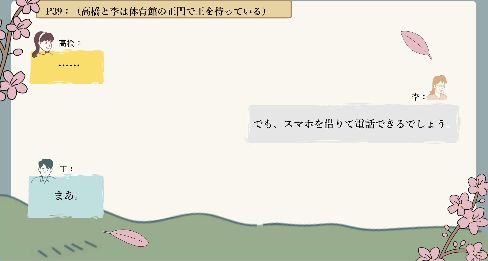
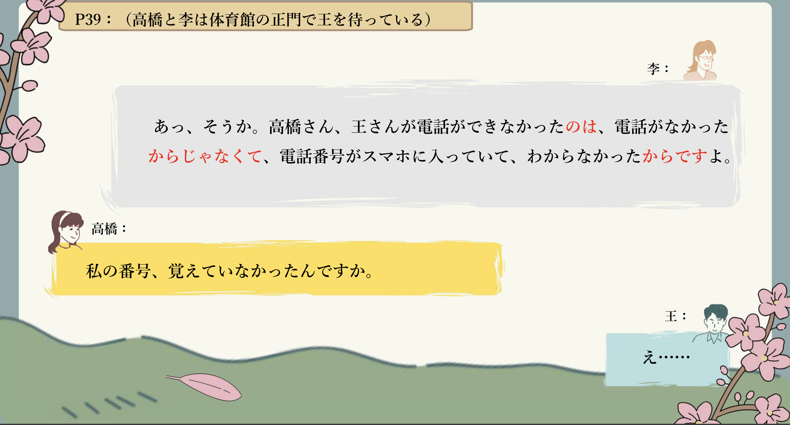
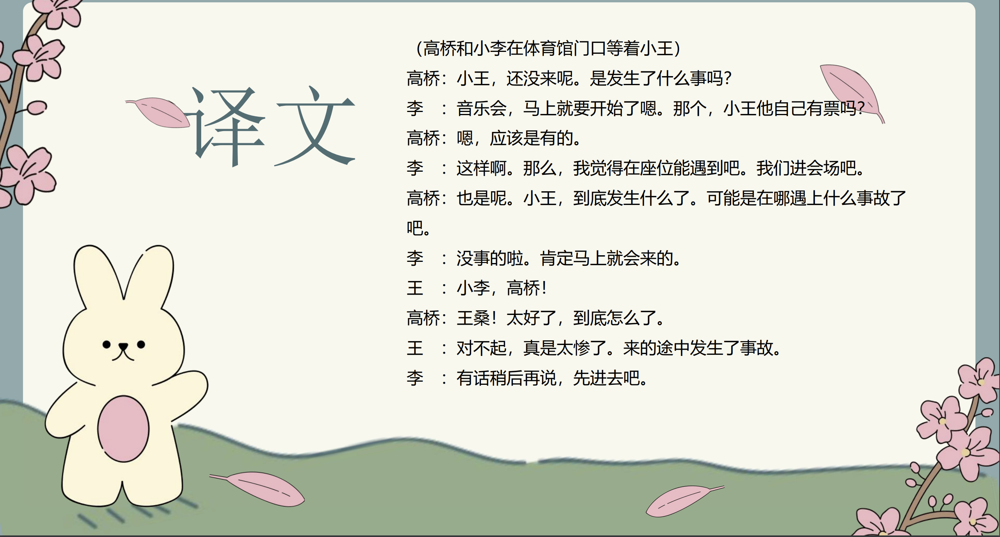
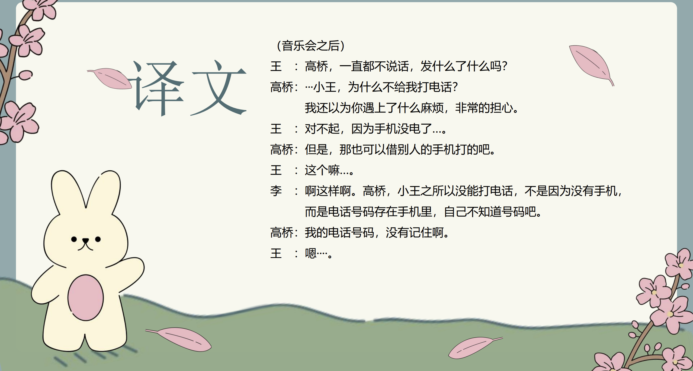

# ～と聞く＜间接引语＞......

## 新出単語

<vue-plyr>
  <audio controls crossorigin playsinline loop>
    <source src="../audio/c/3-2-たんご.mp3" type="audio/mp3" />
  </audio>
 </vue-plyr>

| 単語                                  | 词性            | 翻译                                       |
| ------------------------------------- | --------------- | ------------------------------------------ |
| お見舞い（<JpWord>おみまい</JpWord>） | ⓪ ＜名＞        | 看望；探视（礼貌说法）                     |
| <JpWord>ただいま</JpWord>             | ⓪②              | 我回来啦                                   |
| 頼む（<JpWord>たのむ</JpWord>）       | ② ＜他 Ⅰ ＞     | 请求；拜托                                 |
| <JpWord>ラッキー</JpWord>（lucky）    | ① ＜名・形 Ⅱ ＞ | 幸运                                       |
| <JpWord>おかげ</JpWord>               | ⓪ ＜名＞        | 承蒙；多亏                                 |
| 具合（<JpWord>ぐあい</JpWord>）       | ⓪ ＜名＞        | 身体状况；情况，状况                       |
| <JpWord>だいぶ</JpWord>〖大分〗       | ⓪ ＜副＞        | 相当，很                                   |
| 安心（<JpWord>あんしん</JpWord>）     | ⓪ ＜名・自 Ⅲ ＞ | 放心；安心                                 |
| <JpWord>おかゆ</JpWord>〖お粥〗       | ⓪ ＜名＞        | 粥；稀饭                                   |
| <JpWord>よかったら</JpWord>           | ①               | 如果可以的话；如果你不介意的话             |
| 冷める（<JpWord>さめる</JpWord>）     | ② ＜自 Ⅱ ＞     | 变冷；降低；减退                           |
| <JpWord>そうだ</JpWord>               | ① ＜名＞        | 对啦！（我想起来了）                       |
| <JpWord>このあいだ</JpWord>〖この間〗 | ⓪ ＜名＞        | 前不久，最近                               |
| <JpWord>もう</JpWord>                 | ① ＜副＞        | （表示事情发生得比预想得要早（快））这就要 |

## で＜原因、理由＞

意义：表示原因、理由。  
译文：因为······；因······  
接续：表示事件、事故、自然现象等的名词+で  
说明：主句只能叙述客观事实，不能使用建议、命令、主张等意志性的表达方式。

```ts
(1)高橋さんは病気で何日も授業を休んでいます。
 高桥因为生病，好几天没上课。
(2)事故でバスが遅れました。
 因为事故巴士晚点了。
(3)台風（たいふう）で電車が止まりました。
 因为台风，电车停运了。
```

## 練習 れんしゅう

```ts
1.因为感冒，高桥向学校请假了。
⇒風邪で、高橋さんは学校を休んでいた。
2.因为今天睡眠不足，头疼。【ねぶそく】
⇒今日は寝不足で、頭が痛い。
```

## ～と聞く＜间接引语＞

意义：间接引语，转述听到的内容。　　
译文：听说······，听到······　　
接续：简体句子＋と聞く

```ts
(1)高橋さんが病気で何日も授業を休んでいると聞いて、心配になって、、、。
 听说高桥因为生病请了好几天假，很担心，，，,。
(2)李さんは来年日本に行くと聞きましたが、本当ですか。
 听说小李明年要去日本，是真的吗
(3)あの店の料理がおいしいと聞きました。週末、食べに行きましょう。
 听说那家店的菜很
```

## 練習 れんしゅう

```ts
1.从小王那里听说了小李的日语非常好。练习
⇒王さんから李さんは日本語が上手だと聞いた。　
2. 从渡边那里听说了高桥的病已经治好了。「なおる」
⇒渡辺さんから高橋さんは病気が治ったと聞いた
```

## 动词、形容词的第二连用形

意义：表示轻微的原因或理由。　　
译文：因为······　　
接续：Ⅴ て／A1 くて／A2 で（＋主句）　　
说明：主句只能叙述客观事实，不能用于建议、命令、主张、愿望等表达方式。

```ts
(1)高橋さんが病気で何日も授業を休んでいると聞いて、心配になって、、、。
听说高桥因为生病请了好几天假，很担心，，，,。
(2)行きたいんですが、仕事があって行けません。
我想去，但是有工作不能去。
(3)タクシーがなかなか来なくて困りました。
出租车怎么也来不了，很烦。
(4)道がわからなくて何度も人に聞かなければなりませんでした。
因为不知道路，不得不多次问别人。
(5)部屋が狭くて、大きい机が置けません。
房间太小，放不下大桌子。
(6)予習復習が大変で、全然遊ぶ時間がない。
预习复习很辛苦，根本没有玩的时间。
```

> ☞ 注意下面句子中「Ⅴ て」的用法是错误的。

```ts
(7)今日は｛✖疲れて／〇疲れたから｝、早く寝たい
```

> 全部都是接在原因后，只是接续方式不一样。  
> Ｓ＋から・ので  
> Ｖて、Ａて、Ｎで

```ts
1. 雨で運動会は中止した。
2. 雨が降って、運動会は中止した。
3. 雨が大きくて、運動会は中止した。
4. 雨が降っているから、運動会は中止した。（一般表达主观原因）
5. 雨が降っているので、運動会は中止した。全部都是接在原因后，只是接续方式不一样。Ｓ＋から・ので
```

## 練習 れんしゅう

```ts
1.牙疼，所以吃不下饭。
练习⇒歯が痛くて、ご飯が食べられない。
2.从男朋友那里收到了花，很开心。
⇒彼氏から花をもらって、嬉しい。
```

## もう＜加强语义＞

意义：对后面的动词起到加强语义的作用，带有说话人吃惊或感叹的语气。  
译文：就要~~ ；这就~~快要~~  
接续：もう＋动词

```ts
(1)王：しゃあ、僕はこれで、、、。渡辺：えっ、もう帰るんですか。
王：哎呀，我这就。 渡边：啊，已经回去了吗。
(2)A：そろそろ出かけます。
B：えっ、もう出かけるんですか。約束の時間の２時間も前ですよ。
A：我该走了。B：啊，已经要出门了吗。约好的时间还有2个小时呢。
(3)もう休憩するんですか。練習を始めてから、まだ15分ですよ。
已经要休息了吗。才开始练习15分钟。
```


## 会話

<vue-plyr>
  <audio controls crossorigin playsinline loop>
    <source src="../audio/c/2-2-かいわ.mp3" type="audio/mp3" />
  </audio>
 </vue-plyr>









