# ～と聞く＜间接引语＞......

## 新出単語

<vue-plyr>
  <audio controls crossorigin playsinline loop>
    <source src="../audio/c/3-2-たんご.mp3" type="audio/mp3" />
  </audio>
 </vue-plyr>

| 単語                                   | 词性              | 翻译                                         |
| -------------------------------------- | ----------------- | -------------------------------------------- |
| お見舞い（<JpWord>おみまい</JpWord>）  | ⓪ ＜名＞          | 看望；探视（礼貌说法）                       |
| <JpWord>ただいま</JpWord>              | ⓪②                | 我回来啦                                     |
| 頼む（<JpWord>たのむ</JpWord>）        | ② ＜他 Ⅰ ＞       | 请求；拜托                                   |
| <JpWord>ラッキー</JpWord>（lucky）     | ① ＜名・形 Ⅱ ＞   | 幸运                                         |
| <JpWord>おかげ</JpWord>                | ⓪ ＜名＞          | 承蒙；多亏                                   |
| 具合（<JpWord>ぐあい</JpWord>）        | ⓪ ＜名＞          | 身体状况；情况，状况                         |
| <JpWord>だいぶ</JpWord>〖大分〗        | ⓪ ＜副＞          | 相当，很                                     |
| 安心（<JpWord>あんしん</JpWord>）      | ⓪ ＜名・自 Ⅲ ＞   | 放心；安心                                   |
| <JpWord>おかゆ</JpWord>〖お粥〗        | ⓪ ＜名＞          | 粥；稀饭                                     |
| <JpWord>よかったら</JpWord>            | ①                 | 如果可以的话；如果你不介意的话               |
| 冷める（<JpWord>さめる</JpWord>）      | ② ＜自 Ⅱ ＞       | 变冷；降低；减退                             |
| <JpWord>そうだ</JpWord>                | ① ＜名＞          | 对啦！（我想起来了）                         |
| <JpWord>このあいだ</JpWord>〖この間〗  | ⓪ ＜名＞          | 前不久，最近                                 |
| <JpWord>もう</JpWord>                  | ① ＜副＞          | （表示事情发生得比预想得要早（快））这就要   |
| 謝る（<JpWord>あやまる</JpWord> ）     | ③ ＜自 Ⅰ ＞       | 道歉；赔罪                                   |
| 寝不足（<JpWord>ねぶそく</JpWord> ）   | ⓪② ＜名＞         | 睡眠不足；缺觉                               |
| 重い（<JpWord>おもい</JpWord> ）       | ⓪ ＜形 Ⅰ ＞       | 重（的）；沉重（的）                         |
| 返事（<JpWord>へんじ</JpWord> ）       | ③ ＜名・自 Ⅲ ＞   | 回信；回答；答复                             |
| 成績（<JpWord>せいせき</JpWord> ）     | ⓪ ＜名＞          | 成绩                                         |
| 火事（<JpWord>かじ</JpWord> ）         | ① ＜名＞          | 火灾；着火                                   |
| 彼氏（<JpWord>かれし</JpWord> ）       | ① ＜名＞          | 男朋友                                       |
| 休講（<JpWord>きゅうこう</JpWord> ）   | ⓪ ＜名・自他 Ⅲ ＞ | 停课                                         |
| 合宿（<JpWord>がっしゅく</JpWord> ）   | ⓪ ＜名・自 Ⅲ ＞   | 集训;(班级等以研修为目的)外出住宿            |
| 治る（<JpWord>なおる</JpWord> ）       | ② ＜自 Ⅰ ＞       | 治好；痊愈                                   |
| 講演（<JpWord>こうえん</JpWord> ）     | ⓪ ＜名・自 Ⅲ ＞   | 演讲                                         |
| 天ぷら（<JpWord>てんぷら</JpWord> ）   | ⓪ ＜名＞          | (葡萄牙语 tempero 的译词)油炸食品            |
| 受付（<JpWord>うけつけ</JpWord> ）     | ⓪ ＜名＞          | (医院、诊所等)挂号处；前台接待处；受理；接受 |
| 回復（<JpWord>かいふく</JpWord> ）     | ⓪ ＜名・自 Ⅲ ＞   | 康复；恢复；复原                             |
| 豊か（<JpWord>ゆたか</JpWord> ）       | ① ＜形 Ⅱ ＞       | 丰富（的）                                   |
| 育つ（<JpWord>そだつ</JpWord> ）       | ② ＜自 Ⅰ ＞       | 成长；养育                                   |
| <JpWord>イワシ</JpWord>                | ⓪ ＜名＞          | 沙丁鱼                                       |
| 子育て（<JpWord>こそだて</JpWord> ）   | ② ＜名＞          | 育儿                                         |
| <JpWord>サポート</JpWord> （support）  | ② ＜名・他 Ⅲ ＞   | 支援；支持                                   |
| 育児（<JpWord>いくじ</JpWord>          | ）① ＜名＞        | 育儿                                         |
| 両立（<JpWord>りょうりつ</JpWord> ）   | ⓪ ＜名・自 Ⅲ ＞   | 平衡；兼顾                                   |
| 出かける（<JpWord>でかける</JpWord> ） | ⓪ ＜自 Ⅱ ＞       | 外出；出门；到外面去                         |
| お詫び（<JpWord>おわび</JpWord> ）     | ⓪ ＜名＞          | 道歉                                         |
| お礼（<JpWord>おれい</JpWord> ）       | ⓪ ＜名＞          | 感谢；酬谢；谢辞                             |
| 感謝（<JpWord>かんしゃ</JpWord> ）     | ① ＜名・自 Ⅲ ＞   | 感谢                                         |
| 全員（<JpWord>ぜんいん</JpWord> ）     | ⓪ ＜名＞          | 全员，所有人                                 |

## で＜原因、理由＞

意义：表示原因、理由。  
译文：因为······；因······  
接续：表示事件、事故、自然现象等的名词+で  
说明：主句只能叙述客观事实，不能使用建议、命令、主张等意志性的表达方式。

```ts
(1)高橋さんは病気で何日も授業を休んでいます。
 高桥因为生病，好几天没上课。
(2)事故でバスが遅れました。
 因为事故巴士晚点了。
(3)台風（たいふう）で電車が止まりました。
 因为台风，电车停运了。
```

## 練習 れんしゅう

```ts
1.因为感冒，高桥向学校请假了。
⇒風邪で、高橋さんは学校を休んでいた。
2.因为今天睡眠不足，头疼。【ねぶそく】
⇒今日は寝不足で、頭が痛い。
```

## ～と聞く＜间接引语＞

意义：间接引语，转述听到的内容。　　
译文：听说······，听到······　　
接续：简体句子＋と聞く

```ts
(1)高橋さんが病気で何日も授業を休んでいると聞いて、心配になって、、、。
 听说高桥因为生病请了好几天假，很担心，，，,。
(2)李さんは来年日本に行くと聞きましたが、本当ですか。
 听说小李明年要去日本，是真的吗
(3)あの店の料理がおいしいと聞きました。週末、食べに行きましょう。
 听说那家店的菜很
```

## 練習 れんしゅう

```ts
1.从小王那里听说了小李的日语非常好。练习
⇒王さんから李さんは日本語が上手だと聞いた。　
2. 从渡边那里听说了高桥的病已经治好了。「なおる」
⇒渡辺さんから高橋さんは病気が治ったと聞いた
```

## 动词、形容词的第二连用形

意义：表示轻微的原因或理由。　　
译文：因为······　　
接续：Ⅴ て／A1 くて／A2 で（＋主句）　　
说明：主句只能叙述客观事实，不能用于建议、命令、主张、愿望等表达方式。

```ts
(1)高橋さんが病気で何日も授業を休んでいると聞いて、心配になって、、、。
听说高桥因为生病请了好几天假，很担心，，，,。
(2)行きたいんですが、仕事があって行けません。
我想去，但是有工作不能去。
(3)タクシーがなかなか来なくて困りました。
出租车怎么也来不了，很烦。
(4)道がわからなくて何度も人に聞かなければなりませんでした。
因为不知道路，不得不多次问别人。
(5)部屋が狭くて、大きい机が置けません。
房间太小，放不下大桌子。
(6)予習復習が大変で、全然遊ぶ時間がない。
预习复习很辛苦，根本没有玩的时间。
```

> ☞ 注意下面句子中「Ⅴ て」的用法是错误的。

```ts
(7)今日は｛✖疲れて／〇疲れたから｝、早く寝たい
```

> 全部都是接在原因后，只是接续方式不一样。  
> Ｓ＋から・ので  
> Ｖて、Ａて、Ｎで

```ts
1. 雨で運動会は中止した。
2. 雨が降って、運動会は中止した。
3. 雨が大きくて、運動会は中止した。
4. 雨が降っているから、運動会は中止した。（一般表达主观原因）
5. 雨が降っているので、運動会は中止した。全部都是接在原因后，只是接续方式不一样。Ｓ＋から・ので
```

## 練習 れんしゅう

```ts
1.牙疼，所以吃不下饭。
练习⇒歯が痛くて、ご飯が食べられない。
2.从男朋友那里收到了花，很开心。
⇒彼氏から花をもらって、嬉しい。
```

## もう＜加强语义＞

意义：对后面的动词起到加强语义的作用，带有说话人吃惊或感叹的语气。  
译文：就要~~ ；这就~~快要~~  
接续：もう＋动词

```ts
(1)王：しゃあ、僕はこれで、、、。渡辺：えっ、もう帰るんですか。
王：哎呀，我这就。 渡边：啊，已经回去了吗。
(2)A：そろそろ出かけます。
B：えっ、もう出かけるんですか。約束の時間の２時間も前ですよ。
A：我该走了。B：啊，已经要出门了吗。约好的时间还有2个小时呢。
(3)もう休憩するんですか。練習を始めてから、まだ15分ですよ。
已经要休息了吗。才开始练习15分钟。
```

> 物品授受动词（授受双方是否与我有远近关系）
> あげる：我（他人）给他人什么。

```ts
(1) 我给了妈妈花。
⇒私は母に花をあげました。
(2) 小王给了小李书。
⇒王さんは李さんに本をあげました。
```

> 物品授受动词（授受双方是否与我有远近关系）
> もらう：我（他人）从他人那里得到什么。（一般不说从我（我方）得到）

```ts
(1) 我（小李）从小王那里得到了花。
⇒私（李さん）は王さんから（に）花をもらいました。
```

> 物品授受动词（授受双方是否与我有远近关系）  
> くれる：他人给我（我方）什么。

```ts
(1) 高桥给了我衣服。
⇒高橋さんは私に服をくれました。
(2) 高桥给了我妈妈衣服。
⇒高橋さんは母に服をくれました。
```

## Ⅴ てくれる／あげる／もらう

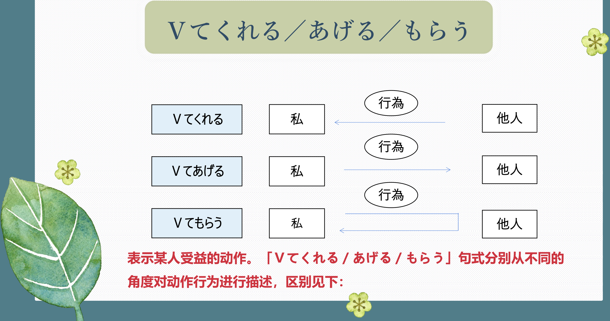
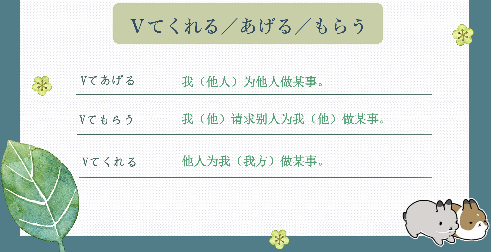

## V てあげる 我（他人）为他人做某事。

意义：表示自己或属于自己一方的人为别人做某事，或某人为其他人做某事。  
译文：我为别人······；某人为某人······  
接续：（私が他人に）Ⅴ て＋あげる  
说明：「Ⅴ てあげる」有施恩于人的语感，在对话中应避免直接用于身份地位高于自己的人。

```ts
(1)私は観光客に道を教えてあげました。
我给游客指了路。
(2)張さんは李さんにペンを貸してあげました。
小张把笔借给了小李。
(3)高橋さんは王さんにおいしいご飯を作ってあげました。
高桥给小王做了好吃的饭。
```

> 往往语感中就包含一种“恩赐给与”“授予者对接受者亲切”的语感。对象多是熟悉的人，平辈等。

```ts
(1)✿仕事のあと、彼氏に焼肉を作ってあげました。
工作之后 ，我给男朋友做烧烤。
(2)✿李さん、荷物を持ってあげますよ。
小李，我帮你拎行李吧。
```

## V てもらう 我（他）请求别人为我（他）做某事。

意义：表示自己请别人或委托别人做某事。  
译文：我请别人······；我让别人······
接续：（私が他人に）Ⅴ て＋もらう  
说明：一般用「～に Ⅴ てもらう」，当谓语为「貸す、教える」等表示出借、传授意义的动词时，也可用「から貸してもらう／教えてもらう」。

```ts
(1)私は子供のとき、よく母に映画館に連れていってもらいました。
我小时候，妈妈经常带我去电影院。
(2)私は昨日授業を休んだので、友達にノートを見せてもらいました。
因为我昨天没去上课，所以朋友给我看了笔记本。
(3)田中さんからパーティーのことについて教えてもらいました。
田中先生告诉了我关于聚会的事情。
```

> 往往语感中就包含一种“请求别人为我~~~”“表示请求、承蒙”的语感。

```ts
(1)✿分からないことがある時は先輩に教えてもらいます。
有不懂的地方时，我就请教师哥师姐。
(2)✿買う金がないから、友だちに本を貸してもらおうと思います。
因为没钱买，所以我想请朋友把书借给我看。
```

## V てくれる 他人为我（我方）做某事。

意义：表示别人为自己或属于自己一方的人做某事，或者表示对方的行为使得自己受益。  
译文：别人为我······  
接续：（他人が私に）Ⅴ て＋くれる  
说明：包含感激的心情。「私に」常常可以省略。

```ts
(1)それで来てくれたんですか。
这就是你来的原因吗。
(2)父は（私に）カメラを買ってくれました。
爸爸给我买了相机。
(3)日本人の友達が（私の）作文を直してくれました。
日本朋友帮我修改了作文。
(4)王さん、コンサートに誘ってくれてありがとう。
小王，谢谢你邀请我去听音乐会。
```

> 往往语感中就包含一种“别人为我做~~~”“表示感谢”的语感。对象多是熟悉的人，平辈等。

```ts
(1)✿友だちが私たちに旅行の写真を見せてくれました。
朋友给我们看了他旅行时拍的照片。
(2)✿友だちは私を待ってくれました。
朋友等我。
```

> ☞ 这一系列句型强调进行对对方有益的动作，相当于“为某人······”“替某人······做某事”。这与单纯表示动作方向的“给某人······”是不同的。

```ts
（A）妹の部屋を見た。 （我看了妹妹的房间。）
妹の宿題を見てあげた。 （我为妹妹检查了作业。）
（B）王さんが来た。 （小王来了。）
王さんが来てくれた。 （小王来看我了。）
```

## 練習 れんしゅう

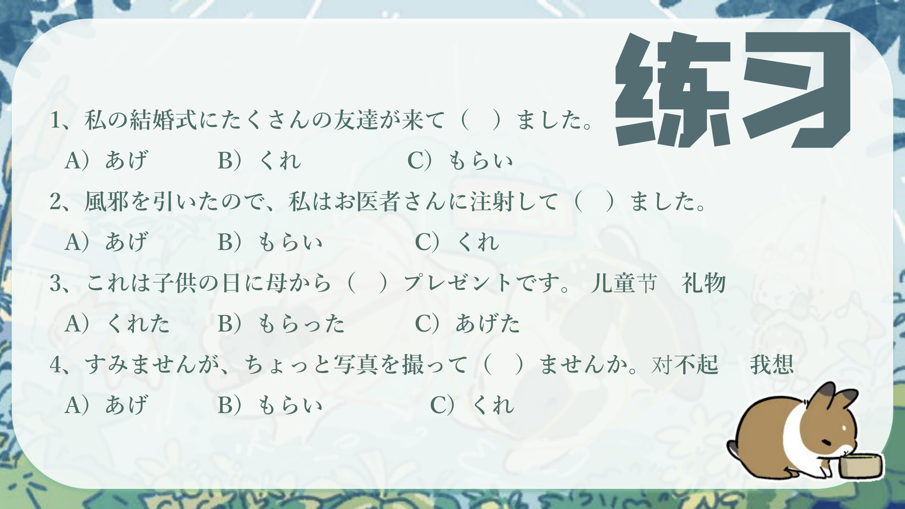

```ts
1.朋友要送给我意大利的杂志。
⇒友達が私にイタリアの雑誌を送ってくれる。
2.我要教朋友这个汉字的读音。
⇒私が友達にこの漢字の読み方を教えてあげる。
3.我拜托朋友让我看看那张照片了。（見せる）
⇒私が友達にその写真を見せてもらった。
```

## Ⅴ たら～た＜确定条件＞

意义：表示确定的或一次性的前后依存关系。  
译文：一~就~；~之后（竟然）就~  
接续：Ｖた+たら  
说明：主句动作要在从句动作、变化的基础上发生，即从句的情况发生在先，主句的动作进行在后。常用于表示意外性的结果。

```ts
(1)よく説明したら、入れてもらえました。
经过详细说明，我被录取了。
(2) 本屋へ雑誌を買いに行ったら、高校時代の友達に会って、びっくりした。
去书店买杂志的时候，遇到了高中时代的朋友，吓了一跳。
(3) 駅に着いたら、電車はもう来ていました。
到了车站，电车已经来了。
(4) 昼は暑かったのですが、夜になったら、寒くなりました。
白天很热，到了晚上就变冷了。
```

## 練習 れんしゅう

```ts
1.去博物馆之后，发现今天竟然休息。
⇒博物館に行ったら、今日は休んでいた。
2.今早起床之后，发现竟然正在下雪。
⇒今朝、起きたら、雪が降っていた。
```


## ～おかげで／～おかげだ

意义：表示引发积极结果的原因。  
译文：多亏~~；幸亏~~；托~~的福  
接续：名词＋の／动词、形容词连体形＋おかげで／だ  

```ts
(1)本当に渡辺さんのおかげです。 
真是多亏了渡边先生。
(2)高橋さんのおかげで、日本語が上手になりました。 
多亏了高桥，我的日语变好了。
(3) みなんが頑張ってくれたおかげで、試合で優勝しました。
多亏了大家的努力，在比赛中获得了优胜。
(4)成績がよかったおかげで、奨学金（しょうがくきん）をもらえました。
 因为成绩好，所以拿到了奖学金。
(5)体調がよくなったのは、たばことお酒をやめたおかげです。 
 身体状况好转是因为戒了烟和酒。
```

> ☞「～おかげ」有时也可用于反语、表示讽刺的话语效果。

```ts
(6)君のおかげで、先生におこられた。【被批评】
 都怪你，我被老师骂了。
```

## 練習 れんしゅう

```ts
1. 多亏了丰富的水，培育出了美味的大米。// 「豊かな水」「こめ」「育つ」
⇒豊かな水のおかげで、おいしい米が育った。
2.多亏老师表扬了我，我有了自信。// 「ほめる」
⇒先生が褒めてくれたおかげで、自信があった。
```


## ～うちに＜时间范围＞

意义：表示在某状态持续的时间范围内，尽快进行后叙的动作。  
译文：趁着······；······时候  
接续：动词的词典形／Ⅴている／Ⅴない＋うちに 形容词的连体形＋うちに 名词＋の＋うちに  
说明：主句的句末一般为命令、要求、愿望、劝诱、意图等表达方式  

```ts
(1)冷めないうちに食べてください。 
请在它冷却之前食用。
(2)中国にいるうちに、一度京劇を見てみたい。 
在中国的时候，想看一次京剧。
(3)友達がアメリカに留学しているうちに、遊びに行きたい。 
想趁朋友在美国留学的时候去玩
(4)忘れないうちにメモしてください。 
请在忘记之前记下来。
(5)若いうちにやりたいことをやったほうがいい。 
年轻的时候做自己想做的事情比较好。
(6)元気なうちに、あちこち旅行してみたいと思います。 
我想趁着身体还好的时候到处旅行一下。
(7)学生のうちにたくさん本を読んでください。
请在学生时期多读书。
```

## 練習 れんしゅう

```ts
1.趁着休息，做大扫除。
⇒暇なうちに、大掃除をする。
2.趁着还没有忘记，做下笔记会比较好哟。
⇒忘れないうちに、メモをしたほうがいい。
```

## 会話

<vue-plyr>
  <audio controls crossorigin playsinline loop>
    <source src="../audio/c/3-2-かいわ.mp3" type="audio/mp3" />
  </audio>
 </vue-plyr>

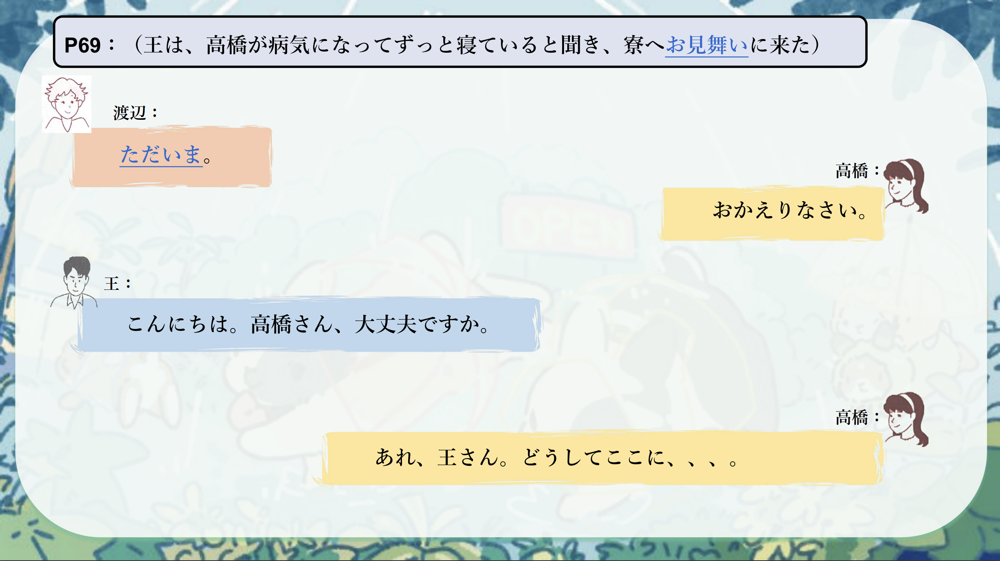
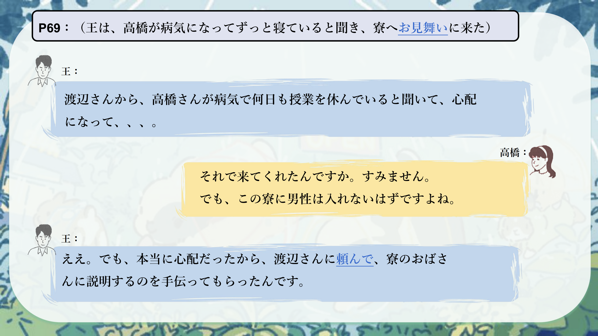
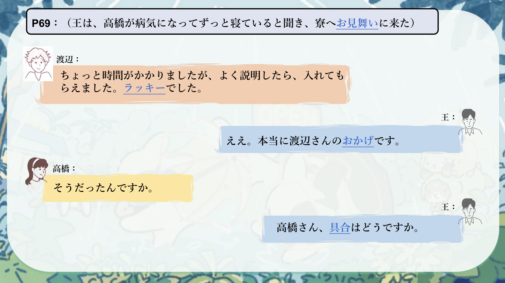
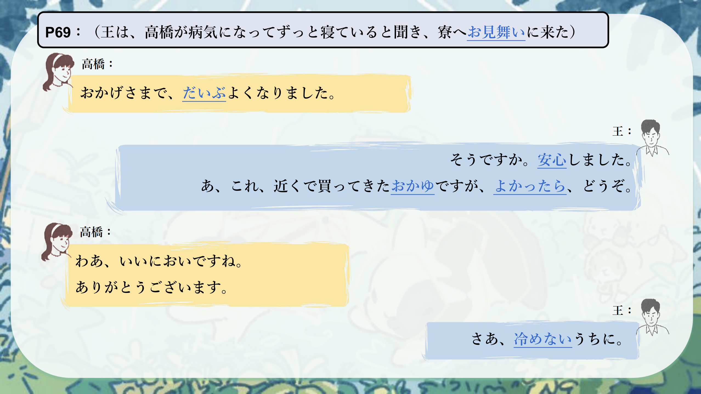
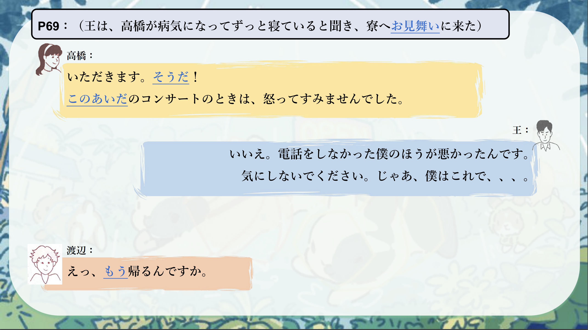
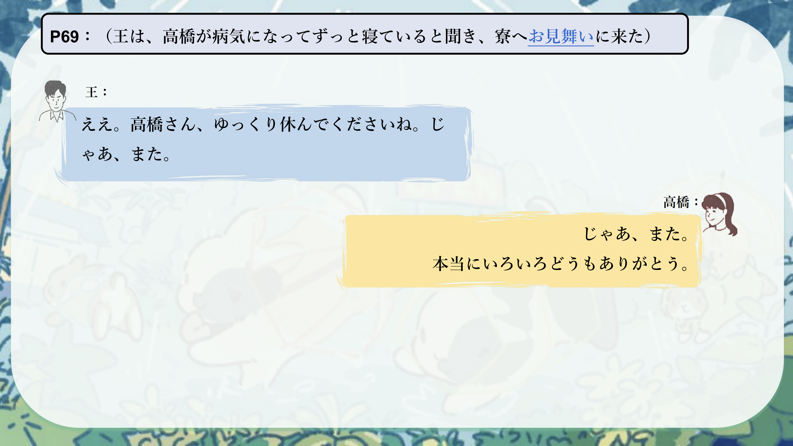
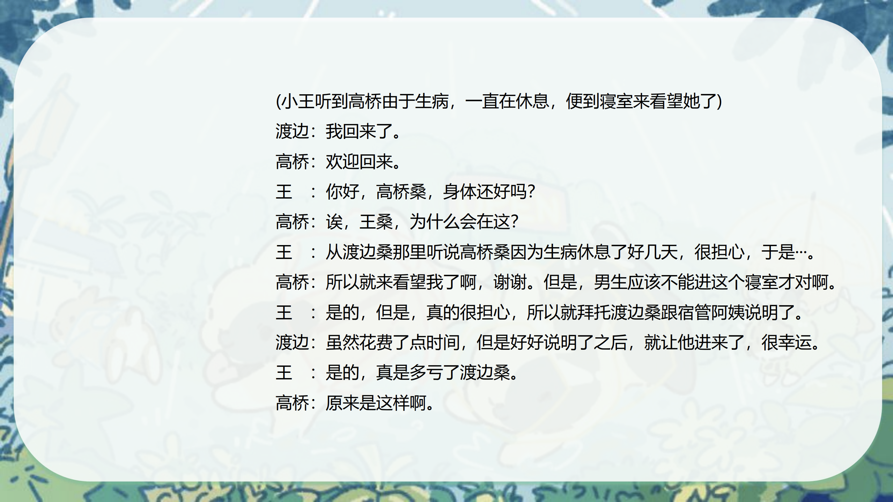
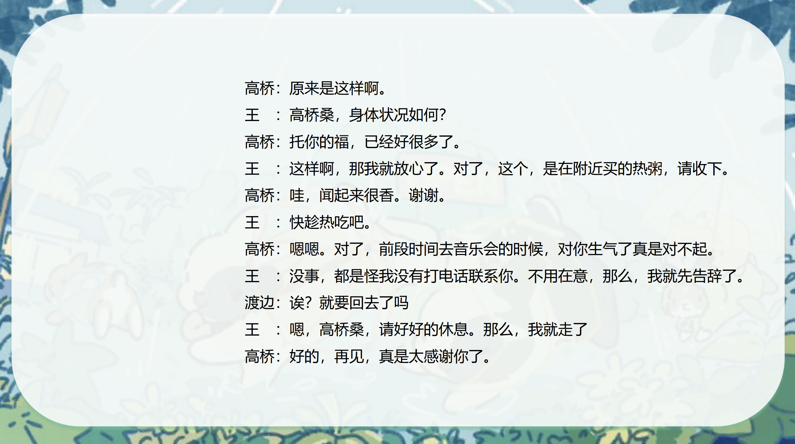
