# くださる...

## 新出単語

<vue-plyr>
  <audio controls crossorigin playsinline loop>
    <source src="../audio/c/3-3-たんご.mp3" type="audio/mp3" />
  </audio>
 </vue-plyr>
 
| 単語                                     | 词性                  | 翻译                                                           |
| ---------------------------------------- | --------------------- | -------------------------------------------------------------- |
| 今まで（<JpWord>いままで</JpWord>）| ③＜名・副＞| 迄今为止；过去| 
|  <JpWord>だるい</JpWord>| ＜形Ⅰ＞②| 乏力；酸痛| 
| <JpWord>このまま</JpWord>| ＜名・副＞④⓪| 照着这种状态；照这种情形| 
|  効く（<JpWord>きく</JpWord>）| ⓪＜自Ⅰ＞| 有效果；管用；灵| 
| 完全（<JpWord>かんぜん</JpWord>）| ⓪＜名・形Ⅱ＞| 完全| 
| <JpWord>とりもどす</JpWord>〖取り戻す〗| ④⓪＜他Ⅰ＞| 恢复；夺回；抢回；拿回；找回| 
| 支える（<JpWord>ささえる</JpWord>）| ⓪③＜他Ⅱ＞| 支；支持；支撑| 
| 気がつく（<JpWord>きが付く</JpWord>）| ③＜自Ⅰ＞| 注意；发现| 
| 励ます（<JpWord>はげます</JpWord>）| ③＜他Ⅰ＞| 鼓励| 
| <JpWord>ひどい</JpWord>| ②＜形Ⅰ＞| 严重；过分；差劲| 
| 看病（<JpWord>かんびょう</JpWord>）| ①＜名・他Ⅲ＞| 看护病人；照顾病人| 
|  退屈（<JpWord>たいくつ</JpWord>）| ⓪＜名・形Ⅱ・自Ⅲ＞| 无聊；没意思；枯燥无味| 
| ネット番組（<JpWord>netばんぐみ</JpWord>）| ④＜名＞| 网络节目| 
|  一番（<JpWord>いちばん</JpWord>）| ②＜名・副＞| 最先；第一~番（～ばん）＜接尾＞：第~；~号| 
| 涙（<JpWord>なみだ</JpWord>）| ①＜名＞| 眼泪| 
| 温かい（<JpWord>あたたかい</JpWord>）| ④＜形Ⅰ＞| 温暖（的）；温热（的）| 
| <JpWord>しみじみ</JpWord>| ③＜副＞| 痛切；深切| 
| 症状（<JpWord>しょうじょう</JpWord>）| ③⓪＜名＞| 症状| 
| <JpWord>くださる</JpWord>| ③＜他Ⅰ＞| (「くれる」的尊他说法)送(我、我们)；给(我、我们)| 
| <JpWord>さしあげる</JpWord>〖差し上げる〗| ⓪④＜他Ⅱ＞| (「あげる」的尊敬说法)给；呈送；敬献| 
| <JpWord>アドバイス</JpWord>（advice）| ①③＜名・自Ⅲ＞| 建议| 
| 原稿（<JpWord>げんこう</JpWord>）| ⓪＜名＞| 原稿| 
| 直す（<JpWord>なおす</JpWord>）| ②＜他Ⅰ＞| 订正，修改；修理| 
| フ<JpWord>ァッション</JpWord>（fashion）| ①＜名＞| 时尚；时装| 
| 推薦状（<JpWord>すいせんじょう</JpWord>）| ⓪③＜名＞| 推荐信；介绍信| 
| 推薦（<JpWord>すいせん</JpWord>）| ⓪＜名・他Ⅲ＞| 推荐～| 
| 状（<JpWord>～じょう</JpWord>）| ⓪ ＜接尾＞| ~书；~信| 
| 桜（<JpWord>さくら</JpWord>）| ⓪＜名＞ | 樱；樱花| 
| 助ける（<JpWord>たすける</JpWord>）| ③＜他Ⅱ＞| 帮助；救助|

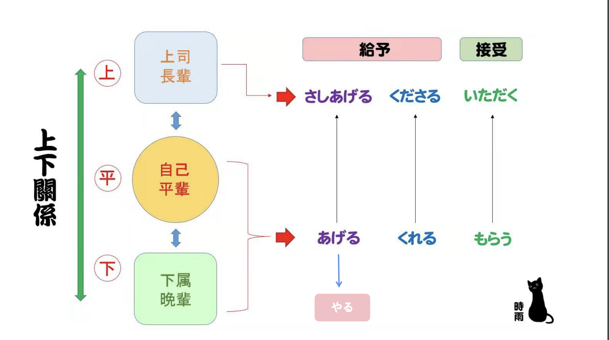

## 我（他人）给他人某物

意义：表示将某物给予身份、年龄高的人，是「あげる」的自谦语  
译文：给他人······  
接续：（私が他人に）名词＋を＋さしあげる

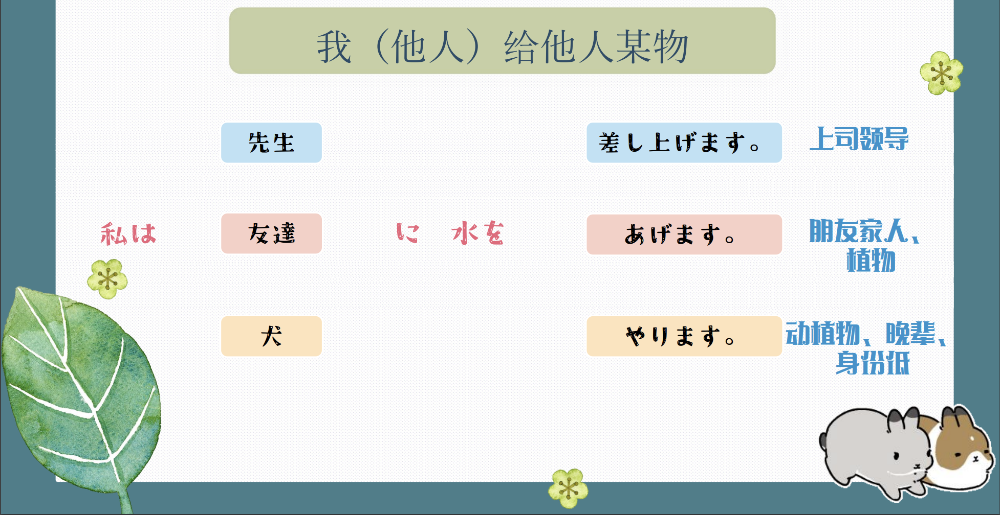

```ts
(1) 課長に漢方薬をさしあげました。
给了科长中药。
(2) 先輩に旅行のお土産をさしあげました。
给前辈送了旅行的特产。
(3)教師の日、みなんで先生にアルバムをさしあげました。
 教师节，大家送给老师相册。
```

## 他人给我某物　　

意义：表示身份、年龄高的人给予自己（或属于自己一方的人）某物，是「くれる」的尊他语

译文：给我······

接续：（他人が私に）名词＋を＋くださる

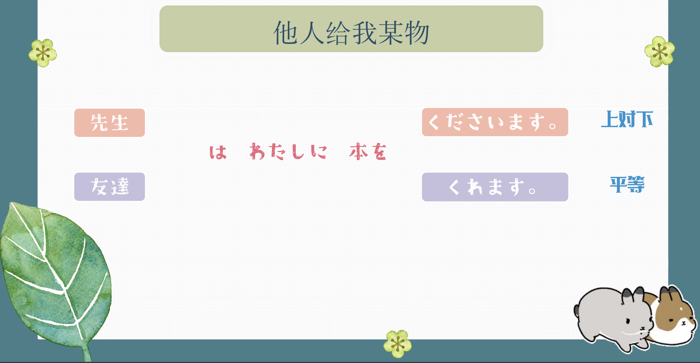

```ts
(1)その後先生は何度もメッセージをくださいました。
后来老师多次给我留言。
(2)先生が日本語の辞書をくださいました。
老师给了我一本日语词典。
(3)先輩が妹にコンサートのチケットをくださいました。
前辈给了妹妹演唱会的门票。
```

## 我（他人）得到他人某物

意义：表示从身份、年龄高的人处领受、获取某物，是「もらう」的自谦语　　
译文：给我······　　
接续：（私が他人に／から）名词＋を＋いただく

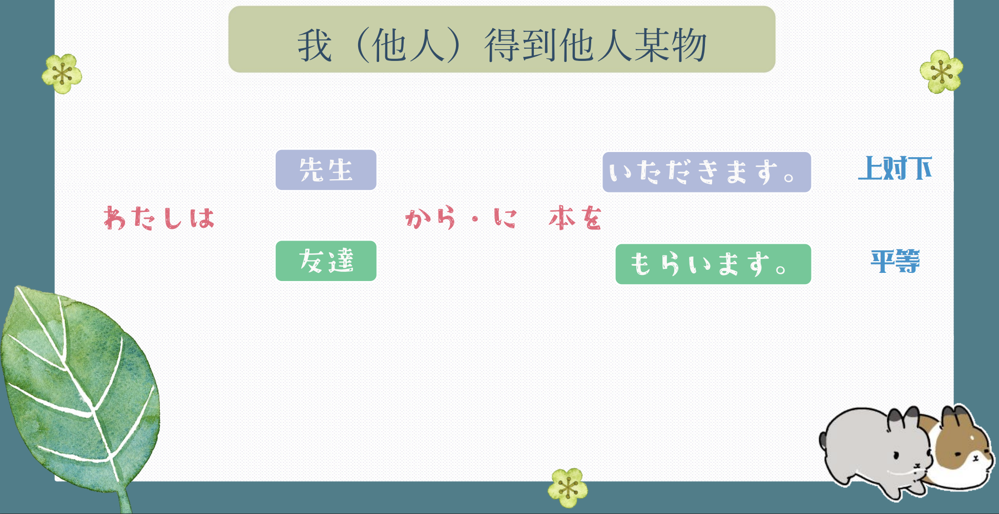

```ts
(1)授業を休んだ日は、先生からお見舞いのメールをいただいた。
请假的那天，收到了老师的慰问邮件。
(2) 私は社長に会社のペンをいただきました。
我从社长那里得到了公司的钢笔。
(3) これは陳先生からいただいた本です。
这是陈老师给我的书。
```

> ☞「くださる／いただく／さしあげる」的使用注意事项 因为敬语一般用于表达对他人的敬意，对自己家人、亲友等一般不使用「くださる／いただく／さしあげる」，而使用「くれる／もらう／あげる」。

```ts
(4)誕生日に父が（私に）プレゼントをくれました。
(5)誕生日に（私は）父にプレゼントをもらいました。
(6)誕生日に（私は）父にプレゼントをあげました。
```

## 練習 れんしゅう

```ts
1.前辈给了我弟弟电脑的杂志。
⇒先輩が弟にパソコンの雑誌をくださった。
2. 我们给了远藤老师花。
⇒私たちは遠藤先生に花をさしあげた。
```

## 我（他人）为他人做某事

意义：表示为身份、年龄高的人做某事，是「 Ⅴ てあげる」的自谦语  
译文：某人为他人······  
接续： （私が他人に） Ⅴ て＋さしあげる

```ts
(1) 先生がいらっしゃったので、町を案内してさしあげました。　　
因为老师来了，所以带您参观了一下街道。
(2) 王さんは先生の荷物を持ってさしあげました。
小王帮老师拿了行李。　　　　
(3) 高橋さんのおばあさんの誕生日に、みんなでおばあさんの好きな歌を歌ってさしあげました。　　
高桥奶奶的生日那天，大家一起唱了奶奶喜欢的歌。
```

## 我（他）请求别人为我（他）做

意义：表示拜托、请求身份、年龄高的人为自己（或属于自己一方的人）做某事，是「 Ⅴ てもらう」的自谦语  
译文：请······为我······  
接续： （私が他人に／から） Ⅴ て＋いただく

```ts
(1)（私は）王さんのお父さんに水ギョーザの作り方を教えていただきました。
(我)向小王的爸爸请教了我水饺的做法。
(2) 妹は先生に新しい辞書を貸していただきました。　　
妹妹向老师借了新词典。　
(3)遠藤先生に推薦状（すいせんじょう）を書いていただきました。　　
我请远藤老师为我写了推荐信。
(4) 兄は前の会社の先輩に、今の仕事を紹介していただきました。
哥哥求以前公司的前辈介绍了现在的工作。　
```

## 他人为我（我方）做某事

意义：表示身份、年龄高的人为自己或属于自己一方的人做某事，是「 Ⅴ てくれる」的尊他语  
译文：给我······  
接续：（他人が私に）Ⅴ て＋くださる

```ts
(1)先生は何度もメッセージをくださり、励ましてくださった。　　
老师多次给我留言，鼓励我。
(2) 友達のお母さんが妹を歌舞伎に招待してくださいました。　　
朋友的母亲邀请妹妹去歌舞伎表演。
(3) 先輩、大切な情報を教えてくださって、ありがとうございました。
前辈，谢谢您告诉了我重要的信息。
(4)先生は弟の作文を丁寧に直してくださいました。　
老师认真地修改了弟弟的作文。　　　　
```

## 練習 れんしゅう

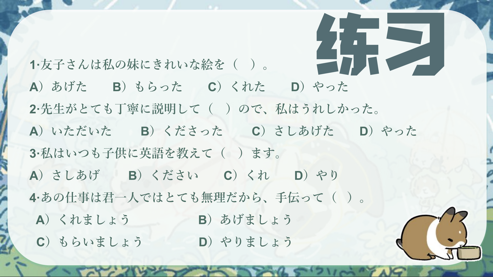
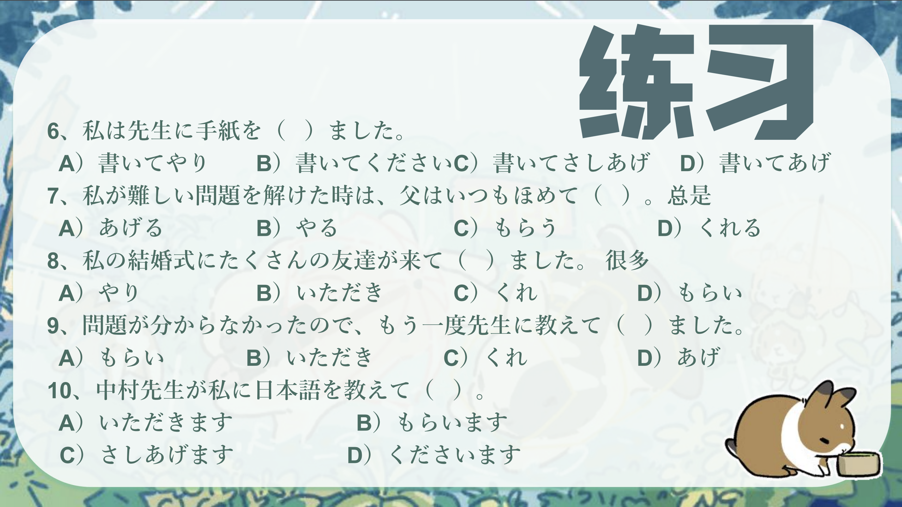

## 会話

<vue-plyr>
  <audio controls crossorigin playsinline loop>
    <source src="../audio/c/3-3-かいわ.mp3" type="audio/mp3" />
  </audio>
 </vue-plyr>

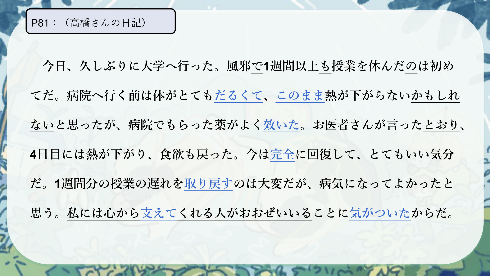
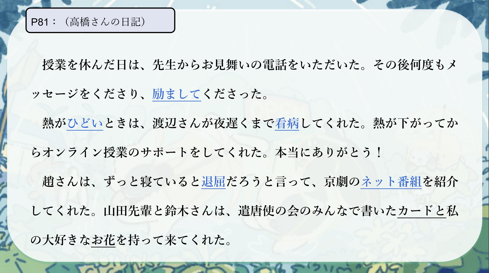

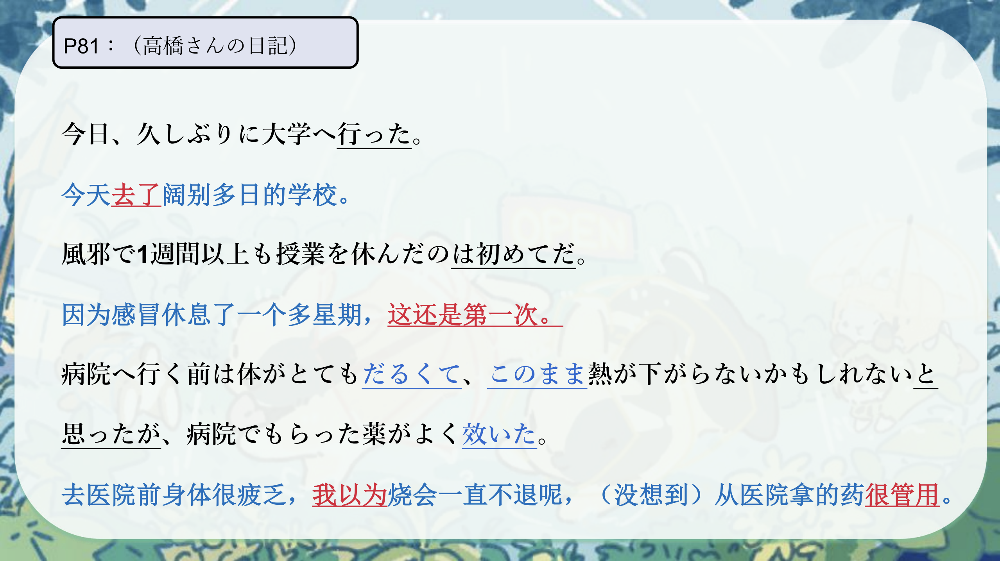
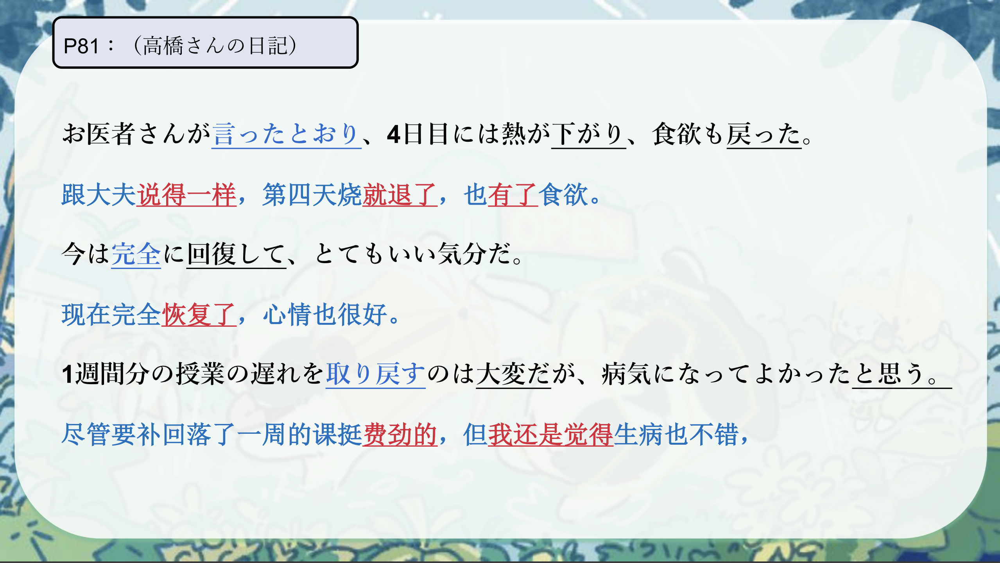
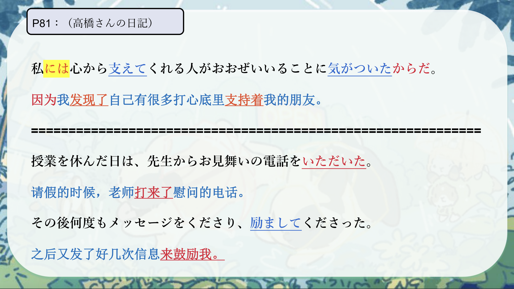
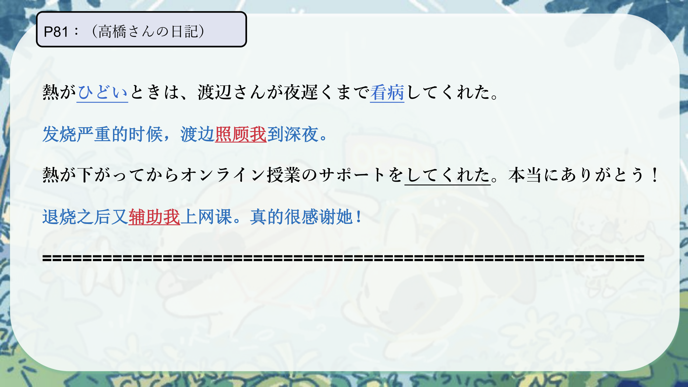
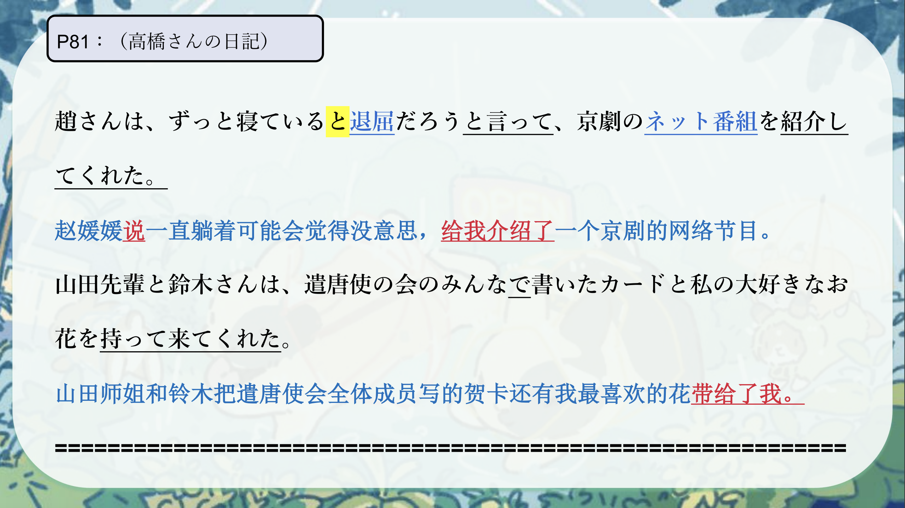
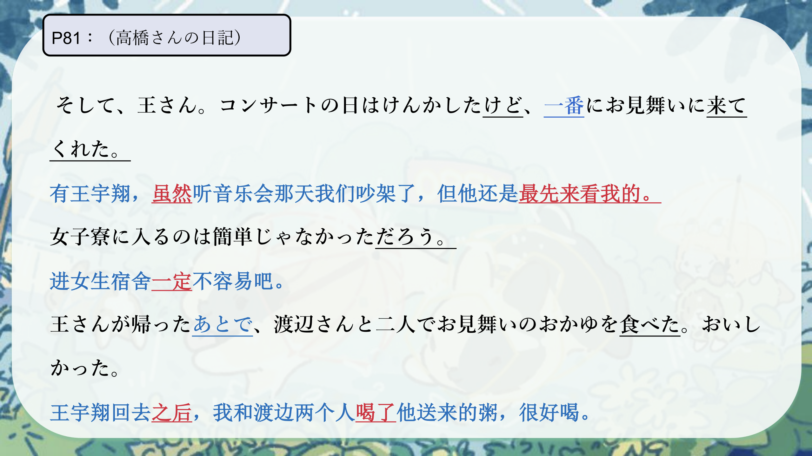
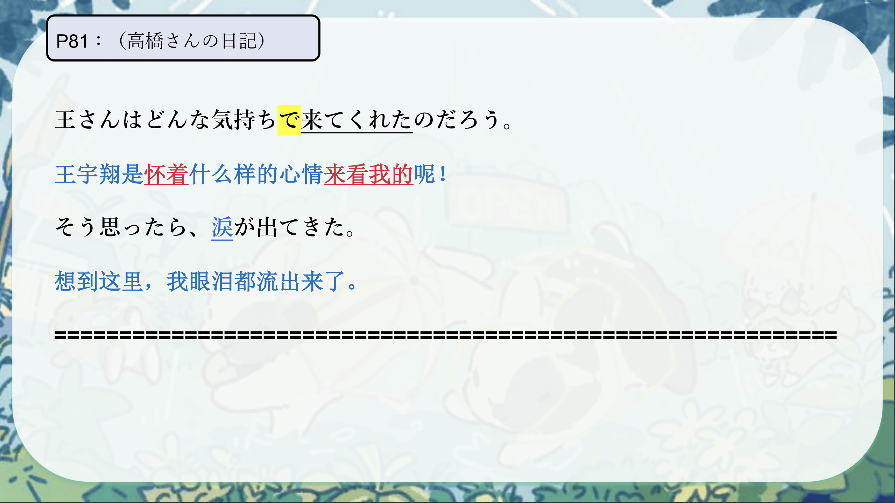
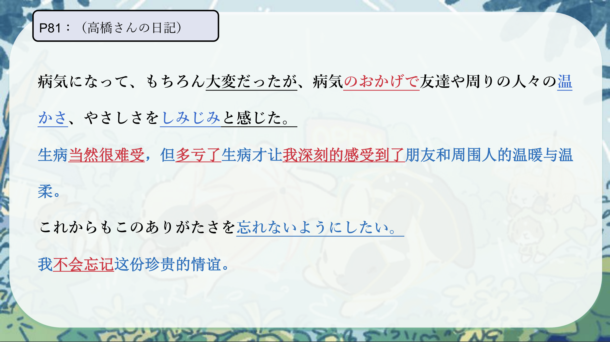
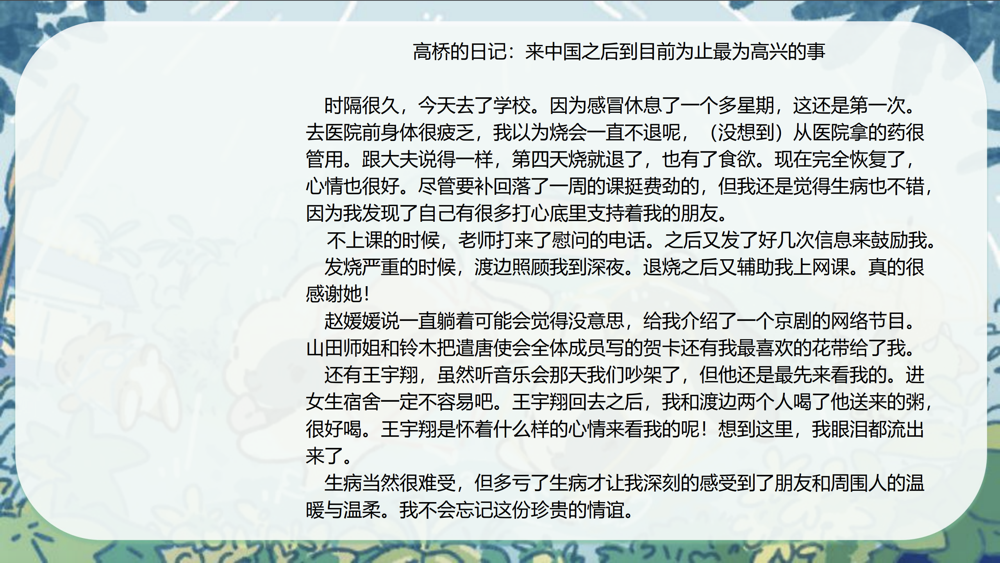
