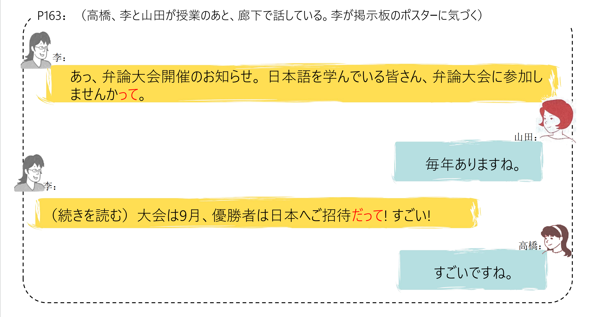
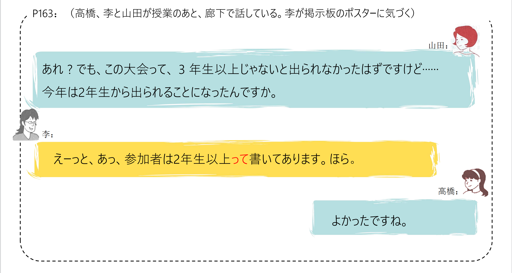
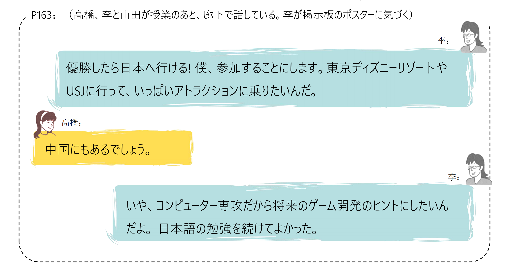
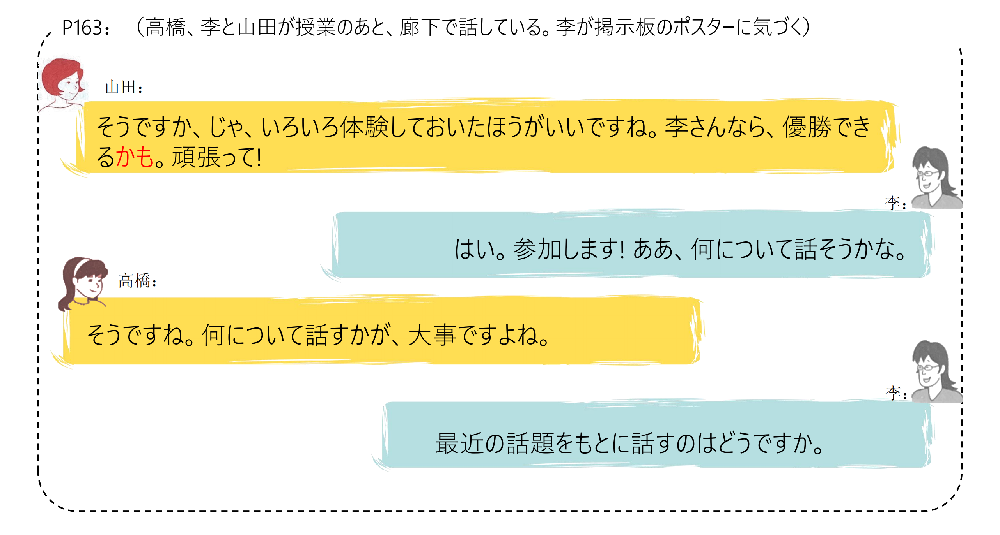
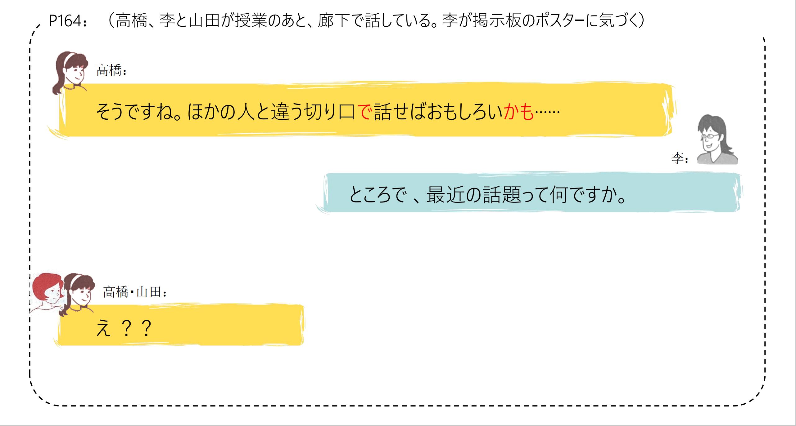
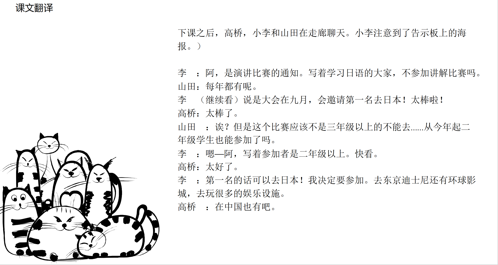
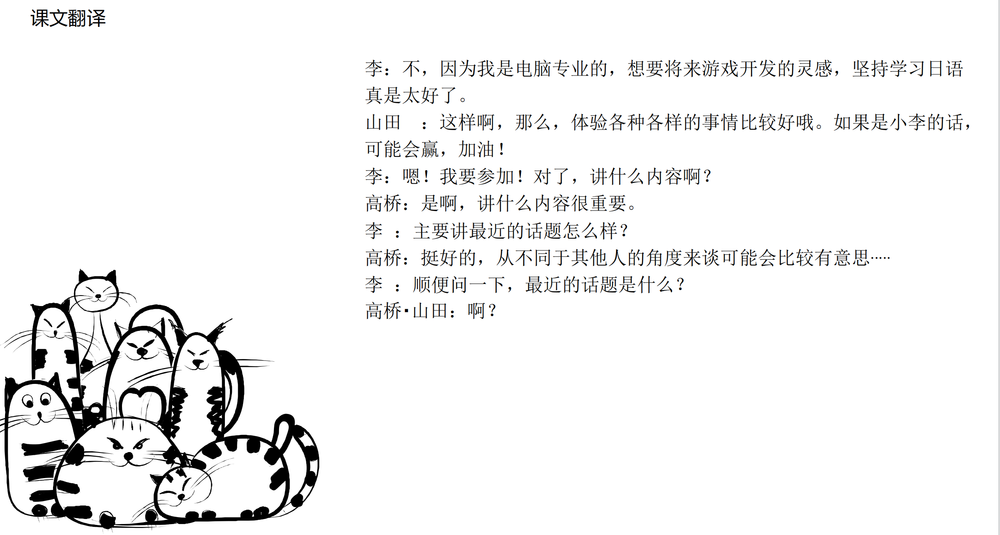

# 弁論大会のポスター

## 新出単語

<vue-plyr>
  <audio controls crossorigin playsinline loop>
    <source src="../audio/d/7-1-たんご.mp3" type="audio/mp3" />
  </audio>
</vue-plyr>

| 単語                                    | 词性          | 翻译         |
| --------------------------------------- | ------------- | ------------ |
| 廊下（<JpWord>ろうか</JpWord>）         | ① ＜名＞      | 走廊         |
| ディズニー<JpWord>リゾート</JpWord>     | ＜名＞        | 迪士尼度假区 |
| USJ（<JpWord>ユーエスジェー</JpWord>）  | ＜名＞        | 日本环球影城 |
| <JpWord>アトラクション</JpWord>                      | ＜名＞        | 游乐园设施   |
| 開発（<JpWord>かいはつ</JpWord>）       | ⑥ ＜名＞      | 开发         |
| <JpWord>ヒント</JpWord>                                   | ＜名＞        | 启发         |
| 切り口（<JpWord>きりくち</JpWord>）     | ② ＜名＞      | 切入点       |
| 材料（<JpWord>ざいりょう</JpWord>）     | ③ ＜名＞      | 材料         |
| 用意（<JpWord>ようい</JpWord>）         | ① ＜名・他Ⅲ＞ | 准备；预备   |
| 手帳（<JpWord>てちょう</JpWord>）       | ⓪ ＜名＞      | 记事本；手帐 |
| <JpWord>しまう </JpWord>                                 | ⓪ ＜他I＞     | 收拾；收纳；整理 |
| 太る（<JpWord>ふとる</JpWord>）         | ② ＜自I＞     | 胖；发福；粗 |
| 地下鉄（<JpWord>ちかてつ</JpWord>）     | ⓪ ＜名＞      | 地铁         |
| アイデア（<JpWord>idea</JpWord>）       | ① ＜名＞      | 想法；主意   |
| 描く（<JpWord>かく</JpWord>）           | ① ＜他I＞     | 画；临摹；描绘 |
| <JpWord>マイク</JpWord>                                  | ① ＜名＞      | 麦克风；话筒 |
| <JpWord>プログラム</JpWord>                              | ③ ＜名＞      | 程序；节目单 |
| <JpWord>ロールプレイ</JpWord>                            | ⑤ ＜名＞      | 分角色扮演   |
| 海淀区（<JpWord>かいでんく</JpWord>）   | ③ ＜固名＞    | （地名）海淀区 |
| 児童（<JpWord>じどう</JpWord>）         | ① ＜名＞      | 儿童         |
| <JpWord>おやつ</JpWord>                                  | ② ＜名＞      | （午后3点吃的）零食；小点心 |
| 気軽（<JpWord>きがる</JpWord>）         | ⓪ ＜形Ⅱ＞     | 轻松；随意   |

## Vることになる〈事态发展的结果〉

意义:表示客观存在的规定或事态自然发展、变化所产生的结果。  
接续: 动词的词典形 / 可能态动词的连体形 /动词的否定形 + ことになる

```ts
(1) 今年は2年生から出られることになったんですか。
(2) 父は、春から名古屋に転勤することになった。
(3) 日本語学科の学生はシンポジウムを手伝うことになった。
(4) コロナの影響で大会は開催しないことになるかもしれない。
```

## 練習 れんしゅう

```ts
1.下周星期天，定好了大家去郊游。 ハイキング
⇒ 来週の日曜日、みんなでハイキングをしに行くことになった。
2.从下个月开始，规定了即使是留学生也能进入这个宿舍。
⇒　来月から、留学生でもこの寮に入れることになった。
```

## Vることにする〈决定〉

意义:表示动作主体决定做(或不做)某事。  
译文:决定······   
接续:动词的词典形/动词的否定形+ ことにする

```ts
(1) 僕、参加することにします。
(2) 頭が痛いので、今日は学校を休むことにします。
(3) 私は今日からたばこを吸わないことにした。
(4) 卒業したら就職しないで、会社を立ち上げることにした。
```

> V ることにする〈决定〉
> "V ることにする"与 "V ることになる"的区别在于:
> "V ることにする"强调的是动作主体主观上做出的决定,而"V ることになる"则表示客观的
> 规定或自然而然出现的结果。和"する"相比 ,由于"なる"弱化了说话人的意志,语气显得委
> 婉客气，例如:

```ts
(5) 後輩 :来月、結婚することになりました。
    先輩 :それは、おめでとう！
```

## 練習 れんしゅう

```ts
1.因为便宜，所以我决定了要坐巴士旅游。
⇒ 安いので/から、バスで旅行することにしました。
2.因为胖了，所以我决定了不吃甜的东西。 ふとる
⇒ 太ったので、甘いものを食べないことにしました。
```

## N なら（ば）＜话题、条件＞

意义:假设在该话题或条件之下的情况,后句表达说话人的意见 、建议 、判断、 意图等。  
译文 : ······的话;如果是······

```ts
(1) 李さんなら、優勝できるかも。
(2) 明日の午後なら、時間があります。
(3) 本当に風邪なら（ば）、早く帰って寝たほうがいいよ。
(4) 今度の試験で成績が一番なら（ば）、留学試験を受けようと思います。
```

##  Nなら（ば）＜条件、凸显＞

> ②承接对方的样子或说过的话，后面陈述说话人的建议、意志、意见、回答等
接续：简体句子＋なら（ナA／N＋なら）

```ts
A「今から図書館へ行きます。」
B「あ、図書館に行くなら、私も返したい本があるんですが…」
A「田中さん、いませんか。」 
B「田中さんなら、さっき出かけましたよ。」
A 日本語を勉強したいです 。
B 日本語を勉強したいなら、授業を受けたほうがいいですよ。
（友達が納豆を食べないのを見て）王さん、納豆がきらいなら、食べなくてもいいんですよ。
```

## 練習 れんしゅう

```ts
1.如果是有趣的小说，就会想要看。
⇒　面白い小説なら（ば）、読みたくなる。
2.下周的话能来的。
⇒　来週なら、来られます。
```

### N をもとに（して）＜题材、基础＞

**意义**: 表示以某一事物为题材或基础进行言语行为或创作活动。    
译文 :以 ……为 (素材、基础)  

```ts
(1) 最近の話題をもとに話すのはどうですか。
(2) 小説をもとにして映画を作った。
(3) 聞いた話（はなし）をもとにして小説を書きました。
  以听到的故事为基础，写了小说。
(4) 調査の結果をもとに対策を考えよう。
  以调查的结果为基础来思考对策。
```

## 練習 れんしゅう

```ts
1.以问卷调查的结果为基础，来进行演讲。　// アンケート調査の結果をもとにして、講演をする。
⇒ アンケート調査の結果をもとにして、講演をする。
2.以大家的意见为基础，制定了计划。計画（けいかく）を立（た）てる
⇒ みんなの意見をもとにして、計画を立てました。
```

###  Vてある〈客体存续的状态〉
意义:表示动作、行为完成之后客体存续的状态。  
译文 : ······着  
接续 :他动词+てある  
说明 :客体的状态实际上是为了某种目的而存续的 , 因此动词V多为自主的他动词。另外 , 他动  
词的 “を格”补足语 , 在 「てある」的句子中一般要改成 “が格”的形式。  

```ts
(1) 参加者は2年生以上って書いてあります。ほら。
  写着2年级以上就可以参加。
(2) 部屋にかぎがかけてあるから、安心です。
  因为房间锁着了，所以放心了。
(3) 壁にポスターが貼ってありました。
  墙上贴着海报。
```


> Vてある〈客体存续的状态〉
> 存在自他对应的动词 ,「他动词+ てある」和 「自动词+ ている」都可以表达结果状态的存续,
>其中「Vてある」表示的是动作、行为的主体出于某种意图或理由实施该动作后 ,客体的存续状  
>态 ,「Vている」则不具有这层含义,只是表示结果状态。  

```ts
(4) 節電のために、電気が｛〇消してある/X消えてある/ X 消えている｝。
(为了节电而关灯后的结果状态)
(5) 電気が消えている。
 (只叙述现在灯是关着的状态)
```

> 「てある」还可以表示做好某种准备之后的状态,一般使用「〜は /を (もう)V てある」的句式。

```ts
(6) 新しい単語はもう調べてある。
 (已经查好了新单词)
(7) 高橋:遠藤先生には遠足のことを話してありますか。
 王 : いいえ 、まだです。
 你已经告诉远藤先生远足的事情了吗？
 没有，还没说。
```


## 練習 れんしゅう

```ts
1.在墙上装饰着看起来有趣的画。// 壁（かべ）　// 飾る（かく） // 絵（え） // 看起来（みえる） // 有趣（おもしろい）
⇒ 壁に面白そうな絵が飾ってある。
2.旧的的东西在箱子里收着。　// 箱（はこ） // 中（なか）
⇒ 古いものが箱の中にしまってある。
```


###  Vておく〈提前准备〉口语：とく／どく
意义:表示该动作是为后面要做的事情提前做好准备。也可以表示短时间内保持某种状态。  
译文 :事先（做）······; 预先（做）······

```ts
（1） じゃ、いろいろ体験しておいたほうがいいですね。
  那，事先体验一下会更好。
（2） 明日は忙しい1日になるから、今晩しっかり寝ておこう。
  因为明天是忙碌的一天，所以今晚要好好睡一觉。
（3） その資料はあとで見ますから、机の上に置いておいてください。
  因为那个资料等会看，所以请放在桌子上。
（4） 李 :黒板を消しましょうか。
     先生 :そのまま［保持原样］にしておいてください。
     李 : 我们把黑板擦了吧？
     老师 : 就保持原样吧。
```

> Vておく〈提前准备〉 「ておいた」与 「Vてある」有时表示的是基本相同的事实,但二者叙述的着眼点各异。例如:

```ts
（5） 会議の資料はコピーしておきました。
（6） 会議の資料はコピーしてあります。
```

>（5）的关注点在于这个动作本身 ,叙述者一般是「コピーする」这一动作的执行者 ; 
> 而6）则聚焦于 「コピーする」这个动作完成后的结果状态 ,叙述者和动作的执行者未必是同一人。


## 練習 れんしゅう

```ts
1.因为朋友会来，所以提前买了水果。　// くだもの（果物）
⇒ 友達が来るから、果物を買っておいた。
2.因为下个月去北海道，所以要事先预约酒店。
⇒ 来月北海道に行くから、ホテルを予約しておく。
```

## 会話

<vue-plyr>
  <audio controls crossorigin playsinline loop>
    <source src="../audio/d/7-1-かいわ.mp3" type="audio/mp3" />
  </audio>
 </vue-plyr>








