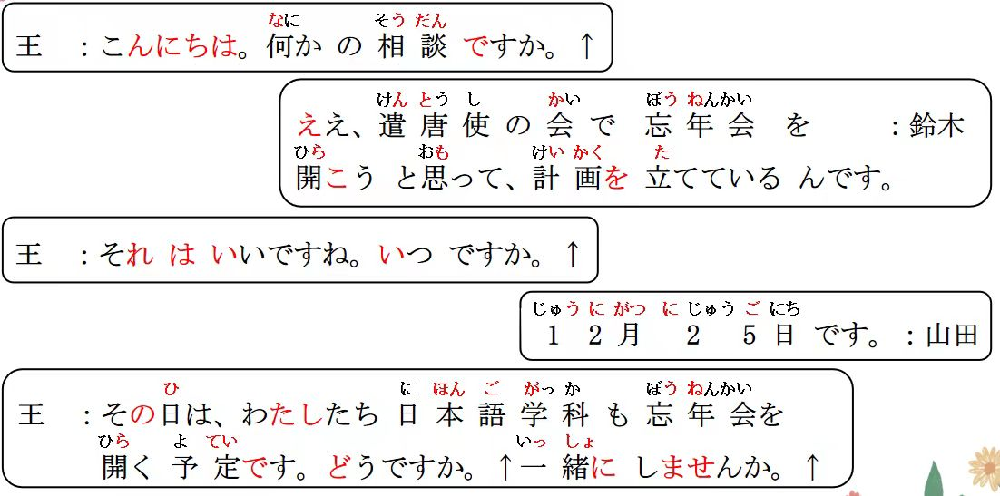

# 意志形、と思う、予定だ..

## 新出単語

<vue-plyr>
  <audio controls crossorigin playsinline loop>
    <source src="../audio/12-1-たんご.mp3" type="audio/mp3" />
  </audio>
 </vue-plyr>

| 単語                                    | 词性         | 翻译                             |
| --------------------------------------- | ------------ | -------------------------------- |
| 忘年会 <JpWord>ぼうねんかい</JpWord>    | 3<名>        | (公司、团体等年底举行的)联欢会;  |
| 思う <JpWord>おもう </JpWord>           | 2<他 I>      | 认为;觉得;想                     |
| 予定 <JpWord>よてい</JpWord>            | 0<名·他 III> | 预定;预计;计划                   |
| 会場 <JpWord>かいじょう </JpWord>       | 0<名>        | 会场;场地                        |
| 出し物<JpWord>だしもの</JpWord>         | 32<名>       | 节目                             |
| 多分<JpWord>たぶん</JpWord>             | 1<副>        | 大概;可能;也许                   |
| 演劇学科<JpWord>えんげきがっか</JpWord> | 5<名>        | 戏剧专业;表演专业                |
| 志望<JpWord>しぼう</JpWord>             | 0<名·他 III> | 志愿;愿望 志望                   |
| 主演<JpWord>しゅえん</JpWord>           | 0<名·自 III> | 主演;主角                        |
| 女優<JpWord>じょゆう</JpWord>           | 0<名>        | 女演员                           |
| 脚本<JpWord>きゃくほん</JpWord>         | 0<名>        | 脚本;剧本                        |
| 男優<JpWord>だんゆう</JpWord>           | 0<名>        | 男演员                           |
| 現代版<JpWord>げんだいばん</JpWord>     | 0<名>        | 现代版                           |
| -版<JpWord>-ばん</JpWord>               | <接尾>       | ~版                              |
| かぐや姫<JpWord>かぐやひめ</JpWord>     | 3<固名>      | (日本故事《竹取物语》的女主人公) |
| guidebook<JpWord>ガイドブック</JpWord>  | 4<名>        | 指南                             |
| 海水浴<JpWord>かいすいよく</JpWord>     | 3<名>        | 海水浴                           |
| 出発<JpWord>しゅっぱつ</JpWord>         | 0<名·自 III> | 出发                             |
| 晩御飯<JpWord>ばんごはん</JpWord>       | 3<名>        | 晚饭                             |
| 集合<JpWord>しゅうごう</JpWord>         | 0<名·自 III> | 集合                             |
| UFO<JpWord>ユーフォ一</JpWord>          | 1<名>        | UFO;不明飞行物                   |
| 南<JpWord>みなみ</JpWord>               | 0<名>        | 南;南边;南方                     |

## 动词的意志形

意义:表示意志、建议。  
译文:要……；……吧  
说明:动词后接表示意志、建议的后缀「(よ)う」时构成动词的意志形，其构成规则是:


## 动词的意志形 1.建议 2.意志

动词的意志形用于第一人称句时，表示说话人(第一人称)要进行该动作的意志；  
用于第一、二人称句时，表示说话人(第一人称)建议对方(第二人称)与自己共同  
进行该动作，它是在第 7 课和第 8 课学过的「V ましょう」的简体形式。

```ts
（1）あそこに毛沢東の肖像画があります。
（2）遣唐使の会で忘年会を開こうと思って、計画を立てているんです。ひらく
我们决定在遣唐使的会上开一个联欢会，现在正在制定计划。
（3）明日朝早いから、今晩早く寝よう。 ねる　明天要早起，今晚早点睡吧~
（4）みんなで頑張ろう。 頑張る「がんばる」 頑張りましょう。
（5）人数「にんず」が足りないから、王さんも一緒に行こう。 行く
```

## 練習 れんしゅう

```ts
（1）天气很好、所以一起散步吧。さんぽする
⇒ 天気がいいですから、散歩しましょう。 敬体
天気がいいから、散歩しよう。 简体
（2）一起坐出租车去吧。タクシー で 行く に乗る
⇒ （一緒に）タクシーで行きましょう・行こう。
（3）我明天买鞋吧。 くつをかう 　　意志 ⇒ 明日は靴を買おう・買いましょう。

```

> ☞「Ｖ(よ)う」后接「と思う」构成「Ｖ(よ)うと思う」这个句式，表示
> 说话人(第一人称)的意志，即决定要做某事，相当于汉语的“我想要
> ……；我决心……；我决定要……”等。

```ts
（4）今日は早く帰ろうと思います。我决定今天要早点回去。
帰るー帰ろう
（5）今晩久しぶりに映画を見ようと思います。
見るー見よう 我决定今晚要久违地看一次电影。
（6）運動しようと思いますけど、時間がありません。
運動するーしよう が 我决定要做运动，但是没有时间。
Vたい お金持ちになりたい。（摆烂） お金持ちになろうと思う。（努力搬砖）
意志形+と思う 我决定要做 意志形+と思っている 他她决定要做
```


## 練習 れんしゅう

```ts
（1）我决心去日本留学。 动作性名词/动词第一连用形+に行く
⇒ （私は） 日本へ/に 留学に行こう と思う・ 思います。
（2）小王决心要存钱。お金を貯める「ためる」
⇒ 王さんお金を貯めようと思っている・思っています。

```

## ~ と思う＜想法＞

意义:表示说话人(第一人称)思考的内容。    
译文:我想……；我认为……；我觉得    
接续:简体的句子+と思う Ｎ、A2+だと思う    

```ts
（1）遣唐使の会で忘年会を開こうと思って、計画を立てているんです。
（2）鈴木:パーティーで何をしましょうか。我们要一起在派对上搞一个节目嘛？
山田:プレゼント交換がいいと思います。我觉得礼物交换（节目）挺好的。
（3）家を買うのは大変だと思う。 我觉得 买房子（这个事情）非常艰辛。
（4） 高橋さんはきっと来ると思う。 我认为高桥一定会来。
高桥觉得一定会来。✖ 第三人称
```

> ☞当「と思う」以非过去时的形式用于陈述句时，表示说话人(第一人称)的思
考内容，因此主语经常省略。
如果使用「～と思っている」的句式，则既可以表示第一人称的思考内容，
也可以表示其他人称(非说话人)的思考内容。
「～と思っている」强调在一
定时间内一直持有该想法。

```ts
（5）王さんは日本に留学しようと思っている。小王觉得要去日本留学。
（6）私は将来教師「きょうし」になろうと思っています。 我决定将来要当老师。
（7）英語より日本語のほうが難しいと思っている人が多いです。
主语：人 觉得 比起英语 日语这一方更难 的人多。
```

☞「と思う/と思っている」前面要用句子的简体形式。

```ts
（8）✖李さんはパーティーに来ませんと思います。きません
→李さんはパーティーに来ないと思います。 こない
我觉得 小李不会来派对。
（9）✖もっと頑張りましょうと思います。敬体
→もっと頑張ろうと思います。 頑張る「がんばる」
我决定要更加努力。
```

```ts
（1）我觉得那绝对办不到。 無理（むり）A2 ＋だ
（私は） それは絶対「ぜったい」無理だと思う・思います。
（2）小李（他）觉得日语简单。A2，N +だ
⇒ 李さんは日本語が簡単だと思っている。
と思っています。
```


## ~ 予定だ＜计划＞

意义:表示某人的计划。 よてい    
译文:计划……；准备……   
接续: Vる+予定だ Nの+予定だ    

```ts
（1）私たち日本語学科も忘年会を開く予定です。我们日语专业也准备开联欢会。
（2）夏休みは久しぶりに国に帰る予定です。 暑假 计划久违地回一次国。
（3）今度の交流会は11月4日(土)の予定だ。 下次的交流会预计是11月4号（6）。
（4）日本語教室は4月から開催の予定です。日语培训班计划从4月开始开班。
```

## 練習 れんしゅう

```ts
（1）我们准备明年结婚。 // らいねん けっこん けっこう
⇒ 来年、 私たちは結婚する予定だ・予定です。
結婚の予定です。
```

## 精読の教文

<vue-plyr>
  <audio controls crossorigin playsinline loop>
    <source src="../audio/12-1-1.mp3" type="audio/mp3" />
  </audio>
 </vue-plyr>


