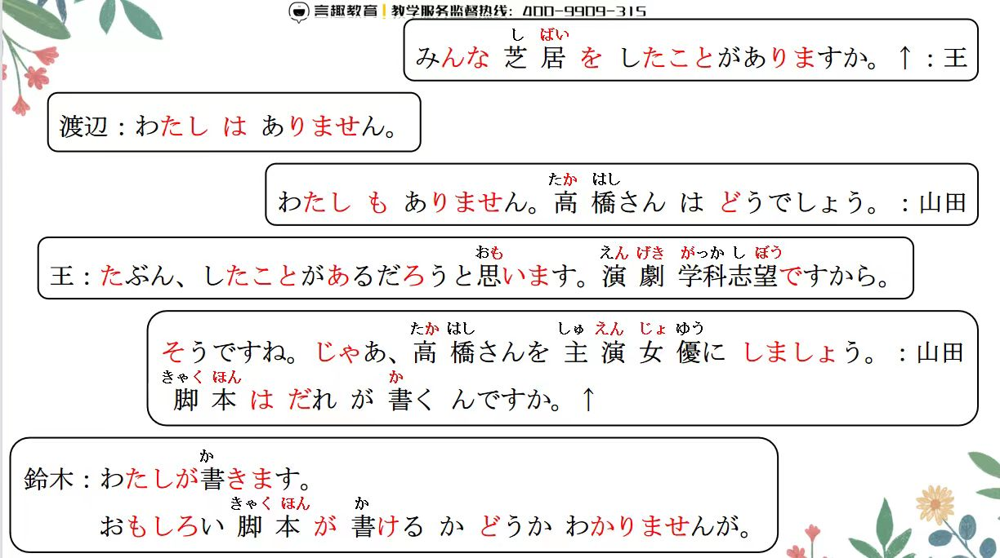
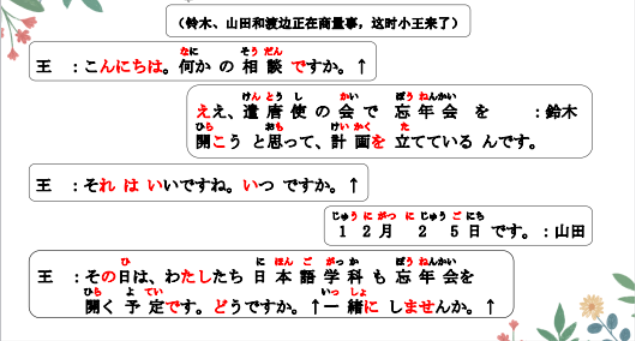
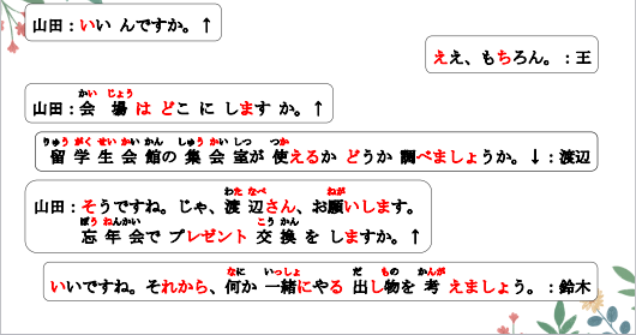
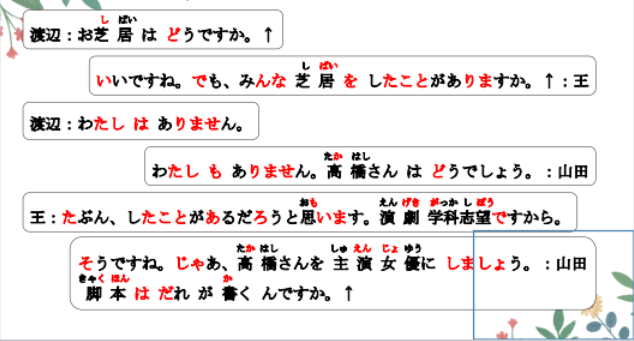
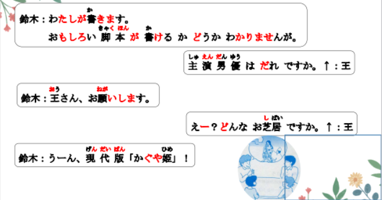
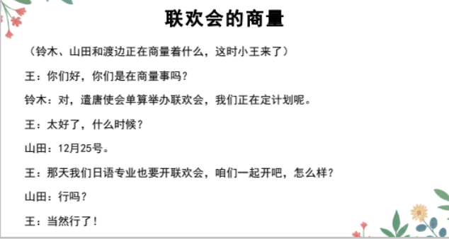
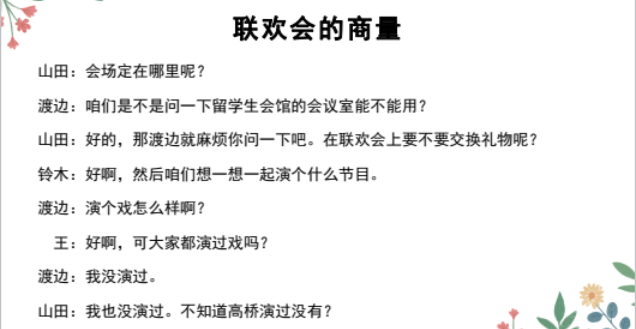
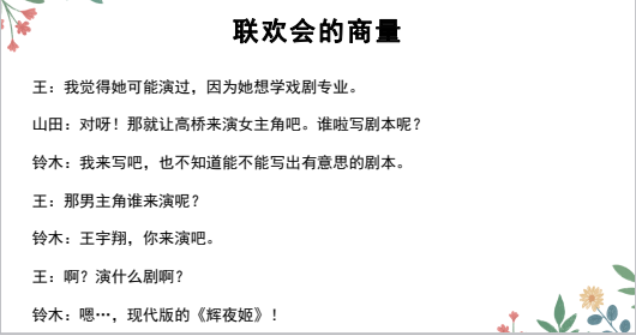

# かどうか、たことがある...

## ~かどうか＜选择＞

意义:用于提出肯定或否定的两种情况，表达疑问或难以判断。  
译文:……还是不……；……与否；是否；是还是不是  
寒いかどうか： 冷还是不冷 （冷不冷）  
先生かどうか： 是老师还是不是老师（是不是老师）  
するかどうか： 做还是不做（做不做）  
接续: 动词、I类形容词的简体+かどうか  
名词、Ⅱ类形容词词干+かどうか  
きれいだかどうか ✖ きれいかどうか ○ 綺麗だと思う  
かどうか 看作副词的词性 + V かどうか＋の＋N  

```ts
（1）留学生会館の集会室が使えるかどうか調べましょうか。
「しゅうかいしつ」
调查一下 留学生会馆的会议室 能不能使用 嘛？ 調べましょう。
（2）あの人が このことを、知っているかどうか、（私は）よくわかりません。
我不是很清楚，那个人是不是知道这件事情。
（3）東京の冬は寒いかどうか、日本人の友達に聞きます。问
问日本的朋友 东京的冬天冷还是不冷呢.
（4）登録のとき、学生かどうかのチエックがあります。
とうろく 注册的时候， 有是否是学生的检查。
（5）2月中旬「ちゅうじゅん」に日本へ旅行に行く予定です。
我计划2月中旬 去日本旅游。 请告诉我大衣有没有必要。
コート[大衣]が必要かとうか教えてください。

```

## 練習 れんしゅう

```ts
（1）不是很清楚那个人是不是好人。　　
⇒ あの人が/はいい人 かどうか
、よくわからない・よくわかりません。
（2）想知道新老师漂不漂亮。 しりたい
⇒ 新しい先生が/は綺麗かどうか、知りたい・知りたいです。
先生（尊称）：老师。 律师，医生
教師「きょうし」：老师（这个职业）

```

## Vたことがある＜经历＞

意义:表示曾经有过的经历。 また：又；再  
译文:(曾经)……过 湖に落ちたことがある。  
接续:Vた＋ことがある 湖に落ちたことがない。  
  

```ts
（1）みんな芝居をしたことがありますか。大家有演过戏剧嘛？
（2）私は富士山に登ったことがあります。我爬过富士山。
（3） 私はまだ日本料理を食べたことがない。我还没有吃过日料。
（4）李:海を見たことがありますか。你见过大海嘛？
王:いいえ、一度「いちど」も(見たことが)ありません。 一次也没有（看过）。
```

## 練習 れんしゅう

```ts
（1）读过这本小说。 // しょうせつをよむ Ｖたことがある
⇒ この小説を読んだことがある。
（2）在海里游过泳。 くーいた ぐーいだ
⇒ 　海を泳いだことがある。游来游去过。　海で泳いだことがある。　 
（3）没看到过UFO。ユーフォー fo
⇒ ＵＦＯを見たことがない・ありません。

```

## ~ だろう＜推测＞

意义:表示说话人的主观推测。  
译文:大概……吧；……吧 应该、、吧~  
接续:动词、 I类形容词的简体+だろう  
Ⅱ类形容词的词干、名词，副词+だろう  
说明:是「でしょう」的简体形式，经常与「ね」「と思う」搭配使用。  


> 简体接でしょう・だろう
1. 一类形容词：やさしいでしょう 優しくないでしょう 優しかったでしょう 優しくなかったでしょう
2. 动词：食べるでしょう 食べないでしょう 食べたでしょう 食べなかったでしょう
3. 二类形容词，名词，副词 的非过去式肯定（原形），不要だ。直接＋でしょう・だろう
4. 二类形容词 綺麗でしょう 綺麗ではないでしょう 綺麗だったでしょう 綺麗ではなかったでしょう
5. 名词： 先生でしょう 先生ではないでしょう 先生だったでしょう 先生ではなかったでしょう
6. 副词： そうでしょう そうではないでしょう そうだったでしょう そうではなかったでしょう


```ts
（1）山田:高橋さんはどうでしょう。
王 :たぶん、したことがあるだろうと思います。
（2）大学生活は楽しいだろう。
（3）明日も雨だろう。 简体 明天也是雨天吧~ 雨が降る「ふる」だろう。
明日も雨でしょう。敬体
（4）あそこへは電車よりバスのほうが便利だろう。
去那里的话比起电车还是公交更方便吧~ に行く：に 移动的目的地 へ行く：へ 移动的方向
に一定要接移动的动词 へ可接可不接 どうぞ こちらへ
```

## 練習 れんしゅう

```ts
（1）小李（应该）在食堂吧。 所在句 は に ある・いる
⇒ 李さんは食堂にいるでしょう・だろう。
（2）A:高桥喜欢什么样的人？
⇒ 高橋さんはどんな人が好きですか。
　B:我觉得大概喜欢帅气的人吧。
⇒ 多分「たぶん」、かっこいい人が好きだろうと思う・思います。
存在句： に が ある・いる 某地有某人/物

```


## 精読の教文

<vue-plyr>
  <audio controls crossorigin playsinline loop>
    <source src="../audio/12-1-2.mp3" type="audio/mp3" />
  </audio>
 </vue-plyr>



## 会話

<vue-plyr>
  <audio controls crossorigin playsinline loop>
    <source src="../audio/12-1-かいわ.mp3" type="audio/mp3" />
  </audio>
 </vue-plyr>









 
