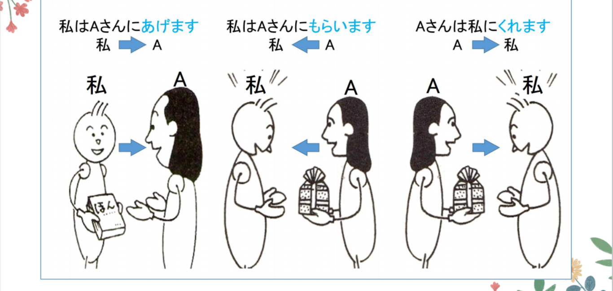
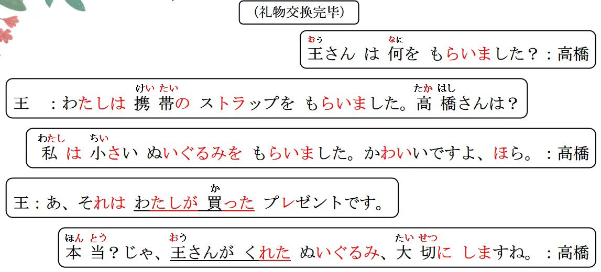
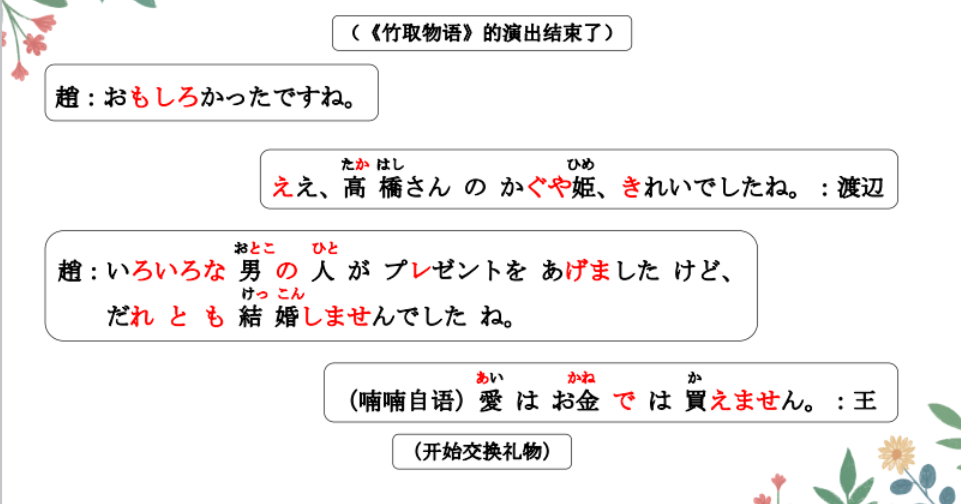
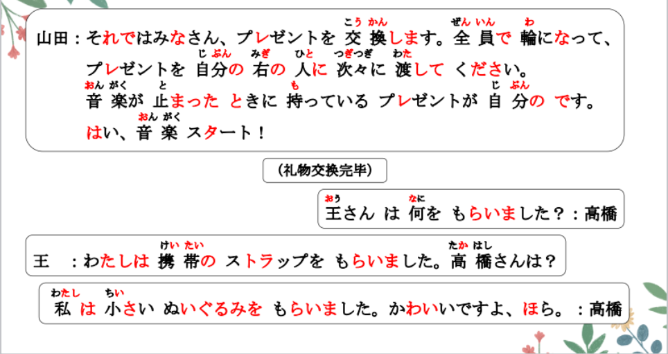
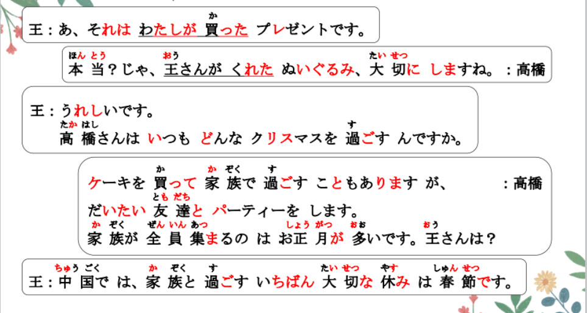
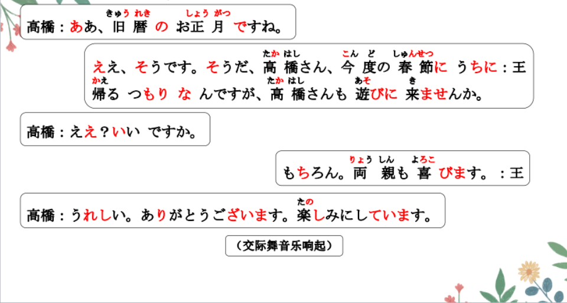
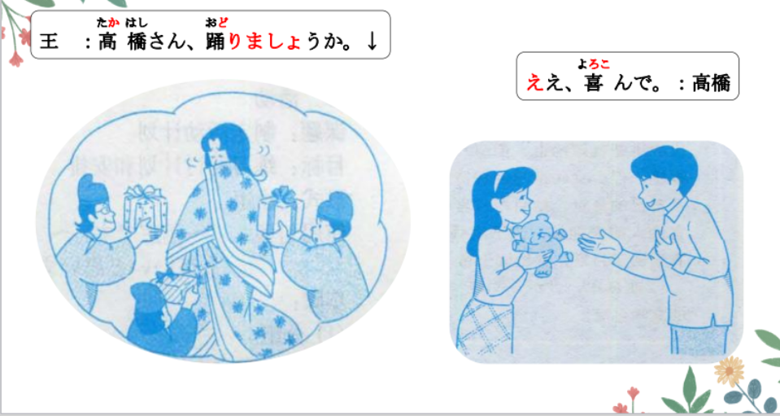
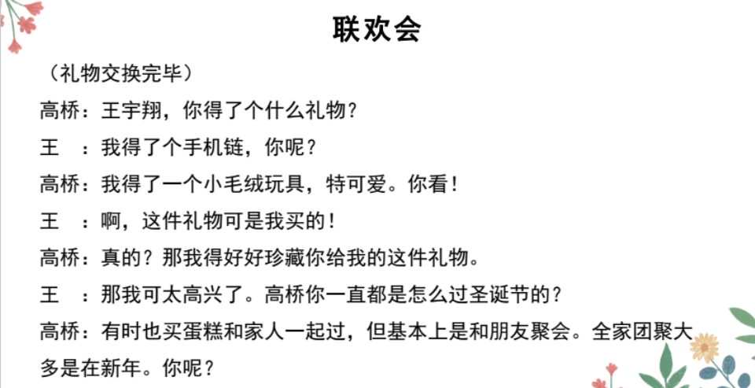
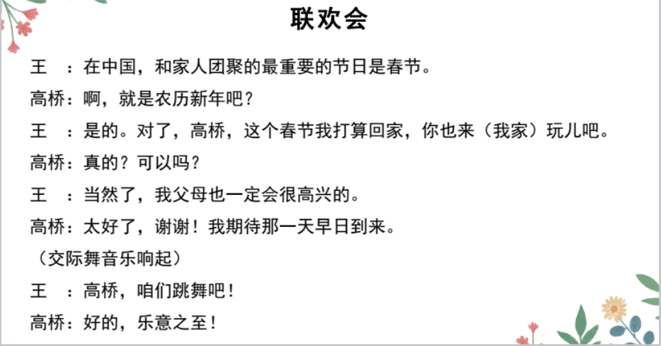

# あげる、くれる、もらう、も.

## 新出単語

<vue-plyr>
  <audio controls crossorigin playsinline loop>
    <source src="../audio/12-2-たんご.mp3" type="audio/mp3" />
  </audio>
 </vue-plyr>

| 単語                                   | 词性        | 翻译                                    |
| -------------------------------------- | ----------- | --------------------------------------- |
| 男の人 <JpWord>おとこのひと</JpWord>   | ⑥<名>       | 男人；男子 男のこ 男孩子                |
| <JpWord>あげる</JpWord>                | ⓪<他 Ⅱ>     | 给；给予 女「おんな」の人 女孩：女の子  |
| 愛<JpWord>あい</JpWord>                | ①<名>       | 爱；爱情 愛に困っている。               |
| 輪<JpWord>わ</JpWord>                  | ①<名>       | 圈；圆圈；环 指輪「ゆびわ」             |
| 右<JpWord>みぎ</JpWord>                | ⓪<名>       | 右；右边 左边：ひだり                   |
| 次々<JpWord>つぎつぎ</JpWord>          | ②<副>       | 一个接一个；接连不断 道を渡る「わたる」 |
| 渡す<JpWord>わたす</JpWord>            | ⓪<他 I>     | 交给；递给 ぺんを王さんに渡す           |
| 止まる<JpWord>とまる</JpWord>          | ⓪<自 I>     | 停；停止 止める 他                      |
| 自分<JpWord>じぶん</JpWord>            | ⓪<名>       | 自己 始まる「はじまる」                 |
| start<JpWord> スタ一卜</JpWord>        | ②⓪<名·自 Ⅲ> | 开始（口号）                            |
| <JpWord>もらう</JpWord>                | ⓪<他 I>     | 得到；拿到；索取                        |
| strap<JpWord>ストラップ</JpWord>       | ③<名>       | 带；吊带；坠儿；链儿                    |
| <JpWord>ぬいぐるみ</JpWord>            | ⓪<名>       | 毛绒玩具 ;布娃娃 玩具「おもちゃ」       |
| <JpWord>くれる</JpWord>                | ⓪<他 Ⅱ>     | 给（我） 渡る 渡过（地方）              |
| 過ごす <JpWord>すごす</JpWord>         | ②<他 I>     | 过；度过 （时间）                       |
| お正月 <JpWord>おしょうがつ</JpWord>   | ⓪⑤<名>      | 正月；新年（礼貌说法）                  |
| 正月 <JpWord>しょうがつ</JpWord>       | ④⓪<名>      | 正月；新年 嬉しがらないで（ください）   |
| 旧暦 <JpWord>きゅうれき</JpWord>       | ⓪<名>       | 旧历；阴历 新暦「しんれき」阳历         |
| <JpWord>つもり</JpWord>                | ⓪<名>       | 打算；准备；想要 嬉しがる 别高兴得太早  |
| 喜ぶ <JpWord>よろこぶ</JpWord>         | ③<自 I>     | 高兴；欢喜 中性 喜んで 乐意之至         |
| 招待券 <JpWord>しょうたいけん</JpWord> | ③<名>       | 请柬；邀请信；招待票                    |
| お年玉（ <JpWord>おとしだま</JpWord>   | ⓪<名>       | 压岁钱；压岁红包                        |
| 指輪 <JpWord>ゆびわ</JpWord>           | ⓪<名>       | 戒指                                    |
| 誕生日 <JpWord>たんじょうび </JpWord>  | ③<名>       | 生日                                    |
| 朝ご飯 <JpWord>あさごはん</JpWord>     | ③<名>       | 早饭                                    |
| バイト代<JpWord>バイトだい</JpWord>    | ⓪<名>       | 打工收入                                |
| scarf<JpWord>スカーフ</JpWord>         | ②<名>       | 围巾                                    |
| 時計 <JpWord>とけい </JpWord>          | ⓪<名>       | 表；钟表                                |
| 忘れる <JpWord>わすれる</JpWord>       | ⓪<他 Ⅱ>     | 忘记；遗忘                              |
| 腕時計 <JpWord>うでどけい</JpWord>     | ③<名>       | 手表；腕表                              |
| 入学 <JpWord>にゅうがく</JpWord>       | ⓪<名·自 Ⅲ>  | 入学                                    |
| 絵本 <JpWord>えほん</JpWord>           | ②<名>       | 绘本；连环画                            |
| 見方 <JpWord>みかた</JpWord>           | ⓪<名>       | 看……的方法；观点                        |
| 守る <JpWord>まもる</JpWord>           | ②<他 I>     | 遵守；守；守卫；守护；保护              |
| 成長 <JpWord>せいちょう</JpWord>       | ⓪<名·自 Ⅲ>  | 成长                                    |
| 記録 <JpWord>きろく</JpWord>           | ⓪<名·他 Ⅲ>  | 记录                                    |

## あげる/くれる/もらう<授受>

意义：表达人与人之间物品的授受。（好处的授受，恩惠的授受）  
译文：给；得到 把笔交给小王 王さんにぺんを渡す 传递  
说明：在表达人与人之间物品的授受时，汉语中只用一个动词“给”字，但  
日语中表示授受的动词很发达，其中「あげる/くれる/もらう」三个动词最  
具代表性，统称为“授受动词”。  
日语的授受动词在使用时具有人称上的限制（以下例句后面括弧中的“⇒”  
表示物品赠予方与物品接受方之间的关系）:



> A. N1〈赠予〉は N2〈接受者〉に　 n3〈所赠物品〉を　 + あげる

「あげる」用于表示说话人或在心理上属于说话人一方的人将物品赠予他人，接受方用
格助词「に」表示。这个句式是侧重于赠予者的表达方式。我给别人；别人给别人

```ts
（1）いろいろな男の人が（かぐや姫に）プレゼントをあげました。谁给谁
各种各样的男人给了辉夜姬礼物。 （第三者⇒第三者）
（2）私は恋人に花をあげました。（说话人⇒第三者）我给谁
我给了对象花。
（3）王さん、母の日に何かプレゼントをあげますか。（听话人⇒第三者）你给谁
小王， 母亲节这天你会不会给礼物（你的妈妈）呢？


```

## 練習 れんしゅう

```ts
（1）我给了朋友点心。 お菓子「おかし」 あげる
⇒ （私は）友達にお菓子をあげた・あげました。
（2）小王要给高桥礼物。プレゼント
⇒ 王さんは高橋さんにプレゼントをあげる・あげます。
（3）我给花浇水。 はな みず 给比自己地位高的：差し上げる 献给
⇒ （私は）花に水をあげる。 花に水をやる。やる：给比自己地位低
判断正误：
先生は私にボールペンをあげました。（〇・✖） 注意：「あげる」不能用于表示流向第一人称。　
```

> B. N2〈赠予者）は　 N1〈接受者〉に　 n3〈所赠物品〉を　+ くれる

「くれる」用于表示他人将物品赠予说话人或在心理上属于说话人一方的人，接受方用
格助词「に」表示。当接受方为说话人（第一人称）时，经常省略。这个句式是侧重于
接受方的表达方式。 给进来；由外向内 （私に）

```ts
（1）高橋:王さんが（私に）くれたぬいぐるみ、大切にしますね。（听话人⇒说话人）
（2）お正月に祖母がお年玉（压岁钱）を（私に）くれました。（第三者⇒说话人）
（3）これは姉がくれたプレゼントです。（第三者⇒说话人） 这个是姐姐给我的礼物
（4）(对姐姐说）去年お姉ちゃんがくれたノートを今も使っています。(听话人⇒说话人）
去年姐姐你给了我的笔记本现在也一直在用。 田中さんにあげる。
☞ 要注意「私は田中さんにプレゼントをくれました」这样的句子是错误的。
```

## 練習 れんしゅう

```ts
（1）妈妈给了我压岁钱。お年玉「おとしだま」
⇒ 母は/が（私に）お年玉をくれた・くれました。
（2）老师给了我妹妹电子词典。 いもうと でんしじしょ
⇒ 先生は私のいもうとに電子辞書をくれた・くれました。
判断正误：
母は父にお金をくれる。（〇・✖）
母は父にお金をあげる。（〇・✖）别人给别人　
母は私にお金をくれる。（〇・✖）　
```

> C. N1〈接受者 / 索取者）は N2〈赠予者〉に／から　 n3（所赠物品〉を +もらう

「もらう」用于表示从他人那里得到或索要物品。表示接受者或索取者的名词在句中做
主语，多用助词「は」表示；而表示赠予者或给予者的名词在句子中用格助词「に」或
「から」表示。这个句式是侧重于接受者（索取者）的表达方式。内从外得到

```ts
（1）高橋:王さんは何をもらいました?（第三者⇒听话人）小王你得到了什么？
王 :私は携帯のストラップをもらいました。（第三者⇒说话人）
（2）私は友達にアメリカのおみやげをもらいました。（第三者⇒说话人）
（3）クラスメートは先輩からコンサートのチケットをもらった。（第三者⇒第三者）
（4）このケ一キ、一つもらってもいいですか。（听话人⇒说话人） 我可以得到一个嘛？
☞ 要注意「田中さんは私にプレゼントをもらいました」这样的句子是错误的。
```

## 練習 れんしゅう

```ts
（1）我从朋友那里收到了花。
⇒ （私は）友達に/から花をもらった・もらいました。
（2）我从对象那里收到了戒指。こいびと ゆびわ
⇒ （私は）恋人に/から指輪をもらった・もらいました。
　
```

1. 强化练习：  
   从「あげる」「くれる」「もらう」中选择最适合的填入下列\_\_\_\_上。  
   1.李さんの誕生日に、王さんは李さんにＣＤを（あげた）。  
   2.私は友達にＣＤを（もらった）よ、一緒に見ませんか。  
   3.李さんは私にノートを（くれた）。　  
   这个是从小李那里得到了的礼物。  
   これは　　李さんに/から　もらったプレゼントです。

## Ｖることがある<频率低>

意义：用于表示动作有时会发生，但是频率不太高。  
译文：有时会……；间或…… V ないことがある 有时不会、、、  
接续：Ⅴ る＋ことがある

```ts
（1）ケーキを買って家族で過ごすこともあります。有时也会买蛋糕一家人一起过。
（2）いつもはやさしい先生ですが、ときどき怒ることがあります。
（3）鈴木さんは授業に遅れることがある。铃木有时候上课会迟到。
（4）毎日暑い。夜寝られないことがある。 每天很热。有时晚上无法入睡。
寝るー寝られる

```

## 練習 れんしゅう

```ts
（1）（我）有时会和朋友在公园里散步。 公園 散歩する
⇒ 友達と（一緒に）公園を散歩することがある・あります。
```

## ～つもりだ<打算>

1. Ｖたい：お金持ちになりたい。
   我想变成有钱人。0% 单纯想
2. （よう）と思う：お金持ちになろうと思う。
   我要成为有钱人。50% 努力
3. つもりだ：国慶節、家に帰るつもりだ。
   国庆节，我打算回家。90% 把握
4. よていだ：十月一日に家に帰る予定だ。
   准备 10 月 1 号回家。100% 票买好了

意义：表示说话人（第一人称）的打算、计划。（想法）  
译文：我打算……  
接续：Ⅴ る/Ⅴ ない＋つもりだ

```ts
（1）今度の春節にうちに帰るつもりです。 这次春节我打算回家。
（2）冬休みには、小説をたくさん読むつもりです。寒假的话，我打算看很多小说。
（3）明日からはタバコを吸わないつもりだ。 我打算从明天开始不吸烟。

```

> ☞ 由于受到人称的限制，例（4）、 （5）这种第二人称做主语的句子一般
> 不使用该句式，因为它会给人一种刨根问底的感觉，显得不够礼貌。

```ts
（4）??あなたは明日何「なに」をするつもりですか。
あなたは明日何「なに」をする予定ですか。
あなたは明日何「なに」をしますか。
（5）??先生も行くつもりですか。 先生も行きますか。
```

```ts
（6）??私は卒業後、大学院に進学する「升学」つもりです。
```

## 練習 れんしゅう

```ts
（1）（我）打算在明天的聚会上唱叫做「花」的歌。コンパ パーティー
⇒ （私は）明日のコンパで「花」と言う歌を歌うつもりだ・つもりです。
（2）A:下课后你要做什么呢。放課後「ほうかご」
⇒ 　放課後は何をしますか。　　国慶節（に）　　
　 B:打算去买新鞋子。
⇒ 新しい靴を買うつもりだ・つもりです。

```

## 精読の教文

<vue-plyr>
  <audio controls crossorigin playsinline loop>
    <source src="../audio/12-2-1.mp3" type="audio/mp3" />
  </audio>
 </vue-plyr>



## 会話

<vue-plyr>
  <audio controls crossorigin playsinline loop>
    <source src="../audio/12-2-かいわ.mp3" type="audio/mp3" />
  </audio>
 </vue-plyr>









