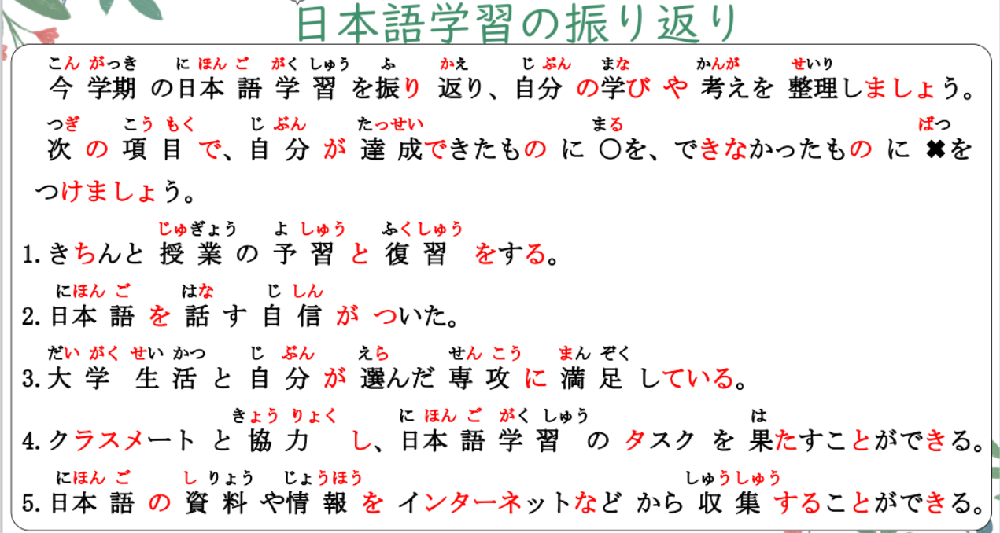
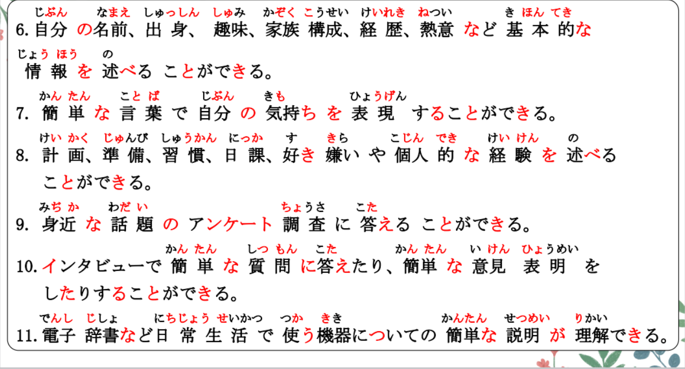
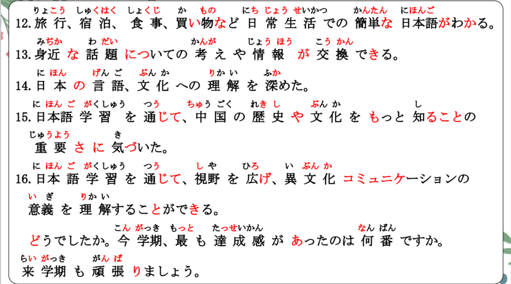
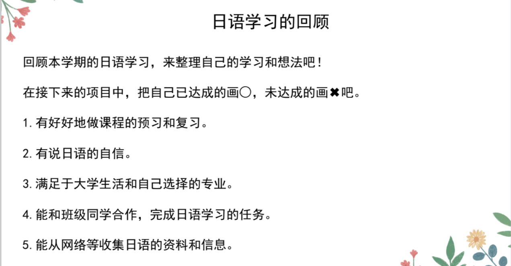
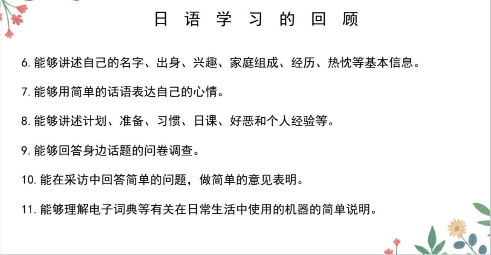
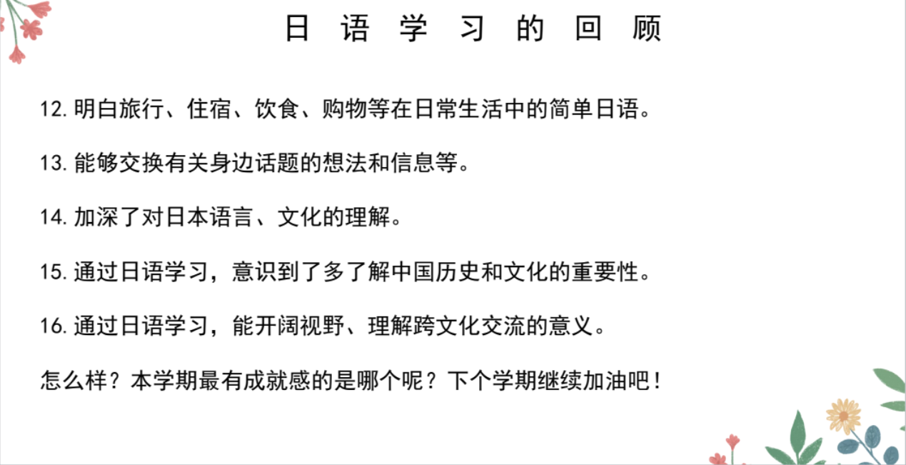

# たり、たりする、通じて

## 新出単語

<vue-plyr>
  <audio controls crossorigin playsinline loop>
    <source src="../audio/12-3-たんご.mp3" type="audio/mp3" />
  </audio>
 </vue-plyr>

| 単語                                             | 词性        | 翻译                                                         |
| ------------------------------------------------ | ----------- | ------------------------------------------------------------ |
| 男の人 <JpWord>おとこのひと</JpWord>             | ⑥<名>       | 男人；男子 男のこ 男孩子                                     |
| 振り返り<JpWord>ふりかえり</JpWord>              | ⓪<名>       | 回顾；回首                                                   |
| 今学期<JpWord>こんがっき</JpWord>                | ③<名>       | 本学期；这学期 来学期「らいがっき」                          |
| 振り返る<JpWord>ふりかえる</JpWord>              | ③<他 Ⅰ>     | 回顾；回首 勉強する 自己学                                   |
| 学び<JpWord>まなび</JpWord>                      | ⓪<名>       | 学习 学ぶ「まなぶ」 習う「ならう」跟别人                     |
| 達成<JpWord>たっせい</JpWord>                    | ⓪<名・他 Ⅲ> | 达成；完成                                                   |
| ○<JpWord>まる・丸</JpWord>                       | ⓪<名>       | 圆圈；圈儿 丸を付ける「つける」画上圈 ✖「ばつ」 ばつを付ける |
| △<JpWord>さんかく・三角</JpWord>                 | ①<名>       | 三角（形）                                                   |
| 復習<JpWord>ふくしゅう</JpWord>                  | ⓪<名・他 Ⅲ> | 复习 予習「よしゅう」                                        |
| <JpWord>きちんと </JpWord>                       | ②<副>       | 好好地；规规矩矩地；整整齐齐 きちんと復習する                |
| 自信<JpWord>じしん</JpWord>                      | ⓪<名>       | 信心；自信                                                   |
| 自信がつく<JpWord>じしんがつく</JpWord>          | ⓪-①         | 有自信                                                       |
| task<JpWord>タスク</JpWord>                      | ①<名>       | 任务                                                         |
| 果たす<JpWord>はたす</JpWord>                    | ②<他 Ⅰ>     | 发挥；起作用；实现；完成；达到                               |
| タスクを果たす 責任「せきにん」を果たす          |             | 尽到责任                                                     |
| 出身<JpWord>しゅっしん</JpWord>                  | ⓪<名>       | 出身；出生地 出身地「ち」                                    |
| 出身地は中国の長沙です。                         |             | 長沙の出身です。                                             |
| 構成<JpWord>こうせい</JpWord>                    | ⓪<名・他 Ⅲ> | 构成；组织；组成 家族構成                                    |
| 経歴<JpWord>けいれき</JpWord>                    | ⓪<名>       | 经历 Ｖたことがある                                          |
| 熱意<JpWord>ねつい</JpWord>                      | ①<名>       | 热情                                                         |
| 基本的<JpWord>きほんてき</JpWord>                | ⓪<形 Ⅱ>     | 基本的 世界 世界的                                           |
| 述べる<JpWord>のべる</JpWord>                    | ②<他 Ⅱ>     | 陈述；诉说 事実「じじつ」を述べる                            |
| 準備<JpWord>じゅんび</JpWord>                    | ①<名・他 Ⅲ> | 准备 準備できた 准备好了                                     |
| 日課<JpWord>にっか</JpWord>                      | ⓪<名>       | 日课；每天的必修课                                           |
| 好き嫌い<JpWord>すききらい</JpWord>              | ③<名        | ：好恶                                                       |
| 身近<JpWord>みぢか</JpWord>                      | ⓪<名・形 Ⅱ> | 身边；跟前                                                   |
| 話題<JpWord>わだい</JpWord>                      | ⓪<名>       | 话题 身近な話題                                              |
| 答える<JpWord>こたえる</JpWord>                  | ③<自 Ⅱ>     | 回答 質問「しつもん」に答える                                |
| interview<JpWord>インタビュー</JpWord>           | ①<名・自 Ⅲ> | 采访                                                         |
| 意見表明<JpWord>いけんひょうめい</JpWord>        | ④<名>       | 表明意见                                                     |
| 意見<JpWord>いけん</JpWord>                      | ①<名>       | 意见                                                         |
| 表明<JpWord>ひょうめい</JpWord>                  | ⓪<名・他 Ⅲ> | 表明                                                         |
| 日常<JpWord>にちじょう</JpWord>                  | ⓪<名>       | 日常 日常生活「せいかつ」                                    |
| 理解<JpWord>りかい</JpWord>                      | ①<名・他 Ⅲ> | 理解；了解 理解できた 理解了                                 |
| 宿泊<JpWord>しゅくはく</JpWord>                  | ⓪<名・自 Ⅲ> | 住宿 ホテルに宿泊する                                        |
| 言語<JpWord>げんご</JpWord>                      | ①<名>       | 语言 長沙に住んでいる 长期定居                               |
| 対する<JpWord>たいする</JpWord>                  | ③<自 Ⅲ>     | 对......；向......                                           |
| 深める<JpWord>ふかめる</JpWord>                  | ③<他 Ⅱ>     | 加深 日本文化への理解を深める                                |
| 誇り<JpWord>ほこり</JpWord>                      | ⓪<名>       | 自豪；骄傲                                                   |
| 視野<JpWord>しや</JpWord>                        | ①<名>       | 视野；眼界                                                   |
| 広げる<JpWord>ひろげる</JpWord>                  | ⓪<他 Ⅱ>     | 扩展；拓展 視野を広げる                                      |
| 異文化<JpWord>いぶんか</JpWord>                  | ②<名>       | 跨文化                                                       |
| communication<JpWord>コミュ二ケーション</JpWord> | ④<名>       | 交流；沟通                                                   |
| 交流<JpWord>こうりゅう</JpWord>                  |             |                                                              |
| 意義<JpWord>いぎ</JpWord>                        | ①<名>       | 意义 意味「いみ」 意思                                       |
| 達成感<JpWord>たっせいかん </JpWord>             | ③<名>       | 成就感                                                       |
| 昼寝<JpWord>ひるね</JpWord>                      | ⓪<名>       | 午睡；午觉 若者「わかもの」 年轻人                           |
| 人気者<JpWord>にんきもの</JpWord>                | ⓪<名>       | 受欢迎者；受追捧者                                           |
| volunteer <JpWord>ボランティア</JpWord>          | ②<名>       | 志愿者 て ぃ xi                                              |
| 成果<JpWord>せいか</JpWord>                      | ①<名>       | 成果                                                         |
| 実感<JpWord>じっかん</JpWord>                    | ⓪<名・他 Ⅲ> | 切实感受 時間「じかん」                                      |
| sheet<JpWord>シート</JpWord>                     | ①<名>       | 清单；工作表单；薄纸；整张；整版                             |

## ～たり、～たりする<交替、反复、并列>

意义：用于示例性列举两个动作或状态，暗示还有其他类似情况。也可以表示  
动作或状态反复、交替进行或出现。  
译文：又……又……；有时……有时……；时而……时而……  
接续：「たり」接动词时要接在动词的「た」形去掉「た」的形式后面，接形    
容词和名词时，要按照以下方式：    
“I类形容词词干+かったり”，“Ⅱ类形容词词干/名词+だったり”。  
说明：一般以「~たり~たりする」的形式使用，有时省略后面的「たり」。接  
I类形容词、Ⅱ类形容词或 名词时，也说「~たり~たりだ」。  

接续：Vたり／イAかったり／ナAだったり／Nだったり（怎么接た就怎么接たり）

```ts
（1）インタビューで簡単な質問に答えたり、
簡単な意見表明をしたりすることができる。
（2）日曜日は洗濯したり、掃除したりします。
（3）食べ物をここに置いたりしてはいけない。禁止把食物放在这里。
举出典型例子
（4）すいかの值段は高かったり、安かったりする。
（5）試験問題は先生によって簡単だったり難しかったりします。根据
（6）父の会社は休みの日が日曜日だったり、平日だったりです。

```
## 練習 れんしゅう

```ts
（1）暑假有时爬山有时在海里游泳。
⇒ 夏休み（に）は、山に登ったり、海を/で泳いだりする・します。
（2）A:周日会做什么呢。
⇒ 日曜日は何をしますか。　　　　　　　先生に聞く 问老师
　B:有时散步有时听音乐。おんがくをきく 聞く 聴く 精听
⇒ 散歩したり、音楽を聞いたりする・します。
```

## Ｎを通じて<手段、方法>

意义：表示借助某种工具、手段或方法达到后句叙述的目的。  
译文：通过…… Ｎをつうじて 重要さ N


```ts
（1）日本語学習を通じて、中国の歴史や文化をもっと知ることの重要さに気づいた。
（2）3人はインターネットを通じて知り合った。
（3）アルバイトを通じていろいろなことを学んだ。まなぶ
```

## 練習 れんしゅう

```ts
（1）通过运动，交到了朋友。 友達ができた。 友達ができる 交朋友
⇒ 運動を通じて、友達ができた・できました。
（2）A:通过学习，拓展了视野。 視野を広げる「しやをひろげる」
⇒ 学習「がくしゅう」を通じて、視野を広げた・広げました。　

```

## 会話

<vue-plyr>
  <audio controls crossorigin playsinline loop>
    <source src="../audio/12-3-かいわ.mp3" type="audio/mp3" />
  </audio>
 </vue-plyr>






