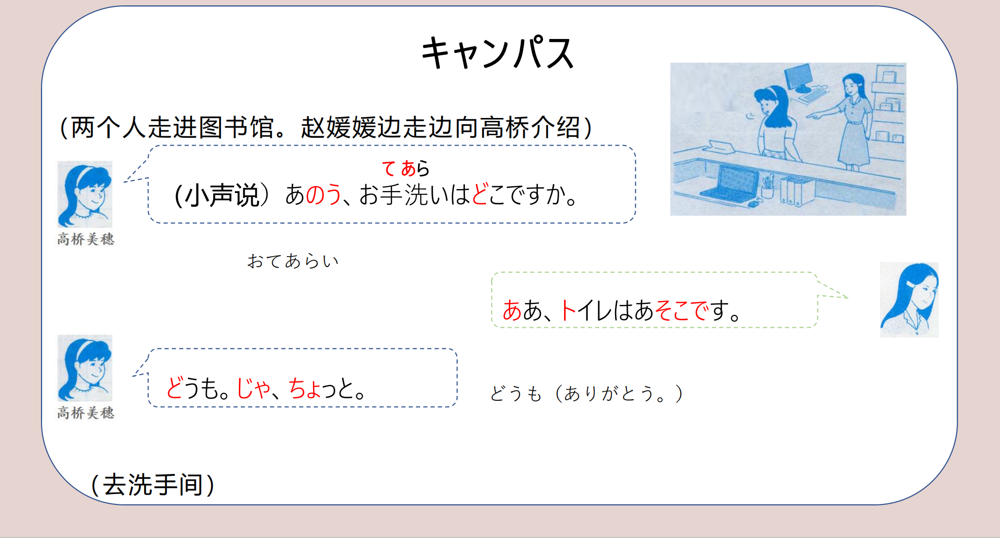

# けいようし、こそあど、も..

## 新出単語

<vue-plyr>
  <audio controls crossorigin playsinline loop>
    <source src="../audio/3-2-たんご.mp3" type="audio/mp3" />
  </audio>
 </vue-plyr>

| 単語                                                             | 词性           | 翻译                                           |
| ---------------------------------------------------------------- | -------------- | ---------------------------------------------- |
| キャンパス.スケジュール <JpWord>キャンパス.スケジュール</JpWord> | (7) <名>       | 校园日程                                       |
| campus <JpWord>キャンパス</JpWord>                               | ①<名>          | 校园                                           |
| schedule <JpWord>スケジュール</JpWord>                           | (3)(2)<名>     | 日程；日程表                                   |
| 売店 <JpWord>ばいてん</JpWord>                                   | (０)<名>       | 小卖部；商店；小铺儿                           |
| どこ <JpWord>どこ</JpWord>                                       | (１)<名>       | 哪里；哪儿                                     |
| 建物 <JpWord> たてもの</JpWord>                                  | (2)（3）<名>   | 建筑；建筑物                                   |
| え <JpWord> え</JpWord>                                          | <感>           | 表示吃惊或疑问；表示反问                       |
| 白い <JpWord> しろい</JpWord>                                    | （2）<形 I>    | 白色（的）                                     |
| あれ<JpWord> あれ</JpWord>                                       | （0）<名>      | （指代远离说话人、听话人双方的事物） 那个      |
| 向こう<JpWord> むこう</JpWord>                                   | （2）（0）<名> | 对面；那边                                     |
| 何<JpWord> なん</JpWord>                                         | （1）<名>      | 什么                                           |
| どれ<JpWord> どれ</JpWord>                                       | （1）<名>      | 哪个                                           |
| 大きい<JpWord> おおきい</JpWord>                                 | （３）<形 I>   | 大（的）                                       |
| 図書館<JpWord> としょかん</JpWord>                               | （２）<名>     | 图书馆                                         |
| 立派<JpWord>りっぱ</JpWord>                                      | ⓪<形 Ⅱ>        | 好（的）；出色（的）；棒                       |
| ここ<JpWord>ここ</JpWord>                                        | ⓪<名>          | 这里                                           |
| 閲覧室<JpWord>えつらんしつ</JpWord>                              | ③<名>          | 阅览室 教室 きょうしつ                         |
| 雑誌<JpWord>ざっし</JpWord>                                      | ◎<名>          | 杂志                                           |
| 検索用<JpWord>けんさくよう</JpWord>                              | <名>⓪          | 检索用                                         |
| 用<JpWord>よう</JpWord>                                          | ＜接尾＞       | 做……用                                         |
| 検索<JpWord>けんさく</JpWord>                                    | ⓪<名・他 Ⅲ>    | 检索                                           |
| （computer）<JpWord>コンピューター</JpWord>                      | ③<名>          | 电脑；计算机（也作「コンピュタ」）             |
| あそこ<JpWord>あそこ</JpWord>                                    | ⓪<名>          | (指代远离说话人、听话人双方的地点)那里         |
| それから<JpWord>それから</JpWord>                                | ④<接>          | (表示添加)另外；还有；之后；然后               |
| 貸し出<JpWord>しカウンター（かしだしカウンター）</JpWord>        | ⑥<名>          | 借书处                                         |
| 貸し出し<JpWord>かしだし</JpWord>                                | ⓪<名>          | 借,借出；                                      |
| counter<JpWord>カウンター</JpWord>                               | ⓪<名>          | 柜台；接待处                                   |
| そこ<JpWord>そこ</JpWord>                                        | ⓪<名>          | (指代对方附近或属于对方范围内的地点)那里；那儿 |
| あのう<JpWord>あのう</JpWord>                                    | ⓪<感>          | 那个(跟对方讲话时的客气、不好意思或犹豫的心情) |
| お手洗い<JpWord>おてあらい</JpWord>                              | ③<名>          | 洗手间；厕所 御 お                             |
| 手洗い<JpWord>てあらい</JpWord>                                  | ②<名>          | 洗手；洗手间(厕所的委婉说法) to i re           |
| トイレ<JpWord>トイレ</JpWord>                                    | ①<名>          | (「トイレット“toilet”」的省略说法)厕所,洗手间  |
| じゃ<JpWord>じゃ</JpWord>                                        | ①<接>          | (「では」的口语体用法)那么                     |
| も<JpWord>も</JpWord>                                            | <取立て助>     | (表示同类事物的添加或并列)也                   |

<vue-plyr>
  <audio controls crossorigin playsinline loop>
    <source src="../audio/3-1-2-たんご.mp3" type="audio/mp3" />
  </audio>
 </vue-plyr>

| 単語                                                             | 词性           | 翻译                                           |
| ---------------------------------------------------------------- | -------------- | ---------------------------------------------- |
|銀行<JpWord> ぎんこう</JpWord> |⓪<名>|银行 gi nn ko Ò|
|<JpWord>コンビニ</JpWord> （convenien store的省略说法）|◎＜名＞|便利店 大超市 スーパー|
|駅<JpWord>えき</JpWord>| ①<名>|车站；地铁站； ちゅうがっこう こうこう|
|学校<JpWord>がっこう</JpWord>| ◎＜名＞|学校 がく 小学 初中 しょうがっこう がくちょう|
|校長<JpWord>こうちょう</JpWord> | 旧书| ふるいほん|
|<JpWord>デパート</JpWord> （department的省略说法）|②＜名＞|百货商店|
|古い<JpWord>ふるい</JpWord>| ②<形Ⅰ>|古老（的）；传统（的）；老（的）|
|新しい<JpWord>あたらしい</JpWord> |④<形Ⅰ>|新的|
|本<JpWord>ほん</JpWord> |①<名>|书 这是本旧的日语书。|
|高い<JpWord>たかい</JpWord> |②<形Ⅰ>|高（的）；（价格、价值）贵（的）|
|低い<JpWord>ひくい</JpWord> |②<形Ⅰ>| 低；矮 安い（やすい）②<形Ⅰ>:低廉；便宜|
|<JpWord>ホテル</JpWord> （hotel）|①<名>|宾馆；饭店；酒店|
|明るい<JpWord>あかるい</JpWord>| ⓪<形Ⅰ>|明亮(的);性格开朗（的）；对……很了解|
|暗い<JpWord>くらい</JpWord> |②<形Ⅰ>|暗的|
|部屋<JpWord>へや</JpWord> |②<名>|房间 アニさんは明るい人ですね。|
|複雑<JpWord>ふくざつ</JpWord>| <形Ⅱ>⓪|复杂（的）|
|簡単<JpWord>かんたん</JpWord> |<形Ⅱ>⓪|简单的 もんだい|
|問題<JpWord>もんだい</JpWord> |<名>⓪|问题|
|有名<JpWord>ゆうめい</JpWord> |◎<形Ⅱ>|有名（的）|
|歌手<JpWord>かしゅ</JpWord>| ①<名>|歌手 て お手洗い|
|東西大学<JpWord>とうざいだいがく</JpWord>| ⑤<固名>|东西大学|
|喫茶店<JpWord>きっさてん</JpWord>| ③<名>|咖啡店；茶馆|

## 形容詞（けいようし）③

1. 什么是形容词？  
   对事物（主语）的性质、状态、大小等进行描述的单词。
2. 形容词分为两类：  
   ① 一类形容词（又名： AⅠ ， 形 Ⅰ ， い /イ 形容詞， 形い /イ ， 形容词）  
   ② 二类形容词（又名： AⅡ ， 形 Ⅱ ， な /ナ 形容詞， 形な /ナ ， 形容词）
3. 形容词的结构是什么？  
    词干+词尾  
    かわいい おいしい 美味しい

   ```ts
   一类形容词：可愛い:「い」结尾的形容词 且い是假名形式写在汉字外面
   かわい い
   词干 词尾
   ```

   ```ts
   二类形容词：立派「りっぱ」⓪：气派，出色的
   りっぱ だ
   词干 词尾
   ```

   > 特殊二类：嫌い（だ）「きらい（だ）」

4. 为什么要区分为两类呢？  
   形容词的接续-连体形

```ts
A.一类形容词 直接+名词
✿かわいい女の子 ✿すごい技 （技：わざ２ ） ✿かっこいいナルト
(可爱的女孩子） （厉害的技能） （帅气的鸣人）
```

```ts
B.二类形容词 だ → な＋ 名词 （词干+な） ri ppa
✿ 簡単な問題：かんたんなもんだい ✿賑やかな町：にぎやかなまち ✿立派な人：りっぱなひと
（简单的问题） （热闹的街道） （杰出的人物）
```

## 场所指示代名词(ここ.そこ.あそこ.どこ)

> 「ここ」 （这里）指离说话人近的场所。  
> 「そこ」 （那里）指离听话人近的场所。  
> 「あそこ」（那里）指离说话人和听话人都远的场所。  
> 「どこ」 （哪里）表示场所的疑问和不确定。

```ts
(1) 高橋：売店はどこですか。
趙：売店はあの建物です。
（2）高橋：検索用のコンピューターはどこですか。
趙：(検索用のコンピューターは)あそこです。
（3）高橋：貸し出しカウンターはどこですか。
趙：(貸し出しカウンターは)そこです。
```

## 事物指示代名词(これ.それ.あれ.どれ)

> 「これ」（这个）指离说话人近的事物。  
> 「それ」（那个）指离听话人近的事物。  
> 「あれ」（那个）指离说话人和听话人都远的事物。  
> 「どれ」（哪个）表示事物的疑问和不确定。

```ts
(1) 趙：（ 売店は ）あの白い建物です。
高橋：ああ、あれですね。
(2) 趙：それは何ですか。
高橋：これは日本語の辞書です。
(3) 高橋：検索用のコンピューターはどれですか。
趙：検索用のコンピューターはあれです。
```

## こそあど系列

| 指示词                      | こ （近称）            | そ（中称）             | あ（远称）             | ど（疑问称）           |
| :-------------------------- | :--------------------- | :--------------------- | :--------------------- | :--------------------- |
| 事物                        | これ这个               | それ那个               | あれ那个               | どれ哪个               |
| 事物，人                    | この+名词 这个~        | その+名词 那个~        | あの+名词 那个~        | どの+名词 哪个~        |
| 场所                        | ここ这里               | そこ那里               | あそこ那里             | どこ哪里               |
| 场所、人、方向、事物(郑重） | こちら这里，这位，这边 | そちら那里，那位，那边 | あちら那里，那位，那边 | どちら哪里，哪位，哪边 |

## も(类同)

意义：表示同类事物。 代替了原本的は 的位置， 也  
译文：也……  
接续：名词+も  
说明：提示句子的话题

```ts
(1) 日本語の雑誌もここですね。
日语杂志也在这里吧。
(2) 京華大学は大きい大学です。北燕大学も大きい大学です。
京华大学很大，北燕大学也很大。
(3) 鈴木さんは王さんの知り合いです。高橋さんも王さんの知り合いです。 // 知り合い しりあい
铃木是小王的熟人。高桥也是小王的熟人。
```

## それから（补充）

意义：表示补充、附加。 宫保鸡丁 辣椒炒肉**それから**乌冬  
译文：另外……、还有……  
接续：用于连接两个或者两个以上的句子、 词组或词

```ts
(1) 検索用のコンピュータは） あそこですねそれから貸出カウンター
はどこですか。
(2) 主要科目は発音、文法、会話、読解、それから作文です。
(3) 鈴木さん、高橋さん、それから山田さんは大麻の知り合いです。
```

## 会話

<vue-plyr>
  <audio controls crossorigin playsinline loop>
    <source src="../audio/3-2-かいわ.mp3" type="audio/mp3" />
  </audio>
 </vue-plyr>





