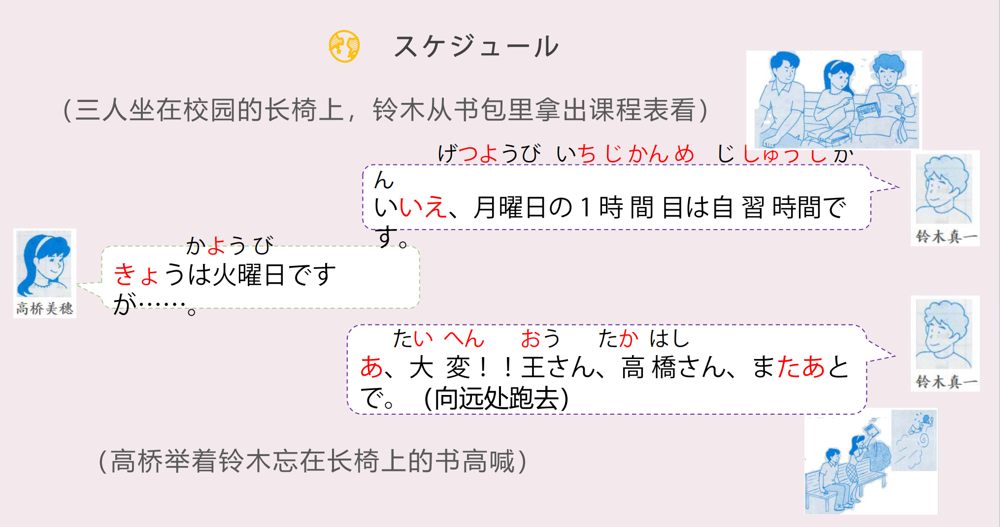

# じ、ふん、じはん

## 新出単語

<vue-plyr>
  <audio controls crossorigin playsinline loop>
    <source src="../audio/3-2-たんご.mp3" type="audio/mp3" />
  </audio>
 </vue-plyr>

| 単語                                      | 词性             | 翻译                                             |
| ----------------------------------------- | ---------------- | ------------------------------------------------ |
| 授業<JpWord>じゅぎょう</JpWord>           | ①<名・自 Ⅲ>      | 课；上课じゅぎょうちゅう                         |
| 一コマ<JpWord>ひとこま</JpWord>           | ②<名>            | 一节课 さんコマ                                  |
| 一-<JpWord>ひと～</JpWord>                | <接頭>           | 1~，1 次~；ふたこま                              |
| コマ<JpWord>こま</JpWord>                 | ⓪<名>            | 一节课，一幕，一个画面                           |
| -分<JpWord>ふん</JpWord>                  | <接尾>           | （前接促音、拨音时发ぷん的音）                   |
| 時間<JpWord>じかん</JpWord>               | ⓪<名>            | （时间单位）小时；时间                           |
| 半<JpWord>はん</JpWord>                   | <名>             | 半，半个小时，じかんはん                         |
| 1 時間目<JpWord>いちじかんめ</JpWord>     | ⑥<名>            | 第一节课                                         |
| -目<JpWord>～め</JpWord>                  | <接尾>           | (表示顺序、次数)第~                              |
| 何時<JpWord>なんじ</JpWord>               | ① ＜名＞         | 几点 何時から 从几点开始~                        |
| -時<JpWord>じ</JpWord>                    | <接尾>           | （表示时间、时刻）~点；~时                       |
| 朝<JpWord>あさ</JpWord>                   | ①<名>            | 早晨；早上                                       |
| 昼<JpWord>ひる</JpWord>                   | ②                | 中午；夜（よる）①：晚上                          |
| 午後<JpWord>ごご</JpWord>                 | ①<名>            | 下午； 下午五点 ごごごじ                         |
| 午前<JpWord>ごぜん</JpWord>               | ①                | 上午                                             |
| <JpWord>だいたい</JpWord>〖大体〗         | ⓪<副>            | 基本上；大约 だいたいごじごじゅうにふん          |
| 今日<JpWord>きょう</JpWord>               | ①<名>            | 今天                                             |
| ☆ 昨日<JpWord>きのう</JpWord>             | ②                | 明日（あした）③                                  |
| 夕方<JpWord>ゆうがた</JpWord>             | ⓪<名>            | 傍晚；黄昏                                       |
| <JpWord>でも</JpWord>                     | ① ＜接＞         | 不过；可是                                       |
| 木曜日<JpWord>もくようび</JpWord>         | ③<名>            | 星期四                                           |
| -曜日<JpWord>ようび</JpWord>              | ⓪<名>            | 星期~；一星期中的某一天                          |
| <JpWord>それ</JpWord>                     | ◎ ＜名＞（       | 指代对方近旁或属于对方范围内的事物等）那；那个   |
| 時間割表<JpWord>じかんわりひょう</JpWord> | ⓪<名>            | 课程表；时间表                                   |
| 時間割<JpWord>じかんわり</JpWord>         | ⓪<名>            | 课程表；时间表                                   |
| 表<JpWord>ひょう</JpWord>                 | ◎ ＜名＞         | 表；表格                                         |
| <JpWord>ほら</JpWord>                     | <感>①            | (用于引起对方注意) 你看                          |
| 選択科目<JpWord>せんたくかもく</JpWord>   | ⑤<名>            | 选修课                                           |
| 選択<JpWord>せんたく</JpWord>             | ⓪<名・他 Ⅲ>      | 选择                                             |
| 中国史<JpWord>ちゅうごくし</JpWord>       | <名>④            | 中国历史                                         |
| -史<JpWord>し</JpWord>                    | ~史<接尾>        | ~史                                              |
| <JpWord>あれ</JpWord>                     | ◎ ＜感＞         | 哎，不对啊 指示代词 あれ 那个                    |
| 自習<JpWord>じしゅう</JpWord>             | ⓪<名・他 Ⅲ>      | 自习                                             |
| 火曜日<JpWord>かようび</JpWord>           | ②<名>            | 星期二 たいへん な しごと                        |
| 大変<JpWord>たいへん</JpWord>             | ⓪<形 Ⅱ>          | 不得了；糟了；坏了，非常；很                     |
| <JpWord>あとで</JpWord>〖後で〗           | ①                | 待会儿（见）；等会儿（见）；再见                 |
| <JpWord>これ</JpWord>                     | ◎ ＜名＞         | （指代说话人近旁或属于说话人范围内的事物）这个   |
| 教科書<JpWord>きょうかしょ</JpWord>       | ③ ＜名＞         | 教科书                                           |
| <JpWord>どんな</JpWord><連体>①            | 什么样的；怎样的 |
| <JpWord>どんな本ですか</JpWord>           | 什么样的书？     | どの本ですか。 哪本书？                          |
| <JpWord>とても</JpWord>                   | ⓪<副>            | 非常；很 とてもきびしい                          |
| 厳しい<JpWord>きびしい</JpWord>           | ③<形 Ⅰ>          | 严厉（的）；严格（的）                           |
| <JpWord>から</JpWord>                     | ＜格助＞         | 表示起点） 从；自                                |
| <JpWord>が</JpWord>                       | ＜接助＞         | （放在句尾，使语气显得柔和）不过；可是           |
| <JpWord>まで</JpWord>                     | ＜格助＞         | （表示到达点或动作、作用、状态的终结点、范围）到 |
| 食堂<JpWord>しょくどう</JpWord>           | ◎ ＜名＞         | 食堂                                             |
| 郵便局<JpWord>ゆうびんきょく</JpWord>     | ③ ＜名＞         | 邮局                                             |
| 難しい<JpWord>むずかしい</JpWord>         | ◎<形 Ⅰ>          | 难（的）                                         |
| 夜<JpWord>よる</JpWord>                   | ① ＜名＞         | 夜晚                                             |
| 休み<JpWord>やすみ</JpWord>               | ③ ＜名＞         | 休息                                             |
| 診療<JpWord>しんりょう</JpWord>           | ⓪<名・他 Ⅲ>      | 诊疗；治疗                                       |
| 休日<JpWord>きゅうじつ</JpWord>           | ◎ ＜名＞         | 休息日                                           |

## ~じ

| １時                      | ２時       | ３時       | ４時       | ５時           | ６時         |
| :------------------------ | :--------- | :--------- | :--------- | :------------- | ------------ |
| いちじ ②                  | にじ ①     | さんじ ①   | **よじ** ① | ごじ ①         | ろくじ ②     |
| ７時                      | ８時       | ９時       | １０時     | １１時         | １２時       |
| **しちじ** ②              | はちじ ②   | **くじ** ① | じゅうじ ① | じゅういちじ ④ | じゅうにじ ③ |
| １７点                    | 19 点      |            |            |                |              |
| じゅうしちじ/じゅうななじ | じゅうくじ |            |            |                |              |

> 疑問詞：何時（なんじ）①  
> 今は何時ですか。 いまはよるくじです。 // 现在是几点。现在是晚上 9 点。  
> 只要４和时/点相连，都是よじ的读音。例如：十四点　じゅうよじ 二十四時間　にじゅうよじ

## 分 ふん　遇到ん或者促音会变成ぶん或者ぷん

| １分       | ２分       | ３分                  | ４分         | ５分              |
| :--------- | :--------- | :-------------------- | :----------- | :---------------- |
| いっぷん ① | にふん ①   | さんぷん ①            | よんぷん ①   | ごふん ①          |
| ６分       | ７分       | ８分                  | ９分         | １０分            |
| ろっぷん ① | ななふん ② | はちふん/② はっぷん ① | きゅうふん ① | じ（ゅ） ① っぷん |

> 个位为 3/4 发生了半浊音变、1/6/8/10 是发生促音变，[~っぷん]  
> 疑問詞：何分（なんぷん）① 今は何分ですか。  
> 1， 3， 4， 6， 8， 10 和分相连发生变化

```ts
(1) 七点三十分
しちじさんじゅっぷん
(2) 九点二十三分
くじ にじゅうさんぷん
```

## 半 はん

1. "几点半"用「～じはん」，统一读成-2 调

```ts
1時半（いちじはん）
```

2. 日语中表达“几个小时”用「～じかん」，统一读成-３调。

```ts
1時間（いちじかん）
4時間（よじかん）
7時間（しちじかん）
9時間（くじかん）
```

3. 日语中表达“几个半小时”用「～じかんはん」，统一读成-２调。

```ts
１時間半（いちじかんはん）
```

## 練習 れんしゅう

```ts
(1) 8点： はちじ
(2) 22点: 二十二点 にじゅうにじ
(3) 7点15分： しちじじゅうごふん
(4) 22点30分： にじゅうにじさんじゅっぷん
(5) 22点半： にじゅうにじはん
(6) 7个小时15分钟 ： しちじかんじゅうごふん
```

## 宿题

```ts
(1) 猫，兔子，还有狗都是动物。
（猫：ねこ；狗：いぬ；兔子：うさぎ；动物：どうぶつ）
(2) 这里是哪里？
(3) 这个是小王的书。那个也是小王的书。
```

## ~じ

## どても<程度>

とても是一个程度副词，修饰形容词，表示程度很深。 “很，非常”  
おもしろいアニメです。 有趣的动漫。  
✿ とてもおもしろいアニメです。 很有趣的动漫。  
高橋さんは優しいです。 高桥温柔。  
✿ 高橋さんはとても優しいです。 高桥很温柔。

## から<起点>

意义：表示起点。  
译文：从……； 自……  
接续：名词+から

```ts
（1）一時間目は何時からですか。
 (2)朝八時からです。
（3）夕方七時から選択科目の授業です。
```

## あで<终点>

意义：表示终点。  
译文：到……； ……为止  
接续：名词+まで

```ts
（1）午後は大体四時四十分までです。
（2）授業は何時までですか。
（3）私の授業は四時五十分までです。
```

## N1 から N2 まで<范围>

意义：表示范围。  
译文：从……到……  
接续：「から」和「まで」分别接在表示时间（或空间）的名词后

```ts
（1）木曜日の選択科目は夕方5時から6時40分までです。
（2）私の授業は朝8時から午後4時40分までです。
（3）授業は月曜日から金曜日までです。
```

## 会話

<vue-plyr>
  <audio controls crossorigin playsinline loop>
    <source src="../audio/3-2-かいわ.mp3" type="audio/mp3" />
  </audio>
 </vue-plyr>





