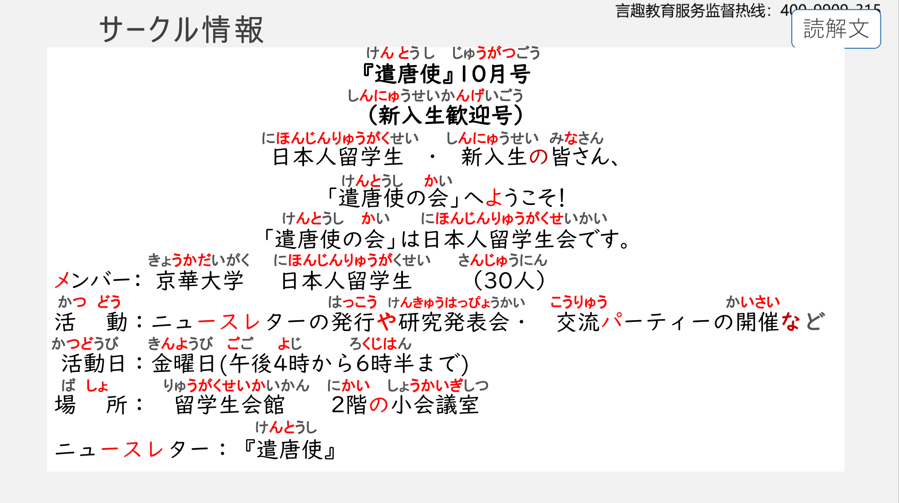
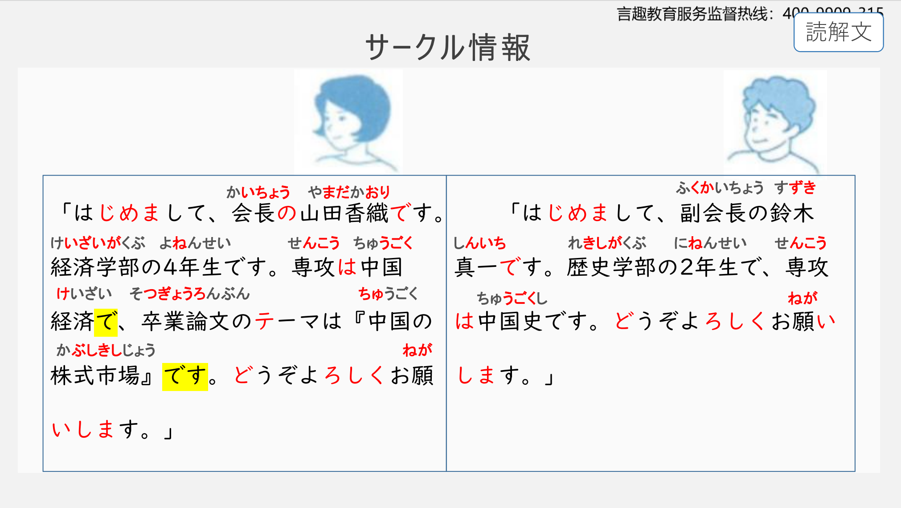
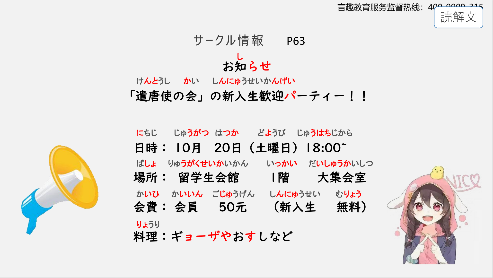
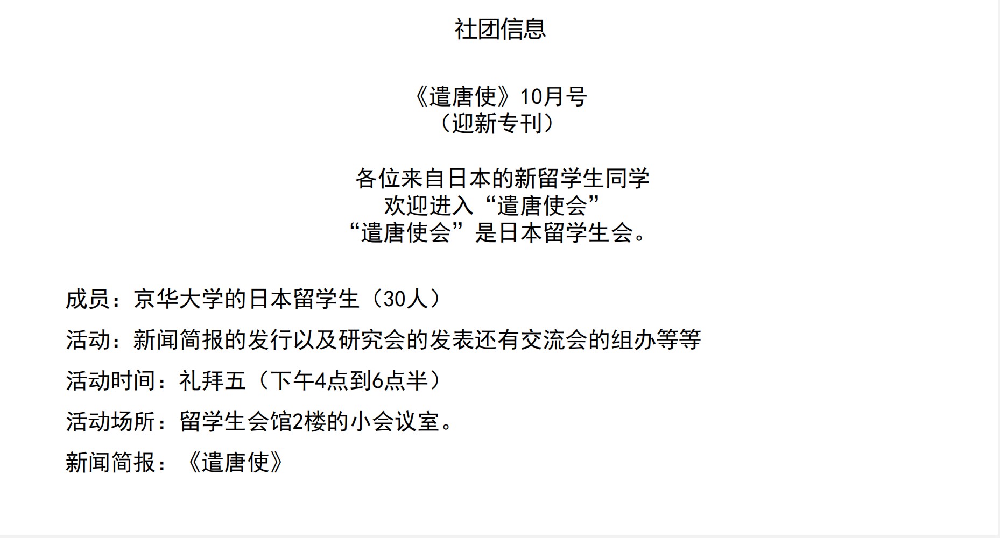
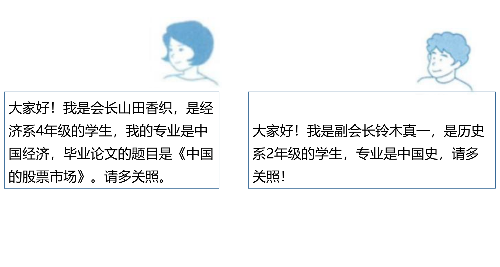
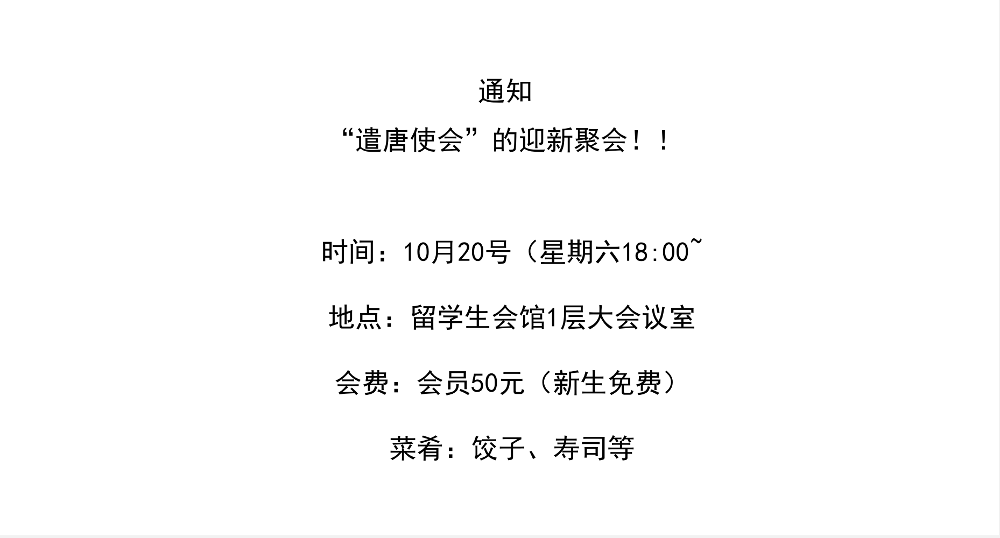

# じゃありませんか、ど..

## 新出単語

<vue-plyr>
  <audio controls crossorigin playsinline loop>
    <source src="../audio/3-3-たんご.mp3" type="audio/mp3" />
  </audio>
 </vue-plyr>

| 単語                                                        | 词性            | 翻译                                                     |
| ----------------------------------------------------------- | --------------- | -------------------------------------------------------- |
| サークル情報<JpWord>サークル じょうほう</JpWord>            | ⑤<名>           | 社团信息                                                 |
| ☆ サークル<JpWord>circle</JpWord>                           | ⓪<名>           | 小组，社团；                                             |
| 情報<JpWord>じょうほう</JpWord>                             | ⓪<名>           | 信息                                                     |
| 遣唐使<JpWord>けんとうし</JpWord>                           | ③<名>           | 遣唐使                                                   |
| 10 月号<JpWord>じゅうがつごう</JpWord>                      | ④<名>           | 10 月号；第 10 期                                        |
| ~月<JpWord>～がつ</JpWord>                                  | <接尾>          | ~月（份）；                                              |
| ~号<JpWord>～ごう</JpWord>                                  | <接尾>          | (表示杂志、报纸等定期刊物的顺序、编号)号，期             |
| 新入生<JpWord>しんにゅうせい</JpWord>                       | ③<名>           | 新生                                                     |
| 新入社員<JpWord>しんにゅうしゃいん</JpWord>                 | ⑤<名>           | 新员工，新职员                                           |
| 歓迎<JpWord>かんげい</JpWord>                               | ⓪<名・他 Ⅲ>     | 欢迎 かんげいかい                                        |
| 日本人留学生会<JpWord>にほんじんりゅうがくせいかい</JpWord> | ⑩<名>           | 日本留学生                                               |
| 留学生会<JpWord>りゅうがくせいかい</JpWord>                 | 名>             | 留学生会 ひと じん にん                                  |
| member<JpWord>メンバー</JpWord>                             | ①<名>           | 成员 me nn ba - 8.活動（かつどう）⓪<名・自 Ⅲ>:活动；工作 |
| news letterー<JpWord>ニュース・レタ</JpWord>                | ④<名>           | 新闻简报；简讯                                           |
| news<JpWord>ニュース</JpWord>                               | ①<名>           | 新闻 nyu - su                                            |
| letter<JpWord>レター</JpWord>                               | ①<名>           | 信；简报；简讯 ラブ レター                               |
| 発行<JpWord>はっこう</JpWord>                               | <名・他 Ⅲ>⓪     | 发行                                                     |
| 研究発表会<JpWord>けんきゅうはっぴょうかい</JpWord>         | ⑦<名>           | 研究发表会                                               |
| 発表<JpWord>はっぴょう</JpWord>                             | ⓪<名・他 Ⅲ>     | 发表；宣读论文                                           |
| 交流<JpWord>こうりゅう</JpWord>                             | ⓪<名・自 Ⅲ>     | 交流                                                     |
| <JpWord>パーティー</JpWord>                                 | ①               | 派对 pa - texi - い i ぃ xi                              |
| 開催<JpWord>かいさい</JpWord>                               | ⓪<名・他 Ⅲ>     | 举办；召开                                               |
| 活動日<JpWord>かつどうび</JpWord>                           | ③<名>           | 活动日                                                   |
| 金曜日<JpWord>きんようび</JpWord>                           | ③ ＜名＞        | 星期五                                                   |
| 場所<JpWord>ばしょ</JpWord>                                 | ⓪<名>           | 地点；场所 いばしょ                                      |
| 留学生会館<JpWord>りゅうがくせいかいかん</JpWord>           | ⑦ ＜名＞        | 留学生会馆                                               |
| 会館<JpWord>かいかん</JpWord>                               | ◎ ＜名＞        | 会馆                                                     |
| -階<JpWord>-かい</JpWord>                                   | ① ＜接尾＞      | 建筑物的楼层；~层                                        |
| 小会議室<JpWord>しょうかいぎしつ</JpWord>                   | ⑤<名>           | 小会议室                                                 |
| 会議<JpWord>かいぎ</JpWord>                                 | <名>①③          | 会议                                                     |
| 会長<JpWord>かいちょう</JpWord>                             | <名>⓪           | 会长                                                     |
| 専攻<JpWord>せんこう</JpWord>                               | ◎ ＜名・他 Ⅲ ＞ | 专业；专攻                                               |
| 中国経済<JpWord>ちゅうごくけいざい</JpWord>                 | ⑤<名>           | 中国经济                                                 |
| 卒業論文<JpWord>そつぎょうろんぶん</JpWord>                 | ⑤<名>           | （本科生）毕业论文                                       |
| 卒業<JpWord>そつぎょう</JpWord>                             | ⓪<名・自 Ⅲ>     | 毕业                                                     |
| 論文<JpWord>ろんぶん</JpWord>                               | ⓪<名>           | 论文                                                     |
| 德・thema<JpWord>テーマ</JpWord>                            | <名>①           | 主题；题目                                               |
| 株式市場<JpWord>かぶしきしじょう</JpWord>                   | ⑤<名>           | 股票市场；股市                                           |
| 株式<JpWord>かぶしき</JpWord>                               | ②<名>           | 股，股票，股份                                           |
| 市場<JpWord>しじょう</JpWord>                               | ⓪<名>           | 市场                                                     |
| 副会長<JpWord>ふくかいちょう</JpWord>                       | <名>③           | 副会长；                                                 |
| 副-<JpWord>ふく-</JpWord>                                   | <接頭>          | 副                                                       |
| 知らせ<JpWord>しらせ</JpWord>                               | ⓪<名>           | 通知 ていでんお知らせ（おしらせ）◎ 通知（礼貌说法）      |
| 日時<JpWord>にちじ</JpWord>                                 | ①<名>           | 日期与时间                                               |
| 大集会室<JpWord>だいしゅうかいしつ</JpWord>                 | ⑤<名>           | 大集会室；大会议室；会议厅                               |
| 大～<JpWord>だい～</JpWord>                                 | <接頭>          | 大~ 集会（しゅうかい ⓪）<名・自 Ⅲ>:集会 しょうかいぎしつ |
| 会費<JpWord>かいひ ⓪</JpWord>                               | <名>            | 会费                                                     |
| 会員<JpWord>かいいん</JpWord>                               | ⓪<名>           | 会员                                                     |
| 元<JpWord>げん</JpWord>                                     | ①<名>           | （人民币单位）元                                         |
| 円<JpWord>えん</JpWord>                                     | ①<名>           | 日元 縁                                                  |
| 無料<JpWord>むりょう</JpWord>                               | ⓪<名>           | 免费                                                     |
| 有料<JpWord>ゆうりょう</JpWord>                             | ⓪<名>           | 收费                                                     |
| 料理<JpWord>りょうり</JpWord>                               | ①<名・他 Ⅲ>     | 菜；料理；烹饪                                           |
| <JpWord>ギョーザ</JpWord>〖餃子〗                           | ⓪<名>           | 饺子                                                     |
| <JpWord>すし</JpWord>〖寿司〗                               | ②①<名>          | 寿司                                                     |
| <JpWord>や</JpWord>＜並助＞                                 |                 | （用于罗列、列举同类事物，但未穷尽）和                   |
| <JpWord>など</JpWord>【等】                                 | ＜取立て助＞    | 表示示例）等；等等                                       |
| 修士<JpWord>しゅうし</JpWord>                               | ① ＜名＞        | 硕士 大学院生 だいがくいんせい                           |
| 水曜日<JpWord>すいようび</JpWord>                           | ③ ＜名＞        | 星期三                                                   |
| 映画<JpWord>えいが</JpWord>                                 | ①⓪<名>          | 电影 えいご英语                                          |
| 鑑賞<JpWord>かんしょう</JpWord>                             | ⓪<名・他 Ⅲ>     | 鉴赏；欣赏                                               |
| 説明会<JpWord>せつめいかい</JpWord>                         | ③ ＜名＞        | 说明会                                                   |
| 説明<JpWord>せつめい</JpWord>                               | ◎<名・他 Ⅲ>     | 说明                                                     |

## N じゃありませんか。<反问>

意义：表示反问。  
译文：不是…… 吗？  
接续：是名词谓语句「Ｎです」的否定疑问形式。

```ts
（1）今は呉先生の中国史の授業じゃありませんか。
 (2)今日は月曜日ではありませんか。
（3）あの人は鈴木さんじゃありませんか。
```

## どんなんですか。<疑问>

意义：询问名词所指的人或事物的性质、状态。  
译文：什么样的……；怎样的……  
接续：是表指示的连体词「どんな」引导的疑问句。

```ts
（1）呉先生はどんな先生ですか。。
 (2)王さんはどんな学生ですか。
（3）京華大学はどんな学校ですか。
```

## 月的数法~月 （かつ）

| 一月            | 二月            | 三月          | 四月              | 五月                  | 六月                |
| :-------------- | :-------------- | :------------ | :---------------- | :-------------------- | ------------------- |
| いちがつ ④      | にがつ ③        | さんがつ ①    | しがつ ③          | ごがつ ①              | ろくがつ ④          |
| 　七月          | 　八月          | 　九月        | 　十月　          | 十一月　              | 十二月　            |
| 　しちがつ ④ 　 | 　はちがつ ④ 　 | 　くがつ ① 　 | 　じゅうがつ ④ 　 | 　じゅういちがつ ④ 　 | 　じゅうにがつ ⓪ 　 |

> 何月（なんがつ）① 几月  
> 先月（せんげつ）① 上个月  
>  来月（らいげつ）① 下个月  
>  今月（こんげつ）⓪ 这个月

## 日期的数法 にち

| 一日       | 二日     | 三日       | 四日     | 五日             | 六日           |
| :--------- | :------- | :--------- | :------- | :--------------- | -------------- |
| ついたち ④ | ふつか ⓪ | みっか ⓪   | よっか ⓪ | いつか ⓪         | むいか ⓪       |
| 七日       | 八日     | 九日       | 十日     | 十一日           | 十二日         |
| なのか ⓪   | ようか ⓪ | ここのか ⓪ | とおか ⓪ | じゅういちにち ⑥ | じゅうににち ⑤ |

> 14 日 じゅうよっか  
> 20 日 はつか  
> 17 日 じゅうしちにち  
> 24 日 にじゅうよっか  
> 19 日 じゅうくにち  
> 29 日 にじゅうくにち  
> 何日（なんにち）① 几号，几天

にち

1. 11 号~31 号：音读数字 ＋にち
2. 4 号： 只要是 4 日相连， 都读作よっか，14 日， 24 日， じゅうよっか、にじゅうよっか
3. ついたち指一号， 而不是“一天”
   其他都可以既指“号”又指“天”
4. 17 号， 19 号 じゅうしちにち、じゅうくにち
5. 20 号： はつか

> 今 日 は 何 月 何 日 で す か

```ts
（例）9月20日 ⇒ 今日はくがつはつかです。
（1） 1月1日 ⇒ 今日は（いちがつついたち）です。
（2） 8月15日 ⇒ 今日は（はちがつじゅうごにち）です。
（3） 2月14日 ⇒ 今日は（にがつじゅうよっか）です。
（4） 7月8日 ⇒ 今日は（しちがつようか）です。
```

## 楼层的读法 かい

| 1 階                                        | 2 階                  | ３階             | 4 階              | 5 階                                    | 6 階           |
| :------------------------------------------ | :-------------------- | :--------------- | :---------------- | :-------------------------------------- | -------------- |
| いっかい ⓪                                  | にかい ⓪              | さんがい ⓪       | よんかい ⓪        | ごかい ⓪                                | ろっかい ⓪     |
| 7 階                                        | 8 階                  | 9 階             | 10 階             | 11 階                                   | 12 階          |
| ななかい ⓪                                  | はっかい ⓪/はちかい ⓪ | きゅうかい ⓪     | じ（ゅ） っかい ⓪ | じゅういっかい ⓪                        | じゅうにかい ⓪ |
| 16 階                                       | 17 階                 | 18 階            | 10 階             | 20 階                                   |                |
| じゅうさんがい ⓪                            | じゅうろっかい ⓪      | じゅうななかい ⓪ | じゅうはっかい ⓪  | にじ（ゅ） っかい ⓪/にじ（ゅ） っかい ② |                |
| 30 階                                       | 100 階                | 何階             |                   |                                         |                |
| さんじ（ゅ） っかい ⓪/さんじ（ゅ） っかい ③ | ひゃっかい ⓪          | なんがい ⓪       |                   |                                         |

## 今日は何曜日ですか。// なんようび 何曜日

1. 日曜日（にちようび） 星期天
2. 月曜日（げつようび） 星期一
3. 火曜日（かようび） 星期二
4. 水曜日（すいようび） 星期三
5. 木曜日（もくようび） 星期四
6. 金曜日（きんようび） 星期五
7. 土曜日（どようび） 星期六
8. 何曜日（なんようび） 星期几

> ～曜日（ようび） ： 一律读成【-③ 调】

## N1 や N2 （など）<并列>

意义：用于列举两个或两个以上的事物。　　
译文：……等等；……之类　　
说明：「など」有时可省略

```ts
（1）活動はニュースレターの発行や研究発表会・交流パーティの開催などです。
 (2)料理はギョーザやおすしなどです。
（3）午後の授業は会話や読解などです。
```

## [~や ~など] 与[~と~]

1. 同:都接在名词后，表示并列，用于列举。
2. 异:「と」用于列举存在的全部事物，为完全列举；
   「や」暗示除了列举的事物之外还包括其他类似的事物，为部
   分列举。
   ```ts
   A: 今日の料理はギョーザ や おすしです。
   今天的菜有饺子和寿司等。（省略其他）
   ✿ B: 今日の料理はギョーザ と おすしです。
   今天的菜是饺子和寿司。（全部只有这两样）
   ```

## 会話

<vue-plyr>
  <audio controls crossorigin playsinline loop>
    <source src="../audio/3-3-かいわ.mp3" type="audio/mp3" />
  </audio>
 </vue-plyr>






