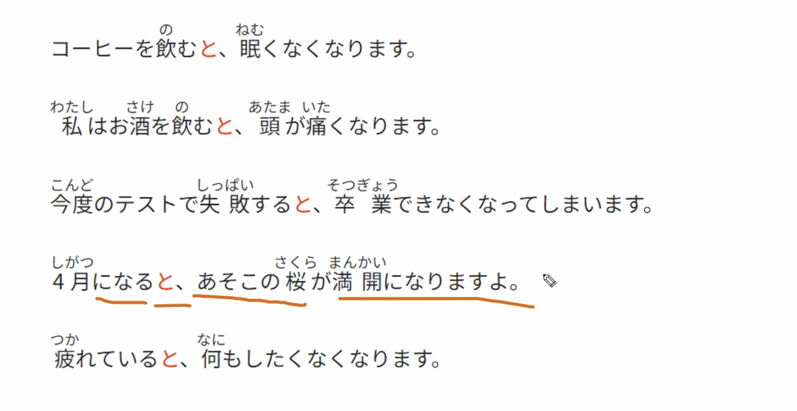
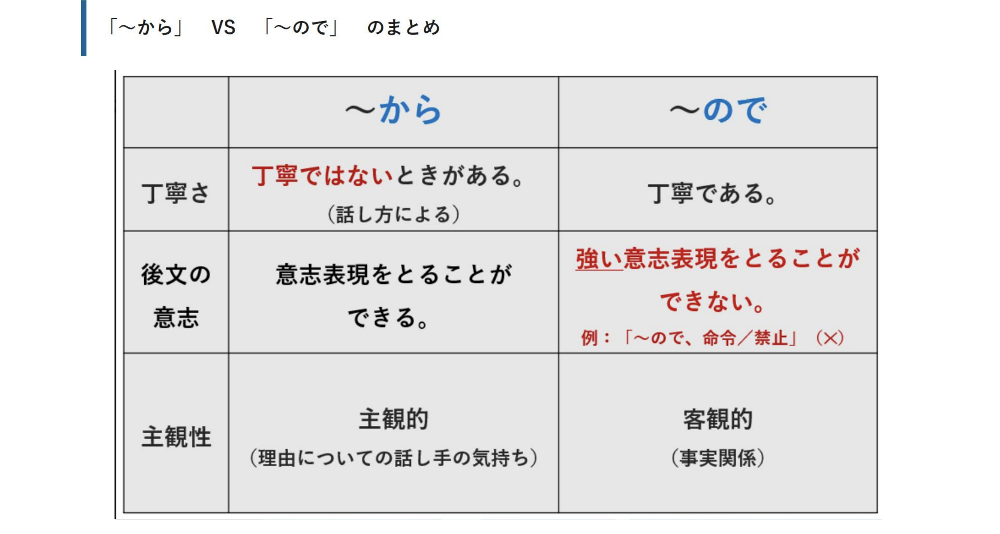
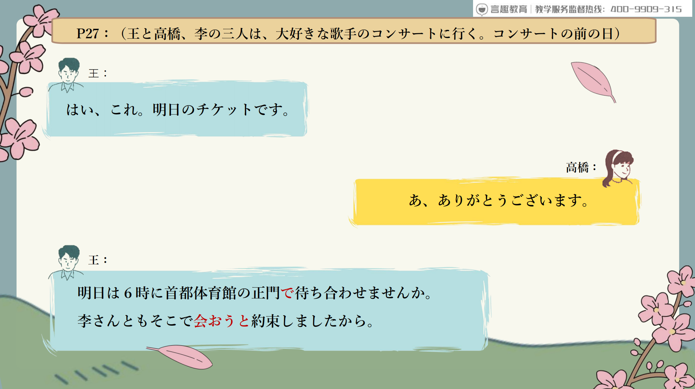
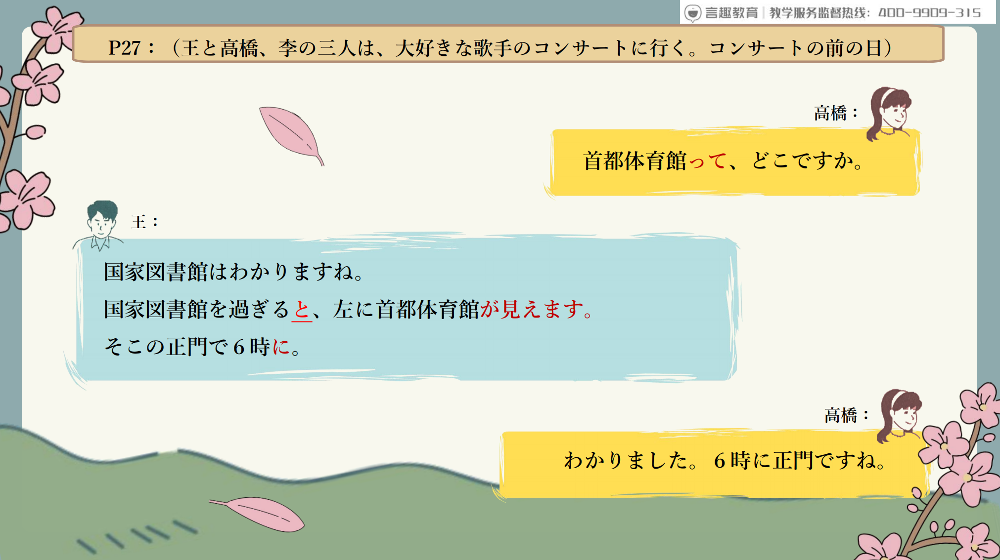
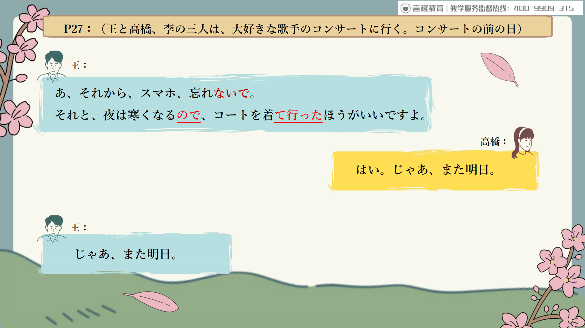
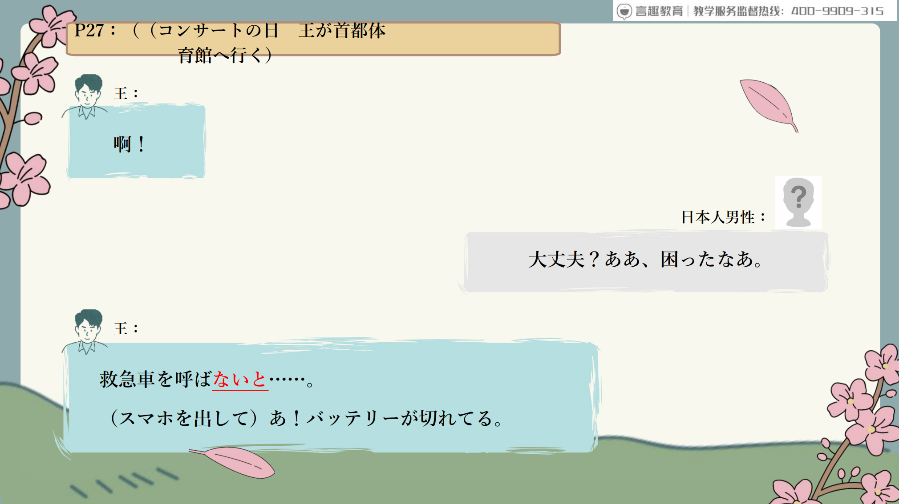
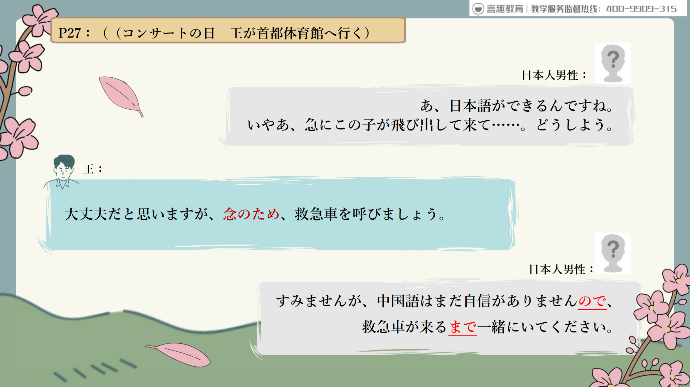
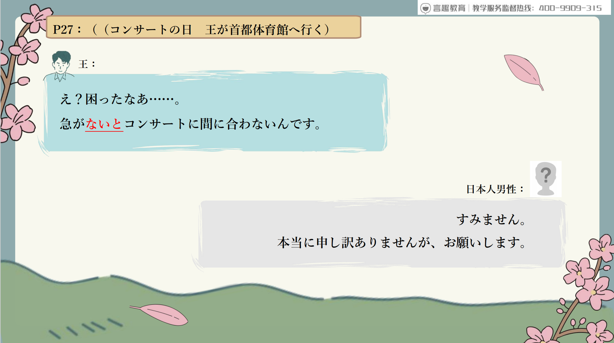
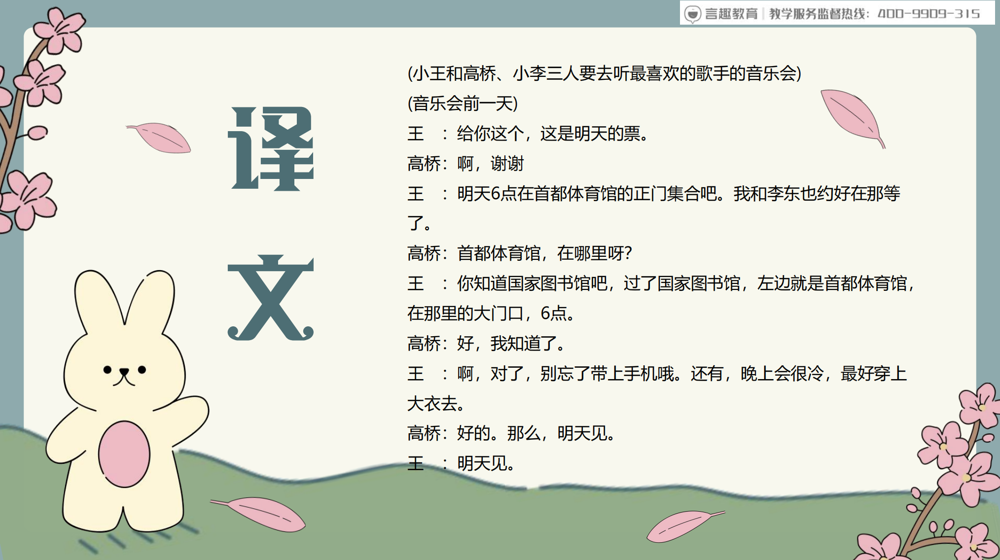
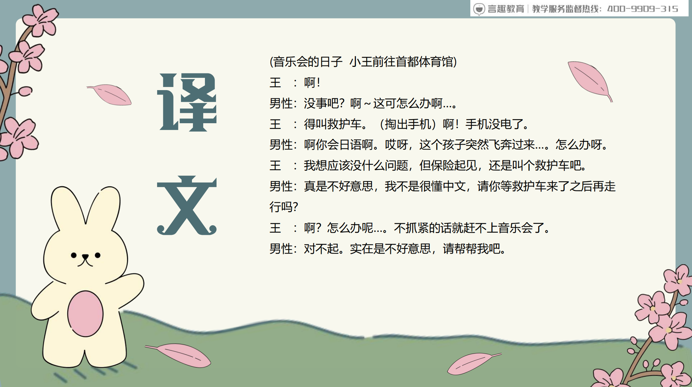

# Ⅴ た/Ⅴ ないほうがいい...

## 新出単語

<vue-plyr>
  <audio controls crossorigin playsinline loop>
    <source src="../audio/c/2-1-たんご.mp3" type="audio/mp3" />
  </audio>
 </vue-plyr>

| 単語                                                  | 词性            | 翻译                             |
| ----------------------------------------------------- | --------------- | -------------------------------- |
| 首都体育館<JpWord>しゅとたいいくかん</JpWord>         | ⑥<固名>         | 首都体育馆；首体                 |
| 首都<JpWord>しゅと</JpWord>                           | ①<名>           | 首都                             |
| 入り口<JpWord>いりぐち</JpWord>                       | ⓪<名>           | 入口                             |
| 待ち合わせる<JpWord>まちあわせる</JpWord>             | ⑤⓪<自 Ⅱ>        | 碰头；接面                       |
| 国家図書館<JpWord>こっかとしょかん</JpWord>           | ⑤<固名>         | 国家图书馆                       |
| 国家<JpWord>こっか</JpWord>                           | ①<名>           | 国家                             |
| 過ぎる<JpWord>すぎる</JpWord>                         | ②<自 Ⅱ>         | 过；经过                         |
| 左<JpWord>ひだり</JpWord>                             | ⓪<名>           | 左，左边                         |
| <JpWord>コート</JpWord> （coat）                      | ①<名>           | 外套；外衣；风衣                 |
| 着る<JpWord>きる</JpWord>                             | ⓪<他 Ⅱ>         | 穿（上衣或全身的衣服）           |
| 念のため<JpWord>ねんのため</JpWord>                   | ⓪⑤              | 保险起见，以防万一               |
| 救急車<JpWord>きゅうきゅうしゃ</JpWord>               | ③<名>           | 救护车，急救车                   |
| 救急<JpWord>きゅうきゅう</JpWord>                     | ⓪<名>           | 救护 －車（―しゃ）＜接尾＞：～车 |
| 呼ぶ<JpWord>よぶ</JpWord>                             | ⓪<他 Ⅰ>         | 叫（来）；呼喊；叫做             |
| <JpWord>バッテリー</JpWord> （battery）               | ⓪<名>           | 蓄电池                           |
| 切れる<JpWord>きれる</JpWord>                         | ②<自 Ⅱ>         | 用尽（没了）；断；断开；断绝     |
| 急<JpWord>きゅう</JpWord>                             | ⓪<形 Ⅱ>         | 突然；急                         |
| 飛び出す<JpWord>とびだす</JpWord>                     | ③<自 Ⅰ>         | 跑出；跳出；突然出现；弹出       |
| 急ぐ<JpWord>いそぐ</JpWord>                           | <自 Ⅰ>②         | 加快；抓紧时间；赶紧             |
| 間に合う<JpWord>まにあう</JpWord>                     | ③<自 Ⅰ>         | 来得及；赶得上                   |
| 申し訳ありません<JpWord>もうしわけありません</JpWord> | ⑨               | 对不起；非常抱歉                 |
| <JpWord>なぜ</JpWord> （何故）                                          | ① ＜副＞        | 为何；为什么                     |
| <JpWord>サイト</JpWord> （site）                                        | ⓪ ＜名＞        | 网站；站点                       |
| 半分<JpWord>はんぶん</JpWord>                                    | ③⓪ ＜名＞       | 一半，二分之一；半               |
| 料金<JpWord>りょうきん</JpWord>                                  | ① ＜名＞        | 费用                             |
| 信号<JpWord>しんごう</JpWord>                                    | ⓪ ＜名＞        | 红绿灯；信号                     |
| <JpWord>まっすぐ</JpWord>                                               | ③ ＜名・副＞    | 笔直；一直；正直                 |
| 北京飯店<JpWord>ぺきんはんてん</JpWord>                          | ④ ＜固名＞      | 北京饭店                         |
| <JpWord>はく</JpWord> 【履く】                                          | ⓪ ＜他 Ⅰ ＞     | 穿（裤子、裙子、鞋袜等）         |
| 飲み物<JpWord>のみもの</JpWord>                                  | ②③ ＜名＞       | 饮料                             |
| 講座<JpWord>こうざ</JpWord>                                      | ⓪ ＜名＞        | 讲座                             |
| 走る<JpWord>はしる</JpWord>                                      | ② ＜自 Ⅰ ＞     | 跑；奔跑                         |
| 車<JpWord>くるま</JpWord>                                        | ⓪ ＜名＞        | 汽车；机动车                     |
| 鳥<JpWord>とり</JpWord>                                          | ⓪ ＜名＞        | 鸟；鸡（肉）                     |
| 魚<JpWord>さかな</JpWord>                                        | ⓪ ＜名＞        | 鱼                               |
| 早い<JpWord>はやい・速い</JpWord>                                | ② ＜形 Ⅰ ＞     | 时间早（的）；快(的)             |
| <JpWord>もう</JpWord>                                                   | ⓪ ＜副＞        | 再~；又~                         |
| 田舎<JpWord>いなか</JpWord>                                      | ⓪ ＜名＞        | 乡下，农村                       |
| 暮（ら）す<JpWord>くらす</JpWord>                                | ⓪ ＜自 Ⅰ ＞     | 居住；生活                       |
| <JpWord>トピック</JpWord> （topic）                                     | ①② ＜名＞       | 话题                             |
| 悩み<JpWord>なやみ</JpWord>                                      | ③ ＜名＞        | 烦恼                             |
| 助言<JpWord>じょげん</JpWord>                                    | ⓪ ＜名・自 Ⅲ ＞ | 开导、帮助他人的话语             |
| 受け入れる<JpWord>うけいれる</JpWord>                            | ⓪④ ＜他 Ⅱ ＞    | 接受                             |
| 断る<JpWord>ことわる</JpWord>                                    | ③ ＜他 Ⅰ ＞     | 拒绝；提前告知                   |
| 中央公園<JpWord>ちゅうおうこうえん</JpWord>                      | ⑤ ＜固名＞      | 中央公园                         |
| 中央<JpWord>ちゅうおう</JpWord>                                  | ③ ＜名＞        | 中间；中心；中枢                 |
| 東小学校<JpWord>ひがししょうがっこう</JpWord>                    | ⑥ ＜固名＞      | 东小学                           |
| 小学校<JpWord>しょうがっこう</JpWord>                            | ③ ＜名＞        | 小学                             |
| 市民体育館<JpWord>しみんたいいくかん</JpWord>                    | ⑦ ＜名＞        | 市民体育馆                       |
| 市民<JpWord>しみん</JpWord>                                      | ① ＜名＞        | 市民                             |

> 一到了春天花就会开。

```ts
(1) 春になったと花が開く。
```

## ～と＜条件＞

意义：表示在某种条件下通常会出现某种必然的结果或现象。在指示方位（指路）时也经常使用。　　
译文：一~~就~~；(如果）~~就~~；一~~总是~~　　
接续：动词、Ⅰ 类形容词的词典形+と Ⅱ 类形容词词干/名词+だ＋と　　
说明：该用法中，后句为非过去时结句。

```ts
(1)国家図書館を過ぎると、左に首都体育館が見えます。
// 「国家」（こっか) //図書館（としょかん）を過ぎる（すぎる）// と、左（ひだり）に首都体育館（しゅとたいいくかん）が見える（みえる）。
经过国家图书馆后，左边就可以看到首都体育馆。
(2)春になると花が咲きます。// 春（はる）になると花（はな）が咲く（さく）。
一到春天花就开了。
(3)気温が低いと果物はおいしくならない。// 気温（きおん）が低い（ひ）と果物（かんぶつ）。“低い”（ひくい，hikui）
气温低的话，水果就变得不好吃。
(4)静かだと、勉強に集中できます。// 静か（しずか）// 勉強（べんきょう）// 集中（ちゅうしん）
安静的话，可以集中精力学习。
(5)天安門までは、地下鉄だと５分で行ける。 // 天安門（てんあんもん）// 地下鉄（ちかてつ）// 5分 （ごふん）// 行ける（いける）
乘地铁5分钟即可到达天安门。
```

> 注意：以「と」连接的前后两句，后句不能表达邀请、要求、命令、愿望、许可等情态意义。

```ts
(6)宿題が終わると、外で{×遊びませんか}邀请
  宿題が終わると、外で{×遊びましょう}邀请
  宿題が終わると、外で{×遊びたいです}愿望
  宿題が終わると、外で{×遊んでください}命令
  宿題が終わると、外で{×遊んだほうがいいよ}建议
  宿題が終わると、外で{×遊んでもいいよ}许可
(7) 例：× 春になると、桜を見に行きたいです。（希望）
       × 春になると、桜を見に行ってください。（命令）
       × 春になると、桜を見に行きませんか。（勧誘）
       × 春になると、桜を見に行こう。（意志）
```

> 注意：以「と」连接的前后两句，后句不能表达邀请、要求、命令、愿望、许可等情态意义。

```ts
(7)宿題が終わると、{自由に遊ぶことができる}。
   宿題が終わると、{テレビが見られる}。
   宿題が終わると、{遊びの時間だ}。
```



## 練習 れんしゅう

```ts
1、一到了春天，花就会开。 // 「春」（はる） //「花」（はな）// 「開く」（さく）
⇒春になると、花が咲きます。
2.在这个网站注册，就可以免费听歌。//「登録する」（とうきょする）//「無料で」（むうきゅうで）//「聞く」（きく）
⇒このサイトに登録すると、無料で歌を聞くことができる。
```

## ～ないと～ない＜否定性条件＞

意义：表示在从句表达的否定性条件的制约下，必然会出现主句表达的否定或消极的结果。  
译文：如果不......就（不）......；不......就会......  
接续：动词、形容词的简体否定形式+と～ない名词+で（じゃ）ない+と～ない  
说明：多用于叙述困难或提出警示。

```ts
(1)急がないとコンサートに間に合わないんです。// 急ぐ（いそぐ）// と // 間に合わない（まにあわない）
不快点的话就赶不上音乐会了。
(2)私は部屋が暗くないと寝られません。 // 部屋 （へや）// 暗くない（くらくない）// 寝られない（ねられない）
房间不黑的话我睡不着。
(3)電子辞書は便利でないと/便利じゃないと売れません。// 電子辞書（でんしじてい）// 便利（べんり）// 「売れ」（うれ）“卖掉”或者“销售”
电子词典如果不方便/不方便就卖不出去。
(4)このことは、王さんでないと/王さんじゃないとわかりませんね。
这件事，不是小王的话/不是小王的话就不知道了。
```

> 说明：口语中，在特定的语境下，「ないと」之后的部分也可以省略，如本课中出现的句子：

```ts
(5)救急車を呼ばないと……。
```

## 練習 れんしゅう

```ts
1.不定主题的话，就写不了报告。// テーマ // 決める // レポート // 書く
⇒テーマを決めないと、レポートが書けない。
2.不安静的话，就不能学习。// 静か // 勉強する
⇒静かでないと、勉強できない。
```

## ～ので＜原因、理由＞

意义：表示原因、理由。  
译文：由于......所以......；因为......所以......  
接续：动词、形容词的连体形+ので 名词+な+ので

```ts
(1)夜は寒くなるので、コートを着て行ったほうがいいですよ。// 夜（よる）// 寒くなる（さむくなる）// コート（コート）// 着る（きる）// 行く（いく）
因为晚上会很冷，所以最好穿上外套。
(2)中国語はまだ自信がありませんので、救急車が来るまで一緒にいてください。// 中国語（ちゅうごくご）// 自信（じしん）// 救急車（きゅうきゅうしゃ）// 来る（くる）// 一緒に（いっしょに）
我对中文还没有信心，所以在救护车来之前请和我在一起。
(3)風邪を引いたので、学校を休みました。// 風邪（かぜ）// 引く（ひく） // 学校（がっこう）// 休む（やすむ）
因为感冒了，所以没去上学。
(4)天気がいいので、子供たちは外で遊んでいます。// 天気（てんき）// 子供（こども）// 遊ぶ（あそぶ） // 外で（そとで）
天气好，孩子们在外面玩。
(5)この辞書は便利なので、いつも使っています。// 辞書（じてい）// 便利（べんり）// いつも（いつも）// 使う（つかう）
这本词典很方便，我一直在用。
```

> 注意：「～ので」在礼貌的谈话中，也可以接在敬体形式的后面。

```ts
(6)ドアが閉まりますので、ご注意ください。
因为门要关上了，所以请您注意。
```

> 「～ので」与「～から」的区别

### ① 接续不同

> Ⅱ 类形容词词干/名词+だから  
> Ⅱ 类形容词词干/名词+なので

### ② 用法不同

> 「ので」一般用于陈述客观的原因  
> 「から」一般用于陈述主观的理由。

```ts
a.乗っていたバスが故障したので、遅刻[迟到]しました。
我乘坐的公共汽车坏了，所以迟到了。
b.朝寝坊したから、遅刻しました。
因为起晚了，所以迟到了。
```

### ③ 语气不同

> 二者相比，「ので」语气更缓和一些。  
> 以命令、意志、禁止等形式结句时，一般多用「から」。

```ts
a.少し頭が痛いので、午後の授業は休んでもいいですか。
我的头有点痛，下午的课我可以不去吗？
b.電車に遅れるから、急ごう。
因为要赶电车，所以快点。
```

> 只能用「から」的情况

```ts
(1) 彼はおそらく来ないだろうから、もう会議を始めよう。「ので✖」
(2) 暑いから、窓を開けよう。「ので✖」
(3) もう間に合わないから、帰りましょう。「ので✖」
(4) 危ないから、そっちに行ってはいけませんよ。「ので✖」
(5) 聞こえないから、大きな声で言え。「ので✖」
```

> から和ので可以互换

```ts
(1) 風が強いので、埃がひどい。「から〇」
(2) 山に近いので昼間はひどく暑い。「から〇」
(3) 試験が近づいたので、みんな一所懸命勉強しています。「から〇」
(4) あまり隣の部屋がうるさいので、よくねむれませんでした。「から〇」
```



## 練習 れんしゅう

```ts
1.因为明天要考试，所以今天睡不着。// 明日 // 試験 // 今日 // 寝る
⇒明日試験なので、今日は寝られない。
2.因为不是周一，所以没有体育课。// 月曜日 // 体育授業
⇒月曜日ではないので、体育の授業はない。
```

## Ⅴ た/Ⅴ ないほうがいい＜建议、忠告＞

意义：表示建议或忠告。  
译文：最好......；......比较好/最好不......；不......比较好  
接续：Ⅴ た+ほうがいい/Ⅴ ない+ほうがいい

```ts
(1)夜は寒くなるので、コートを着て行ったほうがいいですよ。// 着て行く（きる）// 夜 （よる）// 寒くなる（さむくなる）
因为晚上会很冷，所以最好穿上外套。
(2)体に悪いから、お酒はやめたほうがいい。// お酒（おさけ）// やめる（よめる）
对身体不好，最好不要喝酒。
(3)わからないときは先生に聞いたほうがいいよ。// 聞く（きく）
不明白的时候还是问老师比较好。
(4)風邪を引いているときは、シャワーを浴びないほうがいいです。// シャワー（シャワー）// 浴びる（おこる） // 風邪（かぜ）// 引く（ひく）
感冒的时候，最好不要洗澡。
```

## 練習 れんしゅう

```ts
1.早点回家比较好。 // 早点 （はやく） // 家に帰る（かえる）
⇒早く家に帰ったほうがいい。
2.不要喝那个药比较好。// 薬（くすり） // 飲む（のむ）
⇒その薬を飲まないほうがいい。
```

## Ⅴ て来る/Ⅴ て行く＜主体的移动＞

意义：表示完成 Ⅴ 这个动作后，进行方向性的移动。「Ⅴ て来る」表示由远及近靠近说话人所处位置的移动；「Ⅴ て行く」表示由近及远离开说话人所处位置的移动。  
译文：......来/......去  
接续：Ⅴ て+来る/行く  
说明：状态性的动词（如「持つ」）则表示保持该状态进行移动。

```ts
(1)駅まで歩いて行く。// 駅（えき）// 歩く（あるく）
走着去车站。
(2)今日は飲み会なので、電車に乗って行く。// 今日 きょう  // 飲み会（のみかい）// 電車（でんしゃ）// 乗る（のる）
因为今天是酒会，所以坐电车去。
(3)会社は不便な場所にあるので、車を運転して行く。// 会社（かいしゃ）// 不便な場所（ふびんなばしょ）// 車（くるま）// 運転する（うんてんする）
公司在不方便的地方，开车去。
(4)鳥が飛んでくる。// 鳥（とり）// 飛ぶ（とぶ）
鸟飞过来。
```

## Ⅴ て来る/Ⅴ て行く＜主体的移动＞

### ケーキを買っていく。（今は家にいて目的地には着いていない。途中でケーキを買ってから目的地に行く予定。）

### ケーキを買ってきた。（今はもう目的地にいる。途中でケーキを買ってから目的地に着いた。）

### コンビニに寄ってきた。（今はもう目的地にいる。途中でコンビニに寄ってから目的地に着いた。）

### ガソリンを入れていく。（まだ目的地に着いていない。途中でガソリンを入れてから目的地に行きたい。）

```ts
(1)夜は寒くなるので、コートを着て行ったほうがいいですよ。// 着て行く（きる）// 夜 （よる）// 寒くなる（さむくなる）
因为晚上会很冷，所以最好穿上外套。
(2)何か飲みたいですね。ちょっと飲み物を買って来ます。// 何か（なにか）// 飲みたい（のみたい）// 買ってくる（かってくる）
想喝点什么。我去买点喝的。
(3)外国へ旅行するときはパスポートを持って行かなければならない。// 外国へ（がいこくへ）// 旅行する（りょこうする）// パスポート（ぱそーと）// 持っていく（もっていく）
去国外旅行必须带护照。
(4)ちょっと聞いて来るから、ここで待っててください。// 聞いてくる（きいてくる）// 待ってて（まってて）
我去打听一下，请在这里等我。
(5)今日はうちで晩ご飯を食べて行きませんか。// 晩ご飯（ばんごはん）// 食べる（たべる）// 行く（いく）
今天不在家吃完饭后再去吗？
```

## Ⅴ て来る/Ⅴ て行く＜主体的移动＞

说明：当「行く」和「来る」接在移动性动词之后时表示该动作的方向性，相当于“Ⅴ 出去、Ⅴ 过去”，或“Ⅴ 出来，Ⅴ 过来”等。

```ts
(6)急にこの子が飛び出して来て、どうしましょう。
突然这个孩子跳了出来，怎么办。
(7)私の犬は、名前を呼んだらすぐに走って来ます。
当我喊它的名字时，它立刻跑过来。
(8)風船[气球]が飛んで行きました。
气球飞走了。
```

## 練習 れんしゅう

```ts
1.因为是毕业典礼，所以穿新鞋去。
// 卒業式（そつぎょうしき）毕业典礼;新しい（あたらしい）新的;靴（くつ）鞋子;履く（はく）穿
⇒卒業式なので、新しい靴を履いて行く。
2.我去买点饮料什么的回来。// 飲み物（のみもの）“饮料、饮品”;買う(かう）买
⇒飲み物でも買って来る。
```

## Ⅴ るまで＜状态持续的终点＞

意义：表示在该动作、行为完成之前一直持续着某种状态。  
译文：......之前一直......；一直到......  
接续：动词的词典形+まで

```ts
(1)救急車が来るまで一緒にいてください。 // 救急車（きゅうきしゃ）// 来る（くる）// 一緒に（いっしょに）// いる（い）
在救护车到来之前，请和我们在一起。
(2)昨日の夜、父が帰って来るまでずっと起きていました。 // 昨日 // 父（ちちおや）// 归ってくる（かえってくる）// 起きていた（おきた）
昨天晚上，在父亲回来之前一直醒着。
(3)先輩が帰ってもいいと言うまで帰れません。// 先輩（せんぱい）// 归る（かえる）// 言う（いう）
在前辈说可以回去之前不能回去。
(4)こんな言葉があるのを、大学に入るまで知らなかった。// 言葉（ことば）// 大学（だいがく）// 入る（はいる）
上大学之前我都不知道有这么一句话。
```

## 練習 れんしゅう

```ts
1.天黑之前，一直练习网球。// 暗くなる テニスを練習する
⇒暗くなるまで、テニスを練習していた。
2.上大学之前，一直在乡下生活。// 大学に入る 田舎 暮らす
⇒大学に入るまで、田舎で暮らしていた。
```

## 会話

<vue-plyr>
  <audio controls crossorigin playsinline loop>
    <source src="../audio/c/2-1-かいわ.mp3" type="audio/mp3" />
  </audio>
 </vue-plyr>



> こっか　国家　
> 過ぎる すぎる
> 左 ひだり
> 首都体育館 しゅとたいいくかん
> 正門（せいもん）学校的正门
>  6時　ろくじ 







