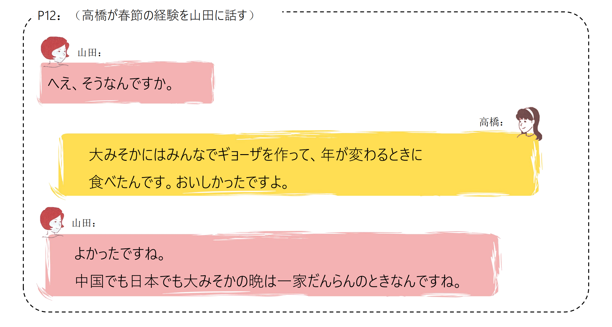

# Ⅴ た/Ⅴ ないほうがいい...

## 新出単語

<vue-plyr>
  <audio controls crossorigin playsinline loop>
    <source src="../audio/c/1-2-たんご.mp3" type="audio/mp3" />
  </audio>
 </vue-plyr>

| 単語                                                  | 词性     | 翻译                             |
| ----------------------------------------------------- | -------- | -------------------------------- |
| 首都体育館<JpWord>しゅとたいいくかん</JpWord>         | ⑥<固名>  | 首都体育馆；首体                 |
| 首都<JpWord>しゅと</JpWord>                           | ①<名>    | 首都                             |
| 入り口<JpWord>いりぐち</JpWord>                       | ⓪<名>    | 入口                             |
| 待ち合わせる<JpWord>まちあわせる</JpWord>             | ⑤⓪<自 Ⅱ> | 碰头；接面                       |
| 国家図書館<JpWord>こっかとしょかん</JpWord>           | ⑤<固名>  | 国家图书馆                       |
| 国家<JpWord>こっか</JpWord>                           | ①<名>    | 国家                             |
| 過ぎる<JpWord>すぎる</JpWord>                         | ②<自 Ⅱ>  | 过；经过                         |
| 左<JpWord>ひだり</JpWord>                             | ⓪<名>    | 左，左边                         |
| <JpWord>コート</JpWord> （coat）                      | ①<名>    | 外套；外衣；风衣                 |
| 着る<JpWord>きる</JpWord>                             | ⓪<他 Ⅱ>  | 穿（上衣或全身的衣服）           |
| 念のため<JpWord>ねんのため</JpWord>                   | ⓪⑤       | 保险起见，以防万一               |
| 救急車<JpWord>きゅうきゅうしゃ</JpWord>               | ③<名>    | 救护车，急救车                   |
| 救急<JpWord>きゅうきゅう</JpWord>                     | ⓪<名>    | 救护 －車（―しゃ）＜接尾＞：～车 |
| 呼ぶ<JpWord>よぶ</JpWord>                             | ⓪<他 Ⅰ>  | 叫（来）；呼喊；叫做             |
| <JpWord>バッテリー</JpWord> （battery）               | ⓪<名>    | 蓄电池                           |
| 切れる<JpWord>きれる</JpWord>                         | ②<自 Ⅱ>  | 用尽（没了）；断；断开；断绝     |
| 急<JpWord>きゅう</JpWord>                             | ⓪<形 Ⅱ>  | 突然；急                         |
| 飛び出す<JpWord>とびだす</JpWord>                     | ③<自 Ⅰ>  | 跑出；跳出；突然出现；弹出       |
| 急ぐ<JpWord>いそぐ</JpWord>                           | <自 Ⅰ>②  | 加快；抓紧时间；赶紧             |
| 間に合う<JpWord>まにあう</JpWord>                     | ③<自 Ⅰ>  | 来得及；赶得上                   |
| 申し訳ありません<JpWord>もうしわけありません</JpWord> | ⑨        | 对不起；非常抱歉                 |

## V ている＜持续体＞

### ① 表示动作、行为正在进行或持续。

例：今、掃除している。／水は流れている。／手紙を書いている。  
経済学を専攻している。／旅行会社に勤めている。／大学の寮に住んでいる。

### ② 表示习惯性、反复性的动作。（句中常有毎日、いつも、よく、時々等词出现）

例：祖父は毎日朝早く起きて、太極拳をやっている。／毎日牛乳を飲んでいる。

### ③ 表示动作、行为完成后，该结果仍在持续和存在。

例：橋が落ちている。（桥塌的这个结果在说话的此刻还在持续，还没修好。）  
教室に来ている。／授業は始まっている。／カギがかかっている。／帽子をかぶっている。

## V ている＜状态＞

意义：表示某种性质，状态。  
说明：做连体修饰语时可以采用「V た」的形式

```ts
(1) 王さんはお父さんに似ていると思いました。
(2) この建物と隣の建物はつながっています「连接，相连」。
(3) この道はくねくね「弯弯曲曲」曲がっています「弯曲，曲折」。
(4) この大学の学生はみんな優れています。
(5) 東のほうに、高い山が聳えている「耸立」。
(6) 着物「和服」は痩せた人も太った人もよく似合います「合适」。
```

> � 这种用法带有形容词的性质，与「ドアが開いている」「結婚している」等表示变化结果持续
> 的「V ている」意义不同。

### 持续动词：在一段时间内能持续动作。这类动词有明显的“开始 → 进行 → 结束”的持续过程。

如「読む、書く、話す、降る」等。 例：読んでいる。表正在进行

### 瞬间动词：动作行为瞬间结束，不能持续进行。死んでいる

如「始まる、終わる、立つ、座る、卒業する、消える、死ぬ」等。
例：橋が落ちている。表动作结果的存续

### 状态动词：

① 表示事物性质状态的动词。如「痩せる、太る、似る、優れる、聳える」等。  
例：娘は母に似ている。／この道はくねくね曲がっている。做谓语以 V ている形式出现  
母に似た娘／曲がった道 做连体修饰语以 V た形式出现  
② 表示恒常状态的动词。如「表示存在的ある、いる；表示能力的できる、行ける、読める」等。这类动词没有ている的形式。

## 練習 れんしゅう

```ts
1.朋友的能力很优秀。
⇒
2.这家店很拥挤。
⇒
3.这条路通到车站。
⇒
```

## N らしい/らしさ＜风格、特征＞

意义：表示具有名词所示事物的特点、性质、风格等。  
译文：很....式；具有....风格的  
接续：N ＋らしい  
说明：「N らしい」是一个复合形容词，其名词形式「N らしさ」可以用来表示某种特质、风
格

```ts
（1）春節の中国らしいイルミネーションもステキですよね。
（2）鈴木さんはとても学生らしい格好で大学に来た。
（3）彼の行動はぜんぜん男らしくないと思う。
（4）その作家の作品はいつも自分らしさを大事にしている。
```

## 練習 れんしゅう

```ts
1.今天的天气不像夏天。
⇒
2.那样的思考方式很小孩子。
⇒
3.小李总是很有精神，真有年轻人的样子。
⇒

```

## V てよかった＜积极评价＞

意义：表示对已经发生（或没有发生）的事情的积极评价。  
译文：幸好....；....，真好  
接续：V て/V ないで＋よかった

```ts
（1）春節を体験できてよかった。
（2）とてもいい映画で、見てよかったと思う。
（3）この本を捨てないでよかった。
（4）いろいろなおもしろいことを体験した。日本に来てよかったと思う。
```

## 練習 れんしゅう

```ts
1.没有放弃真是太好了。
⇒
2.出生在中国真是太好了。
⇒
3.幸好问过老师。
⇒
```

## 会話

<vue-plyr>
  <audio controls crossorigin playsinline loop>
    <source src="../audio/c/1-2-かいわ.mp3" type="audio/mp3" />
  </audio>
 </vue-plyr>





