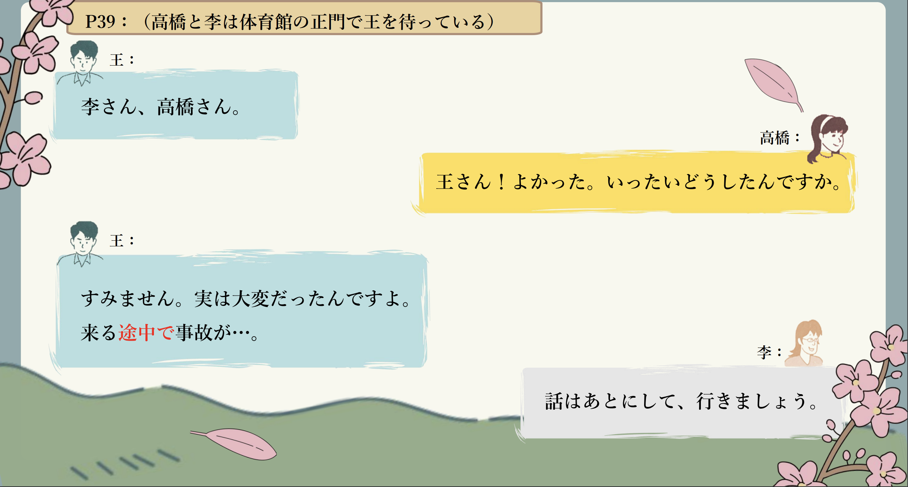
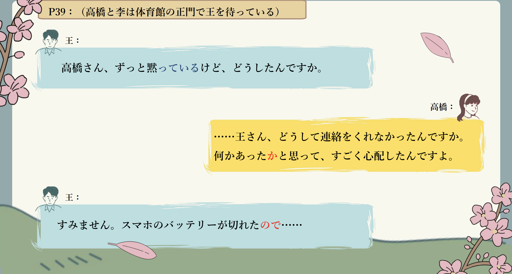
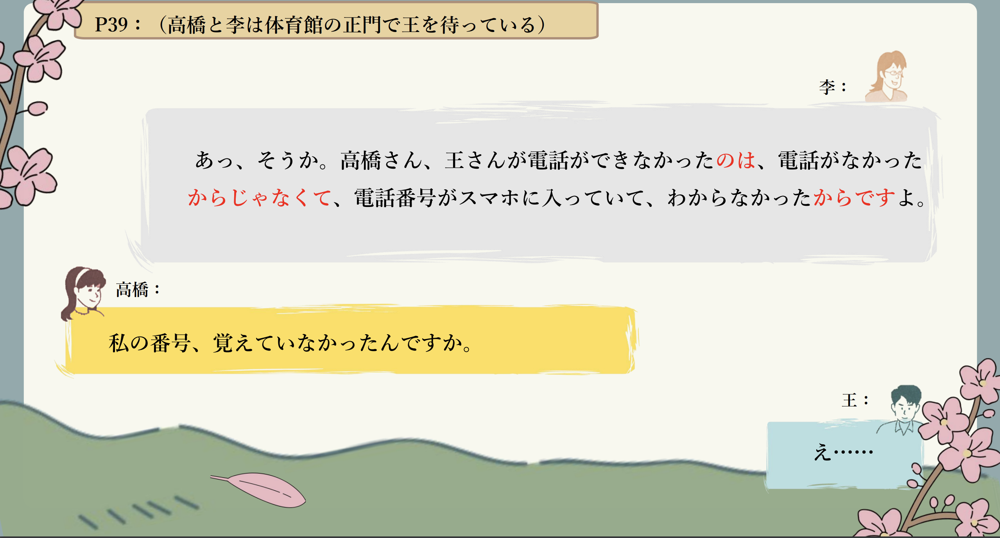
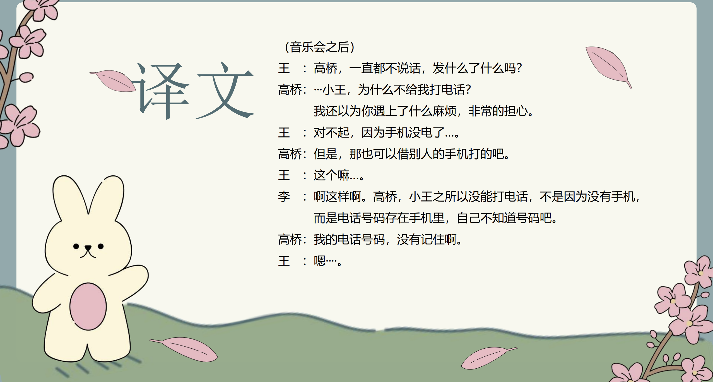

# ～か～＜疑问＞、～からだ...

## 新出単語

<vue-plyr>
  <audio controls crossorigin playsinline loop>
    <source src="../audio/c/2-2-たんご.mp3" type="audio/mp3" />
  </audio>
 </vue-plyr>

| 単語                                     | 词性                  | 翻译                                                           |
| ---------------------------------------- | --------------------- | -------------------------------------------------------------- |
| 遅刻<JpWord>ちこく</JpWord>              | ⓪<名・自 Ⅲ>           | 迟到                                                           |
| <JpWord>すぐ</JpWord>                    | ①<副>                 | 马上；即将                                                     |
| <JpWord>はず</JpWord>                    | ⓪<名>                 | 应该；会                                                       |
| 事故<JpWord>じこ</JpWord>                | ①<名>                 | 事故                                                           |
| <JpWord>あう</JpWord> 【遭う】           | ①<自 Ⅰ >              | 遭遇                                                           |
| <JpWord>いったい</JpWord> 【一体】       | ⓪<副>                 | 究竟；到底                                                     |
| 途中<JpWord>とちゅう</JpWord>            | ⓪<名>                 | 中途；半路上；事物进行中                                       |
| 黙る<JpWord>だまる</JpWord>              | ②<自 Ⅰ>               | 沉默，不说话                                                   |
| <JpWord>え</JpWord>                      | <感>                  | 表示不知该如何回答                                             |
| 先に<JpWord>さきに</JpWord>              | ⓪ ＜副＞              | 先；前面                                                       |
| 雪<JpWord>ゆき</JpWord>                  | ② ＜名＞              | 雪                                                             |
| 降る<JpWord>ふる</JpWord>                | ① ＜自 Ⅰ ＞           | 下（雨、雪等）；降（雨、雪等）                                 |
| 圏外<JpWord>けんがい</JpWord>            | ①⓪ ＜名＞             | （手机）无信号状态                                             |
| 周<JpWord>しゅう</JpWord>                | ① ＜固名＞            | （姓氏）周                                                     |
| 予算<JpWord>よさん</JpWord>              | ⓪① ＜名＞             | 预算                                                           |
| 無理<JpWord>むり</JpWord>                | ① ＜名・形 Ⅱ・自 Ⅲ ＞ | 勉强；为难                                                     |
| 財布<JpWord>さいふ</JpWord>              | ⓪ ＜名＞              | 钱包                                                           |
| <JpWord>なくす</JpWord>【無くす】        | ⓪ ＜他 Ⅰ ＞           | 丢失                                                           |
| 花見<JpWord>はなみ</JpWord>              | ③ ＜名＞              | 赏（樱）花                                                     |
| 雨<JpWord>あめ</JpWord>                  | ① ＜名＞              | 雨；雨水                                                       |
| 降りる<JpWord>おりる</JpWord>            | ② ＜自 Ⅱ ＞           | （从高处）下来；（从交通工具）下来                             |
| 迷う<JpWord>まよう</JpWord>              | ② ＜自 Ⅰ ＞           | 迷（路）；迷惘；犹豫                                           |
| 忘れ物<JpWord>わすれもの</JpWord>        | ⓪ ＜名＞              | 遗忘的物品；忘带走的东西；失物                                 |
| 気づく<JpWord>きづく</JpWord>            | ② ＜自 Ⅰ ＞           | 注意；发觉；意识到                                             |
| <JpWord>ジョギング</JpWord>（jogging）   | ⓪ ＜名・自 Ⅲ ＞       | 慢跑                                                           |
| 落（と）す<JpWord>おとす</JpWord>        | ② ＜他 Ⅰ ＞           | （从高处）放下，丢下；丢失                                     |
| 壊れる<JpWord>こわれる</JpWord>          | ③ ＜自 Ⅱ ＞           | 坏；出故障                                                     |
| 輸入品<JpWord>ゆにゅうひん</JpWord>      | ⓪ ＜名＞              | 进口产品輸入（ゆにゅう）                                       |
| <JpWord>すく</JpWord>【空く】            | ⓪ ＜自 Ⅰ ＞           | 空荡荡；（肚子）饿                                             |
| 彼<JpWord>かれ</JpWord>                  | ① ＜名＞              | 他；男朋友                                                     |
| <JpWord>ブログ</JpWord>（blog）          | ⓪ ＜名＞              | 博客；个人网页                                                 |
| 推測<JpWord>すいそく</JpWord>            | ⓪ ＜名・他 Ⅲ ＞       | 推测；估计                                                     |
| 理由<JpWord>りゆう</JpWord>              | ⓪ ＜名＞              | 理由，原因                                                     |
| <JpWord>ポップコーン</JpWord>（popcorn） | ④ ＜名＞              | 爆米花                                                         |
| <JpWord>イラスト</JpWord>                | ⓪ ＜名＞              | （イラストレーション illustration 的省略说法）插图，插画；图解 |
| 状況<JpWord>じょうきょう</JpWord>        | ⓪ ＜名＞              | 情况，状况                                                     |

## はずだ＜判断、估计＞

意义：表示依据一定的情况或理由，对众所周知的道理或事物的必然性做出判断或估计。  
译文：应该；理应；该  
接续：动词、形容词的连体形+はずだ名词+の＋はずだ

```ts
(1)（王さんはチケットを）持っているはずですけど。
小王应该有票。
(2)高橋さんは病気だから、今日は授業に来ないはずだ。
高桥生病了，今天应该不会来上课。
(3)あの人は英語が上手なはずだ。アメリカに留学に行っていたから。
那个人英语应该很好。因为他之前在美国留学过。
(4)風邪を引いたので、おいしいはずのご飯もおいしくなかった。
因为感冒了，本来应该很好吃的饭也不好吃。
(5)今日は土曜日なので、山田さんは休みのはずです。
今天是星期六，山田应该休息。
```

## 練習 れんしゅう

```ts
1.因为已经八点了，高桥应该已经回宿舍了。// [八点] はちじ // [寮] りょう
⇒もう八時だから、高橋さんはもう寮に帰っているはずだ。
2.因为高桥喜欢演剧，她应该对歌舞伎很了解。 // [演剧] えんげき // [歌舞伎] かぶき // 知る（しる) 表示“知道
⇒高橋さんは演劇が好きだから、歌舞伎のことをよく知っているはずだ。
```

## ～かもしれない＜推测＞

意义：表示说话人的推测。  
译文：也许；可能；大概  
接续：简体句子+かもしれない Ⅱ 类形容词词干、名词+かもしれない


> 说明：与「だろう/でしょう」相比，「かもしれない」的确信度更低一些。
> 「のかもしれない」是说话人根据某一事实对其背景、原因等做出推测。

```ts
(1)どこかで事故にあったのかもしれませんね。// 遭う（あう）事故（じこ）
可能是在什么地方发生了事故。
(2)お正月には、家族と海外旅行に行くかもしれません。// [お正月] おせち  // [家族] かぞく // [海外] がいかい // [旅行] りょこう
新年的时候，可能会和家人一起去海外旅行。
(3)来週の聴解の試験は難しいかもしれません。　// [来週]らいしゅう // [聴解] つうかい // [試験] しけん
下周的听力考试可能很难。
(4)明日の夜は留学生のパーティーがあるので、にぎやかかもしれませんね。// [留学生] れいがくじゅうじゅう
明天晚上有留学生的聚会，可能会很热闹。
(5)あの人は王さんに似ていますね。王さんのお父さんかもしれません。// [似ています] にている // [王さん] おうさん // [お父さん] おとうさん
那个人和小王很像呢。可能是小王的爸爸。
(6)帰ってすぐ寝たのか。疲れていたのかもしれないね。 // [帰って] かえって // [寝た] ねむった // [疲れて] つかれて // [かれない] かれない
回家后马上就睡了吗。可能是太累了吧
```

## 練習 れんしゅう

```ts
1.因为没有预算，也许不行。予算よさん無理。
⇒予算がないから、無理かもしれない。
2.我明天有点忙，所以我可能不能去参加聚会。
⇒明日はちょっと忙いから、パーティーには行けないかもしれません。
```

## Ｎの/V る途中で＜动作进行中＞

意义：表示动作正在进行的过程中，发生了其他的事情。  
译文：……过程中（发生了……）  
接续：动作性名词+の＋途中で动词的词典形＋途中で

> 说明：与「だろう/でしょう」相比，「かもしれない」的确信度更低一些。
> 「のかもしれない」是说话人根据某一事实对其背景、原因等做出推测。

```ts
(1)来る途中で事故が……。
来的路上发生了意外... ..。
(2)駅へ行く途中で、渡辺さんに会いました。
在去车站的路上，我遇到了渡边先生。
(3)散歩の途中で、いいお店を見つけました。
散步途中，发现了一家不错的店。
(4)番組の途中でお知らせがあります。
节目中途有通知。
```

## 練習 れんしゅう

```ts
1.赏花的途中，下起雨了。花見雨降り出す
⇒花見の途中で、雨が降り出した。
2.旅行的途中，手机丢了。旅行スマホを落す
⇒旅行の途中で、スマホを落した。
```

## ～か～＜疑问＞

意义：表示疑问。  
接续：接在包含疑问词的简体小句的句尾（名词或 Ⅱ 类形容词做谓语时可直接接续），构成特殊疑问句。

```ts
(1)何かあったかと思って、すごく心配したんですよ。
我以为发生了什么事，非常担心。
(2)コンサートはどこであるか教えてください。
请告诉我音乐会在哪里。
(3)お店の人にお皿が一枚いくらか聞きました。
向店员询问一个盘子多少钱。
(4)どんな料理が得意か教えてください。
请告诉我你擅长什么样的料理。
```

## 練習 れんしゅう

```ts
1.请告诉我如何制作美味的蛋糕。
⇒どうやっておいしいケーキを作るか教えてください。
2.我不知道谁的房间最干净。
⇒誰の部屋が一番綺麗かわかりません。
```

## ～のは、（～からではなくて）～からだ

意义：表示因果关系。首先提示出事情的结果，然后先对一种可能是对方所认定的原因、理由进行否定，随后再强调说明真正的原因、理由。  
译文：之所以......，（不是因为......），而是因为......  
接续：前接简体小句。  
注意：「じゃなくて」是「ではなくて」的口语表现形式。

```ts
(1)王さんが電話ができなかったのは、電話がなかったからじゃなくて、電話番号がスマホに入っていて、わからなかったからですよ。
小王不能打电话，不是因为没有电话，而是因为电话号码在手机里，所以不知道。
(2)パーティーに出ないのは、出たくないからではなくて仕事があるからだ。
不参加聚会，不是因为不想参加，而是因为有工作。
(3)食べなかったのは、嫌いだからじゃなくて、おなかがいっぱいだったからです。
没吃，不是因为讨厌，而是因为肚子饱了。
```

> 注意：当句中没有「～からではなくて」时，则是说话人对导致事情结果的原因直接做出判断，表示“之所以......，是由于......的缘故。”之意。

```ts
(4)あの人が来られなかったのは、急な用事[事情]ができたからです。
(5)病気になったのはたばこを毎日吸っていたからです。
```

## 練習 れんしゅう

```ts
1.之所以迟到了是因为来的途中发生了交通事故。
⇒遅刻したのは来る途中で、交通事故があったからだ。
2.分手不是因为变得讨厌他了，而是因为看不到和他的未来。
⇒別れたのは嫌いになったからではなくて彼との将来が見えないからだ。
```

## 会話

<vue-plyr>
  <audio controls crossorigin playsinline loop>
    <source src="../audio/c/2-2-かいわ.mp3" type="audio/mp3" />
  </audio>
 </vue-plyr>








