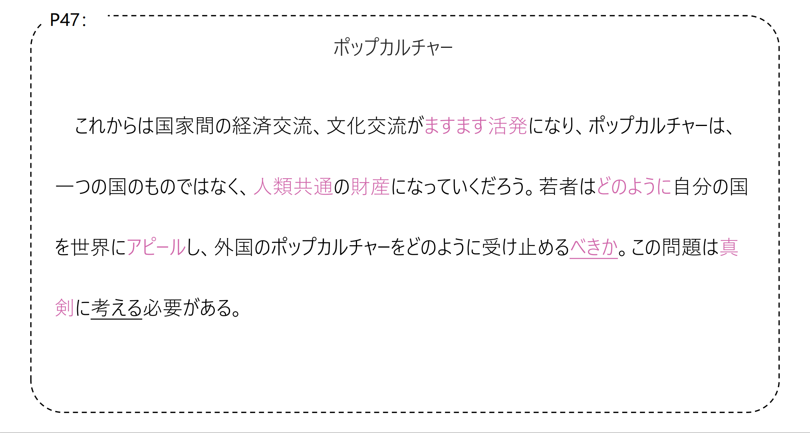

# にとどまらず...

## 新出単語

<vue-plyr>
  <audio controls crossorigin playsinline loop>
    <source src="../audio/c/2-3-たんご.mp3" type="audio/mp3" />
  </audio>
 </vue-plyr>
 
| 単語                                     | 词性                  | 翻译                                                           |
| ---------------------------------------- | --------------------- | -------------------------------------------------------------- |
| <JpWord>ポップカルチャー</JpWord> （pop culture）       | ④<名>             | 大众文化，流行文化         |
| <JpWord>カルチャー</JpWord> （culture）                 | ①<名>             | 文化                       |
| 大衆（<JpWord>たいしゅう</JpWord> ）                    | ⓪<名>             | 大众；群众                 |
| <JpWord>エンターテインメント</JpWord> （entertainment） | ⑤<名>             | 娱乐                       |
| 指す（<JpWord>さす</JpWord> ）                          | ①<他 Ⅰ>           | 指；指向；指定             |
| 国境（<JpWord>こっきょう</JpWord> ）                    | ⓪<名>             | 国界；国境；边境           |
| 越える（<JpWord>こえる</JpWord> ）                      | ⓪<他 Ⅱ>           | 越过；超出                 |
| 一衣帯水（<JpWord>いちい―たいすい</JpWord> ）           | ①-⓪<名>           | 一衣带水                   |
| 隣国（<JpWord>りんごく</JpWord> ）                      | ⓪<名>             | 邻国                       |
| 古く（<JpWord>ふるく</JpWord> ）                        | ①<名>             | 以前                       |
| 親近感（<JpWord>しんきんかん</JpWord> ）                | ③<名>             | 亲切感                     |
| <JpWord>インターネット</JpWord> （internet）            | ⑤<名>             | 互联网，因特网             |
| 海外（<JpWord>かいがい</JpWord> ）                      | ①<名>             | 海外；国外；外国           |
| <JpWord>いっそう</JpWord> 【一層】                      | ⓪①<名・副>        | 更加愈发；一层             |
| 盛ん（<JpWord>さかん</JpWord> ）                        | ⓪<形 Ⅱ>           | 旺盛；繁荣；积极           |
| 活躍（<JpWord>かつやく</JpWord> ）                      | ⓪<名・自 Ⅲ>       | 活跃；活动                 |
| 登場（<JpWord>とうじょう</JpWord> ）                    | ⓪<名・自 Ⅲ>       | 登场；出现                 |
| 増える（<JpWord>ふえる</JpWord> ）                      |  ②<自 Ⅱ>         |   增加；增多                 | 
| 上映（<JpWord>じょうえい</JpWord> ）                    | ⓪<名・他 Ⅲ>       | 上映；公映                 |
| 注目（<JpWord>ちゅうもく</JpWord> ）                    | ⓪<名・自 Ⅲ>       | 关注；注目；注视           |
| 肯定（<JpWord>こうてい</JpWord> ）                      | ⓪<名・他 Ⅲ>       | 肯定                       |
| 否定（<JpWord>ひてい</JpWord> ）                        | ⓪<名・他 Ⅲ>       | 否定                       |
| 自国（<JpWord>じこく</JpWord> ）                        | ⓪①<名>            | 本国                       |
| 消える（<JpWord>きえる</JpWord> ）                      | ⓪<自 Ⅱ>           | 消失；（火、热情等）熄灭   |
| 親しみ（<JpWord>したしみ</JpWord> ）                    | ⓪④<名>            | 亲切；亲近感；亲密感       |
| <JpWord>つまり</JpWord>                                 | ①<接>             | 即；换言之；就是说         |
| 役立てる（<JpWord>やくだてる</JpWord> ）                | ④<他 Ⅱ>           | 有用；起作用               |
| 排除（<JpWord>はいじょ</JpWord> ）                      | ①<名・他 Ⅲ>       | 排除；驱除                 |
| <JpWord>ますます</JpWord>                               | ②<副>             | 愈发；越来越               |
| 活発（<JpWord>かっぱつ</JpWord> ）                      | ⓪<名・形 Ⅱ>       | （活动、现象等）频繁；活跃 |
| 人類（<JpWord>じんるい</JpWord> ）                      | ①<名>             | 人类                       |
| 共通（<JpWord>きょうつう</JpWord> ）                    | ⓪<名・形 Ⅱ・自 Ⅲ> | 共通                       |
| 財産（<JpWord>ざいさん</JpWord> ）                      | ①⓪<名>            | 财产                       |
| <JpWord>どのよう</JpWord>                               | ①<形 Ⅱ>           | 怎样的；什么样的           |
| <JpWord>アピール</JpWord> （appeal）                    | ②<名・自他 Ⅲ>     | 宣传介绍；呼吁             |
| 受け止める（<JpWord>うけとめる</JpWord> ）              | ④⓪<他 Ⅱ>          | 接住；接受                 |
| 真剣（<JpWord>しんけん</JpWord> ）                      | ⓪<形 Ⅱ>           | 认真                       |
| <JpWord>アーティスト</JpWord>（artist）| ①＜名＞| 艺术家| 
| <JpWord>バラエティー</JpWord>（variety）| ③＜名＞| 综艺；变化；多样性；变种，异体| 
| 苦しむ（<JpWord>くるしむ</JpWord>）| ③＜自Ⅰ＞| 痛苦；艰难；难受| 
| 飲食業（<JpWord>いんしょくぎょう</JpWord>）| ⑤＜名＞| 餐饮业| 
| 全体（<JpWord>ぜんたい</JpWord>）| ⓪＜名＞| 全体；整体| 
| 円高（<JpWord>えんだか</JpWord>）| ⓪＜名＞| 日元升值| 
| 場所（<JpWord>ばしょ</JpWord>）| ⓪＜名＞| （相扑）比赛；赛季；会场| 
| 本場所（<JpWord>ほんばしょ</JpWord>）| ⓪＜名＞| （每年举行6次的）相扑正式比赛| 
| 地方場所（<JpWord>ちほうばしょ</JpWord>）| ④＜名＞| 全国巡回相扑表演（比赛）| 
| 込む（<JpWord>こむ</JpWord>）| ①＜自Ⅰ＞| 混杂；拥挤| 
| 出会い（<JpWord>であい</JpWord>）| ⓪＜名＞| 相遇；相逢；邂逅| 
| 今後（<JpWord>こんご</JpWord>）| ⓪＜名＞| 今后，以后| 
| 手段（<JpWord>しゅだん</JpWord>）| ①＜名＞| 手段，办法| 
| 進歩（<JpWord>しんぽ</JpWord>）| ①＜名・自Ⅲ＞| 进步| 
| <JpWord>さらに</JpWord>【更に】| ①＜副＞| 更加| 
| <JpWord>ボランティア</JpWord>（volunteer）| ②＜名＞| 志愿者| 
| <JpWord>できるだけ</JpWord>| ⓪＜副＞| 尽力，尽可能| 
| 広がる（<JpWord>ひろがる</JpWord>）| ⓪＜自Ⅰ＞| 扩展，蔓延，展开| 
| 方々（<JpWord>かたがた</JpWord>）| ②＜名＞| 各位| 
| <JpWord>プロジェクト</JpWord>（project）| ②③＜名＞| 项目；计划| 
| 成功（<JpWord>せいこう</JpWord>）| ⓪ ＜名・自Ⅲ＞| 成功| 
| 不況（<JpWord>ふきょう</JpWord>）| ⓪＜名＞| 不景气，萧条| 
| 倒産（<JpWord>とうさん</JpWord>）| ⓪＜名・自Ⅲ＞| 倒闭，破产| 
| 不注意（<JpWord>ふちゅうい</JpWord>）| ②＜名・形Ⅱ＞| 不注意；粗心大意| 
| 発生（<JpWord>はっせい</JpWord>）| ⓪＜名・自Ⅲ＞| 发生；产生| 
| 確か（<JpWord>たしか</JpWord>）| ①＜形Ⅱ＞| 确实；的确| 
| 接客（<JpWord>せっきゃく</JpWord>）| ⓪＜名・自Ⅲ＞| 会客；接待客人| 
| 質（<JpWord>しつ</JpWord>）| ⓪＜名＞| 质量；品质| 
| <JpWord>サービス</JpWord>（service）| ①＜名・自Ⅲ＞| 服务| 
| 急成長（<JpWord>きゅうせいちょう</JpWord>）| ③＜名・自Ⅲ＞| 迅速成长；迅速发展壮大| 
| 新型コロナ（<JpWord>しんがた-コロナ</JpWord>）| ⓪‐①＜固名＞| 新型冠状病毒| 
| 新型（<JpWord>しんがた</JpWord>）| ⓪＜名＞| 新型| 
| <JpWord>コロナ</JpWord>| ①＜名＞| （コロナウイルスcorona virus的省略说法）冠状病毒| 
| 人手不足（<JpWord>ひとでぶそく</JpWord>）| ④＜名＞| 人手不足| 
| 人手（<JpWord>ひとで</JpWord>）| ⓪＜名＞| 人手| 
| 不足（<JpWord>ふそく</JpWord>）| ⓪＜名・自Ⅲ＞| 不足，短缺| 
| 深刻（<JpWord>しんこく</JpWord>）| ⓪＜形Ⅱ＞| 严肃；严重| 
| <JpWord>ボールペン</JpWord>（ballpen）| ⓪＜名＞| 圆珠笔| 
| 花屋（<JpWord>はなや</JpWord>）| ②＜名＞| 花店| 
| 通る（<JpWord>とおる</JpWord>）| ①＜自Ⅰ＞| 通过；通行| 
| 弱気（<JpWord>よわき</JpWord>）| ⓪③＜名・形Ⅱ＞| 软弱、怯弱| 
| <JpWord>ストレス</JpWord>（stress）| ②＜名＞| 压力| 
| <JpWord>たまる</JpWord>【溜まる】| ⓪＜自Ⅰ＞| 积存，积压；攒| 
| 失恋（<JpWord>しつれん</JpWord>）| ⓪＜名・自Ⅲ＞| 失恋| 
| 与える（<JpWord>あたえる</JpWord>）| ⓪＜他Ⅱ＞| 给与| 
| ‐法（<JpWord>‐ほう</JpWord>）| ＜接尾＞| 方法| 
| 基礎（<JpWord>きそ</JpWord>）| ①②＜名＞| 基础| 
| 洋服（<JpWord>ようふく</JpWord>）| ⓪＜名＞| 洋服，洋装；西服| 
| 世（<JpWord>よ</JpWord>）| ①＜名＞| 人世间；社会；世道| 
| 戦争（<JpWord>せんそう</JpWord>）| ⓪＜名＞| 战争| 
| 欠席（<JpWord>けっせき</JpWord>）| ⓪＜名・自Ⅲ＞| 缺席| 
| 減らす（<JpWord>へらす</JpWord>）| ⓪＜他Ⅰ＞| 减少；削减| 
| 見た目（<JpWord>みため</JpWord>）| ⓪①＜名＞| 外观；看起来| 
| 判断（<JpWord>はんだん</JpWord>）| ①＜名・他Ⅲ ＞| 判断| 
| 悪口（<JpWord>わるくち・わるぐち</JpWord>）| ②＜名＞| （说）坏话| 
| 分ける（<JpWord>わける</JpWord>）| ②＜他Ⅱ＞| 区分| 
| 世代（<JpWord>せだい</JpWord>）| ①⓪＜名＞| 辈；代|

## Ｎ/Ⅴ るにとどまらず＜非限定＞

意义：表示谓语叙述的事项不仅限于该范围或程度，还会继续扩展、发展。　　
译文：不仅仅......　　
接续：名词/动词的词典形+にとどまらず

```ts
（(1)ポップカルチャーはその国にとどまらず、国境を越えて世界中の若者を魅了している。
流行文化并不局限于这个国家，它跨越国界，吸引着全世界的年轻人。
(2)あの歌手は、国内にとどまらず、海外でも活躍している。
那位歌手不仅在国内，在海外也很活跃。
(3)調査の対象は大学生にとどまらず、高校生にも拡大している。
调查对象不仅限于大学生，还扩大到了高中生。
(4)簡単な会話ができるにとどまらず、コミュニケーション能力も身につけなければならない。
不仅要具备简单的会话能力，还要具备沟通能力。
(5)彼女は英語が話せるだけじゃなくて、フランス語とアラビア語も話せます。
她不仅会说英语，还会说法语和阿拉伯语。
```

## 練習 れんしゅう

```ts
1.那个女演员不仅是在日本国内，在世界舞台也很活跃。// 【かつやく】活躍
⇒あの女優さんは日本国内にとどまらず、世界中で活躍している。
2.不仅解说词语的意思，那个用法也要介绍。
⇒言葉の意味を解説するにとどまらず、その使い方も紹介する。
```

## Ｎにより/Ｎによって＜原因＞

意义：表示原因，谓语一般为过去时，用来说明结果。  
译文：因为......而......；由于......原因而......  
说明：多用于书面语。

```ts
(1)インターネットの普及によって、海外の情報が手に入りやすくなり、文化交流もいっそう盛んになった。
互联网的普及，使国外的信息更容易获得，文化交流也更加频繁。
(2)交通事故によって電車は３時間も遅れた。
由于交通事故，电车晚点了3个小时。
(3)戦争によっておおぜいの人がなくなった。
许多人因战争而死亡。
(4)南の地方は今回の台風により大きな被害を受けた。
南部地区受到此次台风的严重破坏。
```

## 練習 れんしゅう

```ts
1.由于经济不景气，很多公司倒闭了。// 「ふきょう」「とうさん」
⇒不況によって、多くの会社が倒産している。
2.由于司机的疏忽，发生了事故。// 「うんてんしゅ」「ふちゅうい」
⇒運転手の不注意によって、事故があった。
```

## Ⅴ やすい/Ⅴ にくい＜难易＞

意义：表示该动作或变化容易或是不容易进行。  
译文：容易....../不容易......；好....../难......  
接续：动词的第一连用形+やすい/にくい说明：动词后接「やすい/にくい」后构成派生形容词。

```ts
(1)インターネットの普及によって、海外の情報が手に入りやすくなり、文化交流もいっそう盛んになった。
互联网的普及，使国外的信息更容易获得，文化交流也更加频繁。
(2)歩きやすい靴をはいて出かけます。
穿好走的鞋子出门。
(3)このコップは軽くて割れにくい。
这个杯子很轻，不容易碎。
(4)内容を理解すると覚えやすくなる。
理解了内容就容易记住。
(5)これはちょっと言いにくい話なんですが……。
这件事有点难以启齿..
```

## 練習 れんしゅう

```ts
1.这本词典便于使用。
⇒この辞書は使いやすい。
2.这本杂志字小，很难读。
⇒この雑誌は字が小さくて、読みにくい。
```

## Ⅴてくる/Ⅴていく＜动作、变化的持续＞

意义：以说话的时间为基准，表示状态变化的开始、事物的发展过程或是动作的继续等。  
译文：......来；......起来；一直....../......下去；继续......  

> 说明：①「Ⅴてくる 」表示事物由过去到现在（强调从过去的某一时点起到说话时或某一特定的时点）的逐渐变化的过程或状态的持续。

```ts
(1)文化交流もいっそう盛んになってきた。
文化交流更加频繁。
(2)人工知能の技術はこれまで少しずつ進歩してきた。
迄今为止，人工智能技术已经有所进步。
(3)李先生はずっと中学校で英語を教えてきた。
李老师一直在中学教英语。
(4)最近日本に住む外国人が多くなってきた。
最近住在日本的外国人多起来了。
```

> 「Ⅴてくる 」这种形式还可以表示说话人某种感觉的加强。

```ts
(5)だんだん寒くなってきた。
(6)周り「周围」に一人もいなくてだんだん怖くなってきた。
```

> ②「Ⅴていく」表示事物由现在到以后（强调从说话时起到以后的某一时点）的发展变化过程以及状态的继续。与「Ⅴてくる」不同的是，「Ⅴていく」不能表示变化的开始。

```ts
(1)ポップカルチャーは一つの国のものではなく、人類共通の財産になっていくだろう。
流行文化不属于任何一个国家，而将成为人类的共同财富。
(2)人工知能の技術はこれからも進んでいくだろうと思います。
我认为人工智能技术将继续发展下去。
(3)今後も一生懸命頑張っていきたいと思います。よろしくお願いします。
今后也想拼命努力。很高兴见到你。
(4)私は結婚しても仕事を続けていきたいと考えています。
即使结婚了，我也想继续工作。
```

> 「Ⅴていく」还可以表示事物、现象的消失

```ts
(5)星がだんだん消えていく。
星星逐渐消失。
(6)ふるさとの習慣がなくなっていくのが残念なことだ。
令人遗憾的是，家乡的习惯正在消失。
```

> 「Ⅴてくる 」和「Ⅴていく」


## Ｎの/Ⅴるたびに＜同一情况的反复＞

意义：表示某种动作、行为反复进行或某种现象反复出现时所发生的相同的情况。  
译文：每当......就......；每......都......  
接续：动作性名词+のたびに动词的词典形+たびに  
 
```ts
(1)日本のアニメは中国で上映するたびに人気を呼んでおり、中国のアニメも世界から注目を集めている。
日本的动画片每次在中国上映都很受欢迎，中国的动画片也受到了世界的关注。
(2)この写真を見るたびに、昔のことを思い出します。
每次看到这张照片，都会想起以前的事情。
(3)鈴木さんは北京へ来るたびに、私を訪ねてくれます。
铃木每次来北京都会来看我。
(4)学生たちは、大学祭のたびに、いろいろな模擬店を出します。
学生们在每个大学节都会摆出各种各样的摊位。
```

## 練習 れんしゅう

```ts
1.每当从花店前走过，心情总是很开朗。// [明るい][とおる]
⇒花屋の前を通るたびに、いつも明るい気持ちになる。
2.一想到考试，就会变得很胆怯，压力也很大。// [弱気][ストレスもたまる]
⇒試験のことを考えるたびに、弱気になって、ストレスもたまる。
```

## 会話

<vue-plyr>
  <audio controls crossorigin playsinline loop>
    <source src="../audio/c/2-3-かいわ.mp3" type="audio/mp3" />
  </audio>
 </vue-plyr>




