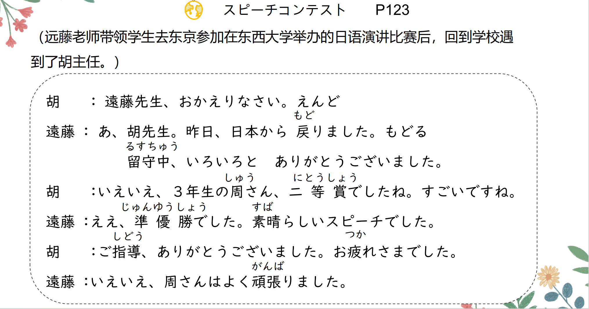

# に、くる...

## 新出単語

<vue-plyr>
  <audio controls crossorigin playsinline loop>
    <source src="../audio/6-1-たんご.mp3" type="audio/mp3" />
  </audio>
 </vue-plyr>

| 単語                                                   | 词性                         | 翻译                                                                                        |
| ------------------------------------------------------ | ---------------------------- | ------------------------------------------------------------------------------------------- |
| <JpWord>スピーチコンテスト</JpWord>（speech contest）  | ⑤<名>                        | 演讲比赛                                                                                    |
| <JpWord>スピーチ</JpWord>（speech）                    | ②<名・自 Ⅲ>                  | 演讲；致辞；讲话                                                                            |
| <JpWord>コンテスト</JpWord>（contest）                 | ①<名>                        | 比赛；大赛 テスト しけん                                                                    |
| 応援<JpWord>おう えん</JpWord>                         | ◎<名·他 Ⅲ>                   | 应援；后援；支持                                                                            |
| お帰りなさい<JpWord>お かえり なさい</JpWord>          | ⑥                            | (您)回来啦 ただいま                                                                         |
| 戻る<JpWord>もど る</JpWord>                           | ②<自 Ⅰ>                      | 返回；回到 帰る 以前の生活に戻りたい ☆ 回到出发地，原来所在的位置（还有表示恢复原状的意思） |
| 留守<JpWord>る す</JpWord>                             | ①<名>                        | 不在家；外出                                                                                |
| <JpWord>いえいえ</JpWord>                              | ②                            | 「いいえ」的口语形式）不不 い/える                                                          |
| 二等賞<JpWord>に とう しょう</JpWord>                  | ② ＜名＞                     | 二等奖                                                                                      |
| -賞<JpWord>-しょう</JpWord>                            | ＜接尾＞                     | ……奖                                                                                        |
| <JpWord>すごい</JpWord>                                | ② ＜形 Ⅰ ＞                  | 很棒（的）；厉害（的）                                                                      |
| 準優勝<JpWord>じゅん ゆう しょう</JpWord>              | ③                            | 亚军；第二名                                                                                |
| 準-<JpWord>じゅん-</JpWord>                            | ＜接頭＞                     | 准……                                                                                        |
| 優勝<JpWord>ゆうしょう</JpWord>                        | ◎ 冠军 第三位（だい さんい） | 季军                                                                                        |
| <JpWord>すばらしい</JpWord>〖素晴らしい〗              | ④<形 Ⅰ>                      | 出色(的);优秀(的)；好(的)                                                                   |
| 指導<JpWord>し どう</JpWord>                           | ◎ ＜名・他 Ⅲ ＞              | 指导；教导；辅导；领导 ご指導いただき、ありがとうございました                               |
| お疲れさまでした<JpWord>お つかれ さま でした</JpWord> | ⑦                            | （您）辛苦了                                                                                |
| 頑張る<JpWord>がん ば る</JpWord>                      | ③ ＜自他 Ⅰ ＞                | 努力；加油 がんばって                                                                       |
| 今年<JpWord>こ とし</JpWord>                           | ◎ ＜名＞                     | 今年                                                                                        |
| 世界中<JpWord>せ かい じゅう</JpWord>                  | ◎<名>                        | 全世界 かいぎちゅう                                                                         |
| -中<JpWord>-じゅう</JpWord>                            | ＜接尾＞                     | （时间、空间）:全……                                                                         |
| 優秀<JpWord>ゆう しゅう</JpWord>                       | ◎<形 Ⅱ>                      | 优秀；出类拔萃                                                                              |
| 集まる<JpWord>あつまる</JpWord>                        | ③ ＜自 Ⅰ ＞                  | 集中；集合；聚集 私があつまる                                                               |
| 集める<JpWord>あつめる</JpWord>                        | ③<他 Ⅱ>                      | 收集 私があつめる                                                                           |
| 最高<JpWord>さい こう</JpWord>                         | ◎ ＜名・形 Ⅱ ＞              | 最高；最棒；最厉害                                                                          |
| <JpWord>レベル</JpWord>（level）                       | ①◎ ＜名＞                    | 水平；层次                                                                                  |
| <JpWord>おおぜい</JpWord>〖大勢〗                      | <名·副>③⓪                    | 许多（人）；很多（的人）                                                                    |
| 名詞:<JpWord>おおぜい</JpWord>                         | ③ 大勢の前で話す。           | 在很多人的面前说话。                                                                        |
| 副詞:おおぜい ⓪                                        | 大勢集まりました。           | 聚集了很多人                                                                                |
| 席<JpWord>せき</JpWord>                                | ① ＜名＞                     | 座位                                                                                        |
| 足りる<JpWord>たりる</JpWord>                          | <自 Ⅱ>⓪                      | 足；够 お金がたりますか                                                                     |
| <JpWord>おととい</JpWord>〖一昨日〗                    | ③<名>                        | 前天                                                                                        |
| <JpWord>あさって</JpWord>〖明後日〗                    | ②<名>                        | 后天                                                                                        |
| 国<JpWord>くに</JpWord>                                | ⓪<名>                        | 国家；家乡 ちゅうごく かんこく                                                              |
| 先月<JpWord>せん げつ</JpWord>                         | ①<名>                        | 上个月 ろくがつ つき                                                                        |
| 来月<JpWord>らい げつ</JpWord>                         | ①<名>                        | 下个月                                                                                      |
| 去年<JpWord>きょ ねん</JpWord>                         | ①<名>                        | 去年 らいねん                                                                               |
| 今晩<JpWord>こん ばん</JpWord>                         | <名>①                        | 今晚 こんばんは                                                                             |
| 洗濯<JpWord>せん たく</JpWord>                         | ◎ ＜名・他 Ⅲ ＞              | 洗涤；洗（衣服）                                                                            |
| 掃除<JpWord>そう じ</JpWord>                           | ◎ ＜名・他 Ⅲ ＞              | 扫除；打扫；清扫                                                                            |
| 運動<JpWord>うん どう</JpWord>                         | ◎ ＜名・自 Ⅲ ＞              | 运动；锻炼身体                                                                              |
| 音読<JpWord>おん どく</JpWord>                         | ◎ ＜名・他 Ⅲ ＞              | 朗读 おんよみ                                                                               |
| <JpWord>チャット</JpWord>（chat）                      | ◎ ＜名・自 Ⅲ ＞              | 聊天；网上聊天                                                                              |
| 本屋<JpWord>ほん や</JpWord>                           | ① ＜名＞                     | 书店 花屋（はなや）花店                                                                     |
| 返す<JpWord>かえす</JpWord>                            | ① ＜他 Ⅰ ＞                  | 归还；返还 去还书给阿尼 アニさんに本を返しにいきます                                        |
| 晩<JpWord>ばん</JpWord>                                | ◎ ＜名＞                     | 夜晚；晚间；晚上 ばんごはん やしょく                                                        |
| 紹介<JpWord>しょう かい</JpWord>                       | ◎ ＜名・他 Ⅲ ＞              | 介绍 アニさんに名前を紹介                                                                   |
| 寝る<JpWord>ねる</JpWord>                              | <自 Ⅱ>◎                      | 睡觉；躺下 我三点睡 三時にねる                                                              |
| <JpWord>シンポジウム</JpWord>（symposium）             | ④                            | 研讨会 si nn po ji u mu                                                                     |
| <JpWord>テニス</JpWord>（tennis）                      | <名>①                        | 网球 する                                                                                   |
| 夏休み<JpWord>なつ やすみ</JpWord>                     | <名>③                        | 暑假 に、                                                                                   |
| <JpWord>テレビばんぐみ</JpWord>番組（televi（sion））  | ④ ＜名＞                     | 电视节目;番組（ばんぐみ）◎ ＜名＞:（广播、电视）节目                                        |

## 无助词现象

① 在日常口语中，名词后的助词「を」、「が」、「は」、「に／へ」经常脱落，出现「無
助詞/ゼロ助詞」现象。注意：正式场合的讲话或书面中，助词不能脱落哦。
② 有些助词不能脱落，如「に（表达对象）」「で」「と」「から」「まで」「より」等。

```ts
(1) 三年生の 周さ ん （ が ） 、 二等賞で し た ね 。
(2) 僕（ は ） 、 ほ と ん ど テ レ ビ （ を ） み ま せ ん 。
(3) 明日学校（ に ） 来ま す か 。
(4) あ の 本（ を ） 、 買い ま し た よ 。
(5) 来週、 ク ラ ス で 発表し ま す 。
(6) 昨日日本か ら 戻り ま し た 。
```

## 动词的第一连用形（与ます型的变形规则一样。）

① 買う →「ます形」 : 買います 词尾う段假名变同行い段假名+に  
→ 第一连用形: 買い  
② 食べる →「ます形」 : 食べます 去掉词尾る＋に  
→ 第一连用形: 食べ  
③ 勉強する →「ます形」 : 勉強します する → し＋に くるーき  
→ 第一连用形: 勉強し 勉強に行きます

## ～に行く／来る<有目的的移动>

意义： 表示有目的的移动  
译文： 去/来做……  
接续： 动词的第一连用形（vr）

> 其实就是我们常说的去（来）某地做某事【某地に宾语をＶＲ１に行く／来る】。

```ts
(1) おおぜい聞きに来ました。
(1) 李さんは本を買いに行きました。
(3) 弟は手伝いに来ませんでした。
(4) 日曜日の午後、 買い物に行きます。
```

> 与“目的地”对比

```ts
(1) 学校に行きます。去学校。
(2) 学校に授業を受けに行きます。
去学校上课
```

## に <对象>

意义：表示动作（完整的动作）的对象（人）。  
译文：与~，跟~，向~，对~  
接续：名词 +に

```ts
(1) 交換留学生の鄭さんに会いましたか。
(2) 王さんは高橋さんにメールを送ります。
(3) 遠藤先生は一年生に試験の結果を発表しました。
```

## と与に的区别

① わたしは母に電話します。 我给妈妈打电话。  
② わたしは母と電話します。 我和妈妈通话。

> に： 单方面对对方做某事
> 因此，① 理解为：我单方面给妈妈打电话，妈妈不一定接通电话。  
> と： 双方互相对对方做某事
> ② 理解为：我和妈妈已经通话了，我在跟她打电话，她也在跟我打电话。

## 宿题

```ts
1.去超市购物。
2.来我家玩。 玩： 遊ぶ （ あそぶ ）
3.送小王书。
4.明天去咖啡馆跟小王见面。 见面： 会う （ あう ）
```

## と<相互动作的对象> <同一动作的参与者>

意义:表示相互动作的对象或同一动作的共同参与者。  
译文:和;同;与  
接续:指人的名词十と 「と一緒に：といっしょに」 和....一起

```ts
(1) 日本人の 学生とたくさん話しました 。
(2) 兄は私の友達と結婚しました 。
(3) 学生たちは鄭さんと一緒にもみじを見に行きました 。
(4) 日曜日、王さんと一緒に映画を見ました 。
```

① 兄はわたしの 友達と 結婚しました。哥哥和我的朋友结婚了。  
② 兄とわたしの 友達は 結婚しました。哥哥和我的朋友结婚了。
区别在哪里呢？  
① 中的「と」是提示相互动作作用的对象的用法。  
因此是哥哥跟我的朋友结婚，我的朋友也是和哥哥结的婚，互相结为夫妻。  
② 中的「と」是列举的用法。  
仅仅只是说明哥哥和我的朋友结婚了，可能两人婚期刚好在同一天，但是不一定是互相结为夫妻。有歧义。

## と与に的区别

① わたしは母に電話します。 我给妈妈打电话。
② わたしは母と電話します。 我和妈妈通话。  
に：单方面对对方做某事  
因此，① 理解为：我单方面给妈妈打电话，妈妈不一定接通电话。  
と：双方互相对对方做某事  
② 理解为：我和妈妈已经通话了，我在跟她打电话，她也在跟我打电话。  
わたしは王さんに会う。无意间碰面，我单方去见他  
わたしは王さんと会う。事先约定好碰头

## 疑问词 + か <虚指> <不确定>

意义：表示虚指，不确定。  
接续：疑问词 +か  
说明：疑问句的情况下，是是非问句（即一般疑问句），可用「はい」「いいえ」  
回答。 如果后面的助词是「が」或「を」时，一般将其省略。

> 我们可以把当做某个（地方，人，事物）的虚指名字。【誰か】，【どれか】

```ts
(1) A: 日曜日はどこに行きましたか。 （ 确定你去了，但不知道你去了哪里）
B: 公園に行きました 。
(2) A : 日曜日はどこかに行きましたか。 （ 不确定你有没有去，也不知道去了哪）
B : はい、 公園に行きました
```

```ts
(1) 胡：スピーチコンテストのあとはどこかに行きましたか。
遠藤： いいえ、わたしはどこにもいきませんでした。
(2) 王：日曜日はどこかに行きますか。
高橋：はい、友達のうちに行きます。
(3) 劉：何（なに）か飲みますか。 ～ を飲む
鈴木：いいえ、けっこうです。
(4) 部屋に誰かいます。
```

## 疑问词 + （格助词） + も <全面否定>

1. 表示全面否定。
2. 提示助词「も」通常与否定意义的谓语搭配，
   当「も」前面的格助词是「が」或「を」时，一般将其省略。
3. 相当于汉语的“……都不……”， “……都没……”

```ts
（1） 私はどこにも行きませんでした。
（2） そのあとは何（なに）（を）もしませんでした。
（3） 試験はどれ（が）も難しくなかったです。
```

```ts
（1）我什么都不吃！ // たべる
（2）我谁都不喜欢。 // 好き（すき） ～が好き
（3）我哪都不去。
（4）我什么也不喝。
（5）哪个都不容易。
```

## ところで　＜转换话题＞

意义：用于在谈话时转换话题。  
译文：话说回来……，顺便一提……  
接续：连接两个句子

```ts
（1）鄭さん偉いですね。ところで、ご家族はお元気でしたか。
（2）今日はお疲れ様でした。ところで、週末はどこかに出かけますか。 // 出门
（3）来週また発表がありますね。ところで、王さんは今日いませんね。
```

## N1 か N2 ＜选择性并列＞

意义：表示选择性的并列。  
译文：……或者……  
接续：名词+か+名词

```ts
（1）息子は今大学二年生で、来年の秋、北京か西安の大学に来ます。
（2）明日李さんか王さんが行きます。
（3）朝はコーヒーか牛乳を飲みます。 // ぎゅうにゅう 牛奶
```

```ts
（1）今天或者明天去日本。
（2）跟小王或者铃木见面。 会う（あう）
（3）给爸爸或者妈妈打电话。 でんわする
```

## 疑问词 + (格助词+) も <全面否定>

表示全面否定。  
提示助词「も」通常与否定意义的谓语搭配，  
当「も」前面的格助词是「が」或「を」时，一般将其省略。  
相当于汉语的“……都不……”，　“……都没……”

```ts
（1） 私はどこにも行きませんでした。
（2）そのあとは何（なに）（を）もしませんでした。没~
（3） 試験はどれ（が）も難しくなかったです。
```

## しましょう

```ts
（1）我什么都不吃！　// たべる　
（2）我谁都不喜欢。　// 好き（すき）　～が好き
（3）我哪都不去。
（4）我什么也不喝。
（5）哪个都不容易。
```

##　ところで <转换话题>
意义：用于在谈话时转换话题。
译文：话说回来……，顺便一提……
接续：连接两个句子

```ts
（1）鄭さん偉いですね。ところで、ご家族はお元気でしたか。
（2）今日はお疲れ様でした。ところで、週末はどこかに出かけますか。 出门
（3）来週また発表がありますね。ところで、王さんは今日いませんね。いる
```

##　 N1 か N2 <选择性并列>
意义：表示选择性的并列。  
译文：……或者……  
接续：名词+か+名词

```ts
（1）息子は今大学二年生で、来年の秋、北京か西安の大学に来ます。
（2）明日李さんか王さんが行きます。// あした
（3）朝はコーヒーか牛乳を飲みます。 // ぎゅうにゅう　牛奶
```

## しましょう

```ts
（1）今天或者明天去日本。
きょうかあした、日本にいきます
（2）跟小王或者铃木见面。　　// 会う（あう）に给 跟 对
　　おうさんかすずきさんにあう
（3）给爸爸或者妈妈打电话。　// でんわする
　　ちちかははに電話します
```

## に

```ts
（1）目的地（地点） 搭配的动词：行く、くる、帰る、はいる、もどる
（2）时间点（某时做某事） 具体时间：数字！ 特定时间：节假日，星期
（3）移动的目的（前接动词第一连用形） 去/来做某事 ～に行く/くる
（4）附着点（动作结果留存） 搭配的动词：書く、置く（おく）、
入れる（いれる）【放入】、かける【挂】
（5）对象（完整动作的对象，一般情况下是 人） 译为：给，对，向，跟
```

## 会話

<vue-plyr>
  <audio controls crossorigin playsinline loop>
    <source src="../audio/6-1-かいわ.mp3" type="audio/mp3" />
  </audio>
 </vue-plyr>




