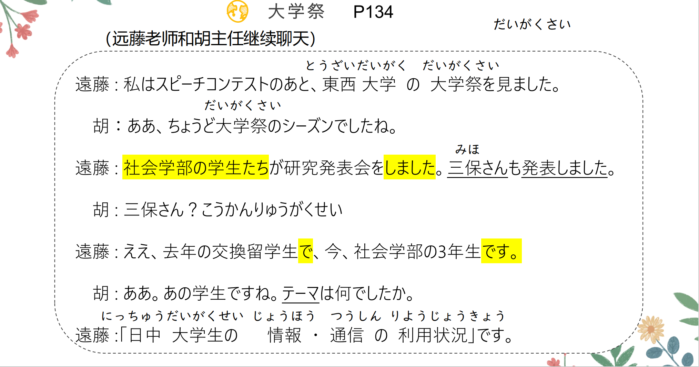
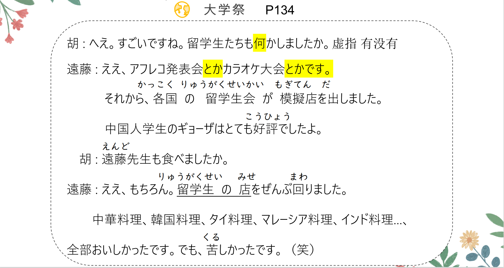
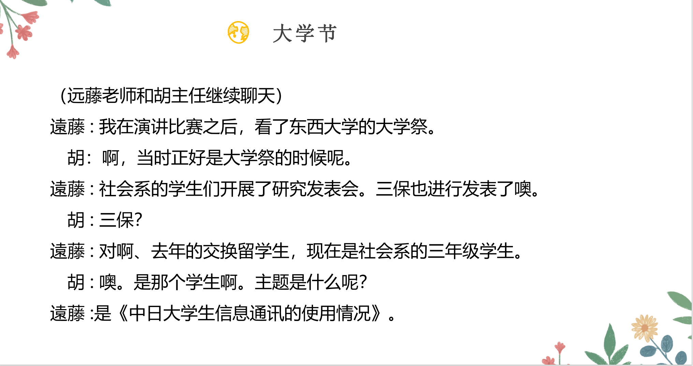
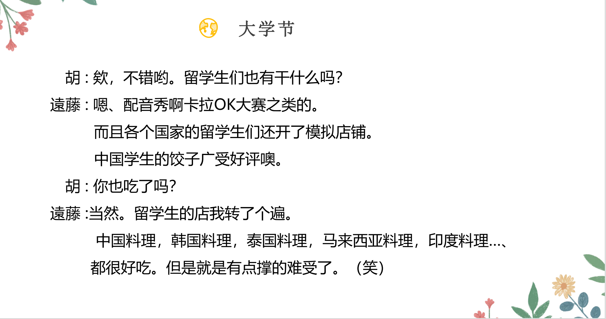

# あの、を、はし、ある

## 新出単語

<vue-plyr>
  <audio controls crossorigin playsinline loop>
    <source src="../audio/6-2-たんご.mp3" type="audio/mp3" />
  </audio>
 </vue-plyr>


| 単語                                            | 词性       | 翻译                                           |
| ----------------------------------------------- | ---------- | ---------------------------------------------- |
| 大学祭<JpWord>だい がく さい</JpWord>           | ④⓪<名>     | 大学(文化)节                                   |
| -祭<JpWord>-さい</JpWord>                       | <接尾>     | 节                                             |
| <JpWord>ちょうど</JpWord>〖丁度〗               | ⓪<名・副>  | 正好；恰好 ちょっと稍微                        |
| <JpWord>シーズン</JpWord>（season）             | ①<名>      | 季节；时节；时期                               |
| <JpWord>ちょうど大学祭のシーズン </JpWord>      |            |                                                |
| 日中<JpWord>にっ ちゅう</JpWord>                | ①<名>      | 中日；白天 ちゅうに                            |
| <JpWord>アフレコ</JpWord>                       | ⓪<名·自 Ⅲ> | （「アフターレコーディング（afterrecording）」 |
| カラオケ大会<JpWord>カラオケ たい かい</JpWord> | ⑤<名>      | 卡拉 OK 比赛                                   |
| <JpWord>カラオケ </JpWord>                      | ◎<名>      | (空（から）+オーケストラ（orchestra）):卡拉 OK |
| 大会<JpWord>たいかい</JpWord>                   | ◎<名>      | 大会；比赛 だいがく                            |
| 各国<JpWord>かっ こく</JpWord>                  | ①⓪<名>     | 各国                                           |
| 各-<JpWord>かく-</JpWord>                       | <接頭>     | 各~                                            |
| 模擬店<JpWord>も ぎ てん</JpWord>               | ⓪②<名>     | 模拟店铺；模拟摊位                             |
| 出す<JpWord>だ す</JpWord>                      | ）①<他 Ⅰ>  | 出；摆出；拿出；提出 宿題をだす 给             |
| 好評<JpWord>こう ひょう</JpWord>                | ⓪<名·形 Ⅱ> | 好评；受到好评 ひょうばんがいい                |
| <JpWord>ぜん ぶ</JpWord>〖全部〗                | ①<名·副>   | 全部 全部の人 全部できました                   |
| 回る<JpWord>まわる</JpWord>                     | ⓪<自 Ⅰ>    | 转；绕                                         |
| 中華料理<JpWord>ちゅう か りょう り</JpWord>    | ④<名>      | 中国菜；中餐 京きょうと 華                     |
| 中華<JpWord>ちゅうか</JpWord>                   | ①<名>      | （「中華料理」的省略说法）中国菜；中餐         |
| 韓国料理<JpWord>かん こく りょう り</JpWord>    | ⑤<名>      | 韩国菜；韩国料理；韩餐                         |
| タイ料理（thai タイ りょう り）         | ③<名>      | 泰国菜                                         |
| <JpWord>タイ</JpWord>（Thailand）               | ①<固名>    | 泰国                                           |
| マレーシア料理（Malaysia マレーシア りょう り） | ⑥<名>      | 马来西亚菜                                     |
| <JpWord>マレーシア</JpWord>（Malaysia）                  | ②<固名>    | 马来西亚                                       |
| インド料理（India インド りょう り）            | ④<名>      | 印度菜                                         |
| <JpWord>インド</JpWord>（India）                | ①<固名>    | 印度                                           |
| 苦しい<JpWord>くるしい</JpWord>                 | ③<形 Ⅰ>    | 痛苦（的）；难受（的）                         |
| を                                              | <格助>     | 表示移动的范围                                 |
| <JpWord>ヒーロー</JpWord>（hero）               | ①<名>      | 英雄                                           |
| 値段<JpWord>ね だん </JpWord>                   | ⓪<名>      | 价格；价钱 たかい ねだんがたかい               |
| 空<JpWord>そら</JpWord>                         | ①<名>      | 天空                                           |
| 旅行<JpWord>りょ こう</JpWord>                  | <名·自 Ⅲ>⓪ | 旅行                                           |
| 飛ぶ<JpWord>とぶ</JpWord>                       | ⓪<自 Ⅰ>    | 飞；飞翔；飞行 ひこうき                        |
| 歩く<JpWord>あるく</JpWord>                     | ②<自 Ⅰ>    | 走；行走；走路 走る（はしる）跑                |
| 週末<JpWord>しゅう まつ</JpWord>                | ◎<名>      | 周末                                           |

## あの <指示>

意义：表示说话双方都知道的人，事物等。  
译文：那个……，那件……  
说明：あの是指示性的连体词，后需接名词

```ts
	(1) 胡：三保さん？
		遠藤：ええ、去年の交換留学生で、今、社会学部の３年生です。
		胡：ああ。あの学生ですね。// 那个
	(2) 李：昨日どんな映画を見ましたか。 どの
　　	高橋：「ヒーロー」です。
　　	李：ああ。（あの）映画ですか。
    (3) 鈴木：日曜日、李先生に会いました。
　　　	高橋：李先生？
　　　	鈴木：あのおもしろい中国史の先生ですよ。ちゅうごくし
　　　	高橋：ああ。あの先生ですね。
```

## を＜移动的处所＞

意义：表移动的范围，经过的场所。　で动作进行的场所  
译文：在，经过~ 海を泳ぐ 食堂でご飯を食べる  
接续：地点名词+を＋表示移动的自动词

```ts
(1) 留学生の店を全部回りました。// まわる
(2) いろいろな場所を旅行しました。
(3) 昨日も公園を散歩しました。
```

## 常用的表示移动的自动词

1. 飛（と）ぶ ⓪：飞；　　 そら（を）とぶ
2. 渡（わた）る ⓪：渡过，过；　はし（を）わたる
3. 走（はし）る ② ：跑；　道をはしる
4. 歩（ある）く ② ：走。
5. 回（まわ）る ⓪：旋转，回转；巡视，周游；绕弯，绕道；
6. 散歩（さんぽ）する ⓪：散步；
7. 旅行（りょこう）する ⓪：旅行，旅游；

```ts
（1）坐船过河。　// 船（ふね）　河：川（かわ） 　渡る（わたる）　　
船で河を过 //工具で经过的场所を移动性的自动词
（2）小鸟在天空飞。　　// 空（そら）　飛ぶ（とぶ）　ことり 小鳥
ことりはそらをとぶ
```

## 会話

<vue-plyr>
  <audio controls crossorigin playsinline loop>
    <source src="../audio/6-2-かいわ.mp3" type="audio/mp3" />
  </audio>
 </vue-plyr>





