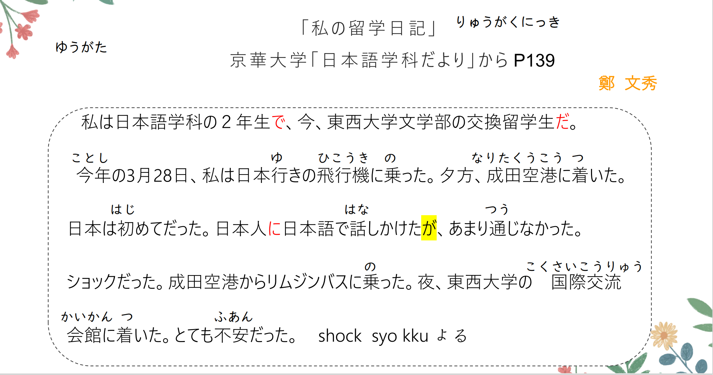
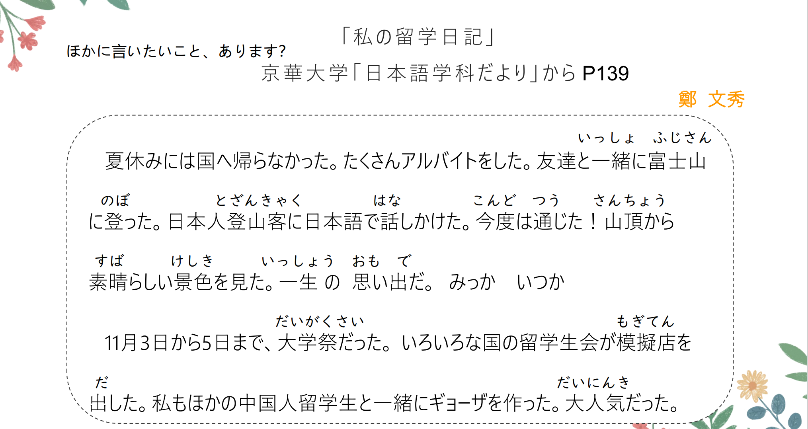
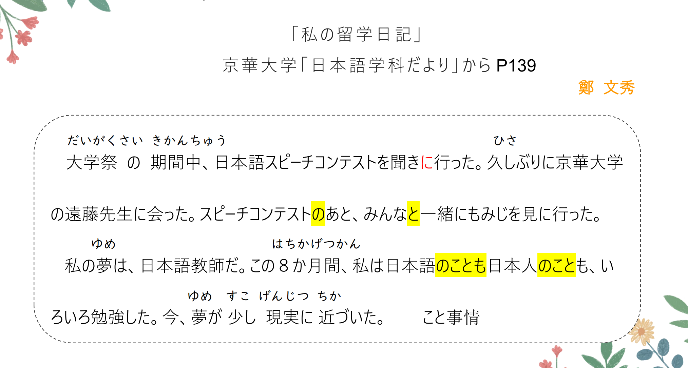
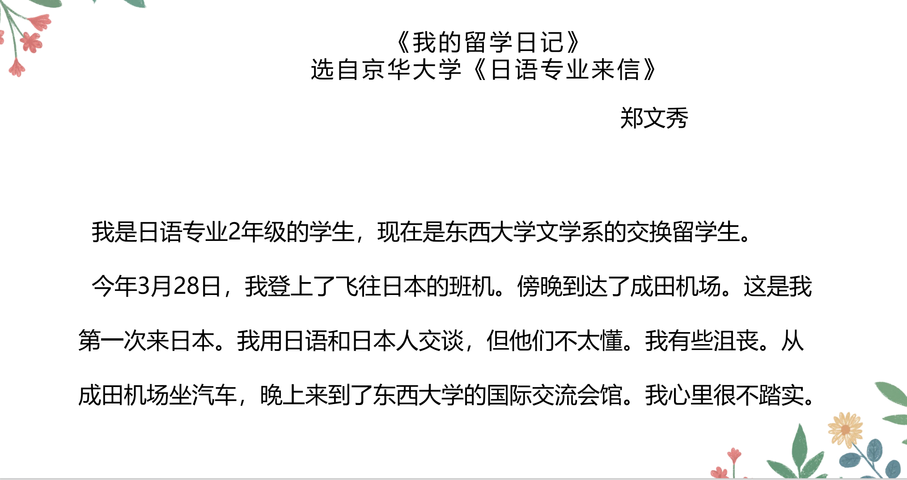
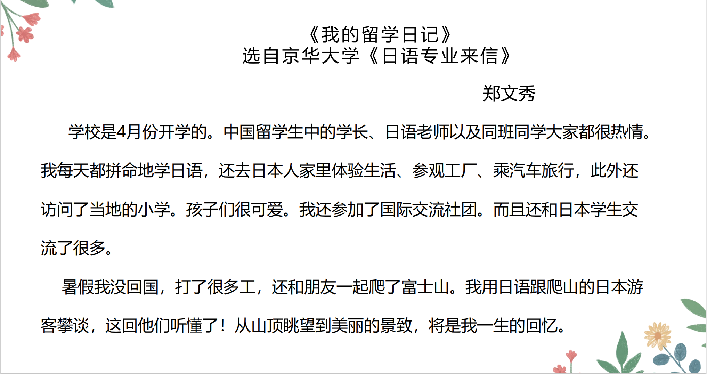
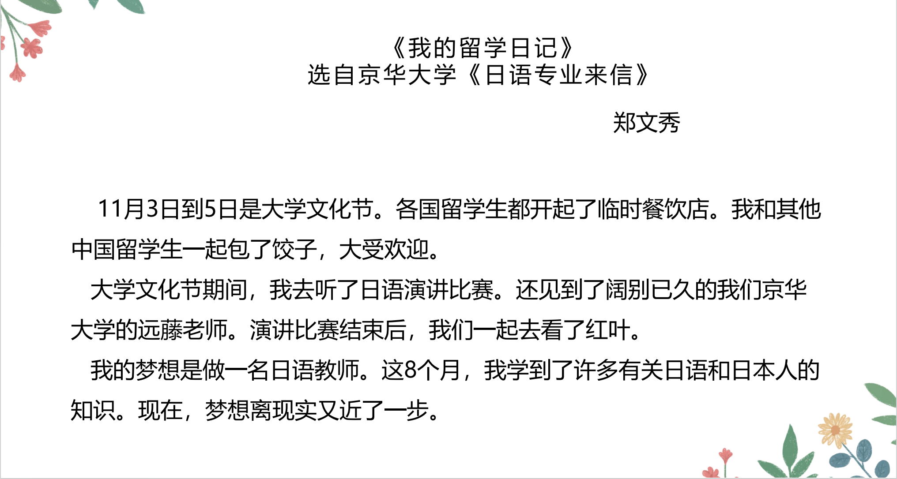

# に、そして、と、へ、ません..

## 新出単語

<vue-plyr>
  <audio controls crossorigin playsinline loop>
    <source src="../audio/6-3-たんご.mp3" type="audio/mp3" />
  </audio>
 </vue-plyr>

| 単語                                                    | 词性                              | 翻译                                                   |
| ------------------------------------------------------- | --------------------------------- | ------------------------------------------------------ |
| 日本語学科だより<JpWord>にほんごがっかだより</JpWord>   | <名>⑧                             | 日语专业通讯                                           |
| ☆ ～だより                                              | 〖～便り〗                        | :通讯；                                                |
| 日本行き<JpWord>にほんゆき</JpWord>                     | <名>⓪                             | 前往日本 日本にいく                                    |
| ☆ ～行き<JpWord>～ゆき</JpWord>                         | :去~；前往~；开往~                | 前往日本的飞机                                         |
| 飛行機<JpWord>ひこうき</JpWord>                         | <名>②                             | 飞机 にほんゆきのひこうき                              |
| 乗る<JpWord>のる</JpWord>                               | <自 Ⅰ>⓪                           | 乘；乘坐；骑； ひこうき(に)のる ＝ ひこうきで          |
| 成田空港<JpWord>なりたくうこう</JpWord>                 | <固名>④                           | 成田机场(东京国际机场)                                 |
| 成田<JpWord>なりた</JpWord>                             | <固名>①                           | 成田(位于日本千叶县)                                   |
| 空港<JpWord>くうこう</JpWord>                           | <名>⓪                             | 机场                                                   |
| 着く<JpWord>つく</JpWord>                               | <自 Ⅰ>①                           | 到；到达 くうこう (に)つく                             |
| 初めて<JpWord>はじめて</JpWord>                         | <副>②                             | 初次；第一次 初めまして 初める                         |
| 話しかける<JpWord>はなしかける</JpWord>                 | <自 Ⅱ>⑤                           | 搭话；跟~讲话                                          |
| 跟阿尼讲话                                              | アニさんに話しかける              | 和阿尼说话 アニさんとはなす はなし                     |
| 通じる<JpWord>つうじる</JpWord>                         | <自他 Ⅱ>⓪                         | 通；沟通；精通 にほんごに通じる 話が通じない           |
| shock<JpWord>ショック</JpWord>                          | <名·形 Ⅱ>①                        | 打击；冲击 syo kku をうけました                        |
| 国際交流会館<JpWord>こくさいこうりゅうかいかん</JpWord> | <名>⑨                             | 国际交流会馆                                           |
| 不安<JpWord>ふあん</JpWord>                             | <名·形 Ⅱ>⓪                        | 不安(的)；担心 ふあんなこころもち                      |
| 始まる<JpWord>はじまる</JpWord>                         | <自 Ⅰ>⓪                           | 开始                                                   |
| 同級生<JpWord>どうきゅうせい</JpWord>                   | <名>③                             | 同学                                                   |
| 一所懸命<JpWord>いっしょけんめい</JpWord>               | <形 Ⅱ·副>④                        | 拼命；全力以赴;全力以赴学习 いっしょけんめい勉強します |
| ホームステイ<JpWord>homestay</JpWord>                   | <名>⑤                             | 留学生等寄宿在当地人家里 ho - mu su te i               |
| 工場見学<JpWord>こうじょうけんがく</JpWord>             | <名>⑤                             | 参观工厂                                               |
| 工場<JpWord>こうじょう</JpWord>                         | <名>③                             | 工厂；                                                 |
| 見学<JpWord>けんがく</JpWord>                           | <名·他 Ⅲ>⓪                        | 参观学习                                               |
| 新幹線<JpWord>しんかんせん</JpWord>                     | ③<名>                             | 新干线                                                 |
| 経験<JpWord>けいけん</JpWord>                           | <名·他 Ⅲ>                         | ⓪:经验；经历                                           |
| 地域<JpWord>ちいき</JpWord>                             | <名>①                             | 地区；地域 ちず りょういきてんかい                     |
| 中学校<JpWord>ちゅうがっこう</JpWord>                   | ③<名>                             | 中学；初中 しょうがっこう こうこう だいがく            |
| 訪問<JpWord>ほうもん</JpWord>                           | <名·他 Ⅲ>⓪                        | 访问 中国を訪問する                                    |
| 生徒<JpWord>せいと</JpWord>                             | ①<名>                             | (高中、中小学)学生 がくせい                            |
| クラブ<JpWord>club</JpWord>                             | <名>①                             | 俱乐部 ku ra bu                                        |
| 参加<JpWord>さんか</JpWord>                             | ⓪<名·自 Ⅲ>                        | 参加 クラブ に さんかする                              |
| <JpWord>たくさん</JpWord>                               | ⓪③<名· 副>                        | 很多；大量 たくさん集まりました                        |
| <JpWord>たくさんのひと </JpWord>                        |                                   | 日本語で話す                                           |
| 話す<JpWord>はなす</JpWord>                             | ②<他 Ⅰ>                           | 说话；告诉；陈述                                       |
| アルバイト<JpWord>德语 Arbeit</JpWord>                  | <名·他 Ⅲ>③                        | 打工；勤工助学                                         |
| 富士山(ふじさん)                                        | ①<固名>                           | 富士山                                                 |
| 登る<JpWord>のぼる</JpWord>                             | <自 Ⅰ>⓪                           | 上；登                                                 |
| 登山客<JpWord>とざんきゃく</JpWord>                     | <名>②                             | 登山者                                                 |
| 登山<JpWord>とざん</JpWord>                             | <名·自 Ⅲ>①                        | 登山、爬山；                                           |
| 客<JpWord>きゃく</JpWord>                               | <名>⓪                             | 客；客人 こんどの会議                                  |
| 今度<JpWord>こんど</JpWord>                             | <名>①                             | 这次；这回；下次 今度ぜったい やってみせる             |
| 山頂<JpWord>さんちょう</JpWord>                         | <名>⓪                             | 山顶 山頂にのぼる                                      |
| 景色<JpWord>けしき</JpWord>                             | <名>①                             | 景色；风景 いいけしき いっしょうけんめい               |
| 一生<JpWord>いっしょう</JpWord>                         | <名>⓪                             | 一生 いっしょけんめい                                  |
| 思い出<JpWord>おもいで</JpWord>                         | <名>⓪                             | 回忆 いっしょうのおもいで                              |
| <JpWord>ほか</JpWord>                                   | ⓪<名>                             | 其他                                                   |
| 水ギョ一ザ<JpWord>すいギョ一ザ</JpWord>                 | ③<名>                             | 水饺                                                   |
| 作る<JpWord>つくる</JpWord>                             | <他 Ⅰ>②                           | 做；包(饺子) ご飯を作る かいしゃをつくる               |
| 大人気<JpWord>だいにんき</JpWord>                       | ③<名·形 Ⅱ>                        | 超有人气；超受欢迎                                     |
| 期間中<JpWord>きかんちゅう</JpWord>                     | <名>⓪                             | 在~期间 有効期間                                       |
| 期間<JpWord>きかん</JpWord>                             | <名>①②                            | 期间 機関 ごぶさたしております                         |
| 久しぶり<JpWord>ひさしぶり</JpWord>                     | <名·形 Ⅱ>⑤⓪                       | 许久；好久 はんざわなおき                              |
| 夢<JpWord>ゆめ</JpWord>                                 | <名>②                             | 梦；理想 いいゆめを                                    |
| 日本語教師<JpWord>にほんごきょうし</JpWord>             | <名>⑤                             | 日语教师                                               |
| ~か月間<JpWord>～かげつかん</JpWord>                    | 三ヶ月間(さんかげつかん) さんがつ | (几)个月                                               |
| こと                                                    | <名>②                             | 事；事情；情况 君のことが好きです。 年末が近づく       |
| 現実<JpWord>げんじつ</JpWord>                           | <名>⓪                             | 现实 現実(に)ちかづく 时间が+近づく                    |
| 近づく<JpWord>ちかづく</JpWord>                         | <自 Ⅰ>③⓪                          | 接近                                                   |
| <JpWord>そして </JpWord>                                | ⓪ <接助>                          | 然后；于是                                             |
| へ                                                      | <格助>                            | 发 e 的音:表示移动的方向或到达的地点                   |
| 待つ<JpWord>まつ</JpWord>                               | <他 Ⅰ>①                           | 等待；等候 まつらしません                              |
| 遊び<JpWord>あそび</JpWord>                             | <自 Ⅰ>(０)                        | 玩；娱乐 あそぶ あそびましょう                         |
| 入る<JpWord>はいる</JpWord>                             | <自 Ⅰ>①                           | 进入；进去 はいってください                            |
| 集める<JpWord>あつめる</JpWord>                         | <他 II>(3)                        | 收集；聚集 あつめる あつめます                         |
| 借りる<JpWord>かりる</JpWord>                           | <他 II>(０)                       | 借；借来 かります かりる かります                      |
| 若者<JpWord>わかもの</JpWord>                           | <名>⓪                             | 知识；学问 たのしいわかもの                            |
| 親友 <JpWord>しんゆう</JpWord>                          | <名>⓪                             | 朋友 しんゆうにあいましょう                            |
| 結婚<JpWord>けっこん</JpWord>                           | <名>⓪                             | 结婚 けっこんします けっこんします                     |
| 来週<JpWord>らいしゅう</JpWord>                         | <名>⓪                             | 下周；下周 あしたのらいしゅう                          |
| りんご<JpWord>りんご</JpWord>                           | <名>⓪                             | 苹果 あのりんごはおいしいです                          |
| 切る　<JpWord>きる</JpWord>                             | <他 Ⅰ>①                           | 吃；喝 きる きる きる きる                             |
| 使い方<JpWord>つかいかた</JpWord>                       | <名>⓪                             | 用法；使用方法 この使い方はわかりません                |
| 丁寧<JpWord>ていねい</JpWord>                           | <名·形 Ⅱ>(1)                      | 尊敬；礼貌 ていねいに ていねいに                       |

## に ＜着落点、到达点＞

意义:表示动作的着落点、到达点。　附着点：动作做完以后有东西留下来  
译文: ……在……; ……到……;  
接续:接在表达处所、地点等的名词后面

```ts
(1) 私は日本行きの飛行機に乗った。// 附着点のる:乗る => のった
  我坐了前往日本的飞机
(2) 午後3時に空港に着く。// 目的地
  下午三点到机场
(3) ノ一トに名前を書いた。// かく => かいた 写（附着含义）
(4) 教科書を机の上うえ　　// に置く。置く（附着含义）
```

## そして＜顺序、累加＞

意义:表示连个动作之间的先后接续，也表示累加、递进、并列等意。  
译文:又;还;而且;接着又……，然后　　　动作性名词＋のあとで  
接续:用于连接句子，也可以连接词或词组

```ts
(1) 国際交流クラブにも参加した。そして、日本人の学生とたくさん話した。はなす
(2) 高橋さんは朝、5時に起きた。そして、6時に寮を出た。おきる　でる
(3) 鈴木さんはとても親切です。そして、おもしろい人です。
    铃木非常亲切，而且是个有意思的人。
(4) 去超市买水果，然后回家。// くだもの：果物　かう　いく：行く　
  // 目的地に目的に去，そして、目的地に回
  スーパーにくだものをかいにいく。そして、いえにかえる。
```

## と＜相互动作的对象＞ ＜同一动作的参与者＞

意义：表示相互动作的对象或同一动作的参与者  
译文：和；同；与 你对我做，我也对你做，需要两个人完成。  
接续：指人的名词 + と

```ts
(1) 日本人の学生とたくさん話した。// はなす　私は母と　けんかする
(2) 兄は私の友達と結婚しました。
 哥哥和我的朋友结婚了。けっこんする
(3) 和谁就把と放谁后面
学生たちは鄭さんと一緒にもみじを見に行きました。
(4) 日曜日、王さんと一緒に映画を見ました。
```

## へ ＜方向＞

**意义**: 表示移动的方向。  
**接续**: 表示处所的名词十へ

> ちょうさから北京へ行く 目的地  
> ちょうさから北京へ。方向

```ts
(1) 夏休みには国へ帰らなかった。　// 夏休み：なつやすみ　国：くに　
在暑假期间我没有回国。
(2) 毎日7時ごろうちへ帰る。
(3) 授業のあと、図書館へ本を借りに行きます。
```

> 注意：「に」也有接在表示处所名词后面的用法(第 5 课第 2 单元)，但是「に」表达的是到达的地点，
> 「へ」 表达的是移动的方向。

## 动词的变形

## 动词的敬体

1.  非过去时 （肯定、ます） （否定、ません）
2.  过去时 （肯定、ました）（否定、ませんでした）

## 动词的简体

1.  非过去时 （肯定、原型）（否定、ない）
2.  过去时 **简体否定　なかった**

```ts
かう　かわない　うーわ＋ない　かわなかった
行く　いかない　词尾--同行 a 段+ない
```

一、动词的简体过去时（肯定）动词第二连用形

> 一类动词 **五段动词**

1. 词尾：**く、ぐ**　 → 　**いた、いだ**
   聞く → 聞いた） （泳ぐ → 泳いだ）きく　およ**ぐ**
2. 词尾：**う、つ、る**　 → 　**った 促音变**
   　（会う → 会った）（待**つ** → 待った）　（降**る** → 降った）
3. 词尾：**ぶ、む、ぬ**　 → 　**んだ 浊音 　姆布努**
   　（読む → 読んだ）（呼ぶ → 呼んだ） （死ぬ → 死んだ）
4. 词尾：**す**　 → 　**した**
   　　探す → 探した）さがす さがした

   **特例**: 行く → 行った

```ts
★ 试试把下面的动词变形（た型）吧~
✿ 驚（おどろ）く ⇒ いた　おどろいた　　　
✿ 死ぬ（しぬ）⇒ しんだ　浊音变　　　
✿ 食べる ⇒ 食べた 　
✿ 使う ⇒ 　　つかう　つかった　　　　
✿ 行く ⇒ いった　
✿ する ⇒ 　した
```

## 一类动词总结表

|          |      | 简体                                                               | 敬体                                         |
| :------- | :--- | :----------------------------------------------------------------- | :------------------------------------------- |
| 非过去时 | 肯定 | 原型 あく                                                          | **词尾 u 段变 i 段＋ます**<br>あく　あきます |
| 非过去时 | 否定 | **词尾 u 段变 a 段＋ない**<br>あく　あかない<br>**(以う结尾特殊)** | あき**ません**                               |
| 过去时   | 肯定 | **た**                                                             | あき**ました**                               |
| 过去时   | 否定 | **ない → なかった**                                                | あき**ませんでした**                         |

## 二类动词总结表

|          |      | 简体                           | 敬体                           |
| :------- | :--- | :----------------------------- | :----------------------------- |
| 非过去时 | 肯定 | 原型 みる                      | **去る＋ます**<br>みる　みます |
| 非过去时 | 否定 | **去る＋ない**<br>みる　みない | み**ません**                   |
| 过去时   | 肯定 | **去る加た**                   | み**ました**                   |
| 过去时   | 否定 | **ない → なかった**            | み**ませんでした**             |

## 三类动词总结表

|          |      | 简体                                | 敬体                                                 |
| :------- | :--- | :---------------------------------- | :--------------------------------------------------- |
| 非过去时 | 肯定 | 原型 くる　する                     | くる　き**ます**<br>する　し**ます**                 |
| 非过去时 | 否定 | くる **こ**ない<br>する　**し**ない | くる　き**ません**<br>する　し**ません**             |
| 过去时   | 肯定 | くる　き**た**<br>する　し**た**    | くる　き**ました**<br>する　し**ました**             |
| 过去时   | 否定 | **ない → なかった**                 | くる　き**ませんでした**<br>する　し**ませんでした** |

## 动词总结表


## 会話

<vue-plyr>
  <audio controls crossorigin playsinline loop>
    <source src="../audio/6-3-かいわ.mp3" type="audio/mp3" />
  </audio>
 </vue-plyr>








