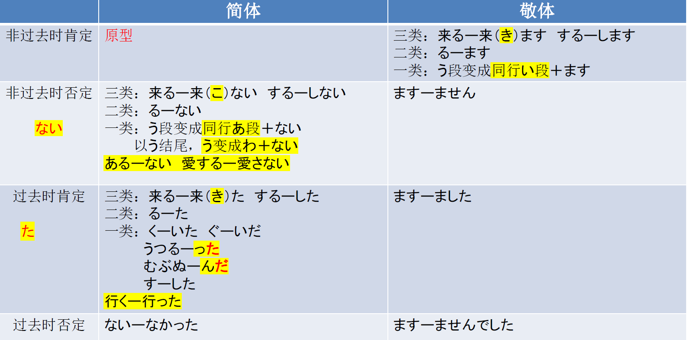

# に、そして、と、へ、ません..

## 新出単語
<vue-plyr>
  <audio controls crossorigin playsinline autoplay loop>
    <source src="../audio/6-3-たんご.mp3" type="audio/mp3" />
  </audio>
 </vue-plyr>

## に ＜着落点、到达点＞

意义:表示动作的着落点、到达点。　附着点：动作做完以后有东西留下来  
译文: ……在……; ……到……;  
接续:接在表达处所、地点等的名词后面

```ts
(1) 私は日本行きの飛行機に乗った。// 附着点のる:乗る => のった
  我坐了前往日本的飞机
(2) 午後3時に空港に着く。// 目的地
  下午三点到机场
(3) ノ一トに名前を書いた。// かく => かいた 写（附着含义）
(4) 教科書を机の上うえ　　// に置く。置く（附着含义）
```

## そして＜顺序、累加＞

意义:表示连个动作之间的先后接续，也表示累加、递进、并列等意。  
译文:又;还;而且;接着又……，然后　　　动作性名词＋のあとで  
接续:用于连接句子，也可以连接词或词组

```ts
(1) 国際交流クラブにも参加した。そして、日本人の学生とたくさん話した。はなす
(2) 高橋さんは朝、5時に起きた。そして、6時に寮を出た。おきる　でる
(3) 鈴木さんはとても親切です。そして、おもしろい人です。
    铃木非常亲切，而且是个有意思的人。
(4) 去超市买水果，然后回家。// くだもの：果物　かう　いく：行く　
  // 目的地に目的に去，そして、目的地に回
  スーパーにくだものをかいにいく。そして、いえにかえる。
```

## と＜相互动作的对象＞ ＜同一动作的参与者＞

意义：表示相互动作的对象或同一动作的参与者  
译文：和；同；与 你对我做，我也对你做，需要两个人完成。  
接续：指人的名词 + と

```ts
(1) 日本人の学生とたくさん話した。// はなす　私は母と　けんかする
(2) 兄は私の友達と結婚しました。
 哥哥和我的朋友结婚了。けっこんする
(3) 和谁就把と放谁后面
学生たちは鄭さんと一緒にもみじを見に行きました。
(4) 日曜日、王さんと一緒に映画を見ました。
```

## へ ＜方向＞

**意义**: 表示移动的方向。  
**接续**: 表示处所的名词十へ  

> ちょうさから北京へ行く 目的地  
> ちょうさから北京へ。方向

```ts
(1) 夏休みには国へ帰らなかった。　// 夏休み：なつやすみ　国：くに　
在暑假期间我没有回国。
(2) 毎日7時ごろうちへ帰る。
(3) 授業のあと、図書館へ本を借りに行きます。
```

> 注意：「に」也有接在表示处所名词后面的用法(第 5 课第 2 单元)，但是「に」表达的是到达的地点，
> 「へ」 表达的是移动的方向。

## 动词的变形

## 动词的敬体

1.  非过去时 （肯定、ます） （否定、ません）
2.  过去时 （肯定、ました）（否定、ませんでした）

## 动词的简体

1.  非过去时 （肯定、原型）（否定、ない）
2.  过去时 **简体否定　なかった**

```ts
かう　かわない　うーわ＋ない　かわなかった
行く　いかない　词尾--同行 a 段+ない
```

一、动词的简体过去时（肯定）动词第二连用形

> 一类动词 **五段动词**

1. 词尾：**く、ぐ**　 → 　**いた、いだ**
   聞く → 聞いた） （泳ぐ → 泳いだ）きく　およ**ぐ**
2. 词尾：**う、つ、る**　 → 　**った 促音变**
   　（会う → 会った）（待**つ** → 待った）　（降**る** → 降った）
3. 词尾：**ぶ、む、ぬ**　 → 　**んだ 浊音 　姆布努**
   　（読む → 読んだ）（呼ぶ → 呼んだ） （死ぬ → 死んだ）
4. 词尾：**す**　 → 　**した**
   　　探す → 探した）さがす さがした

   **特例**: 行く → 行った

```ts
★ 试试把下面的动词变形（た型）吧~
✿ 驚（おどろ）く ⇒ いた　おどろいた　　　
✿ 死ぬ（しぬ）⇒ しんだ　浊音变　　　
✿ 食べる ⇒ 食べた 　
✿ 使う ⇒ 　　つかう　つかった　　　　
✿ 行く ⇒ いった　
✿ する ⇒ 　した
```

## 一类动词总结表

|          |      | 简体                                                               | 敬体                                         |
| :------- | :--- | :----------------------------------------------------------------- | :------------------------------------------- |
| 非过去时 | 肯定 | 原型 あく                                                          | **词尾 u 段变 i 段＋ます**<br>あく　あきます |
| 非过去时 | 否定 | **词尾 u 段变 a 段＋ない**<br>あく　あかない<br>**(以う结尾特殊)** | あき**ません**                               |
| 过去时   | 肯定 | **た**                                                             | あき**ました**                               |
| 过去时   | 否定 | **ない → なかった**                                                | あき**ませんでした**                         |

## 二类动词总结表

|          |      | 简体                           | 敬体                           |
| :------- | :--- | :----------------------------- | :----------------------------- |
| 非过去时 | 肯定 | 原型 みる                      | **去る＋ます**<br>みる　みます |
| 非过去时 | 否定 | **去る＋ない**<br>みる　みない | み**ません**                   |
| 过去时   | 肯定 | **去る加た**                   | み**ました**                   |
| 过去时   | 否定 | **ない → なかった**            | み**ませんでした**             |

## 三类动词总结表

|          |      | 简体                                | 敬体                                                 |
| :------- | :--- | :---------------------------------- | :--------------------------------------------------- |
| 非过去时 | 肯定 | 原型 くる　する                     | くる　き**ます**<br>する　し**ます**                 |
| 非过去时 | 否定 | くる **こ**ない<br>する　**し**ない | くる　き**ません**<br>する　し**ません**             |
| 过去时   | 肯定 | くる　き**た**<br>する　し**た**    | くる　き**ました**<br>する　し**ました**             |
| 过去时   | 否定 | **ない → なかった**                 | くる　き**ませんでした**<br>する　し**ませんでした** |


## 动词总结表



