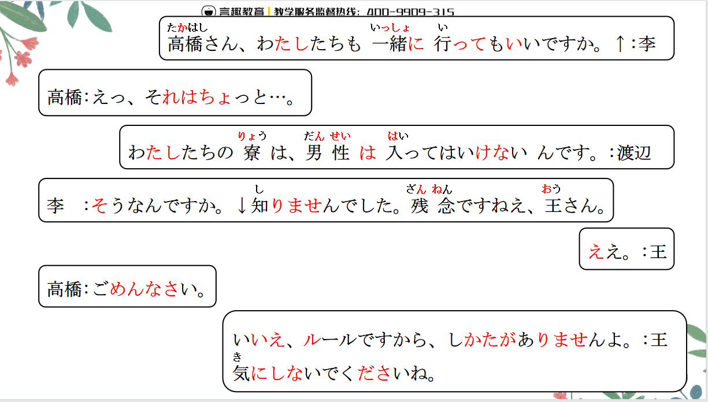
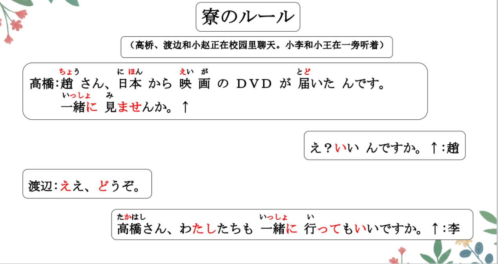
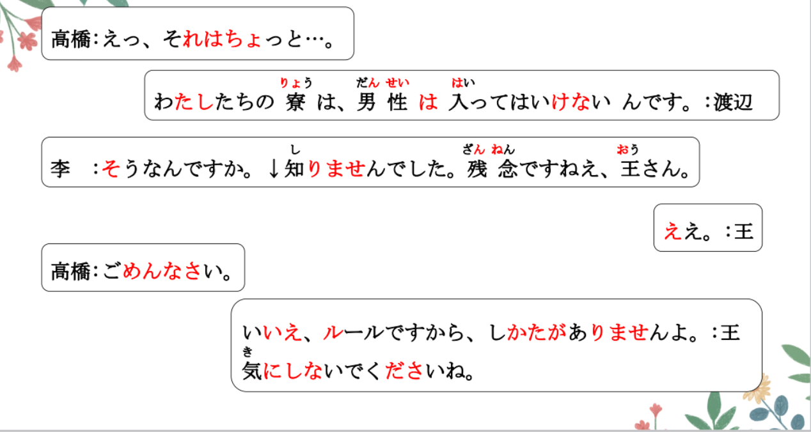
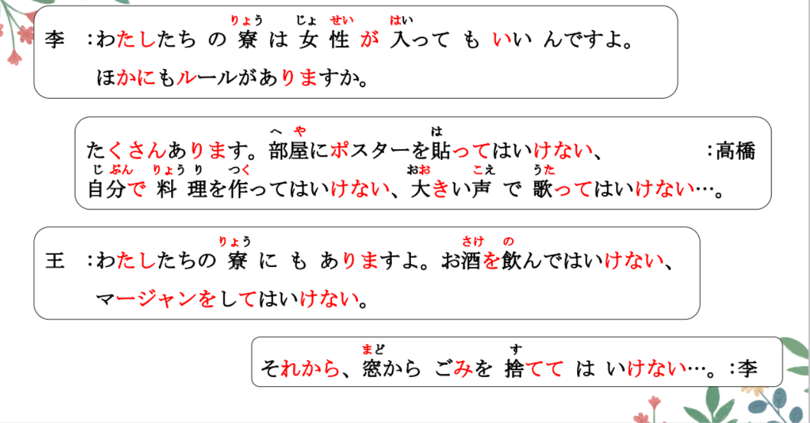
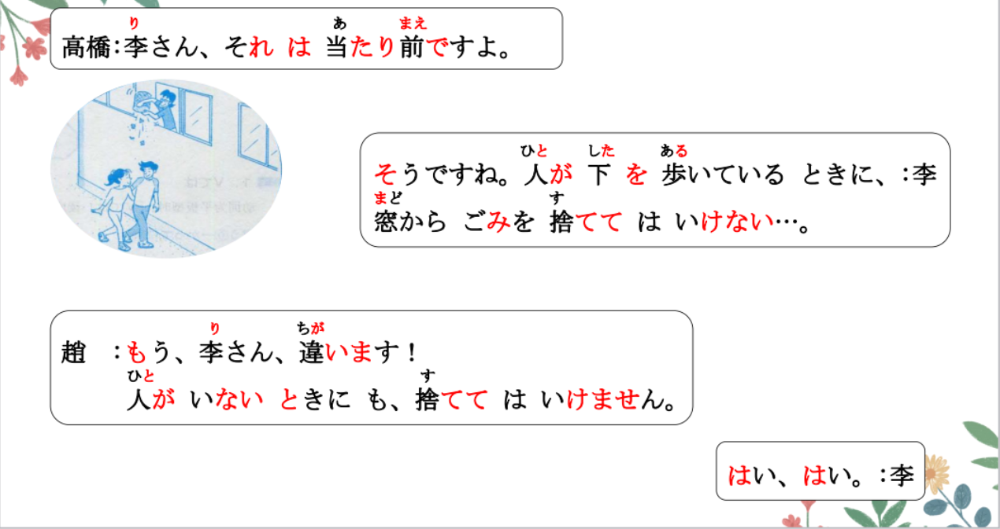
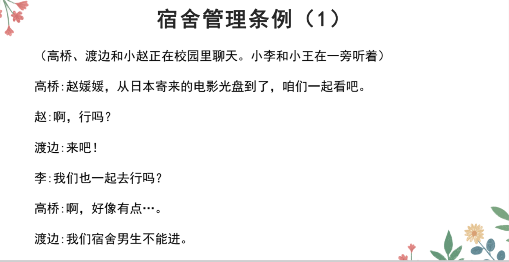
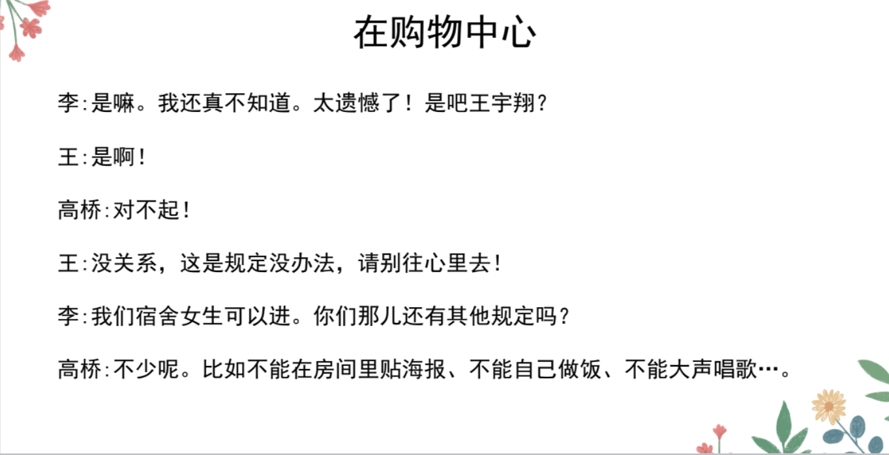
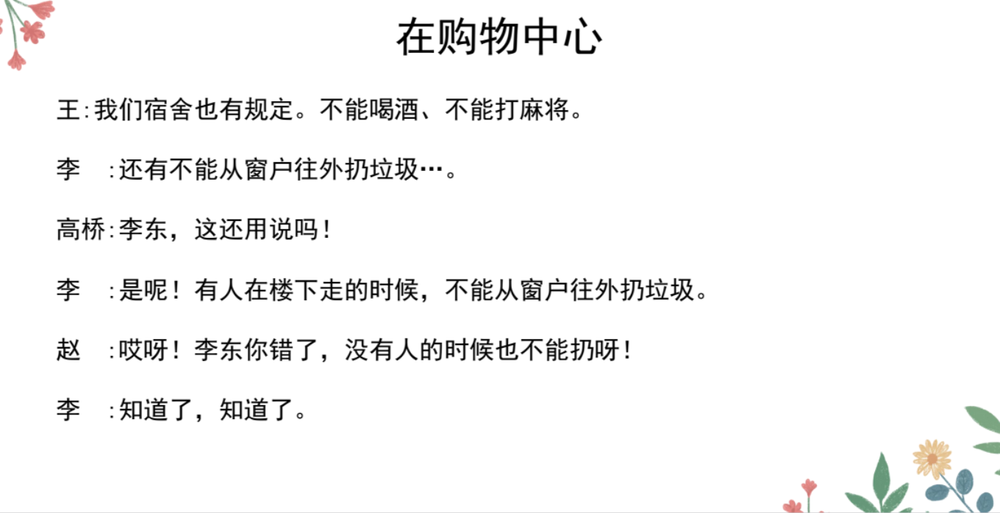

# もいい、はいけない、から..

## 新出単語


## V てもいい＜允许＞

意义：表示允许、同意、批准（别人）做某事。 上级批准下级  
译文：可以...... 接续：**Ｖて**+もいい  
说明：用于肯定句时，多在句末加助词「よ」以缓和语气。用于问句时则  
表示询问对方是否许可做某事。回答该问句时，如果是肯定性回答，一般  
用「はい、どうぞ」「ええ、いいですよ」（只适用于同级或上对下的关  
系）等；如果是否定性回答，一般用「すみませんが、ちょっと」「すみ  
ませんが、～から、V ないでください」等。

```ts
(1) 高橋さん、私たちも一緒に行ってもいいですか。
(2) ここに座ってもいいですか。
(3) 作文は中国語で書いてもいいですよ。
(4) 趙 ：あのう、ちょっと暑いんですが、窓を開けてもいいですか。
高橋：ええ、いいですよ。
```

> ☞「Ｖてもいい」表达允许、许可的意思，不用在与上级或长辈的对话中。  
> x 先生、もう帰ってもいいですよ。 私はもう帰ってもいいですか。  
> x 先生、パーティーに参加してもいいですよ。

## 練習 れんしゅう

```ts
(1) 老师，不好意思，我可以去厕所嘛？ 、// お手洗い トイレ
⇒ 先生、すみませんが、お手洗いに行ってもいいですか。
   可以的。
⇒ いいですよ。
(2) 老师：考试的时候可以查字典。　// 辞書を引く　查字典
⇒ 試験のとき、辞書を引いてもいいですよ。
```

## V てはいけない＜禁止＞

意义：表示禁止。  
译文：不许；不准；不要；不得  
接续：Ｖて+はいけない  
说明：多用于表示规则、标语，纪律等，语气较为严厉。

```ts
(1) 私たちの寮は、男性は入ってはいけないんです。はいる
(2) 教室ではタバコを吸ってはいけません。すう
(3) 子どもはお酒を飲んではいけない。　のむ
```

## 練習 れんしゅう

```ts
(1) 禁止把垃圾丢到这里。 、// 捨てる「すてる」 ２类动词 去る＋て
⇒ ここにごみをすててはいけない。
(2) 禁止在湖里游泳。 みずうみ（のなか）　　 　// およぐ
⇒ 湖で泳いではいけない。　// 湖を泳ぐ　在湖里游来游去
```

## から＜原因、理由＞

1. から：（起始点）从...（开始）  
   日本語の授業は八時からです。
2. から：（原材料） 由...构成... （看不见原材料的）  
   ぶどうからワインを作ります。
3. だから、ですから：所以...（因果，两个句子中间）  
   君がかっこいいです。ですから、好きです。

意义：表示原因、理由。 结句：N、A2(原形）+だ A1（原形）不要だ  
译文：因为......，所以...... 简体句+から、敬体句。  
接续：连接两个分句 简体句+から、简体句。 敬体句+から、敬体句。

```ts
(1) ルールですから、しかたがありませんよ。
(2) 暑いから、窓を開けてください。 開ける
(3) もう遅いから、寝ましょう。おそい
(4) 日本人の友達が来るから、明日北京空港へ行きます
```
## 練習 れんしゅう
> ☞ 口语中，有时会省略后句，以「～から」结句。  
> (5) もう大丈夫だから（心配しないでください）。

```ts
(1) （因为）吃了药了，所以已经没事了。// くすりをのむ
⇒ 薬を飲んだから、もう大丈夫だ。薬を飲みましたから、もう大丈夫です。
(2) （因为）已经晚了，所以我想回去。// おそい かえる
⇒ もう遅いから、かえりたい。　もう遅いですから、帰りたいです。
```

## Vないでください＜否定性请求＞

意义：请求、提示对方不做某事。 口语： Vないで（ください）  
译文：请（你）不要......；请勿...... 接续：Ｖない+でください 说明：「Vないでください」是表示请求的句式「Vてく  
ださい」的否定形式。关系亲近的人之间使用时，多在句末加助词「ね」缓和语气。  

```ts
(1) 気にしないでくださいね。気にする 介意
(2) 図書館では大きい声を出さないでください。 こえをだす 发出声音
(3) 試験のとき、作文は鉛筆で書かないでください。 書く「かく」
(4) 明日の会議には遅れないでくださいね。 おくれる 迟到
```
## 練習 れんしゅう

```ts
(1) 请不要在自习室讲话。、// 自習室「じしゅうしつ」 話す「はなす」
⇒ 自習室で「は」話さないでください。 口语：話さないで
(2) 请不要在宿舍里喝酒。 // のむ
⇒ 寮でお酒を飲まないでください。（比较委婉）
　　Ｖてはいけない　不准做、、 禁止做 （更加严厉）
```
## Vている・Vないとき（に）＜时点＞
意义：表示后面主句的动作或变化是在该时点成立的。  
译文：......时；......的时候 Ｖているとき 正在做、、的时候  
接续：Ｖている / Ｖない+とき(に) Vないとき 不 没、、的时候  

```ts
(1) 人が下を歩いているときに、窓からごみを捨ててはいけません。
(2) 昨日、部屋で小説を読んでいるときに、停電した。
(3) 説明がわからないときに、質問してください。
(4) 母がいないとき、自分で料理を作る。
```
## 練習 れんしゅう
```ts
(1) 没钱的时候，向朋友借。 
   お金がある お金がない 借りる 貸す
⇒ お金がないとき（に）、友達に・から借りる・借ります。
(2) 孩子在睡觉的时候，请不要发出声音。 // 子供が寝る 声「こえ」を出す「だす」
⇒ こどもが寝ているとき（に）、声を出さないでください。
```

## 精読の教文




## 会話








