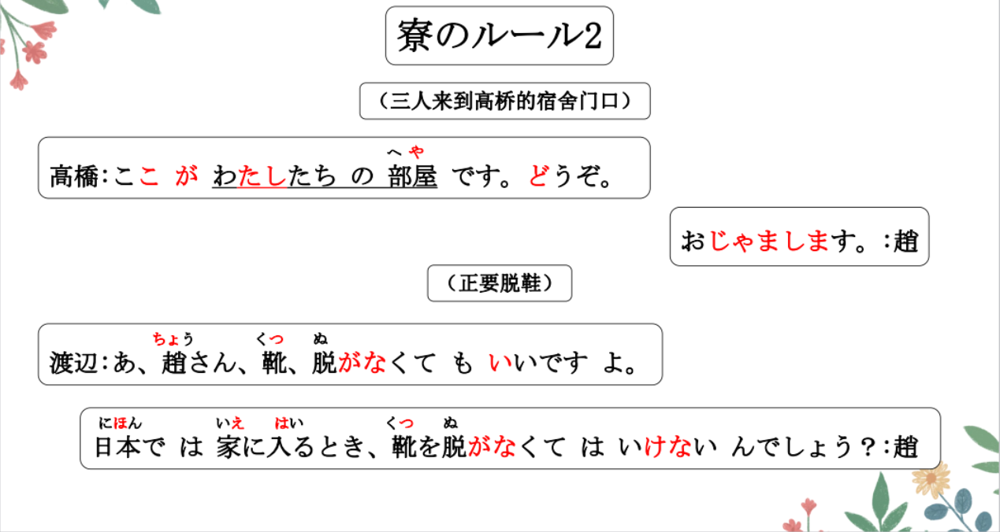
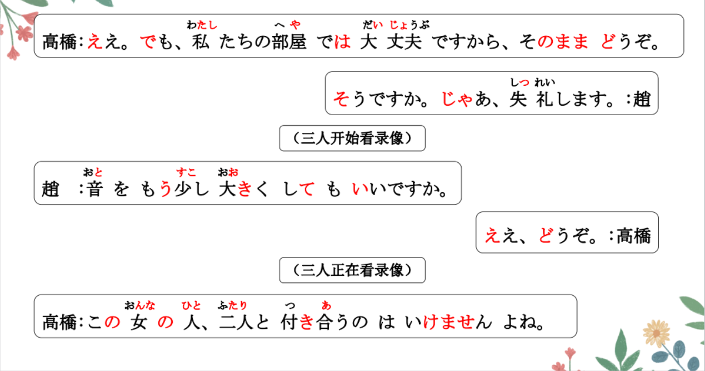
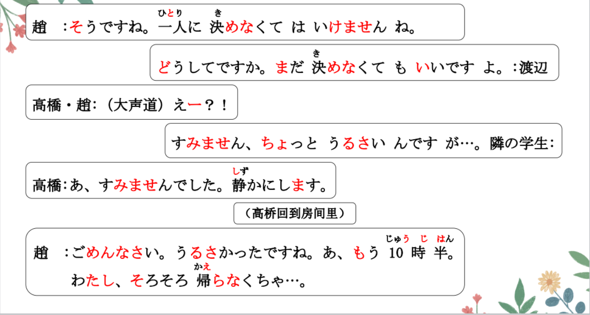
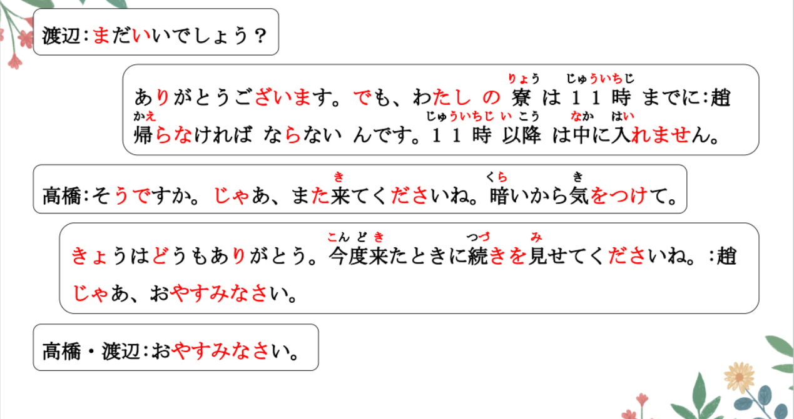
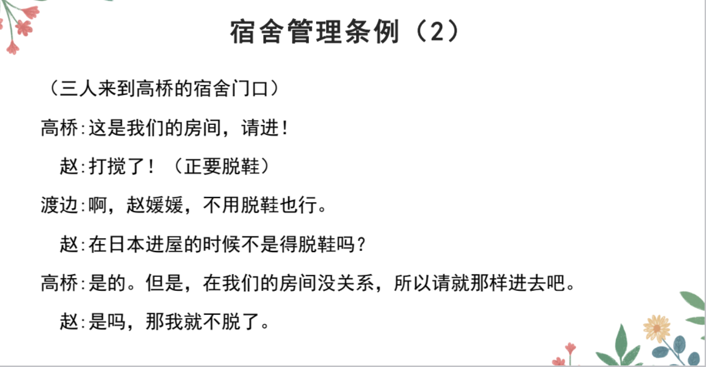
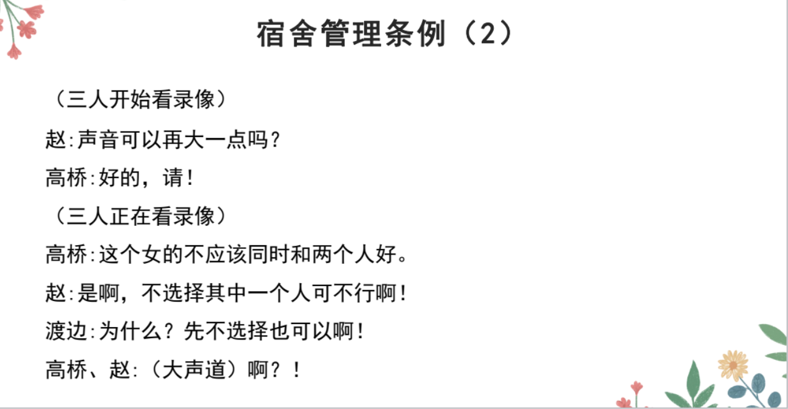
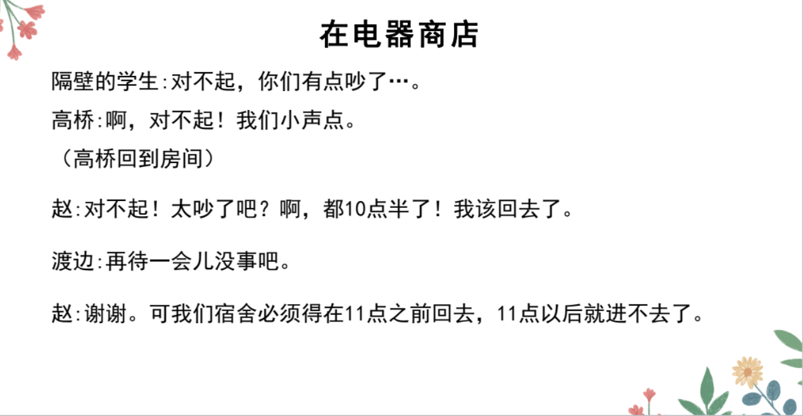
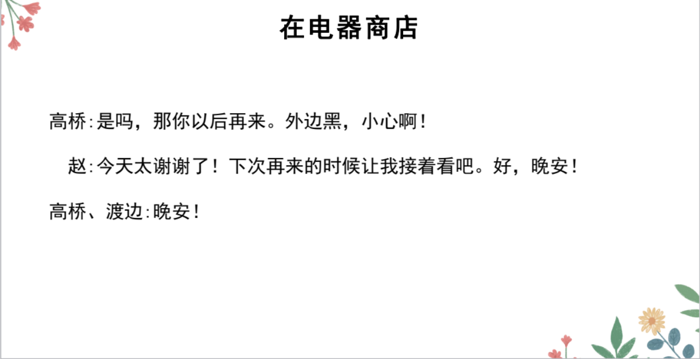

# Ｖなくてもいい、いけない

## 新出単語
<vue-plyr>
  <audio controls crossorigin playsinline autoplay loop>
    <source src="../audio/10-2-たんご.mp3"  type="audio/mp3" />
  </audio>
 </vue-plyr>

| 単語                                        | 词性               | 翻译                                                        |
| ------------------------------------------- | ------------------ | ----------------------------------------------------------- |
| お邪魔します<JpWord>おじゃまします</JpWord> | **⑤**              | 打扰了 （抱歉）                                             |
| 邪魔<JpWord>じゃま</JpWord>                 | **⓪**＜名・他 Ⅲ ＞ | 妨碍；碍事                                                  |
| 靴<JpWord>くつ</JpWord>                     | **②**＜名＞        | 鞋 脱鞋：靴を脱ぐ                                           |
| 脱ぐ<JpWord>ぬぐ</JpWord>                   | **①**＜他 Ⅰ ＞     | 脱 拖鞋：スリッパ Ｎ                                        |
| 失礼します<JpWord>しつれいします</JpWord>   | **②**              | 失礼；打扰；告辞 （客套）                                   |
| 失礼<JpWord>しつれい</JpWord>               | **②**＜名・自 Ⅲ ＞ | 失礼；冒昧 お先「さき」に～                                 |
| 音<JpWord>おと</JpWord>                     | **②**＜名＞        | （物体发出的）声音；声响 声「こえ」 喉咙                    |
| 付き合う<JpWord>つきあう</JpWord>           | **③** ＜自 Ⅰ ＞    | 交往 私と付き合ってください                                 |
| <JpWord>いけない</JpWord>                   | **⓪**＜形 Ⅰ ＞     | 不行；不可以                                                |
| <JpWord>どうして</JpWord>                   | **①**＜副＞        | 为什么 どうしてですか                                       |
| 以降<JpWord>いこう</JpWord>                 | **①**＜名＞        | 以降；之后；以后 十一時以降                                 |
| 気をつける<JpWord>きをつける</JpWord>       | **④**              | 多加小心；注意                                              |
| 付ける<JpWord>つける</JpWord>               | **②**＜他 Ⅱ ＞     | 贴；粘；附着；安装                                          |
| 続き<JpWord>つづき</JpWord>                 | **⓪** ＜名＞       | 后续部分；未完部分；未完待续続く<JpWord>「つづく」</JpWord> |
| <JpWord>おやすみなさい</JpWord> | **⑥**              | 晚安口语：おやすみ 晚安                                     |
| 門限<JpWord>もんげん</JpWord>               | **③**＜名＞        | 门限（最晚回家、回宿舍的时间）                              |
| memo<JpWord>メモ</JpWord>                   | **①**＜名・他 Ⅲ ＞ | 笔记；记笔记                                                |
| 相談（<JpWord>そうだん</JpWord>             | **⓪**＜名・自 Ⅲ ＞ | 商量                                                        |
| 道<JpWord>みち</JpWord>                     | **⓪**＜名＞        | 道路                                                        |
| 渡る<JpWord>わたる</JpWord>                 | **⓪**＜自 Ⅰ ＞     | 渡过（马路、河、桥等）                                      |
| 横断歩道<JpWord>おうだんほどう</JpWord>     | **⑤** ＜名＞       | 人行横道；斑马线                                            |
| 横断<JpWord>おうだん</JpWord>               | **⓪**＜名・自 Ⅲ ＞ | 横断；横穿；横过                                            |
| 歩道<JpWord>ほどう</JpWord>                 | **⓪**＜名＞        | 道；人行道                                                  |
| 風邪を引く<JpWord>かぜをひく</JpWord>       | **⓪-⓪**            | 得感冒                                                      |
| 風邪<JpWord>かぜ</JpWord>                   | **⓪**＜名＞        | 感冒；伤风                                                  |
| 落とし物<JpWord>おとしもの</JpWord>         | **⓪**＜名＞        | 失物；遗忘、丢失的物品                                      |
| 交番<JpWord>こうばん</JpWord>               | **⓪**＜名＞        | 警亭；派出所                                                |
| 学生証<JpWord>がくせいしょう</JpWord>       | **⓪**＜名＞        | 学生证                                                      |
| 残業<JpWord>ざんぎょう</JpWord>             | **⓪**＜名・自 Ⅲ ＞ | 加班                                                        |
| 辛い<JpWord>からい</JpWord>                 | **②**＜形 Ⅰ ＞     | 辣（的）                                                    |
| 甘い<JpWord>まい</JpWord>                   | **⓪**＜形 Ⅰ ＞     | 甜（的）                                                    |
| 出席<JpWord>しゅっせき</JpWord>             | **⓪**＜名・自 Ⅲ ＞ | 出席；参加                                                  |
| <JpWord>やせる</JpWord>                     | **⓪**＜自 Ⅱ ＞     | 瘦；消瘦                                                    |
| 喧嘩<JpWord>けんか</JpWord>                 | **⓪**＜名・自 Ⅲ ＞ | 吵架；打架                                                  |
| 連れる<JpWord>つれる</JpWord>               | **⓪**＜他 Ⅱ ＞     | 领；带着（某人）                                            |

## V なくてもいい＜不必要＞

意义：表示同意、许可不做某事或没必要做某事。  
译文：可以不......；不......也行  
接续：「Ｖない」先变为「Ｖなく」，然后加「てもいい」  
说明：「Ⅴ なくてもいい」是「Ⅴ てもいい」的否定形式。

```ts
(1) 靴、脱がなくてもいいですよ。 脱ぐーぬが＋ない
(2) もう薬を飲まなくてもいいですよ。飲むーのま＋ない
(3) 忙しいときは、行かなくてもいい。 行くーいか＋ない

```

## 練習 れんしゅう

```ts
(1) 不做笔记也行。 メモをする メモを取る「とる」 ノート：笔记本
⇒ メモをしなくてもいい・いいです。
メモを取らなくてもいい・いいです。
(2) 明天不来也可以。　// 来る　「くる」　ーこない　　するーしない
⇒ 明日は、こなくてもいい・いいです。
```

## V る・V たとき（に）＜时点＞ 时「とき」：时候

1. 见到小王的时候，请你把文件交给他。
   会うとき **会ったとき**
2. 你回来的时候，给我买瓶水。
   **帰るとき** 帰ったとき
3. 你回来的时候，请打扫一下房间。
   帰るとき **帰ったとき**
4. 我生病的时候，经常吃这个药。
   病気になるとき **病気になったとき**

意义：表示后面主句的动作或变化是在该时点之前或之后成立的。  
译文：**Ｖるとき:（要）做什么的时候（先后再前）、Ｖたとき：做了什么的时候（先前再后）**
说明：动作后续「とき（に）」时，其非过去时「Ⅴ る」和过去时「V た」所表示的时间关系相  
反。「V るとき（に）」表示先进行主句中的动作，然后再进行时间从句中的动作；「Ｖたとき  
（に）」表示先进行时间从句中的动作，然后再进行主句中的动作。

```ts
(1) 日本では家に入るとき、靴を脱がなくてはいけないんでしょう?
(2) 今度来たときに続きを見せてくださいね。 下次来了的时候，
(3) 日本ヘ行くとき、パソコンを買いました。 要去日本的时候，买了电脑。
(4) 日本ヘ行ったとき、パソコンを買いました。去了日本的时候，买了电脑。

```

## 練習 れんしゅう

```ts
(1) 吃饭的时候，会说“我开动了！”。 、// 「 」と言う。
⇒ ごはんを食べるとき（に）、
「いただきます」と言う・言います。　
(2) 吃完饭的时候，会说“多谢款待”。
⇒ ご飯を食べたとき（に）、
「ごちそうさま」と言う・言います。　

```

## V なくては（なければ）いけない

## V なくては（なければ）ならない＜必要；义务＞

1. **Ｖては いけない 禁止做…**  
   Ｖては:做…的话 いけない:不行
2. **Ｖなくては いけない 不得不 必须 一定**  
   **V ない**的い ⇒ くては ＝Ｖなくては 不做…的话 いけない:不行
3. **Ｖなければ いけない 不得不 必须 一定**  
   **V ない**的い ⇒ ければ ＝Ｖなければ 不做…的话 いけない:不行

> 不学习的话不行： 勉強しなくては いけない  
> （必须学习） 勉強しなければ いけない  
> 勉強しなくては ならない  
> (必需学习) 勉強しなければ ならない

意义：表示有必要、有义务进行该动作。接续：Ｖない的い ⇒ くては/ければ  
译文：必须......；应该......；得......；一定......；不得不...... 说明：「V なくては（なければ）いけない」表示说话人认为有必要、有义务进行该动作，或者某种特殊情况要求必须进行该动作；而「V なくては（なければ）ならない」多表示从社会常识来看有必要、有义务进行该动作，是人们都认可的一般性的判断。在口语中「なくては」经常说成「なくちゃ」,「なければ」经常说成「なきゃ」，「いけない」和「ならない」也时常被省略。尤其「なくちゃ」在自言自语时多用。

```ts
(1) 明日は早く起きなくてはいけない。我明天必须要早起。
 明日は早く起きなくちゃ。 口语 （自言自语）
(2) 子供は勉強しなければならない。孩子必需学习。
 子供は勉強しなきゃ。 口语
```

## 「~いけない」vs「~ならない」

> 「~いけない」表示说话人主观认为必须要进行某动作。  
> 「~ならない」则表示从客观的社会常识来看，不得不进行。

```ts
(1) 日本では家に入るとき、靴を脱がなくてはいけないんでしょう?
(2) 私の寮は11時までに帰らなければならないんです。
(3) 明日の授業で、日本語で自己紹介をしなきゃなりません。
しなければなりません。
(4) もうこんな時間だ。早く帰らなくちゃ。なくては
已经这个点了。 不早点回去的话（不行了） 自言自语
```

## 練習 れんしゅう

```ts
(1) 打扰一下，必须要写地址吗？ // 住所「じゅうしょ」を書く
⇒ すみませんが、住所を書かなくてはいけませんか。
すみませんが、住所を書かなくてはいけないんですか。
--不写也可以。 Ｖなくてもいい
⇒ 書かなくてもいい・いいです。

```

## 会話
<vue-plyr>
  <audio controls crossorigin playsinline autoplay loop>
    <source src="../audio/10-2-かいわ.mp3"  type="audio/mp3" />
  </audio>
 </vue-plyr>









