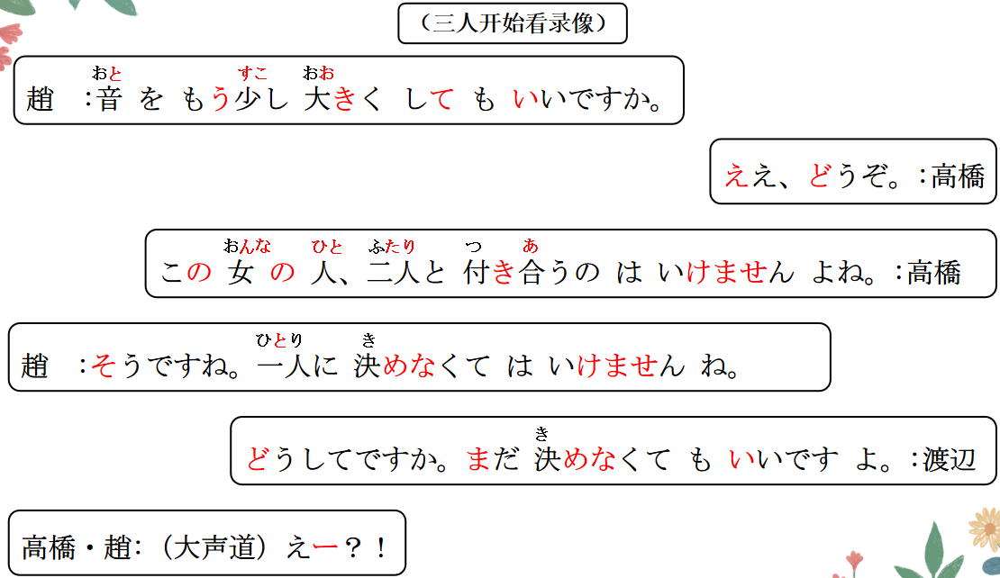

# にする、どうして、でしょう

## 新出単語
<vue-plyr>
  <audio controls crossorigin playsinline autoplay loop>
    <source src="../audio/10-3-たんご.mp3"  type="audio/mp3" />
  </audio>
 </vue-plyr>

| 単語                                         | 词性                      | 翻译                                              |
| -------------------------------------------- | ------------------------- | ------------------------------------------------- |
| 食事<JpWord>しょくじ</JpWord>                | **③** ＜名・自 Ⅲ ＞       | 吃饭；餐食；饮食                                  |
| manner<JpWord>マナ一</JpWord>                | ① ＜名＞                  | 礼节；礼仪                                        |
| 比較 <JpWord>ひかく</JpWord>                 | **⓪** ＜名・他 Ⅲ ＞       | 比较                                              |
| Asia じん <JpWord>アジア人</JpWord>          | **③** ＜名＞              | 亚洲人                                            |
| Asia <JpWord>アジア</JpWord>                 | **①** ＜固名＞            | 亚洲                                              |
| 隣人 <JpWord>りんじん</JpWord>               | **⓪** ＜名＞              | 邻居；周围的人                                    |
| しかし <JpWord>しかし</JpWord>               | **②** ＜接＞              | 但是；然而                                        |
| 習慣 <JpWord>しゅうかん</JpWord>             | **⓪**＜名＞               | 习惯 习俗                                         |
| 御馳走様<JpWord>ごちそうさま </JpWord>       | **⑥** ＜饭后用语＞        | 我吃好了；谢谢款待                                |
| 御馳走<JpWord>ごちそう </JpWord>             | **⓪** ＜名・他 Ⅲ ＞       | 款待；丰盛的饭菜；好吃的                          |
| <JpWord>どちら </JpWord>                     | **①** ＜名＞ （二者中的） | 哪一方                                            |
| 箸<JpWord>（はし） </JpWord>                 | **①** ＜名＞              | 筷子                                              |
| 刺す<JpWord>（さす） </JpWord>               | **①** ＜他 Ⅰ ＞           | 插；刺入                                          |
| 法语 centi<JpWord>-センチ </JpWord>          | **①** ＜接尾＞            | 厘米；公分                                        |
| 縦<JpWord>たて</JpWord>                      | **①**＜名＞               | 竖；垂直；纵向                                    |
| 短い<JpWord>みじかい</JpWord>                | **③**＜形 Ⅰ ＞            | 短（的）                                          |
| 横向き<JpWord>よこむき</JpWord>              | **⓪**＜名＞               | 横向                                              |
| ▼ 麺類<JpWord>めんるい</JpWord>              | **①**＜名＞               | 面条                                              |
| 立てる<JpWord>たてる</JpWord>                | **②**＜他 Ⅱ ＞            | 使立起；使发出                                    |
| 乾杯<JpWord>かんぱい</JpWord>                | **⓪**＜名・自 Ⅲ ＞        | 干杯                                              |
| 御馳走になる <JpWord>ごちそうになる</JpWord> | **⑥**                     | 承蒙款待                                          |
| 残す<JpWord>のこす</JpWord>                  | **②**＜他 Ⅰ ＞            | 留；剩；剩下                                      |
| 好き<JpWord>すき</JpWord>                    | **②**＜形 Ⅱ ＞            | 喜欢；喜爱；中意                                  |
| <JpWord>このように</JpWord>                  | **③**＜副＞               | 这样；如此                                        |
| 違い<JpWord>ちがい</JpWord>                  | **⓪**＜名＞               | 不同；差异                                        |
| 互いに<JpWord>たがいに</JpWord>              | **⓪**＜副＞               | 互相                                              |
| 別れる<JpWord>わかれる</JpWord>              | **③**＜自 Ⅱ ＞            | 分别；分手；分开                                  |
| <JpWord>さようなら</JpWord>                  | **⓪**                     | （彼此将会很长时间不再相见时，语气较正式严肃)再见 |
| cake<JpWord>ケ一キ</JpWord>                  | **①**＜名＞               | 蛋糕                                              |
| 嘘<JpWord>うそ</JpWord>                      | **①**＜名＞               | 谎言；谎话                                        |

## N にする/A1 くする/A2 にする＜使之发生变化＞

意义：表示人为造成的变化的结果或状态。 N1 は N2 を N3 にする  
译文：使......；将......；把...... N1 把 N2 变成 N3

```ts
（1）（私は）音をもう少し大きくしてもいいですか。
我可以把声音再调大一点嘛？
// 分析： 私は音を大きくする + Ｖてもいいですか。
（2）（（私は）りんごをジュースにして飲みます。
把苹果榨成汁喝掉
（3）（教室をきれいにしてください。 请你把教室打扫干净。
教室它变干净了。 // 使用自动词：教室が/は綺麗になった。
（4）（夢「ゆめ」を現実にしたい。
我想让梦想变成现实。
```

> 1、我把小王变成了美女。 する 他动词  
> 私は王さんを美人にした。  
> ２、小王变成了美女。 なる 自动词  
> 王さんは/が美人「びじん」になった。

## 練習 れんしゅう

```ts
（1）我会让你幸福的，所以请和我结婚。　// 幸せ「しあわせ」　A2
⇒ 私は君を幸せにするから、私と結婚してください。
（2）把空调打开，让房间变凉快了。 // エアコン 涼しい「すずしい」 他动词
⇒（私は) エアコンをつけて、部屋を涼しくした・しました。
（3）房间它变得凉快了。// 自动词
⇒ 部屋が涼しくなった・なりました。

```

## どうして＜原因（疑问）＞

意义：用于询问理由、原因。 **何で「なんで」 ：为啥 （个人感情)**
译文：どうして：为什么 （带有个人感情） **なぜ ：为何（通常不带有感情） 书面语**  
说明：「どうして」用于疑问句时，大多构成「どうして···んですか」这种句式。  
回答时也多用「～んです」「～からです」（是因为） 解释理由。  
除疑问外，该句式还可表达吃惊、疑惑、责备等语气。

```ts
（1）高橋：この女の人、二人と付き合うのはいけませんよね。
   渡辺：どうしてですか。
（2）どうして先生に話さなかったんですか。話すー話さないー話さなかった
（3）どうしてこんなに値段が高いんですか。
（4）高橋：どうして行かないんですか。
   王 ：お金がないんです。

```

## 練習 れんしゅう

```ts
（1）为什么昨天休假了。 、// 休む「やすむ」
⇒ どうして昨日は休みましたか。
どうして昨日は休んだ んですか。
--是因为头痛。 あたまがいたい
⇒ 頭が痛かった からです。
```

## ~ でしょう？＜确认＞

意义：向对方确认或征得对方同意。  
译文：......对吧？是吧？  
接续：简体＋でしょう  
名词／Ⅱ 类形容词/副词 词干＋でしょう 不要「だ」+でしょう  
说明：「でしょう」在表示确认的意思时，要读**升调**。一般不用于与上级或长辈的对话中。

```ts
（1）日本では家に入るとき、靴を脱がなくてはいけないんでしょう?
在日本进屋的时候，不拖鞋子是不行的，对吧？
（2）もう宿題は終わったでしょう?
   作业做完了对吧？
（3）王さんはまだ二年生でしょう?
   小王你还是二年级的学生，是吧？
（4）見て（ください）、このコップ、かわいいでしょう?
   快看，这个杯子，很可爱的，是吧？
```

## 接续

1. 简体接**でしょう**・だろう
2. 一类形容词：やさしい**でしょう** 優しくない**でしょう** 優しかった**でしょう** 優しくなかった**でしょう**
3. 动词：食べる**でしょう** 食べない**でしょう** 食べた**でしょう** 食べなかった**でしょう**
4. **二类形容词，名词，副词 的非过去式肯定（原形），不要だ。直接＋でしょう・だろう**
5. 二类形容词 綺麗**でしょう** 綺麗ではない**でしょう** 綺麗だった**でしょう** 綺麗ではなかった**でしょう**
6. 名词： 先生**でしょう** 先生ではない**でしょう** 先生だった**でしょう** 先生ではなかった**でしょう**
7. 副词： そう**でしょう** そうではない**でしょう** そうだった**でしょう** そうではなかった**でしょう**

## 練習 れんしゅう

```ts
（1）我刚刚说过了吧？ // さっき 言う「いう」
⇒ さっき言ったでしょう？
（2）会议是在2点钟开始对吧？　//  かいぎ　　始まる「はじまる」　二時「にじ」　
⇒ 会議は二時に始まるでしょう？
会議は二時に始まるだろう？

```

## 精読の教文

<vue-plyr>
  <audio controls crossorigin playsinline autoplay loop>
    <source src="../audio/10-2-1.mp3"  type="audio/mp3" />
  </audio>
 </vue-plyr>


