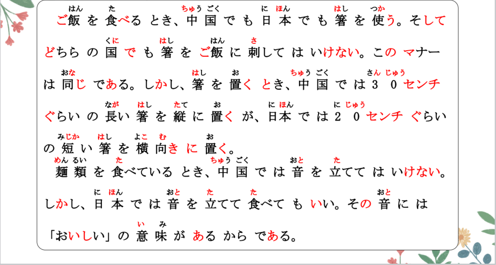

# N について、に、からだ...

## 新出単語
<vue-plyr>
  <audio controls crossorigin playsinline loop>
    <source src="../audio/10-3-たんご.mp3"  type="audio/mp3" />
  </audio>
 </vue-plyr>

| 単語                                         | 词性                      | 翻译                                              |
| -------------------------------------------- | ------------------------- | ------------------------------------------------- |
| 食事<JpWord>しょくじ</JpWord>                | **③** ＜名・自 Ⅲ ＞       | 吃饭；餐食；饮食                                  |
| manner<JpWord>マナ一</JpWord>                | ① ＜名＞                  | 礼节；礼仪                                        |
| 比較 <JpWord>ひかく</JpWord>                 | **⓪** ＜名・他 Ⅲ ＞       | 比较                                              |
| Asia じん <JpWord>アジア人</JpWord>          | **③** ＜名＞              | 亚洲人                                            |
| Asia <JpWord>アジア</JpWord>                 | **①** ＜固名＞            | 亚洲                                              |
| 隣人 <JpWord>りんじん</JpWord>               | **⓪** ＜名＞              | 邻居；周围的人                                    |
| しかし <JpWord>しかし</JpWord>               | **②** ＜接＞              | 但是；然而                                        |
| 習慣 <JpWord>しゅうかん</JpWord>             | **⓪**＜名＞               | 习惯 习俗                                         |
| 御馳走様<JpWord>ごちそうさま </JpWord>       | **⑥** ＜饭后用语＞        | 我吃好了；谢谢款待                                |
| 御馳走<JpWord>ごちそう </JpWord>             | **⓪** ＜名・他 Ⅲ ＞       | 款待；丰盛的饭菜；好吃的                          |
| <JpWord>どちら </JpWord>                     | **①** ＜名＞ （二者中的） | 哪一方                                            |
| 箸<JpWord>（はし） </JpWord>                 | **①** ＜名＞              | 筷子                                              |
| 刺す<JpWord>（さす） </JpWord>               | **①** ＜他 Ⅰ ＞           | 插；刺入                                          |
| 法语 centi<JpWord>-センチ </JpWord>          | **①** ＜接尾＞            | 厘米；公分                                        |
| 縦<JpWord>たて</JpWord>                      | **①**＜名＞               | 竖；垂直；纵向                                    |
| 短い<JpWord>みじかい</JpWord>                | **③**＜形 Ⅰ ＞            | 短（的）                                          |
| 横向き<JpWord>よこむき</JpWord>              | **⓪**＜名＞               | 横向                                              |
| ▼ 麺類<JpWord>めんるい</JpWord>              | **①**＜名＞               | 面条                                              |
| 立てる<JpWord>たてる</JpWord>                | **②**＜他 Ⅱ ＞            | 使立起；使发出                                    |
| 乾杯<JpWord>かんぱい</JpWord>                | **⓪**＜名・自 Ⅲ ＞        | 干杯                                              |
| 御馳走になる <JpWord>ごちそうになる</JpWord> | **⑥**                     | 承蒙款待                                          |
| 残す<JpWord>のこす</JpWord>                  | **②**＜他 Ⅰ ＞            | 留；剩；剩下                                      |
| 好き<JpWord>すき</JpWord>                    | **②**＜形 Ⅱ ＞            | 喜欢；喜爱；中意                                  |
| <JpWord>このように</JpWord>                  | **③**＜副＞               | 这样；如此                                        |
| 違い<JpWord>ちがい</JpWord>                  | **⓪**＜名＞               | 不同；差异                                        |
| 互いに<JpWord>たがいに</JpWord>              | **⓪**＜副＞               | 互相                                              |
| 別れる<JpWord>わかれる</JpWord>              | **③**＜自 Ⅱ ＞            | 分别；分手；分开                                  |
| <JpWord>さようなら</JpWord>                  | **⓪**                     | （彼此将会很长时间不再相见时，语气较正式严肃)再见 |
| cake<JpWord>ケ一キ</JpWord>                  | **①**＜名＞               | 蛋糕                                              |
| 嘘<JpWord>うそ</JpWord>                      | **①**＜名＞               | 谎言；谎话                                        |
|                                              |

## N について・N についての＜相关＞

意义：表示动作行为涉及的对象。  
译文：关于……(的)；有关……(的)；就……(的)  
接续：名词+について+Ｖ/について＋の＋Ｎ  
说明：谓语动词多为指称语言行为或思维活动的动词。修饰名词时，用「Ｎについての」的形式。

```ts
（1）ここでは、食事のマナーや習慣について比較する。 // 其中や代表不完全列举
   在这里的话、关于用餐的礼仪和习惯进行一个比较。
（2）これから日本語の文法について説明します。
   接下来，我们关于日语的语法做解释说明。
（3）若者のスマホ利用について、アンケート調査をした。 // わかもの 年轻人 // 若者のスマホ利用についてのアンケート調査 をした。
   关于年轻人的手机使用情况做了问卷调查。
（4）日本文化についての資料を集めている。
   正在收集有关日本文化的资料。
```

## 練習 れんしゅう

```ts
（1）关于日本文化进行研究。// にほんぶんか けんきゅうする
⇒ 日本文化について 研究する・研究します。
（2）写了有关旅行的作文。//りょこう　　さくぶんをかく
⇒ 旅行についての作文を書いた・書きました。
```

## 「～」と言う＜直接引语＞

意义：表示直接引语。 1.引用他人所言 先生は「 」と言った。  
译文：说:“……” 2.引用某种说法 “文件”は日本語で「ファイル」と言う  
接续：接在引用的话语后面 3.自我介绍 王と申します。 申す「もうす」  
说明：书写时，引用的内容一般用「 」引出。

```ts
（1）食事のとき、日本では皆で「いただきます」と言う。
   吃饭的时候、大家会一起说，我要开动了。
（2）日本人は夜寝るときに、「おやすみなさい」と言う。
   日本人晚上睡觉的时候会说晚安。
（3）高橋さんは王さんに「明日、日本に帰ります」と言いました。 // 先说再睡，需要用到非过去时。
   高桥对小王说：“明天，我要回日本了”。
```

## 練習 れんしゅう

```ts
（1）与人离别的时候，会说“再见”。 // 別れる「わかれる」 さようなら
   人と別れるとき（に）、「さようなら」と言う・言います。
（2）回到家的时候，会说“我回来啦！”。 // 帰る ただいま
⇒ 家に帰ったとき（に）、「ただいま」と言う・言います。
```

## に＜状态＞

意义：表示动作、作用的方式、状态。最後に 紹興酒を二本ください  
接续：接在表示方向、顺序等名词Ｎ＋に＋Ｖ 名词副词化

```ts
（1）中国では30センチぐらいの長い箸を縦に置くが、日本では20センチぐらい
の短い箸を横向きに置く。 // 箸を縦に置く
   在中国这个国家的话，会竖着放30厘米左右的长筷子，在日本20厘米左右的筷子横着放。
（2）2つのファイルを左右「さゆう」に並べて表示「ひょうじ」する。
   两份文件以左右并列的方式摆放出来。
（3）そちらから順番「じゅんばん」[顺序]に自己紹介をお願いします。
   请从那一位开始按照顺序依次进行自我介绍。
（4）では、はじめに日本と中国の食事のマナーについて紹介します。
   那么、先介绍关于日本和中国的就餐礼仪。
```

## 練習 れんしゅう

```ts
（1）用上下键，可以使画面上下移动。 // キー がめん じょうげ うごかす
⇒ 「うえ」「した」キーで、画面を上下に動かすことができる・できます。
上下に画面が動かせる
```

## ~からだ＜原因、理由＞

意义：用于说明原因、理由。 頭が痛かった。だから、学校を休んだ。(前因后果）  
译文：…之所以，是因为… 学校を休んだ。頭が痛かったからだ。（前果后因）  
接续：简体句子+からだ。书面语中一般用「～からである」。N、A2+だ＋からだ

```ts
（1）しかし、日本では音を立てて食べてもいい。 // 立てるー立てて
   その音には「おいしい」の意味があるからである。
   然而，在日本可以发出声音来吃面的。是因为，在你吃面的时候是包含着好吃的含义在里面的。
（2）日曜日はどこへも行きません。ゆっくり休みたいからです。// 休むー休み＋たい
   在周日的话，我哪里都不去，是因为我想要好好的休息。 
（3）私たちがこのように交流「こうりゅう」できるのは、言語「げんご」があるからである。
   我们之所以可以像这样的交流，是因为有语言这样的东西存在。
（4）渡辺:どうして答えなかったんですか。
     王 :相手「あいて」の質問がわからなかったからです。
     渡边：你为什么没有回答呢？
     王：是因为我没有弄懂对方的问题。

```

## 練習 れんしゅう

```ts
（1）房子的价格很贵。是因为 附近这带很方便。 // 辺り「あたり」 部屋：房间
⇒ 家「いえ」の値段「ねだん」は高いです。この辺りが便利だからです。
（2）你为什么上学迟到了？　　// がっこう：学校　　おくれる:遅れる　　　ます　
⇒ どうして学校に遅れたんですか。 遅れた？
 是因为闹钟没响。// 鳴る「なる」　ならなかった
 // めざましどけい:目覚し時計　
⇒ 目覚まし時計が鳴らなかったからだ・からです。
```

## は＜部分否定＞

意义：表示部分否定 **全て「すべて」所有 毎日 毎月**
接续：表示统括意义的名词或副词+は+否定的谓语形式.

```ts
（1）全部は飲まなくてもいいです。// ぜんぶ：全部   // 中国では、お酒を全部飲まなくてはいけない // 在中国，酒要全部喝完
   全部的话不喝完也是可以的。
（2）王：毎日運動をしますか。
   鈴木：いいえ、毎日はしません。日曜日だけです。
   王：你今天都做运动嘛？
   铃木：不是每天都做、只有周日。
（3）王：全員、来ましたか。
    高橋：いいえ、全員は来ませんでした。
    王：全员都来了嘛？
   高桥：不是、并不是所有人都来了。
```

## 練習 れんしゅう

```ts
（1）ーA：语法全部都理解了嘛？
   ⇒ ぶんぽうは ぜんぶ わかりましたか。
   ーB：没有全懂。 部分否定。 // わかる  60%
   ⇒ 全部は分からなかった・分かりませんでした。 // わかる:"明白"、"理解" 或 "明了"
   ーC：全懂了。 // 完全肯定 100%
   ⇒ 全部分かった・分かりました。
   ーD：完全不懂。  // 完全否定 0%
   ⇒ 全然分からない・ぜんぜんわかりません。
```

## 精読の教文
<vue-plyr>
  <audio controls crossorigin playsinline loop>
    <source src="../audio/10-3-1.mp3"  type="audio/mp3" />
  </audio>
 </vue-plyr>


## 会話
<vue-plyr>
  <audio controls crossorigin playsinline loop>
    <source src="../audio/10-3-かいわ.mp3"  type="audio/mp3" />
  </audio>
 </vue-plyr>





