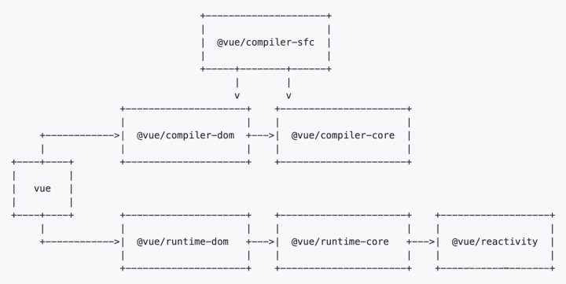

# 01-Vue3 源码结构的介绍



## vue3 的三大核心功能模块

1. Compiler 模块
> compiler-sfc 主要用来解析 sfc（其实就是单文件组件）  
   > compiler-dom 底层是依赖 compiler-core，是用来处理 template 的，会将 template 编译成 render 函数。
2. Runtime 模块: 也可以称之为 Renderer 模块，真正渲染的模块。
3. Reactivity 模块: 响应式系统; 比如: data 中的数据，setup 中的数据，ref,reactive 等等。

## 三大系统协调工作

## 编译系统

将 template 模块转为 render 函数

```javascript
<div id="app">
    <div @click="confole.log('hello vue3')"></div>
    <h1>开始学习vue源码</h1>
    <p>今天天气真不错</p>
</div>

```

-> 转换为render函数

```javascript
import { createElementVNode as _createElementVNode, openBlock as _openBlock, createElementBlock as _createElementBlock } from "vue"

export function render(_ctx, _cache, $props, $setup, $data, $options) {
  return (_openBlock(), _createElementBlock("div", { id: "app" }, [
    _createElementVNode("div", {
      onClick: $event => (_ctx.confole.log('hello vue3'))
    }, null, 8 /* PROPS */, ["onClick"]),
    _createElementVNode("h1", null, "开始学习vue源码"),
    _createElementVNode("p", null, "今天天气真不错")
  ]))
}

// Check the console for the AST

```

## 渲染系统

runtime-dom 以及 runtime-core 一系列业务逻辑的处理

## 响应式系统

主要进行 vnode 的 diff 算法
