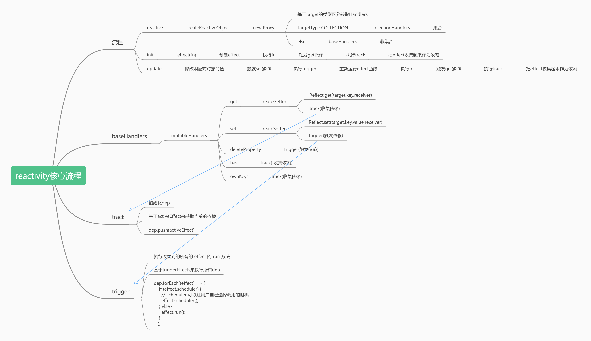

# 02-reactivity 的核心流程



## reactive 的使用

接收一个对象，将其转换为代理对象

## 核心函数 createGetter、createSetter

```javascript
function createGetter(isReadonly = false, shallow = false) {
  return function get(target, key, receiver) {
    const isExistInReactiveMap = () =>
      key === ReactiveFlags.RAW && receiver === reactiveMap.get(target);

    const isExistInReadonlyMap = () =>
      key === ReactiveFlags.RAW && receiver === readonlyMap.get(target);

    const isExistInShallowReadonlyMap = () =>
      key === ReactiveFlags.RAW && receiver === shallowReadonlyMap.get(target);

    if (key === ReactiveFlags.IS_REACTIVE) {
      return !isReadonly;
    } else if (key === ReactiveFlags.IS_READONLY) {
      return isReadonly;
    } else if (
      isExistInReactiveMap() ||
      isExistInReadonlyMap() ||
      isExistInShallowReadonlyMap()
    ) {
      return target;
    }

    const res = Reflect.get(target, key, receiver);

    if (shallow) {
      return res;
    }

    if (isObject(res)) {
      // 把内部所有的是 object 的值都用 reactive 包裹，变成响应式对象
      // 如果说这个 res 值是一个对象的话，那么我们需要把获取到的 res 也转换成 reactive
      // res 等于 target[key]
      return isReadonly ? readonly(res) : reactive(res);
    }

    // 问题：为什么是 readonly 的时候不做依赖收集呢
    // readonly 的话，是不可以被 set 的， 那不可以被 set 就意味着不会触发 trigger
    // 所有就没有收集依赖的必要了
    if (!isReadonly) {
      // 在触发 get 的时候进行依赖收集
      track(target, "get", key);
    }
    return res;
  };
}

function createSetter() {
  return function set(target, key, value, receiver) {
    const result = Reflect.set(target, key, value, receiver);

    // 在触发 set 的时候进行触发依赖
    trigger(target, "get", key);

    return result;
  };
}
```
